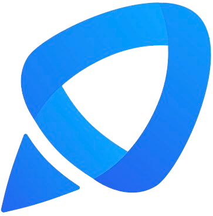
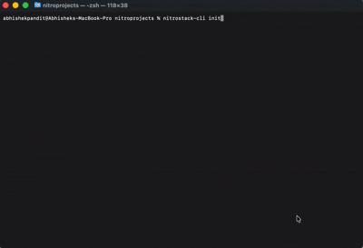
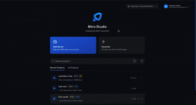
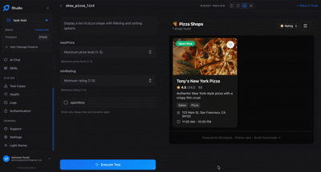
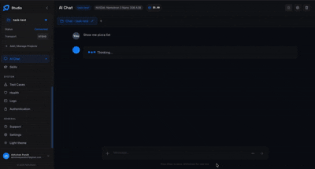

<<<<<<< HEAD
# WARDEN — an MCP server that assumes every website it reads is trying to trick it

> WARDEN is an MCP server for security teams drowning in vulnerabilities — thousands open, time to fix five.

  

**WARDEN — an MCP server that assumes every website it reads is trying to trick it** is an [MCP (Model Context Protocol)](https://nitrostack.ai) server that extends AI assistants — like Claude, Cursor, and any MCP-compatible client — with new, real-world capabilities. It is built and deployed on [Nitrostack](https://nitrostack.ai), the fastest way to build, deploy, and share MCP apps.

## Table of Contents

- [Overview](#overview)
- [What is MCP?](#what-is-mcp)
- [Features](#features)
- [Getting Started](#getting-started)
- [Connect to an MCP Client](#connect-to-an-mcp-client)
- [Deploy Your Own MCP App](#deploy-your-own-mcp-app)
- [Explore More MCP Apps](#explore-more-mcp-apps)
- [FAQ](#faq)
- [Keywords](#keywords)
- [License](#license)

## Overview

WARDEN is an MCP server for security teams drowning in vulnerabilities — thousands open, time to fix five.

It does three things nobody combines. It ranks by evidence, not theory: instead of a severity score that says what could go wrong, it checks whether a bug is actually being exploited (CISA KEV) and how likely it is to be hit (FIRST EPSS) — so a "terrifying" 9.8 nobody attacks is deprioritised, and a modest 7.5 used by ransomware crews gets patched today.

It defends itself. Threat-intel work means feeding AI attacker-written text — the perfect vehicle for prompt injection. WARDEN never hands raw fetched pages to the model: it extracts facts server-side, quarantines hidden commands, and flags the attempt without being affected by it.

And it knows its limits. It auto-fixes what it safely can (a ready-to-review patch PR), flags what needs a human, and refers the rest — but it never touches production, by design.

Every decision, including rejected leads, is fully auditable. Open Innovation / cybersecurity.

## What is MCP?

The **Model Context Protocol (MCP)** is an open standard that lets AI assistants securely connect to external tools, data sources, and services. Instead of being limited to what it was trained on, an AI model can call **MCP servers** to fetch live data, run actions, and integrate with real systems.

This project is one such MCP server. Learn more about building and shipping MCP apps at [nitrostack.ai](https://nitrostack.ai).

## Features

- 🔌 **MCP-native** — works with any MCP-compatible client (Claude, Cursor, and more)
- 🛠️ **Tools, resources & prompts** — exposes structured capabilities to AI agents
- ⚡ **Deployed on Nitrostack** — reliable, hosted, and instantly shareable
- 🔐 **Secure by design** — secrets stay in environment variables, never in code
- 🧩 **Composable** — combine with other MCP apps to build powerful AI workflows

## Getting Started

### Prerequisites

- Node.js 18+ (or your project runtime)
- An MCP-compatible client (Claude Desktop, Cursor, etc.)

### Installation

```bash
git clone https://github.com/your-username/your-mcp-project.git
cd warden-an-mcp-server-that-assumes-every-website-it-reads-is-
npm install
```

### Configuration

Copy the example environment file and add your own values:

```bash
cp .env.example .env
```

### Run

```bash
npm run start
```

## Connect to an MCP Client

Add this server to your MCP client configuration. A typical entry looks like:

```json
{
  "mcpServers": {
    "warden-an-mcp-server-that-assumes-every-website-it-reads-is-": {
      "command": "npm",
      "args": ["run", "start"]
    }
=======
<div align="center">
  <a href="https://nitrostack.ai">
    
  </a>

  <h1>NitroStack</h1>

  <p><strong>The enterprise-grade TypeScript framework for building production-ready MCP servers.</strong></p>
  <p>Decorators. Dependency Injection. Widgets. One framework to ship AI-native backends.</p>

  <br />

  <a href="https://www.npmjs.com/package/@nitrostack/core"></a>
  <a href="https://www.npmjs.com/package/@nitrostack/core"></a>
  <a href="https://github.com/nitrocloudofficial/nitrostack"></a>
  <a href="https://opensource.org/licenses/Apache-2.0"></a>
  <a href="https://discord.gg/uVWey6UhuD"></a>
  <a href="https://x.com/nitrostackai"></a>
  <a href="https://www.youtube.com/@nitrostackai"></a>
  <a href="https://linkedin.com/company/nitrostack-ai/"></a>
  <a href="https://github.com/nitrostackai"></a>

  <br />
  <br />

  <a href="https://docs.nitrostack.ai"><strong>Documentation</strong></a> &nbsp;&middot;&nbsp;
  <a href="https://docs.nitrostack.ai/quick-start"><strong>Quick Start</strong></a> &nbsp;&middot;&nbsp;
  <a href="https://blog.nitrostack.ai"><strong>Blog</strong></a> &nbsp;&middot;&nbsp;
  <a href="https://nitrostack.ai/studio"><strong>NitroStudio</strong></a> &nbsp;&middot;&nbsp;
  <a href="https://discord.gg/uVWey6UhuD"><strong>Discord</strong></a>

  <br />
  <br />
</div>

---

## Quick Start

### Prerequisites

- **Node.js** >= 20.18 ([download](https://nodejs.org/))
- **npm** >= 9

### 1. Scaffold a new project

```bash
npx @nitrostack/cli init my-server
```



### 2. Start developing

```bash
cd my-server
npm install
npm run dev
```

Your MCP server is running. Connect it to any MCP-compatible client.

### 3. Open in NitroStudio

Once your project is scaffolded, open the same folder in NitroStudio for visual testing and debugging.

- Download: <https://nitrostack.ai/studio>
- Open your `my-server` project folder
- Use NitroStudio to test tools, inspect payloads, and chat with your MCP server

## Why NitroStack?

Building MCP servers today means stitching together boilerplate, reinventing authentication, and hoping your tooling scales. NitroStack gives you an opinionated, batteries-included framework so you can focus on what your server actually does.

- **Decorator-driven** — Define tools, resources, and prompts with clean, declarative TypeScript decorators
- **Dependency injection** — First-class DI container with singleton, transient, and scoped lifecycles
- **Auth built in** — JWT, OAuth 2.1, and API key authentication out of the box
- **Middleware pipeline** — Guards, interceptors, pipes, and exception filters just like enterprise backends
- **UI Widgets** — Attach React components to tool outputs for rich, interactive responses
- **Zod validation** — End-to-end type safety from schema to runtime
- **NitroStudio** — A dedicated desktop app for testing, debugging, and chatting with your server

## See It in Action

```typescript
import { McpApp, Module, ToolDecorator as Tool, z, ExecutionContext } from '@nitrostack/core';

@McpApp({
  module: AppModule,
  server: { name: 'my-server', version: '1.0.0' }
})
@Module({ imports: [] })
export class AppModule {}

export class SearchTools {
  @Tool({
    name: 'search_products',
    description: 'Search the product catalog',
    inputSchema: z.object({
      query: z.string().describe('Search query'),
      maxResults: z.number().default(10)
    })
  })
  @UseGuards(ApiKeyGuard)
  @Cache({ ttl: 300 })
  @Widget('product-grid')
  async search(input: { query: string; maxResults: number }, ctx: ExecutionContext) {
    ctx.logger.info('Searching products', { query: input.query });
    return this.productService.search(input.query, input.maxResults);
>>>>>>> 80c545f2c2b55cb8dda61701b23ac64e79b14d2f
  }
}
```

<<<<<<< HEAD
Restart your client and the tools from this MCP server will be available to your AI assistant.

## Deploy Your Own MCP App

Want to build and ship an MCP server like this one? **[Nitrostack](https://nitrostack.ai)** lets you create, deploy, and host MCP apps in minutes — no infrastructure to manage.

👉 **Start building:** [https://nitrostack.ai](https://nitrostack.ai)

## Explore More MCP Apps

- 🌙 Discover and share MCP projects with the community on [r/mcptothemoon](https://www.reddit.com/r/mcptothemoon/)
- 🧰 Browse a growing catalog of MCP apps on [Nitrostack](https://nitrostack.ai/apps)

## FAQ

### What is an MCP server?

An MCP server implements the Model Context Protocol to expose tools, resources, and prompts that AI assistants can call. It lets an AI model take real actions and access live data.

### What does WARDEN — an MCP server that assumes every website it reads is trying to trick it do?

WARDEN is an MCP server for security teams drowning in vulnerabilities — thousands open, time to fix five.

### Which AI clients does this work with?

Any MCP-compatible client, including Claude Desktop and Cursor. New clients are adding MCP support regularly.

### How do I deploy my own MCP app?

Use [Nitrostack](https://nitrostack.ai) to build, deploy, and host MCP apps without managing infrastructure.

## Keywords

`Open Innovation` · `WARDEN — an MCP server that assumes every website it reads is trying to trick it` · `MCP` · `Model Context Protocol` · `MCP server` · `MCP app` · `AI tools` · `AI agents` · `LLM tools` · `Claude MCP` · `Nitrostack` · `deploy MCP server` · `build MCP app`

## License

MIT © 2026

---

Built with ❤️ using the Model Context Protocol on [Nitrostack](https://nitrostack.ai). Share your MCP app on [r/mcptothemoon](https://www.reddit.com/r/mcptothemoon/).
=======
One decorator stack gives you: **API definition + validation + auth + caching + UI** — zero boilerplate.

## Ecosystem

NitroStack is modular. Install only what you need:
The implementation workspace for NitroStack packages lives in [`typescript/`](./typescript).

| Package | What it does | Install |
|:---|:---|:---|
| [`@nitrostack/core`](./typescript/packages/core) | The framework — decorators, DI, server runtime | `npm i @nitrostack/core` |
| [`@nitrostack/cli`](./typescript/packages/cli) | Scaffolding, dev server, code generators | `npm i -g @nitrostack/cli` |
| [`@nitrostack/widgets`](./typescript/packages/widgets) | React SDK for interactive tool output UIs | `npm i @nitrostack/widgets` |

## NitroStudio

NitroStudio is a desktop app purpose-built for developing MCP servers. Open your project folder — it handles the dev server for you.



**[Download NitroStudio](https://nitrostack.ai/studio)**

<table>
<tr>
<td width="50%">

**Real-time tool testing**
Execute tools, inspect payloads, and debug request/response cycles.



</td>
<td width="50%">

**Built-in AI chat**
Talk to your MCP server through an integrated AI assistant.



</td>
</tr>
</table>

- **Widget preview** — Instantly visualize your interactive UI components
- **Hot reload** — Changes reflect in real time as you develop

## Documentation

| Resource | Description |
|:---|:---|
| [Getting Started](https://docs.nitrostack.ai/getting-started) | Installation, quick start, and first project |
| [Server Concepts](https://docs.nitrostack.ai/sdk/typescript/server-concepts) | Modules, DI, and architecture deep dive |
| [Tools Guide](https://docs.nitrostack.ai/sdk/typescript/tools-guide) | Defining tools, validation, annotations |
| [Widgets Guide](https://docs.nitrostack.ai/sdk/typescript/ui-widgets-guide) | Building interactive UI components |
| [Authentication](https://docs.nitrostack.ai/sdk/typescript/authentication-overview) | JWT, OAuth 2.1, API key setup |
| [CLI Reference](https://docs.nitrostack.ai/cli/introduction) | All CLI commands and options |
| [Deployment](https://docs.nitrostack.ai/deployment/checklist) | Production checklist, Docker, cloud platforms |

## Community

- [Discord](https://discord.gg/uVWey6UhuD) — Ask questions, share projects, get help
- [GitHub Discussions](https://github.com/nitrocloudofficial/nitrostack/discussions) — Proposals, ideas, and Q&A
- [Twitter / X](https://x.com/nitrostackai) — Announcements and updates
- [YouTube](https://www.youtube.com/@nitrostackai) — Product demos and walkthroughs
- [LinkedIn](https://linkedin.com/company/nitrostack-ai/) — Company news and updates
- [GitHub](https://github.com/nitrostackai) — Organization profile and open-source work
- [Blog](https://blog.nitrostack.ai) — Tutorials, deep dives, and release notes

## Contributing

We welcome contributions of all kinds — bug fixes, features, docs, and ideas. Read the **[Contributing Guide](./CONTRIBUTING.md)** to get started.

Looking for a place to begin? Check out issues labeled [**good first issue**](https://github.com/nitrocloudofficial/nitrostack/labels/good%20first%20issue).

## Contributors

<a href="https://github.com/nitrocloudofficial/nitrostack/graphs/contributors">
  
</a>

## License

NitroStack is open-source software licensed under the [Apache License 2.0](./LICENSE).

---

<div align="center">
  <sub>Built by the <a href="https://nitrostack.ai">NitroStack</a> team and contributors.</sub>
</div>
>>>>>>> 80c545f2c2b55cb8dda61701b23ac64e79b14d2f
