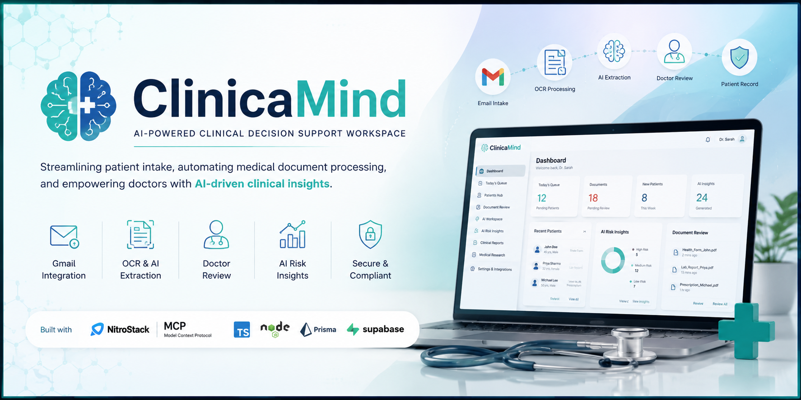
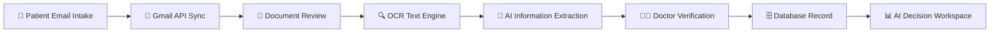
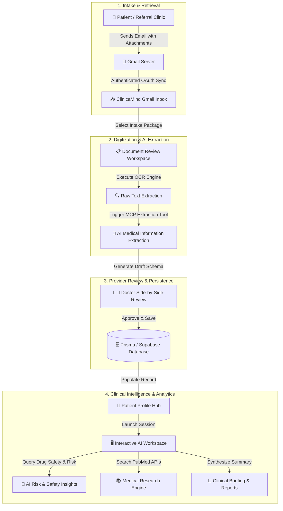
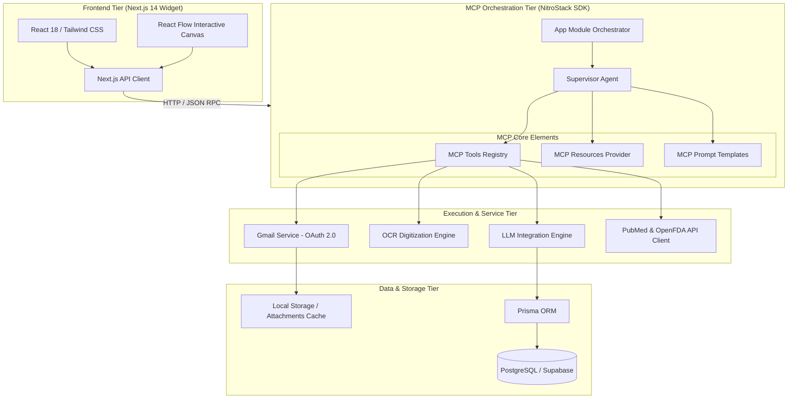
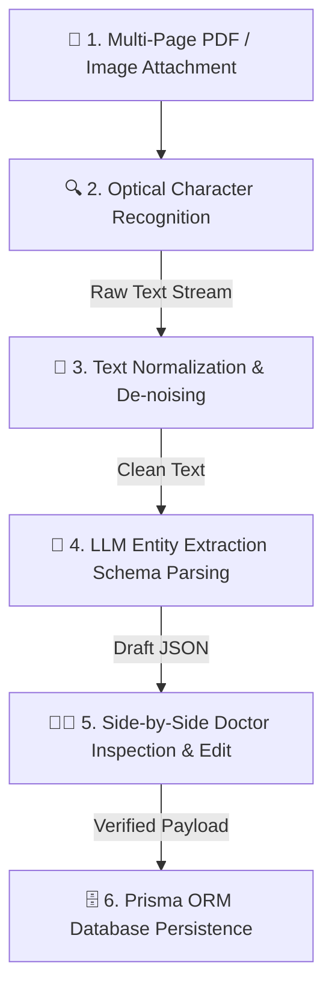
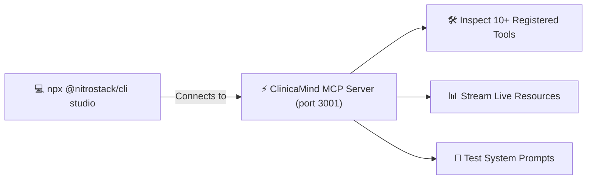

<div align="center">

  

  # 🏥 ClinicaMind
  ### **AI-Powered Clinical Decision Support Workspace built on NitroStack MCP**

  [](https://github.com/nitrostack)
  [](https://www.typescriptlang.org/)
  [](https://nextjs.org/)
  [](https://www.prisma.io/)
  [](https://supabase.com/)
  [](https://developers.google.com/gmail/api)
  [](https://ai.google.dev/)
  [](LICENSE)

  <br />

  [Explore Features](#-key-features) • [System Architecture](#-system-architecture) • [MCP Capabilities](#-mcp-capabilities) • [Installation](#-installation) • [Demo Walkthrough](#-demo-walkthrough)

</div>

---

## 📌 Executive Summary

**ClinicaMind** is an enterprise-grade, AI-powered clinical decision support platform designed to revolutionize modern hospital intake and physician workflows. Built natively on the **NitroStack Model Context Protocol (MCP)** SDK, ClinicaMind bridges the gap between chaotic inbound patient data and actionable, evidence-based medical decisions.

By seamlessly connecting doctor Gmail inboxes, multi-lingual Optical Character Recognition (OCR), LLM-driven structured medical information extraction, and interactive visual reasoning workspaces, ClinicaMind reduces administrative overhead by up to **80%** while keeping healthcare providers firmly in control through a strict **Doctor-in-the-Loop** verification paradigm.

> [!IMPORTANT]
> **Safety First Protocol**: ClinicaMind never modifies patient EHR databases or issues clinical diagnoses autonomously. All AI-extracted data, risk evaluations, and clinical summaries must be explicitly verified and approved by a licensed medical provider.

---

## 🛑 The Problem

Healthcare providers globally face unprecedented levels of cognitive burnout and administrative fatigue:

* ⏱️ **Administrative Bottlenecks**: Physicians spend up to 2 hours on data entry and intake documentation for every 1 hour spent with patients.
* 📄 **Unstructured Data Chaos**: Inbound patient referrals, lab reports, previous discharge summaries, and prescriptions arrive as scanned PDFs, images, or email attachments.
* 🔍 **Information Fragmentation**: Critical patient history, drug allergies, and active contraindications are buried across disparate emails and paper attachments.
* ⚠️ **Human Error Risk**: Manual transcriptions under high time pressure increase the likelihood of missing vital medical warnings or drug interactions.

---

## 💡 The Solution

ClinicaMind introduces an end-to-end automated intake and decision support pipeline that ingests, extracts, analyzes, and presents patient clinical data in a unified interactive workspace.



### Key Pillars of Solution:
1. **Automated Inbox Monitoring**: Listens for inbound patient emails using Google Gmail API read-only OAuth integration.
2. **Intelligent Document Digitization**: Extracts raw text from multi-page scanned PDFs and image attachments using a robust OCR engine.
3. **Structured Clinical Extraction**: Converts raw unstructured text into standardized JSON schemas containing patient demographics, chief complaints, medical history, medications, allergies, and vital signs.
4. **Physician Verification Layer**: Allows clinicians to inspect, correct, and validate extracted entities side-by-side with original source documents before database commitment.
5. **Contextual AI Workspace**: Provides real-time drug interaction warnings, differential diagnosis assistance, PubMed literature references, and automated report generation via NitroStack MCP tools.

---

## 🔄 End-to-End Clinical Workflow

The end-to-end lifecycle of a patient record inside ClinicaMind progresses through 13 specialized stages:



| Stage | Process Name | Description | Key Technology |
| :--- | :--- | :--- | :--- |
| **1** | **Patient Intake** | Patient or referring physician submits medical intake form & reports via email | SMTP / Email Client |
| **2** | **Gmail Sync** | OAuth 2.0 service checks inbox for structured subjects like `subject:"NEW PATIENT"` | Google Gmail API v1 |
| **3** | **Inbox Queue** | Message payload and file attachments are indexed into the hospital intake queue | Next.js Server Actions |
| **4** | **Document Review** | Provider selects intake package and previews attachments in browser | React PDF / Image Canvas |
| **5** | **OCR Digitization** | Optical Character Recognition parses printed/handwritten medical text | Tesseract / Vision OCR |
| **6** | **AI Structuring** | Structured entity extraction maps raw text into FHIR-like JSON schemas | Gemini / OpenAI via MCP |
| **7** | **Doctor Verification** | Provider compares source PDF against extracted JSON fields, making edits as needed | Interactive Form Verification |
| **8** | **Database Storage** | Verified patient profile, history, and medications are stored | Prisma ORM & Supabase |
| **9** | **Patient Hub** | Unified master patient registry organizes longitudinal records | PostgreSQL / SQLite |
| **10**| **AI Workspace** | Live consultation workspace renders draggable nodes and real-time insights | React Flow Node Canvas |
| **11**| **Risk Analysis** | Automated drug allergy contraindication check & missing information detection | NitroStack MCP Tools |
| **12**| **Literature Search**| Fetches latest clinical trials and PubMed evidence relevant to symptoms | NCBI PubMed E-utilities |
| **13**| **Report Export** | Synthesizes full clinical progress notes, discharge summaries, and referral briefs | PDF / Markdown Exporter |

---

## 📑 Key Features

<div align="center">
  
</div>

<br />

| Feature | Category | Feature Description |
| :--- | :--- | :--- |
| **Gmail Integration** | Ingest | Seamless Google OAuth 2.0 read-only integration to fetch patient emails & attachments automatically. |
| **OCR Processing** | Digitization | Built-in OCR pipeline that extracts text from medical scans, prescriptions, and lab reports. |
| **AI Info Extraction** | Intelligence | Translates messy clinical text into structured JSON schemas (demographics, history, meds, allergies). |
| **Patient Intake Automation** | Workflow | Reduces patient onboarding time from 30 minutes to under 2 minutes per patient package. |
| **Clinical Decision Support** | Provider Tool | Real-time differential diagnosis suggestions and evidence-backed clinical reasoning. |
| **AI Risk Insights** | Safety | Automated detection of drug-drug interactions, penicillin/allergy warnings, and missing diagnostic data. |
| **Medical Reports** | Documentation | One-click generation of structured clinical summaries, consultations, and discharge notes. |
| **Patient Management Hub** | Data Store | Centralized searchable repository of past medical records, history, and consult timelines. |
| **Secure Doctor Review** | Compliance | Human-in-the-loop validation UI enforcing provider verification before permanent DB writes. |
| **MCP Native Architecture** | Core Framework | Built from the ground up using NitroStack Model Context Protocol SDK for tool/resource modularity. |
| **NitroStudio Debugger** | Developer Experience | Real-time visual debugging and live inspection of MCP tools, resources, and prompt executions. |
| **Extensible Model Support** | AI Agnostic | Hot-swappable AI provider support (Google Gemini 1.5/2.0, OpenAI GPT-4o, Anthropic Claude). |

---

## 🏗️ System Architecture

ClinicaMind utilizes a decoupled, modern tier architecture built around the **Model Context Protocol (MCP)** specification.



<div align="center">
  
</div>

---

## 🧩 MCP Capabilities

ClinicaMind harnesses the full power of **NitroStack MCP**, exposing domain-specific Tools, Resources, and Prompts to enable autonomous agentic workflows.

### 1. MCP Tools
Tools represent executable functions that AI agents or frontend components can invoke:

```typescript
// Registered MCP Tool Examples in ClinicaMind
process_patient_intake(emailId: string): Promise<IntakePackage>;
review_document(documentId: string): Promise<DocumentStatus>;
extract_medical_information(rawText: string): Promise<ClinicalSchema>;
create_patient(patientData: PatientInput): Promise<PatientRecord>;
get_patient(patientId: string): Promise<PatientProfile>;
generate_clinical_report(patientId: string, format: ReportType): Promise<Report>;
search_medical_research(query: string): Promise<PubMedArticle[]>;
generate_ai_risk_insights(patientId: string): Promise<RiskAssessment>;
check_drug_safety(medications: string[], allergies: string[]): Promise<SafetyAlert[]>;
```

### 2. MCP Resources
Resources provide standardized URI-addressable data streams for context injection:

| Resource URI | Description | MIME Type |
| :--- | :--- | :--- |
| `patient://records` | Active patient directory and master index | `application/json` |
| `patient://history` | Longitudinal medical history and diagnostic timeline | `application/json` |
| `reports://clinical` | Synthesized clinical briefings and consultation notes | `text/markdown` |
| `research://medical` | Cached PubMed literature references and drug monograph data | `application/json` |
| `workspace://queue` | Pending document review and intake processing queue | `application/json` |

### 3. MCP Prompts
Pre-engineered system prompt templates optimized for healthcare domain reasoning:

* 📄 `patient_summary`: Synthesizes complex multi-visit clinical records into a 3-bullet executive briefing.
* 🚨 `clinical_risk_analysis`: Evaluates patient vital signs, lab values, and active prescriptions for acute contraindications.
* 🩺 `generate_followup`: Formulates evidence-backed follow-up questions for the physician during consultation.
* 📝 `medical_report`: Formats structured clinical data into standardized SOAP notes (Subjective, Objective, Assessment, Plan).

---

## ⚡ AI & OCR Pipeline

ClinicaMind's core data extraction pipeline processes unstructured medical documentation through six rigorous validation stages:



> [!TIP]
> **Schema Guardrails**: The AI pipeline utilizes Zod schema validation. If an AI model returns malformed JSON or omits mandatory fields (e.g., patient date of birth), NitroStack automatically retries the prompt with structural corrections.

---

## 🖥️ Screens Showcase

### 1. Dashboard Overview
Central control room displaying active patient queues, recent intake emails, system health metrics, and pending document verifications.


### 2. Today's Intake Queue & Gmail Integration
Monitors connected doctor Gmail inboxes in real-time, highlighting incoming referral emails with attached medical forms.


### 3. Document Review & OCR Workspace
Interactive split-screen interface allowing clinicians to view source PDF/image files on the left and extracted OCR text on the right.


### 4. AI Information Extraction & Verification
Presents AI-extracted clinical entities in editable form cards, enabling instant doctor verification before saving to the database.


### 5. Interactive AI Workspace (Canvas)
Dynamic React Flow visual node workspace for consultation transcript processing, live agent reasoning, and diagnostic node creation.


### 6. AI Risk & Safety Insights
Proactive alert module scanning active patient records for drug-drug interactions, penicillin allergies, and missing diagnostic tests.


### 7. NitroStudio Debugger
Live MCP inspector for monitoring NitroStack server health, inspecting registered tools, testing resources, and debugging prompts.


---

## 🛠️ Tech Stack

ClinicaMind is engineered using modern, type-safe, and high-performance technologies:

| Layer | Technology | Purpose |
| :--- | :--- | :--- |
| **Framework** | [NitroStack SDK](https://github.com/nitrostack) | Native Model Context Protocol (MCP) server & agentic tool orchestration |
| **Frontend** | [Next.js 14](https://nextjs.org/) (App Router) | Server-rendered web application and reactive UI widgets |
| **Language** | [TypeScript 5.x](https://www.typescriptlang.org/) | End-to-end type safety across server, tools, and client components |
| **Database ORM** | [Prisma ORM 6](https://www.prisma.io/) | Schema management, type-safe database queries, and migrations |
| **Database Host**| [Supabase PostgreSQL](https://supabase.com/) | Production relational database (with local SQLite fallback for dev) |
| **Visual Canvas**| [React Flow 11](https://reactflow.dev/) | Interactive node-based drag-and-drop clinical decision canvas |
| **Email Service** | [Google Gmail API v1](https://developers.google.com/gmail/api) | OAuth 2.0 read-only intake inbox monitoring and file attachment download |
| **OCR Engine** | Tesseract / Vision API | Multi-lingual optical character recognition for medical scans |
| **AI Models** | Google Gemini / OpenAI GPT-4o | High-reasoning LLMs for structured extraction and clinical decision support |
| **Styling** | Vanilla CSS & Tailwind CSS | Modern healthcare-tailored dark/light mode design system |
| **Dev Tools** | NitroStudio CLI | Visual MCP inspector, resource browser, and prompt testing tool |

---

## 📂 Project Structure

```
clinicaMind/
├── .agents/                      # Custom workspace agent rules & guidelines
├── data/                         # Local runtime cache & attachment storage
│   ├── temp_attachments/         # Temporary downloaded email attachments
│   └── gmail_connection.json     # Server-side encrypted OAuth connection state
├── docs/                         # Comprehensive project documentation
│   ├── ARCHITECTURE.md           # Deep-dive system architecture spec
│   ├── AGENTS.md                 # Agent orchestration guidelines
│   ├── DATABASE_ARCHITECTURE.md  # Database schema & entity relationships
│   ├── INTEGRATION.md            # Gmail & external API integration docs
│   ├── SECURITY_COMPLIANCE.md    # HIPAA & security compliance protocols
│   └── TOOLS.md                  # Complete MCP tool reference guide
├── images/                       # README banner and UI screenshot assets
│   ├── banner.png
│   ├── architecture.png
│   ├── dashboard.png
│   ├── document-review.png
│   ├── gmail-intake.png
│   ├── ocr-processing.png
│   ├── ai-workspace.png
│   ├── risk-insights.png
│   └── nitrostudio.png
├── prisma/                       # Database schema and migration files
│   ├── schema.prisma             # Master Prisma schema model definitions
│   └── migrations/               # PostgreSQL / SQLite migration history
├── src/                          # Application source code
│   ├── app.module.ts             # Root NitroStack application module
│   ├── index.ts                  # MCP server entry point & bootstrapper
│   ├── db/                       # Prisma client initialization & helpers
│   ├── modules/                  # NitroStack MCP Feature Modules
│   │   ├── gap-analysis/         # Diagnostic gap detection module
│   │   ├── health/               # MCP server healthcheck module
│   │   ├── history/              # Patient history lookup module
│   │   ├── medication/           # Drug interaction & safety module
│   │   ├── prompts/              # MCP Prompt definitions
│   │   ├── report/               # Clinical briefing report module
│   │   ├── research/             # PubMed research integration module
│   │   ├── resources/            # MCP Resource stream definitions
│   │   ├── supervisor/           # Multi-agent supervisor coordinator
│   │   ├── tasks/                # Background queue task manager
│   │   └── tools/                # Clinical MCP Tool implementations
│   ├── services/                 # Core backend business services
│   │   ├── gmail.service.ts      # Gmail OAuth & API service
│   │   └── ocr.service.ts        # OCR text extraction service
│   └── widgets/                  # Next.js 14 Frontend Application
│       ├── app/                  # App Router pages & API routes
│       │   ├── api/              # Internal API endpoints (gmail, ocr, etc.)
│       │   ├── patients/         # Patient directory pages
│       │   ├── review/           # Intake review workspace pages
│       │   └── settings/         # Gmail integration & system settings
│       ├── components/           # Reusable React UI components & canvas
│       │   └── canvas/           # React Flow nodes (Speech, Risk, Research)
│       ├── .env.local            # Frontend environment configuration
│       └── next.config.js        # Next.js configuration
├── .env                          # Root environment variables
├── .env.example                  # Environment configuration template
├── package.json                  # Dependencies and execution scripts
├── prisma.config.ts              # Prisma CLI configuration
├── tsconfig.json                 # TypeScript compiler configuration
└── README.md                     # Project documentation overview
```

---

## 💻 Installation & Setup

### Prerequisites
* **Node.js**: `v18.x` or `v20.x` higher
* **npm**: `v9.x` or higher
* **Git**: Installed on system
* **Google Cloud Console Account**: For Gmail API Client ID & Client Secret (Optional for local mock mode)

### 1. Clone Repository
```bash
git clone https://github.com/kartik815/ClinicaMind.git clinicaMind
cd clinicaMind
```

### 2. Install Dependencies
Install dependencies for both the root NitroStack MCP server and the Next.js widget frontend:

```bash
# Install root dependencies
npm install

# Install widget frontend dependencies
cd src/widgets
npm install
cd ../..
```

### 3. Configure Environment Variables
Create `.env` in the project root and `src/widgets/.env.local` based on the provided templates:

```bash
# Copy root environment template
cp .env.example .env

# Copy widget environment template
cp .env.example src/widgets/.env.local
```

### 4. Database Setup & Initialization
Initialize the Prisma database (SQLite for local dev or PostgreSQL for production):

```bash
# Push schema to database
npx prisma db push

# Generate Prisma Client
npx prisma generate
```

### 5. Launch Development Server
Start the NitroStack MCP Server and Next.js Frontend concurrently:

```bash
npm run dev
```

> The Next.js application will be live at `http://localhost:3000` and the NitroStack MCP Server will run on port `3001`.

---

## 🔐 Environment Variables Reference

Below is a complete reference of the environment variables used by ClinicaMind:

```env
# ==========================================
# DATABASE CONFIGURATION
# ==========================================
# Supabase PostgreSQL or Local SQLite Connection String
DATABASE_URL="<YOUR_DATABASE_CONNECTION_STRING>"

# ==========================================
# GOOGLE GMAIL OAUTH INTEGRATION
# ==========================================
# Google Cloud Platform OAuth 2.0 Credentials
GOOGLE_CLIENT_ID="<YOUR_GOOGLE_CLIENT_ID>"
GOOGLE_CLIENT_SECRET="<YOUR_GOOGLE_CLIENT_SECRET>"

# ==========================================
# AI MODEL PROVIDERS
# ==========================================
# Google Gemini API Key for Extraction & Reasoning
GEMINI_API_KEY="<YOUR_GEMINI_API_KEY>"

# OpenAI API Key (Optional alternative model provider)
OPENAI_API_KEY="<YOUR_OPENAI_API_KEY>"

# ==========================================
# AUDIO & TRANSCRIPTION SERVICES
# ==========================================
# Deepgram Speech-to-Text API Key for Consultation Recording
DEEPGRAM_API_KEY="<YOUR_DEEPGRAM_API_KEY>"
```

---

## 🛠️ NitroStudio Integration

ClinicaMind natively supports **NitroStudio**, the visual debugging and administration console for NitroStack MCP servers.



### Launching NitroStudio:
1. Ensure your ClinicaMind MCP server is running (`npm run dev`).
2. Run the NitroStudio CLI command in a new terminal window:
   ```bash
   npx @nitrostack/cli studio
   ```
3. Open `http://localhost:4000` in your browser.
4. From NitroStudio, you can:
   - **View Server Health**: Monitor memory usage, active sessions, and request latency.
   - **Execute Tools Interactively**: Test `extract_medical_information()` with sample text payloads.
   - **Inspect Resources**: Query `patient://records` and view real-time state changes.
   - **Test Prompts**: Test `clinical_risk_analysis` with custom parameter inputs.

---

## 🧪 Demo Walkthrough

Follow this 10-step walkthrough to test the complete end-to-end ClinicaMind clinical workflow:

1. **Send Patient Email**: Send an email with subject `"NEW PATIENT - John Doe Intake"` containing attached medical records/scans to your connected doctor Gmail inbox.
2. **Refresh Intake Inbox**: Navigate to `http://localhost:3000/settings/integrations/gmail/inbox` and click **Refresh Inbox**.
3. **Open Document Review**: Click on the new intake package to launch the **Document Review Workspace**.
4. **Execute OCR Processing**: Click **Run OCR** to convert the attached PDF/image into clean text.
5. **AI Information Extraction**: Click **Extract Medical Info**. ClinicaMind calls the Gemini/OpenAI MCP tool to build a structured patient JSON schema.
6. **Doctor Verification**: Review the extracted DOB, chief complaints, past history, and active medications. Adjust any field if necessary and click **Verify & Create Patient**.
7. **Patient Profile Created**: The patient record is saved to PostgreSQL/SQLite via Prisma. Navigate to the **Patients Hub** to view the newly created profile.
8. **Launch AI Workspace**: Open the **AI Workspace Canvas** for John Doe.
9. **Run AI Risk Insights**: Click **Analyze Risks**. The MCP Supervisor Agent detects active drug-allergy warnings (e.g., Penicillin allergy vs proposed Amoxicillin prescription).
10. **Generate Clinical Report**: Click **Export Clinical Briefing** to compile a complete SOAP note report ready for hospital EMR filing.

---

## ⚖️ Why ClinicaMind?

| Metric / Dimension | Traditional Hospital Intake Workflow | ClinicaMind Automated MCP Platform |
| :--- | :--- | :--- |
| **Intake Onboarding Time** | 25 – 40 minutes per patient | **< 2 minutes** per patient |
| **Document Processing** | Manual typing from paper scans & PDFs | Automated **OCR & LLM Schema Extraction** |
| **Drug Safety Checks** | Manual reference cross-checking | Real-time **Automated Risk Insights** |
| **Literature References** | Manual web search across PubMed | Integrated **One-Click PubMed Research Tool** |
| **Data Integrity** | Vulnerable to transcription typos | **Doctor-in-the-Loop** verification guardrails |
| **Architecture** | Monolithic legacy EMR software | **MCP Native Modular Microservices** |
| **Extensibility** | Hardcoded vendor lock-in | Open standard **NitroStack MCP SDK** |

---

## 🔮 Future Roadmap

ClinicaMind is evolving rapidly to expand enterprise hospital integrations:

- [ ] **HL7 v2 & FHIR R4 API Connectors**: Direct bi-directional integration with Epic Systems, Cerner, and AthenaHealth.
- [ ] **Ambient Voice Dictation**: Real-time multi-speaker diarization for automatic doctor-patient consultation transcriptions.
- [ ] **DICOM Medical Imaging Viewer**: AI-assisted chest X-ray and MRI diagnostic annotation layers inside the document review workspace.
- [ ] **Advanced Drug Interaction Engine**: Deep integration with RxNorm and NLM databases for multi-drug synergy and contraindications.
- [ ] **Predictive Patient Risk Scoring**: ML-driven readmission risk scoring and early sepsis detection alerts.
- [ ] **Hospital Information System (HIS) Middleware**: Enterprise LDAP/Active Directory SSO authentication and HIPAA Audit Logging export.
- [ ] **Mobile Provider App**: iOS and Android companion apps for rapid patient review and push notifications.

---

## 🏆 Hackathon Highlights

ClinicaMind was created for the **NitroStack Agentic AI Hackathon**, demonstrating advanced usage of the Model Context Protocol:

* ⚡ **100% Native NitroStack MCP Implementation**: Architecture built natively on NitroStack SDK tools, resources, prompts, and supervisor patterns.
* 🤖 **Multi-Agent Supervisor Pattern**: Orchestrates specialized domain agents (History, Medication, Research, Gap Analysis) into a unified clinical briefing.
* 📥 **Real-World API Ingestion**: Integrates live Google Gmail API, OCR engines, and PubMed APIs into structured agent tools.
* 🛡️ **Strict Ethical AI & HIPAA Guardrails**: Implements mandatory doctor-in-the-loop validation, avoiding autonomous unverified AI mutations.
* 👁️ **NitroStudio Live Inspection**: Full compatibility with NitroStudio for visual execution tracing and live debugging.

---

## 📄 License & Disclaimer

### License
Distributed under the **MIT License**. See `LICENSE` for more information.

### Medical Disclaimer
> [!CAUTION]
> **ClinicaMind is a decision-support demonstration tool designed for healthcare professionals.** It does not provide medical diagnoses, treatment advice, or autonomous medical decisions. All clinical outputs generated by AI components must be independently evaluated, verified, and confirmed by a qualified, licensed medical practitioner before any treatment or clinical action is taken.

---

<div align="center">
  <sub>Built with ❤️ by the ClinicaMind Team using <b>NitroStack MCP</b></sub>
</div>
