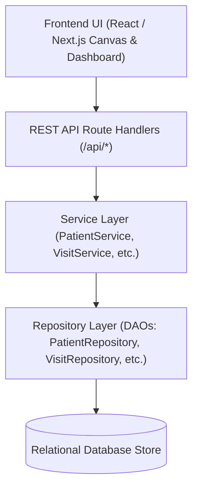
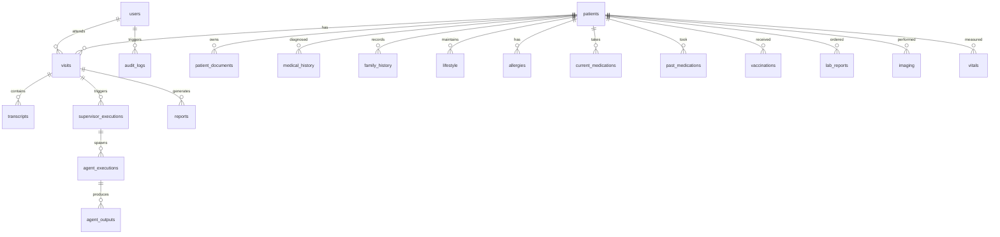

# ClinicaMind Database Architecture & Backend Data Layer Documentation

## Architectural Overview

ClinicaMind enforces a strict 4-layer backend architecture for clinical data management and AI multi-agent decision support persistence:



---

## Entity Relationship (ER) Diagram



---

## Core Schema Tables & Relationships

| Table Name | Primary Key | Foreign Keys | Purpose |
| :--- | :--- | :--- | :--- |
| `users` | `id` | - | Doctor and clinician accounts |
| `patients` | `id` | `primaryDoctor` -> `users.id` | Demographics, MRN indexing, contact & insurance |
| `patient_documents` | `id` | `patientId` -> `patients.id` | File metadata & paths for PDF, MRI, CT, X-Ray, ECG |
| `medical_history` | `id` | `patientId` -> `patients.id` | Diagnosed conditions and resolution flags |
| `family_history` | `id` | `patientId` -> `patients.id` | Familial medical conditions |
| `lifestyle` | `id` | `patientId` -> `patients.id` | Smoking, alcohol, diet, and exercise habits |
| `allergies` | `id` | `patientId` -> `patients.id` | Allergen, reaction, and severity levels |
| `current_medications`| `id` | `patientId` -> `patients.id` | Active prescription drugs and dosages |
| `past_medications` | `id` | `patientId` -> `patients.id` | Discontinued medications and reasons |
| `vaccinations` | `id` | `patientId` -> `patients.id` | Immunization history |
| `lab_reports` | `id` | `patientId`, `visitId` | Blood, urine, and pathology laboratory results |
| `imaging` | `id` | `patientId`, `visitId` | Radiographic findings and file paths |
| `vitals` | `id` | `patientId`, `visitId` | Blood pressure, heart rate, temperature, SpO2 |
| `visits` | `id` | `patientId`, `doctorId` | Consultation sessions owning transcripts & AI outputs |
| `transcripts` | `id` | `visitId` -> `visits.id` | Diarized transcript turns (Doctor/Patient/System) |
| `supervisor_executions`| `id` | `visitId`, `patientId` | AI Supervisor planner execution runs |
| `agent_executions` | `id` | `supervisorExecutionId` | Specialist agent execution lifecycle |
| `agent_outputs` | `id` | `agentExecutionId` | Structured JSON outputs, evidence & confidence |
| `reports` | `id` | `visitId`, `patientId` | SOAP notes, discharge summaries, signed PDFs |
| `audit_logs` | `id` | `userId` -> `users.id` | Immutable audit trail for clinical actions |

---

## REST API Specification

### 1. Patients API
- `GET /api/patients`: Search/list patients (`?q=name_or_mrn`)
- `POST /api/patients`: Create a new patient
- `GET /api/patients/:id`: Retrieve full EHR profile
- `PATCH /api/patients/:id`: Update patient demographics
- `DELETE /api/patients/:id`: Delete patient record
- `GET /api/patients/:id/clinical`: Retrieve clinical sub-records (allergies, meds, labs, docs)
- `POST /api/patients/:id/clinical`: Add clinical sub-record

### 2. Visits API
- `GET /api/visits`: List consultations (`?patientId=1234`)
- `POST /api/visits`: Start a new consultation visit
- `GET /api/visits/:id`: Retrieve visit details, transcripts & AI executions
- `PATCH /api/visits/:id`: Update visit status or clinical findings

### 3. Transcript API
- `GET /api/visits/:id/transcript`: Retrieve transcript turns for visit
- `POST /api/visits/:id/transcript`: Append diarized transcript turn

### 4. Reports API
- `GET /api/reports`: List generated clinical reports (`?patientId=1234`)
- `POST /api/reports`: Create clinical summary, SOAP note, or discharge report

### 5. Search & Audit APIs
- `GET /api/search`: Multi-entity query across Patients, MRN, Phone, Visits, and Doctors
- `GET /api/audit`: Query system audit logs

---

## Zero-State Execution & Optional Seeding

1. **Default Zero State**:
   - ClinicaMind starts with an empty 0-record database upon launch.
   - UI views display clean "No patients", "No visits", and "No reports" states without errors or crashes.

2. **Optional Test Seeder**:
   - Developers can seed test patient data on demand by running:
     ```bash
     npm run seed
     ```
