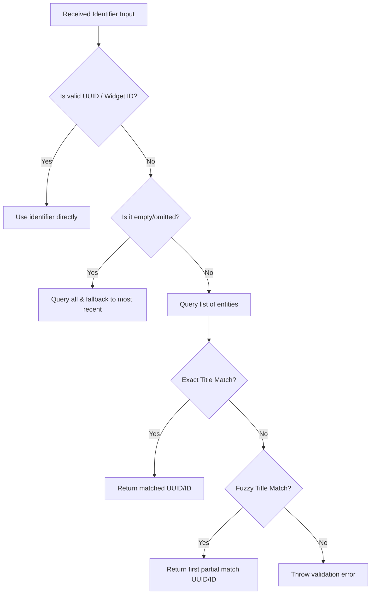

# Smart ThingsBoard Dashboard Integration Guide

This guide describes how to use and customize the interactive ThingsBoard Dashboard management system in our platform. These tools allow you to seamlessly build, view, resize, and manage telemetry dashboards for your IoT devices using simple natural language names and automated smart layouts.

---

## Key Features

1. **Auto-Resolution of Identifiers**: 
   No need to hunt down complex UUIDs. You can reference any dashboard or widget by its plain text name/title (case-insensitive, exact or partial match).
2. **Recent Dashboard Auto-Select**:
   If no dashboard identifier is provided, the platform automatically targets the most recently created or updated dashboard.
3. **Smart Grid Auto-Packing**:
   When widgets are added, the system automatically checks the active 24-column layout and packs them into the first available space to prevent overlapping and minimize empty space.
4. **Native ThingsBoard Widget Library Sync**:
   Fetches the actual widget templates directly from ThingsBoard's system library, ensuring layouts and widgets render in correct dimensions.

---

## 🛠️ MCP Tools Reference

### 1. `create_dashboard`
Creates a brand-new, empty dashboard ready for widgets.

* **Parameters:**
  * `title` (string, required): Title/name of the new dashboard.
* **Example Usage:**
  ```json
  {
    "title": "Smart Home Living Room"
  }
  ```

### 2. `list_dashboards`
Lists all dashboards available on the account with paging.

* **Parameters:**
  * `pageSize` (number, optional, default: 10)
  * `page` (number, optional, default: 0)

### 3. `get_dashboard`
Gets layout coordinates, properties, and widget details for a dashboard.

* **Parameters:**
  * `dashboard` (string, optional): Dashboard UUID or name. If omitted, targets the most recent dashboard.
* **Example Response:**
  ```json
  {
    "success": true,
    "title": "Smart Home Living Room",
    "widgets": [
      {
        "widgetId": "widget-171829472",
        "title": "Temperature",
        "type": "simple_card",
        "sizeX": 12,
        "sizeY": 5,
        "row": 0,
        "col": 0
      }
    ]
  }
  ```

### 4. `add_widget_to_dashboard`
Adds a telemetry widget for a specific device. The system reads the device's telemetry keys, auto-selects the best matching widget type, and packs it dynamically into the layout.

* **Parameters:**
  * `dashboard` (string, optional): Target dashboard name or UUID (defaults to most recent).
  * `deviceId` (string, required): Device UUID to bind telemetry from.
  * `widgetTitle` (string, optional): Custom title for the widget.
* **Widget Type Selection Rules:**
  * Keys containing `"alarm"` or `"alert"` ➔ **Alarm Table** (full-width)
  * Single key containing `"level"`, `"percent"`, `"battery"`, or `"fill"` ➔ **Gauge** (one-third width)
  * Single numeric key ➔ **Value Card** (half-width)
  * Multiple keys ➔ **Timeseries Line Chart** (full-width)

### 5. `update_widget_layout`
Moves or resizes a widget on the 24-column grid.

* **Parameters:**
  * `dashboard` (string, optional): Dashboard name or UUID.
  * `widget` (string, required): Widget ID or widget title.
  * `sizeX` (number, optional): Width in columns (1-24).
  * `sizeY` (number, optional): Height in rows.
  * `row` (number, optional): Starting row index.
  * `col` (number, optional): Starting column index (0-23).

### 6. `delete_widget_from_dashboard`
Deletes a widget from the layout.

* **Parameters:**
  * `dashboard` (string, optional): Dashboard name or UUID.
  * `widget` (string, required): Widget ID or widget title.

### 7. `delete_dashboard`
Deletes an entire dashboard from the account.

* **Parameters:**
  * `dashboard` (string, optional): Dashboard name or UUID.

---

## 📈 Grid Coordinate System

ThingsBoard operates on a **24-column grid**. The coordinates map as follows:

```
col 0                                                      col 23
┌───────────────────────────┬───────────────────────────┐
│ Value Card (sizeX: 12)    │ Value Card (sizeX: 12)    │ row 0
├───────────────────────────┴───────────────────────────┤
│ Timeseries Chart (sizeX: 24)                          │ row 5
└───────────────────────────────────────────────────────┘ row 13
```

- **Width (`sizeX`)**: From `1` to `24`.
- **Height (`sizeY`)**: Measured in layout row increments (approx. 70px per row).
- **Auto-Packing**: Adding two half-width (`sizeX: 12`) widgets back-to-back will automatically position them side-by-side on the same row!

---

## 🚀 Step-by-Step Developer Guide

This section outlines common workflows and patterns when developing or integrating with this module.

### Scenario A: Provisioning a New Smart Dashboard
To provision a clean workspace dashboard for a customer device and display its telemetry:

1. **Create the Dashboard**:
   Invoke `create_dashboard` with a descriptive name.
   ```json
   { "title": "Facility A - Power Metrics" }
   ```
   *Result:* Returns the new Dashboard UUID. However, you don't need to save this ID; the service now defaults to this dashboard as it is the most recently created.

2. **Add a Device Telemetry Widget**:
   Identify the device UUID (e.g. `648ae560-880e-11f1-bb5b-f59caa77e86d`) and invoke `add_widget_to_dashboard`.
   ```json
   {
     "deviceId": "648ae560-880e-11f1-bb5b-f59caa77e86d",
     "widgetTitle": "Primary Generator Temperature"
   }
   ```
   *Under the hood:* 
   - The service fetches the telemetry keys for that device.
   - If the device contains only `temperature`, it auto-selects a `value_card` (half-width, sizeX: 12).
   - It searches the Widgets Library for `system.cards.simple_card`, configures the datasource bindings, and assigns a random instance UUID.
   - It places the widget at the top-left (`col: 0`, `row: 0`).

3. **Add a Second Device Widget**:
   Now, invoke the tool again for a different device or different metrics:
   ```json
   {
     "deviceId": "b8a8b120-8812-11f1-bb5b-f59caa77e86d",
     "widgetTitle": "Secondary Generator Temperature"
   }
   ```
   *Layout solver packing:*
   - Since the first widget was `sizeX: 12` (half-width) and placed at `col: 0`, `row: 0`, the layout solver scans the grid.
   - It finds that column range `12-23` at `row: 0` is completely empty.
   - The new `value_card` (sizeX: 12) is automatically positioned at `col: 12`, `row: 0` (side-by-side with the first one!).

---

### Scenario B: Restructuring Layouts (Grid Alignment)
If you want to resize a widget (e.g. stretch a single value card to full width, or reposition a chart):

1. **Inspect current widgets**:
   Call `get_dashboard` to list all widgets inside the dashboard.
   ```json
   { "dashboard": "Facility A - Power Metrics" }
   ```
   *Result:*
   ```json
   {
     "success": true,
     "title": "Facility A - Power Metrics",
     "widgets": [
       {
         "widgetId": "widget-1784975958182",
         "title": "Primary Generator Temperature",
         "type": "simple_card",
         "sizeX": 12,
         "sizeY": 5,
         "row": 0,
         "col": 0
       }
     ]
   }
   ```

2. **Resize the Widget**:
   Call `update_widget_layout` to stretch this card to full-width (24 columns):
   ```json
   {
     "dashboard": "Facility A - Power Metrics",
     "widget": "Primary Generator Temperature",
     "sizeX": 24
   }
   ```
   *Result:* The tool resolves the widget title `"Primary Generator Temperature"` to `"widget-1784975958182"`, then updates both the layout settings and the widget structure definitions, stretching the card across the full width.

---

## 🔍 Detailed Resolution Logic

When an identifier parameter (`dashboard` or `widget`) is passed to a tool, the server runs a resolution cycle:



---

## ⚠️ Troubleshooting & Common Error Messages

#### 1. `"Device {UUID} has no telemetry data yet."`
* **Why it happens:** ThingsBoard does not save timeseries key schemas for devices that have never emitted telemetry messages.
* **Solution:** Send a mock telemetry post from your device emulator first (e.g. `{"temperature": 25}`) before adding the widget.

#### 2. `"Could not find dashboard with name or ID matching..."`
* **Why it happens:** The dashboard name is misspelled, or the dashboard has been deleted.
* **Solution:** Call `list_dashboards` to verify the exact titles currently registered on the account.

