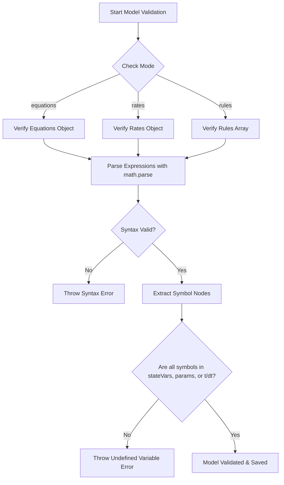

# Simulation Twin & AI-Assisted Modeling Guide

This guide describes how to use and customize the **Simulation Twin** capability in our platform. This module allows non-technical users to describe dynamic physical, ecological, or business systems in plain natural language, translate them automatically into validated mathematical models, and execute them safely and deterministically.

---

## Key Features

1. **AI-Assisted Model Generation**: 
   Uses Google Gemini (`gemini-2.5-flash` with a `gemini-3.5-flash` fallback) to translate qualitative textual requirements into structured equation models, rates, or conditional rules.
2. **Safe Mathematical Evaluation**:
   Uses `mathjs` for deterministic expression parsing and calculation. The system **never** evaluates raw code or executable scripts, preventing security vulnerabilities.
3. **Strict Parameter Validation**:
   Checks all model expressions before saving and execution to ensure that they only reference declared state variables, parameters, or reserved time parameters (`t` and `dt`).
4. **Safety Gating & Expert Review Lifecycle**:
   Automatically identifies safety-critical domains (such as medical, pharmaceutical, structural, legal, and financial). Models in these domains start in a `draft` status and are blocked from running until reviewed and approved by an expert.

---

## ⏱️ Core Simulation Concepts

Understanding how simulation twins model dynamic systems:

### 1. What is a "Simulation"?
Unlike a static calculation or database lookup, a **simulation** models how a system evolves **over time**. It starts with an initial state at $t = 0$ (such as starting temperature or initial population) and computes subsequent values step-by-step into the future using mathematical rates or conditional rules.

### 2. Time Steps (`steps`) & Step Size (`dt`)
In the real world, time flows continuously. To calculate this on a digital system, time must be divided into discrete chunks:
- **Step Size (`dt`):** The duration of each time step. If your time unit is hours, `dt = 1` evaluates the simulation in 1-hour increments. A smaller `dt` (e.g. `0.1`) yields higher mathematical accuracy because rate changes are calculated over smaller intervals, but requires more computations.
- **Steps:** The total number of ticks/steps to compute. For example, running `steps: 24` with `dt: 1` simulates a total duration of 24 hours.

### 3. Why Time-Series Data (`resultHistory`)?
Instead of just returning the final state, the engine returns the entire **time-series history** (a list of values at $t = 0, 1, 2...$). This is crucial for:
- **Visualizing Trends:** Understanding the curves and trajectories (e.g., exponential growth, decay curves, oscillations).
- **Dashboard Plotting:** Allowing the digital twin frontend to bind this dataset directly to interactive charts, widgets, and timeline graphs.

---

## 🛠️ MCP Tools Reference

### 1. `generate_simulation_model`
Uses AI to draft a mathematical model from a plain-language requirement text.

* **Parameters:**
  * `requirement` (string, required): Layperson description of simulation behavior.
  * `domain` (string, optional): Domain hint (e.g. `physics`, `hydraulics`, `ecology`). If omitted, the AI auto-detects it.
* **Example Input:**
  ```json
  {
    "requirement": "A water tank filling up. Water flows in from a pipe, and there is a small leak at the bottom."
  }
  ```
* **Example Response:**
  ```json
  {
    "success": true,
    "modelId": "709ff7e3-8d39-4795-9891-d4340996c41f",
    "domain": "hydraulics",
    "mode": "rates",
    "stateVars": ["h"],
    "params": {
      "A_tank": 2.0,
      "A_leak": 0.005,
      "Q_in": 0.02,
      "g": 9.81,
      "C_d": 0.6,
      "h": 0.1
    },
    "rates": {
      "h": "(Q_in - C_d * A_leak * sqrt(2 * g * max(0, h))) / A_tank"
    },
    "knownFormulaReference": "Torricelli's Law & Mass Conservation",
    "requiresExpertReview": false,
    "status": "draft"
  }
  ```

### 2. `run_simulation`
Executes a generated model and returns time-series output data.

* **Parameters:**
  * `modelId` (string, required): UUID of the model to run.
  * `steps` (number, optional, default: `24`): Total number of ticks/steps.
  * `dt` (number, optional, default: `1`): The step size increment.
  * `paramOverrides` (object/string, optional): JSON mapping of parameter name overrides.
* **Example Input:**
  ```json
  {
    "modelId": "709ff7e3-8d39-4795-9891-d4340996c41f",
    "steps": 24,
    "dt": 1,
    "paramOverrides": {
      "h": 0.5
    }
  }
  ```

### 3. `approve_simulation_model`
Marks a model as reviewed and trusted by an expert, optionally correcting equations.

* **Parameters:**
  * `modelId` (string, required): UUID of the model.
  * `reviewedBy` (string, required): Name of the expert reviewer.
  * `equationOverrides` (object, optional): Formula overrides to correct AI equations or rates.
* **Example Input:**
  ```json
  {
    "modelId": "709ff7e3-8d39-4795-9891-d4340996c41f",
    "reviewedBy": "Dr. Watson",
    "equationOverrides": {
      "h": "(Q_in - C_d * A_leak * sqrt(2 * g * h)) / A_tank"
    }
  }
  ```

---

## 📈 Simulation Modes

The engine runs simulations in three different mathematical modes depending on the nature of the system:

### A. Equations Mode
Used when variables have a direct closed-form formula at time `t`.
* **Equation:** $N(t) = f(\text{params}, t)$
* **Evaluation:** At each step, evaluates the expression directly:
  `state[v] = math.evaluate(equations[v], scope)`

### B. Rates Mode (Euler Integration)
Used when you define how fast something changes (derivatives) rather than its absolute value.
* **Equation:** $N(t + dt) = N(t) + \frac{dN}{dt} \times dt$
* **Evaluation:** Performs standard first-order numerical integration:
  `state[v] = state[v] + math.evaluate(rates[v], scope) * dt`

### C. Rules Mode
Used for conditional state-machine-like transitions.
* **Condition:** A math expression evaluating to a boolean (e.g. `stock < reorder_threshold`).
* **Effect:** Formatted as `variable = expression`.
* **Evaluation:** At each step, if the condition evaluates to `true`, the effect's right-hand side is evaluated and assigned to the variable.

---

## 🚀 Step-by-Step Developer Guide

### Scenario: Simulating a Petri Dish Colony (Medical Domain)

This workflow demonstrates model creation, safety gating, expert review approval, and execution:

1. **AI Model Generation**:
   A user calls the builder with a medical requirement:
   ```json
   {
     "requirement": "Model bacteria growth starting at 10 cells in a petri dish, growing at a rate of 0.3, limited by a carrying capacity of 10,000."
   }
   ```
   *Result:* The AI automatically detects `domain: "medical"` and sets `"requiresExpertReview": true`, saving the model in a `draft` state.

2. **Simulation Attempt (Gated)**:
   The user attempts to run it immediately:
   ```json
   { "modelId": "709ff7e3-8d39-4795-9891-d4340996c41f" }
   ```
   *Result:* The engine blocks execution because of the `medical` domain restriction.

3. **Expert Approval**:
   A medical researcher reviews the formulas, validates they follow the *Verhulst Logistic Growth Equation*, and approves the model:
   ```json
   {
     "modelId": "709ff7e3-8d39-4795-9891-d4340996c41f",
     "reviewedBy": "Dr. Watson"
   }
   ```
   *Result:* Status is upgraded to `"trusted"`.

4. **Simulation Execution**:
   The model is now unlocked:
   ```json
   { "modelId": "709ff7e3-8d39-4795-9891-d4340996c41f", "steps": 5 }
   ```
   *Result:* The engine integrates growth rates and returns a time-series history:
   ```json
   "resultHistory": [
     { "t": 0, "N": 10 },
     { "t": 1, "N": 12.997 },
     { "t": 2, "N": 16.891 },
     { "t": 3, "N": 21.949 },
     { "t": 4, "N": 28.520 },
     { "t": 5, "N": 37.051 }
   ]
   ```

---

## 🔍 Validation Pipeline

When a model is generated or updated, it undergoes a strict safety validation parse cycle:



---

## ⚠️ Troubleshooting & Common Error Messages

#### 1. `"This model requires expert review before running..."`
* **Why it happens:** The model is in a safety-critical domain (`medical`, `pharmaceutical`, `financial`, etc.) and still has a status of `"draft"`.
* **Solution:** Call `approve_simulation_model` with a reviewer name to elevate its status to `"trusted"`.

#### 2. `"Undefined variable or function '{name}' in expression..."`
* **Why it happens:** An equation contains a variable not declared in `stateVars` or `params`, or uses an unsupported function.
* **Solution:** Approve the model and pass `equationOverrides` correcting the spelling or removing the reference to the undefined variable.
