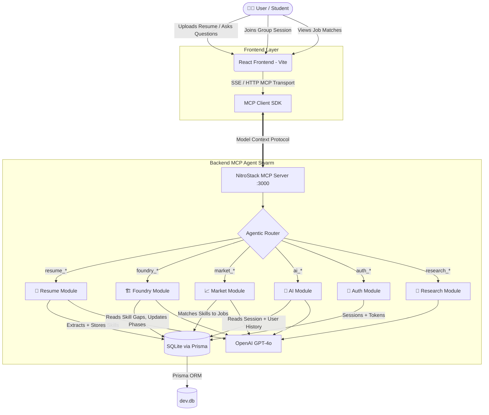

# 🌱 EKALAVYA — The Agentic Career Intelligence Platform

<div align="center">

**The new way to grow your career: build real projects, learn by doing, and collaborate with peers — all guided by AI.**

[](https://nitrostack.ai)
[](https://vitejs.dev)
[](https://prisma.io)
[](https://www.typescriptlang.org)
[](https://sqlite.org)
[](https://openai.com)

</div>

---

## 🛑 The Problem Nobody Is Solving Correctly

The modern education-to-employment pipeline is broken at every layer:

| Problem | Reality |
|---|---|
| 🔁 **Experience Paradox** | Entry-level jobs require experience. But you can't get experience without a job. |
| 📋 **Generic Portfolios** | Every student builds the same Todo app, weather tracker, and calculator. Recruiters are numb to it. |
| 🔇 **The Feedback Void** | Self-taught developers have no senior oversight. They don't know if their code is scalable, clean, or insecure. |
| 🏝️ **Isolated Learning** | Existing ed-tech traps users in solo silos. Software engineering is a team sport. |
| 🤖 **Passive AI Reliance** | ChatGPT gives you answers. You copy-paste them. You learn nothing. Skills don't compound. |
| 🌐 **Language Barriers** | Brilliant minds in developing nations fail interviews not because of skill — but because of how they articulate it. |

---

## ✅ What Ekalavya Does

```
┌──────────────────────────────────────────────────────────────────────┐
│                        EKALAVYA PLATFORM                             │
│                                                                      │
│  User Uploads Resume                                                 │
│        │                                                             │
│        ▼                                                             │
│  ┌─────────────┐    ┌──────────────────┐    ┌───────────────────┐   │
│  │  Resume AI  │───▶│  Skill Gap Engine│───▶│ Project Foundry   │   │
│  │  (Parser)   │    │  (SWOT Matrix)   │    │ (Guided Building) │   │
│  └─────────────┘    └──────────────────┘    └─────────┬─────────┘   │
│                                                        │             │
│        ┌───────────────────────────────────────────────┘             │
│        ▼                                                             │
│  ┌─────────────────┐    ┌──────────────────┐    ┌────────────────┐  │
│  │  Group Foundry  │    │  AI Career Coach │    │  Job Matching  │  │
│  │  (Collab Rooms) │    │  (Chatbot + Mem) │    │  (Skill-Delta) │  │
│  └─────────────────┘    └──────────────────┘    └────────────────┘  │
│        │                                                             │
│        ▼                                                             │
│  ┌─────────────────────────────────────────┐                        │
│  │  Resume Architect AI (STAR PDF Export)  │                        │
│  └─────────────────────────────────────────┘                        │
└──────────────────────────────────────────────────────────────────────┘
```

---

## 🏛️ System Architecture

### Full Agentic MCP Architecture



---

### MCP Tool Call Flow (How a Request Works)

```
User clicks "Analyze Resume"
        │
        ▼
React calls mcpClient.callTool("resume_build_resume", { userId, pdfText })
        │
        ▼
NitroStack routes to → ResumeModule.tools.ts
        │
        ├─▶ Calls OpenAI with structured prompt
        │         │
        │         └─▶ Returns: { skills[], gaps[], swot{} }
        │
        ├─▶ Writes to Prisma: profile.analysisJson
        │
        └─▶ Returns structured MCP response to Frontend
                  │
                  ▼
         React renders SWOT + Skill Map UI
```

---

## 🧩 Feature Breakdown

### 1. 🧠 Resume Intelligence Engine (`resume` module)

| Tool | What It Does |
|---|---|
| `resume_build_resume` | Parses raw resume text → extracts skills, role, experience into a structured JSON profile |
| `resume_get_profile` | Fetches the stored profile for a user |
| `resume_export_pdf` | Generates STAR-method formatted resume as downloadable PDF |

- **Deep Skill Extraction**: Maps your listed technologies against live industry demands for your target role
- **SWOT Matrix Generation**: Automatically categorizes your profile into Strengths, Weaknesses, Opportunities, and Threats
- **STAR Resume Export**: Extracts verified projects from The Foundry and rewrites them into recruiter-ready bullet points

---

### 2. 🏗️ Group Foundry — Collaborative Project Workspace (`foundry` module)

The centrepiece feature. This is where rote learning dies.

| Tool | What It Does |
|---|---|
| `foundry_start_project` | Generates a hyper-personalized project blueprint tailored to your skill gaps |
| `foundry_unlock_phase` | Verifies phase completion and advances the project to the next milestone |
| `foundry_get_projects` | Returns all active + completed projects for a user |
| `foundry_join_session` | Joins a peer's live collaborative workspace using a 6-digit sync code |
| `foundry_create_session` | Creates a new group session and generates a join code |
| `foundry_update_project` | Saves code progress to a project phase |

**Phase-Based Project Architecture**:
```
Project Blueprint
├── Phase 1: Environment Setup       ← Verify toolchain
├── Phase 2: Core Logic              ← Implement business rules
├── Phase 3: Database Integration    ← Add persistence
├── Phase 4: API Development         ← Expose interfaces
├── Phase 5: Frontend Integration    ← Connect UI
└── Phase 6: Deployment              ← Ship it
```

**Group Session Sync Flow**:
```
Team Lead                         Peer(s)
    │                                │
    ├─ foundry_create_session ──────▶ Gets 6-digit code (e.g. A3F9K2)
    │                                │
    │                 ◀──────────── foundry_join_session(code)
    │                                │
    └── Shared Foundry Workspace ────┘
        (Both see same project state, AI coaches the group)
```

---

### 3. 📈 Market Intelligence (`market` module)

| Tool | What It Does |
|---|---|
| `market_get_recommended` | Returns job listings ranked by skill-delta match |
| `market_update_profile` | Updates career goals, target role, and preferences |
| `market_get_job_matches` | Fetches current job match scores |
| `market_post_to_channel` | Posts to community discussion channels |
| `market_get_channels` | Lists all community learning channels |
| `market_get_channel_messages` | Fetches messages from a specific channel |

**Skill-Delta Job Matching**: Instead of keyword search, the platform measures the *distance* between your current skills and each job requirement, ranking opportunities by how close you already are.

---

### 4. 💬 AI Career Coach (`ai` module)

| Tool | What It Does |
|---|---|
| `ai_chat` | Persistent, context-aware career coaching conversation |
| `ai_get_sessions` | Fetches all past chat sessions for a user |
| `ai_new_session` | Creates a new coaching session |

- **Stateful Memory**: Remembers every interaction, your goals, struggles, and growth stage over time
- **Proactive Guidance**: Doesn't wait for you to ask — surfaces relevant nudges based on your current project phase
- **Multilingual Support**: Tamil mode (தமிழ்) for students in Tier-2/3 cities who think better in their native language

---

### 5. 🔐 Auth Module (`auth` module)

| Tool | What It Does |
|---|---|
| `auth_register` | Creates a new user account with hashed credentials |
| `auth_login` | Authenticates and returns a session token |
| `auth_logout` | Invalidates the current session |
| `auth_me` | Returns the authenticated user's profile |

- Secure password hashing (bcrypt)
- Session-token-based auth stored in SQLite
- All MCP tool calls validate session before execution

---

### 6. 🔬 Research Module (`research` module)

AI-powered deep-dive research tools to support learning:

| Tool | What It Does |
|---|---|
| `research_topic` | Deep-dives into any tech topic with structured explanations |
| `research_compare` | Compares two technologies head-to-head |
| `research_roadmap` | Generates a full learning roadmap for a given skill |

---

## 🗄️ Database Schema

```
User
 ├── id, email, passwordHash, fullName, createdAt
 ├── sessions[]        → Session tokens
 ├── profiles[]        → Career profiles + skill analysis JSON
 ├── projects[]        → Foundry projects (phases, code, status)
 ├── goals[]           → UserGoal (text, tag, color, isDone)
 ├── activity[]        → Daily heatmap data (hours, level)
 ├── chatSessions[]    → AI coaching conversations
 └── messages[]        → Community channel messages

Project
 ├── id (UUID), userId
 ├── title
 ├── dataJson          → Full project blueprint + phase tracking
 ├── codeContent       → Saved code for the active phase
 └── createdAt, updatedAt

ChatSession
 ├── id (UUID), userId, title, createdAt
 └── messages[]        → ChatMessage (role, content, timestamp)

Channel
 ├── id, name (unique), category
 └── messages[]        → CommunityMessage (user, content, type)
```

---

## 💻 Tech Stack

| Layer | Technology | Purpose |
|:---|:---|:---|
| **Frontend** | React 19 + Vite | Fast HMR, component-based dashboards |
| **Styling** | Tailwind CSS + Framer Motion | Glassmorphism UI + fluid micro-animations |
| **Code Editor** | Monaco Editor | VS Code experience inside the browser |
| **MCP Client** | `@modelcontextprotocol/sdk` | SSE transport + MCP tool-call routing |
| **Backend Core** | NitroStack TypeScript SDK | Modular MCP server + agent tool framework |
| **AI Models** | OpenAI GPT-4o | Career strategy, code analysis, coaching |
| **Database** | SQLite + Prisma ORM v7 | Zero-config relational DB with TS type safety |
| **DB Adapter** | `@prisma/adapter-libsql` | Cross-platform SQLite driver (no compilation) |
| **Auth** | bcrypt + session tokens | Secure password hashing + stateless sessions |
| **Deployment** | NitroCloud | MCP server hosting with auto-deploy |

---

## 📁 Repository Structure

```
Ekalavya/
├── README.md                          ← You are here
├── frontend/                          ← React + Vite UI
│   ├── src/
│   │   ├── pages/
│   │   │   ├── Dashboard.jsx          ← Main career dashboard
│   │   │   ├── Foundry.jsx            ← Project workspace + Group Sessions
│   │   │   ├── CareerGuidance.jsx     ← AI coaching chatbot
│   │   │   ├── ResumeBuilder.jsx      ← Resume upload + STAR export
│   │   │   ├── JobHub.jsx             ← Skill-delta job matching
│   │   │   └── Community.jsx          ← Learning channels
│   │   ├── components/                ← Reusable UI components
│   │   └── MCPProvider.jsx            ← MCP client + tool-call wrapper
│   └── package.json
│
└── ekalavya-2.0/                      ← NitroStack MCP Backend
    ├── package.json                   ← "build": "prisma generate && nitrostack-cli build"
    ├── prisma/
    │   └── schema.prisma              ← Full database schema
    ├── prisma.config.ts               ← Prisma v7 datasource config
    ├── src/
    │   ├── app.module.ts              ← Root module (registers all agents)
    │   ├── index.ts                   ← Server bootstrap
    │   └── modules/
    │       ├── auth/                  ← Auth tools (register, login, logout, me)
    │       ├── resume/                ← Resume analysis + PDF export tools
    │       ├── foundry/               ← Project workspace + group session tools
    │       ├── market/                ← Job matching + community tools
    │       ├── ai/                    ← AI coaching chat tools
    │       ├── research/              ← Topic deep-dive tools
    │       └── database/              ← Prisma service (singleton)
    └── .env                           ← OPENAI_API_KEY + DATABASE_URL
```

---

## ⚙️ Quick Start

### Prerequisites

| Item | Requirement |
|---|---|
| OS | Windows / macOS / Linux |
| Node.js | v20.x or higher |
| npm | v9+ |
| OpenAI API Key | Required for AI features |

### 1. Clone the Repository

```bash
git clone https://github.com/PrajithS20/Ekalavya.git
cd Ekalavya
```

### 2. Backend Setup (MCP Server)

```bash
cd ekalavya-2.0

# Install dependencies
npm install

# Configure environment
cp .env.example .env
# → Edit .env and add your OPENAI_API_KEY

# Start the MCP server
npm run start
# Server listens on http://localhost:3000
# MCP endpoint: http://localhost:3000/mcp
# SSE endpoint: http://localhost:3000/sse
```

### 3. Frontend Setup

Open a new terminal:

```bash
cd frontend
npm install
npm run dev
# UI starts on http://localhost:5174
```

### 4. Verify the Backend Is Live

```bash
curl http://localhost:3000/mcp
# Expected: MCP handshake response JSON
```

---

## 🧠 Why This Is Truly Agentic (Not Just a Wrapper)

Most "AI apps" are `user prompt → LLM → response`. That's it. Ekalavya is different:

| Capability | Standard LLM App | Ekalavya |
|---|---|---|
| **State** | Stateless (each call is isolated) | Stateful (remembers your entire career history) |
| **Tool Use** | None | 25+ specialized MCP tools across 6 agent modules |
| **Autonomy** | Responds when asked | Proactively advances project phases, surfaces nudges |
| **Collaboration** | Single user | Multi-user group sessions with shared AI context |
| **Verification** | None | Phase-gate system: AI verifies completion before advancing |
| **Output** | Text | Structured JSON → DB → PDF → UI rendering |

---

## 🚀 Deployment (NitroCloud)

The backend is a NitroStack MCP server deployable to NitroCloud:

```bash
# Build for production (generates Prisma types + compiles TypeScript)
cd ekalavya-2.0
npm run build

# Deploy via NitroStack CLI
nitrostack-cli start
```

Or upload `ekalavya-cloud-ready.zip` directly on [cloud.nitrostack.ai](https://cloud.nitrostack.ai).

Once deployed, update your frontend `MCPProvider.jsx`:
```js
// Change from:
const MCP_URL = "http://localhost:3000/mcp"
// To:
const MCP_URL = "https://your-app.nitrocloud.app/mcp"
```

---

## 🌱 Growth Stage System

Ekalavya tracks your career evolution through stages:

```
Seed 🌱  →  Sprout 🌿  →  Sapling 🌳  →  Tree 🌲  →  Forest 🌎
  |              |              |              |             |
  0 projects   1-2 verified  3-5 verified  6-10 jobs   Mentor others
               projects      projects       applied
```

Each stage unlocks new features, harder challenges, and more personalized AI guidance.

---

## 🤝 Contributing

1. Fork the repo
2. Create a feature branch: `git checkout -b feat/your-feature`
3. Add your MCP tool in the appropriate module under `ekalavya-2.0/src/modules/`
4. Register it in the module's `*.module.ts` file
5. Submit a PR with a description of what the tool does

---

## 📄 License

Apache 2.0 — free to use, modify, and distribute with attribution.

---

<div align="center">
  <strong>Built with ❤️ for the NitroStack Hackathon</strong><br/>
  <em>Ekalavya — because the best teacher you'll ever have is the work itself.</em>
</div>
