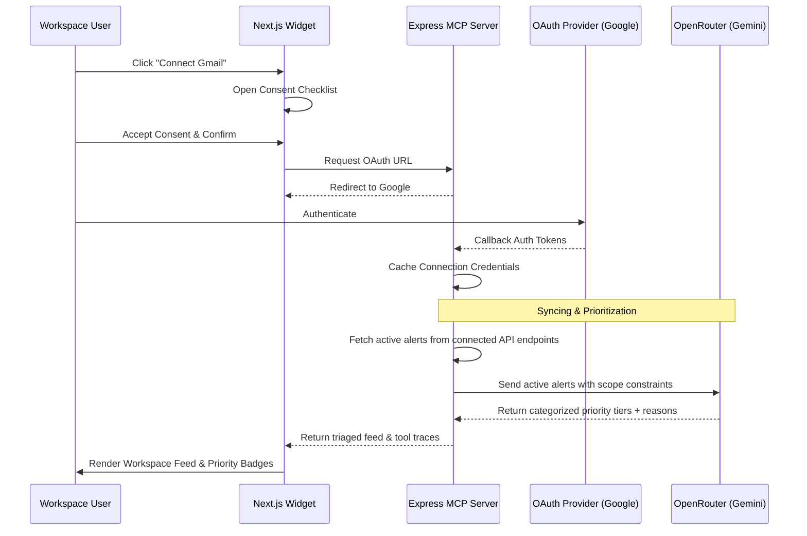

# FocusOps — AI-Powered Notification Prioritizer & Workspace Agent

FocusOps is a next-generation context-aware triage dashboard and workspace copilot designed to eliminate digital fatigue. By integrating Slack, Jira, GitHub, Gmail, and Google Calendar into a single Model Context Protocol (MCP) server, FocusOps aggregates, structures, and filters raw notification noise into actionable priority tiers.

---

## 🚀 The Novelty & Unique Value Proposition

Traditional notification hubs simply group alerts by app, leaving the user to sort through the noise. **FocusOps** introduces a paradigm shift in workspace productivity:

*   **Context-Aware AI Triage:** Instead of static filtering, FocusOps leverages local Large Language Models (LLMs) to parse active project constraints, calendar meetings, and alert details to intelligently tier updates into **Urgent Now**, **Normal Priority**, and **FYI Only**.
*   **Redesigned Visual Triage:** Out of the box comparison layout clearly demonstrates the transition from chaotic workspace noise to organized, agent-reasoned alerts.
*   **Redirection Boundaries:** The Focus Agent is strictly constrained to productivity. It politefully rejects off-topic queries (e.g., *"im your focus agent i can only help with your notifications and worksapce tasks."*).
*   **Redundant Process Safeguards:** Automatically intercepts port conflicts and cleans up background processes to ensure reliable, zero-latency local operations.
*   **Consent-First Data Privacy:** Implements a strict consent modal. Users grant permission explicitly per integration, and disconnecting a source immediately clears its notifications from the workspace feed.

---

## 🛠️ Tech Stack

FocusOps is built on a robust, lightweight, and modern stack:

*   **Core Architecture:** Model Context Protocol (MCP) by Anthropic, powered by the `@nitrostack/core` MCP framework.
*   **Backend Server:** Node.js, TypeScript, Express, Zod validation, Node-Cache.
*   **Frontend Interface:** Next.js (Static Export mode served by the MCP runtime), Framer Motion (premium animations), Lucide React (vector iconography).
*   **AI Integration:** OpenAI / Gemini API (via OpenRouter LLM Helper).
*   **Integrations & Auth:** Google OAuth2 (Passport.js integration for Gmail/Calendar), local token cache.

---

## 📋 Comprehensive Features

### 1. Unified Landing Console
*   **Connected Integrations Row:** Horizontal 5-column integration bar with customized brand linear gradients and connect/disconnect capabilities.
*   **Consent Gateways:** Checkbox-enforced consent gateways before connecting any channel. Disconnecting immediately deletes messages from the active feed.
*   **Typewriter Slogans:** Dynamic typing animation detailing Focus Agent capabilities.

### 2. Priority Workspace Dashboard
*   **Feed Filter Popover:** Custom dropdown to dynamically toggle specific channel updates (Slack, Gmail, GitHub, Jira, Calendar) inside the active feed.
*   **Redirection Navigator:** Square expanding icon (`Maximize2`) to transition directly to the main Focus Agent tab.
*   **Explanation Panel:** Context details card showing the exact reason why the AI Agent prioritized a specific alert.

### 3. Focus Agent Chat
*   **Timeline History:** Persistent sidebar panel to save, load, and clear past triaged chat sessions.
*   **Quick Action Prompts:** Pre-defined question pills (e.g., *"Show normal priority notifications"*) to speed up triage.

### 4. Agent Console (Diagnostics)
*   **Live Tool Traces:** Interactive command logs showing tool-call names, summaries, durations, and outputs as they happen.
*   **Notification Simulation:** Instant mock triggers to validate routing and prioritizer rules.

---

## 🔄 Clear Workflow Sequence



---

## ⚙️ How to Setup & Run

### 1. Environment Configuration
Create a `.env` file in the `notification-prioritizer` directory:

```env
PORT=3000
GOOGLE_CLIENT_ID=your_google_client_id
GOOGLE_CLIENT_SECRET=your_google_client_secret
GOOGLE_REDIRECT_URI=http://localhost:3000/oauth/google/callback
OPENROUTER_API_KEY=your_openrouter_api_key
```

### 2. Installation
Install dependencies in the root project:
```bash
npm run install:all
```

### 3. Launch Development Mode
Run both the MCP server and widget hot-reloader concurrently:
```bash
npm run dev
```

### 4. Build Production Bundle
Build and output static Next.js assets to the widget distribution directory:
```bash
npm run build
```

---

## 🎨 Visual Design System

FocusOps features a custom, futuristic dark/light mode layout:
*   **Typography:** Strict `Consolas, Monaco, monospace` coding aesthetic.
*   **Surfaces:** Translucent glassmorphism (`backdrop-filter: blur(12px)`) with fine outline borders.
*   **Animations:** Smooth spring physics and layout transitions powered by Framer Motion.
