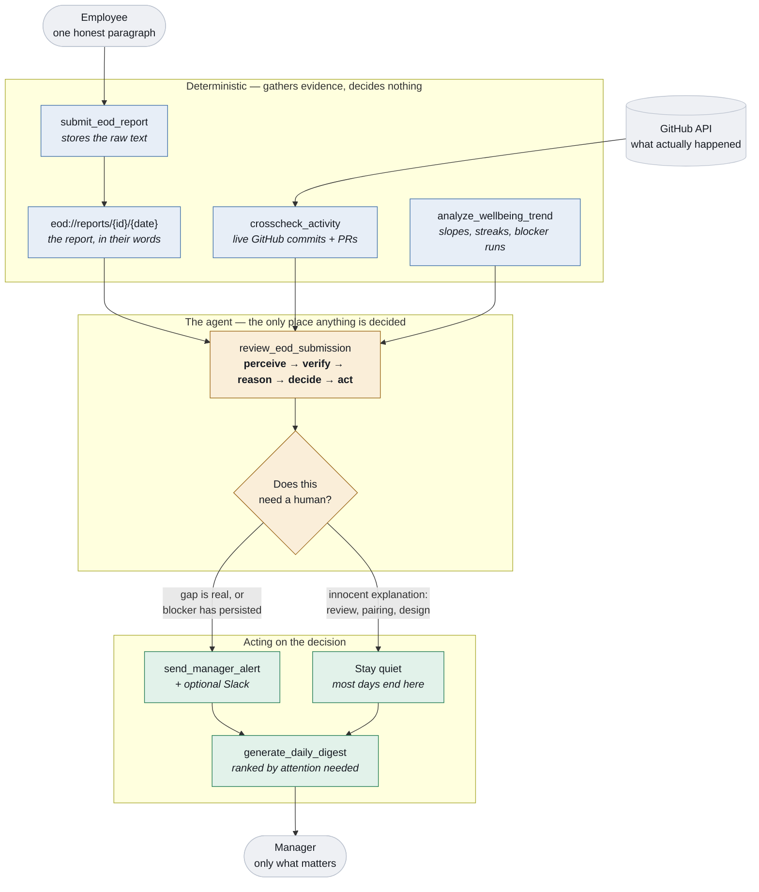

# GroundTruth

> An AI agent for EOD-driven team intelligence.

   

**GroundTruth** is an [MCP (Model Context Protocol)](https://nitrostack.ai) server that extends AI assistants — like Claude, Cursor, and any MCP-compatible client — with new, real-world capabilities. It is built and deployed on [Nitrostack](https://nitrostack.ai), the fastest way to build, deploy, and share MCP apps.

Built for the **NitroStack × Amrita University Hackathon** — Track: Enterprise AI & Workplace Automation.

## Table of Contents

- [Overview](#overview)
- [What is MCP?](#what-is-mcp)
- [Features](#features)
- [Architecture](#architecture)
- [Tools, Resources & Prompts](#tools-resources--prompts)
- [Getting Started](#getting-started)
- [Connect to an MCP Client](#connect-to-an-mcp-client)
- [Testing](#testing)
- [Deploy Your Own MCP App](#deploy-your-own-mcp-app)
- [Explore More MCP Apps](#explore-more-mcp-apps)
- [FAQ](#faq)
- [Keywords](#keywords)
- [License](#license)

## Overview

An AI agent for EOD-driven team intelligence. Employees write one honest paragraph a day; the agent verifies it against what actually happened in GitHub, and tells managers only what genuinely needs them.

**The problem.** Every IT company runs on end-of-day reports, and the process is broken. Reports scatter across Slack, email, and spreadsheets. Managers skim ten to twenty a day without verifying any of them. What someone *claims* — "finished the login module" — often doesn't match what actually landed in GitHub, and nobody checks. By the time a recurring blocker surfaces in a standup, three or four days of productivity are already gone.

**The solution.** GroundTruth reads daily EOD reports, cross-checks them against live GitHub activity, and surfaces only what genuinely needs a manager's attention — before they have to ask.

## What is MCP?

The **Model Context Protocol (MCP)** is an open standard that lets AI assistants securely connect to external tools, data sources, and services. Instead of being limited to what it was trained on, an AI model can call **MCP servers** to fetch live data, run actions, and integrate with real systems.

This project is one such MCP server. Learn more about building and shipping MCP apps at [nitrostack.ai](https://nitrostack.ai).

## Features

- 🔌 **MCP-native** — 14 tools, 5 resources, 3 prompts, 6 interactive widgets
- 🔍 **Verifies claims against reality** — pulls live GitHub commits and pull requests and scores whether the day's claims are actually supported
- 🧠 **The judgement lives in the model, not in a threshold** — every tool is deterministic; the decision to escalate is made by the agent reading the prompt
- 🤫 **Knows when to stay quiet** — review, pairing and design work leave no commit trail, and the agent is written to recognise that rather than cry wolf
- 📉 **Multi-day signals** — confidence slopes, tone, and blocker runs that survive rewording, so a blocker stuck all week reads as one blocker
- 🖥️ **Interactive widgets** — submission form, claimed-vs-actual comparison, manager dashboard, org digest, employee timeline
- ⚡ **Deployed on Nitrostack** — reliable, hosted, and instantly shareable
- 🔐 **Secure by design** — secrets stay in environment variables, never in code
- 🧪 **161 assertions across 9 offline suites** — no credentials or network required

## Architecture

The split below is the whole design. Everything on the left is deterministic — it fetches, diffs, stores, and notifies, and decides nothing. Everything the agent does is judgement, and it happens in the model reading the prompt. **Move the decision into a tool and this stops being an agent.**



Why it matters that the decision sits where it does: a scoring function with hardcoded thresholds would produce the same alerts on the same inputs, but it could never tell that a designer with no commits is fine while a backend engineer with no commits *and* a completion claim is not. The tools cannot make that distinction. The model can, and the prompt is what asks it to.

Claim extraction follows the same principle. `submit_eod_report` parses the report with keyword matching so there is always *something* to compare, but that parse cannot tell "finished the login module" from "still finishing the login module". So `crosscheck_activity` accepts a `claims` array from the caller, and the prompt tells the model to read the raw text and supply its own. **The deterministic parse is the fallback; the model's reading is the authority.**

## Tools, Resources & Prompts

### Tools

| Tool | Purpose |
|---|---|
| `open_eod_form` | Renders the submission form widget |
| `submit_eod_report` | Stores a report and pre-parses claims, blockers, sentiment |
| `crosscheck_activity` | Pulls live GitHub commits/PRs and scores claim support |
| `send_manager_alert` | Raises an alert — called only when the agent decides to, and posts to Slack if configured |
| `resolve_manager_alert` | Clears a handled alert |
| `generate_daily_digest` | One team's dashboard, every row, ordered by attention needed |
| `generate_org_digest` | Every team at once: per-team health plus the people needing attention org-wide |
| `analyze_wellbeing_trend` | Confidence, tone, and recurring blockers across days |
| `get_employee_detail` | One person's full history — the digest says who, this says why |
| `generate_weekly_summary` | What kind of week a team had: reliable, stuck, wearing down, quiet |
| `search_reports` | Keyword / person / date-range search over stored reports |
| `seed_demo_data` | Seeds history. `realistic` (default): 12 people, two teams. `demo`: the original four |
| `reset_demo_data` | Clears reports, cross-checks, and alerts |
| `set_employee_github` | Points an employee at a real GitHub login |

### Resources

| URI | Contents |
|---|---|
| `team://employees` | Team roster with GitHub usernames |
| `eod://reports/{employeeId}/{date}` | One report plus its cross-check result |
| `github://commits/{employeeId}` | Today's commits, live from GitHub |
| `github://pull-requests/{employeeId}` | Today's PRs, live from GitHub |
| `alerts://team/{teamId}` | Open alerts for a team |

### Prompts

| Prompt | Purpose |
|---|---|
| `review_eod_submission` | The core agent loop for one employee |
| `review_team_day` | Runs the loop across a whole team, then renders the digest |
| `ask_about_team` | Answers a manager's open question from the stored data |

### Widgets

| Widget | Shown by |
|---|---|
| `eod-form` | `open_eod_form` — employee submission form |
| `crosscheck-result` | `crosscheck_activity` — claimed vs. actual, side by side |
| `team-digest` | `generate_daily_digest` — manager dashboard |
| `wellbeing-trend` | `analyze_wellbeing_trend` — confidence sparklines per person |
| `org-digest` | `generate_org_digest` — team cards plus the org-wide concerns |
| `employee-detail` | `get_employee_detail` — one person's timeline, blockers, alerts |

## Getting Started

### Prerequisites

- Node.js 20.x (18+ minimum)
- An MCP-compatible client (NitroStudio, Claude Desktop, Cursor, etc.)

### Installation

```bash
git clone https://github.com/Vimaladharsan/GroundTruth-NitroStack.git
cd GroundTruth-NitroStack
npm install
```

### Configuration

Copy the example environment file and add your own values — **never commit `.env`**:

```bash
cp .env.example .env
```

| Variable | Required | Description |
|---|---|---|
| `GITHUB_TOKEN` | yes | GitHub Personal Access Token (classic), `repo` read scope |
| `GITHUB_ORG` | yes | GitHub org or username owning the repos to inspect |
| `GITHUB_REPOS` | no | Comma-separated repos to restrict the check to. Blank scans the org's 30 most recently pushed |
| `GITHUB_API_URL` | no | API base override, for GitHub Enterprise or the integration test's mock |
| `SLACK_WEBHOOK_URL` | no | Post alerts to a Slack channel as well as recording them. Blank means nothing is ever sent |
| `DEMO_AUTOSEED` | no | Re-seed demo history on boot when the store is empty. Useful on a deployed instance, where a redeploy starts with an empty data file. Never overwrites existing reports |
| `NITRO_LOG_LEVEL` | no | Defaults to `info` |

### Run

```bash
npm run dev
```

Then connect the project in **NitroStudio**: *Add Server → Nitro Project*, browse to this folder, and open it in **Studio App Canvas**.

### Try it

```bash
npm run demo:prepare                    # local
npm run demo:prepare -- <service-url>   # a deployed instance
```

Checks health, wires `emp-1` to a real GitHub identity, and seeds three prior days. Today is deliberately left empty — submitting it live is the point.

1. Run `open_eod_form` and submit today's report. Try a claim that overstates things, like *"finished the login module"*, while your actual commits that day are something else.
2. Run the `review_eod_submission` prompt. Watch the agent call `crosscheck_activity`, reason about the gap out loud, and decide for itself whether to alert.
3. Run `generate_daily_digest` for the manager's dashboard, worst row first.
4. Run `analyze_wellbeing_trend` to see the multi-day picture.
5. Ask `ask_about_team` a real question: *"what has been blocking the team this week?"*

The seeded team contains deliberately different cases. The interesting one is Karthik: his work is review, pairing, and design, so he leaves almost no commits. A system that flags him is producing false positives. The prompt is written to make the agent recognise that and stay quiet.

## Connect to an MCP Client

Add this server to your MCP client configuration. A typical entry looks like:

```json
{
  "mcpServers": {
    "groundtruth": {
      "command": "npm",
      "args": ["run", "start"]
    }
  }
}
```

Restart your client and the tools from this MCP server will be available to your AI assistant.

## Testing

```bash
npm run verify
```

Builds, then runs nine suites — **161 assertions total**, exiting non-zero on any failure. No credentials or network access required.

| Suite | Command | Covers |
|---|---|---|
| Unwrap | `npm run test:unwrap` | 15 — normalising every MCP envelope shape a widget host might send |
| Text signals | `npm run test:text` | 19 — whole-word matching and negation, so "unresolved" never reads as resolved |
| Smoke | `npm run smoke` | 43 — the full MCP surface over stdio |
| GitHub | `npm run test:github` | 20 — the real fetch path against a local mock GitHub API |
| Read-only | `npm run test:readonly` | 6 — the server still serves when the data directory cannot be written |
| Slack | `npm run test:slack` | 12 — optional alert delivery, including every failure mode |
| Blockers | `npm run test:blockers` | 8 — a blocker reported across days is one blocker, however it is reworded |
| Insights | `npm run test:insights` | 18 — the drill-down and weekly rollup |
| Caveats | `npm run test:caveats` | 20 — caller-supplied claims win; auto-seed never clobbers real data; the declared input schema is the enforced one |

Three properties worth calling out, because they are the ones that break quietly:

- **The GitHub path is tested without a token.** A local HTTP server speaks GitHub's REST shapes, so auth headers, the date-window query, parsing, claim matching, and verdicts are all exercised for real.
- **Absence of false signals is asserted, not just presence of real ones.** The healthy employee and the non-code employee must both come back unflagged — that is the failure mode most likely to make this useless in practice.
- **A notification failure is never an escalation failure.** If Slack is down, rejects the webhook, or hangs, the alert is still recorded and `send_manager_alert` still reports success, because the escalation did happen.

## Deploy Your Own MCP App

Want to build and ship an MCP server like this one? **[Nitrostack](https://nitrostack.ai)** lets you create, deploy, and host MCP apps in minutes — no infrastructure to manage.

👉 **Start building:** [https://nitrostack.ai](https://nitrostack.ai)

Two things behave differently once deployed:

- **Environment variables do not travel with the code.** `.env` is gitignored, so set `GITHUB_TOKEN`, `GITHUB_ORG`, and `GITHUB_REPOS` in the hosting environment. Read `health://checks` to confirm — `github` reports `up` with a rate limit when the token is working, and `down` with the specific reason when it is not. **Saving variables is not enough; the container must be redeployed to pick them up.**
- **Storage is per-container and may be ephemeral.** A redeploy can reset stored reports — set `DEMO_AUTOSEED=true` so history is restored on boot. If the directory is not writable at all the server keeps serving from memory and the `storage` check reports `degraded`.

## Explore More MCP Apps

- 🌙 Discover and share MCP projects with the community on [r/mcptothemoon](https://www.reddit.com/r/mcptothemoon/)
- 🧰 Browse a growing catalog of MCP apps on [Nitrostack](https://nitrostack.ai/apps)

## FAQ

### What is an MCP server?

An MCP server implements the Model Context Protocol to expose tools, resources, and prompts that AI assistants can call. It lets an AI model take real actions and access live data.

### What does GroundTruth do?

It reads daily end-of-day reports, cross-checks them against real GitHub activity, and tells a manager only what genuinely needs their attention.

### Isn't this just an if-statement?

No — and the design is the answer. Every tool here is deterministic: they fetch, diff, store, and notify, and none of them decides anything. A threshold function would give the same verdict for a designer with no commits and a backend engineer with no commits and a completion claim. The model can tell those apart, and the prompt is what asks it to.

### Why doesn't it alert on everyone with a low match score?

Because meetings, design work, pairing, code review, and debugging all legitimately leave no commit trail. An agent that stays quiet when nothing is wrong is more useful than one that cries wolf — a manager who learns to ignore these alerts is worse off than one who never had them.

### Which AI clients does this work with?

Any MCP-compatible client, including NitroStudio, Claude Desktop, and Cursor. New clients are adding MCP support regularly.

### How do I deploy my own MCP app?

Use [Nitrostack](https://nitrostack.ai) to build, deploy, and host MCP apps without managing infrastructure.

## Keywords

`Enterprise AI & Workplace Automation` · `GroundTruth` · `MCP` · `Model Context Protocol` · `MCP server` · `MCP app` · `EOD reports` · `standup automation` · `engineering management` · `GitHub verification` · `AI tools` · `AI agents` · `LLM tools` · `Claude MCP` · `Nitrostack` · `deploy MCP server` · `build MCP app`

## License

MIT © 2026 — see [LICENSE](LICENSE).

---

Built with ❤️ using the Model Context Protocol on [Nitrostack](https://nitrostack.ai). Share your MCP app on [r/mcptothemoon](https://www.reddit.com/r/mcptothemoon/).
