# 🌉 HealthBridge MCP System

> **Cross-hospital patient safety intelligence powered by Model Context Protocol (MCP).**

---

## 📖 Overview
HealthBridge is an intelligent healthcare orchestration system that exposes Model Context Protocol (MCP) tools and resources to detect patient safety issues across a distributed, multi-hospital network. By unifying patient histories, HealthBridge acts as a singular intelligence layer preventing drug interactions, allergy conflicts, and duplicated procedures when patients move between different healthcare facilities.

## ✨ Key Highlights
- **Universal Patient Timeline**: A centralized `healthbridge://patients/{patient_id}` MCP resource that aggregates visits, diagnoses, and prescriptions.
- **Cross-Hospital Safety**: Proactively detects buried drug conflicts and missed allergies from previous hospital visits.
- **Intelligent Stock Routing**: Checks medicine availability across facilities and automatically reroutes prescriptions or requests replenishments.
- **Context-Aware Scheduling**: Evaluates diagnosis severity to assign appropriate urgency tiers for follow-up appointments.

## 🚨 Problem Statement
Healthcare data is heavily siloed. When a patient visits multiple hospitals, clinics, or pharmacies, their medical history becomes fragmented. This fragmentation leads to:
- **Adverse Drug Events (ADEs)**: Prescribing medications that interact dangerously with drugs prescribed at a different facility.
- **Missed Allergies**: Prescribing drugs a patient is allergic to because the allergy was recorded in another hospital's system.
- **Resource Inefficiency**: Ordering expensive duplicate tests (e.g., Lipid Panels, MRIs) simply because the previous results are inaccessible.
- **Inventory Shortages**: Pharmacies running out of stock without an automated fallback mechanism to nearby clinics.

## 💡 Our Solution
HealthBridge bridges these silos using the **Model Context Protocol (MCP)**. Instead of relying on a centralized database that hospitals are reluctant to adopt, HealthBridge provides AI-driven agents with the tools to securely query cross-hospital histories, perform safety checks, and orchestrate inventory. 

By exposing specialized MCP tools, HealthBridge empowers AI assistants to act as a universal safety net for healthcare providers.

---

## 🔄 Workflow

The typical workflow involves an AI agent utilizing HealthBridge tools during a patient encounter:

```mermaid
sequenceDiagram
    participant Doctor as Doctor (via AI Assistant)
    participant Agent as AI Agent
    participant HB as HealthBridge MCP
    
    Doctor->>Agent: "Prescribe Aspirin 100mg to PAT-001 at HOSP-B"
    
    rect rgb(30, 30, 30)
        Note over Agent,HB: 1. Safety Check Phase
        Agent->>HB: Call cross_hospital_safety_check(PAT-001, Aspirin)
        HB-->>Agent: ⚠️ HIGH RISK: Warfarin conflict (from HOSP-A)
    end
    
    Agent-->>Doctor: Warn about interaction. Doctor changes to safe alternative.
    
    rect rgb(30, 30, 30)
        Note over Agent,HB: 2. Inventory Phase
        Agent->>HB: Call medicine_availability_check(HOSP-B, SafeDrug)
        HB-->>Agent: 🔀 Rerouted to HOSP-C (In Stock)
    end
    
    rect rgb(30, 30, 30)
        Note over Agent,HB: 3. Logging & Follow-up Phase
        Agent->>HB: Call log_patient_visit(...)
        HB-->>Agent: Visit logged to global history
        Agent->>HB: Call followup_scheduler(PAT-001, severity)
        HB-->>Agent: 🟢 Routine follow-up scheduled (30 days)
    end
    
    Agent-->>Doctor: Prescription rerouted and visit logged successfully.
```



---

## 🏗️ Architecture

HealthBridge operates via an MCP server interacting with a static data layer, presenting a unified interface for AI clients and a visual widget.

```mermaid
graph TD
    Client[AI Client / Claude Desktop] -->|MCP Protocol| Server[HealthBridge FastMCP Server]
    Widget[Browser Widget] -->|HTTP/SSE| Server
    
    subgraph HealthBridge Core
        Server --> T1[log_patient_visit]
        Server --> T2[cross_hospital_safety_check]
        Server --> T3[medicine_availability_check]
        Server --> T4[followup_scheduler]
        Server --> R1[(Resource: patient_history)]
    end
    
    subgraph Data Layer
        T1 -.-> D1[patients.json]
        R1 -.-> D1
        T2 -.-> D2[drug_interactions.json]
        T3 -.-> D3[facility_stock.json]
        T2 -.-> D1
    end
    
    classDef tools fill:#2a4d69,stroke:#4b86b4,stroke-width:2px;
    classDef data fill:#1f2833,stroke:#66fcf1,stroke-width:2px;
    
    class T1,T2,T3,T4 tools;
    class D1,D2,D3 data;
```



---

## 🛠️ MCP Tools & Resources

### Tools
| Tool Name | Description |
|-----------|-------------|
| `log_patient_visit` | Records a new encounter into the shared patient history. |
| `cross_hospital_safety_check` | Detects drug interactions, allergy conflicts, and duplicate tests across all past visits. |
| `medicine_availability_check` | Checks stock, reroutes to nearby facilities if empty, or requests replenishment. |
| `followup_scheduler` | Assigns follow-up urgency tier with contextual escalation. |

### Resources
- `healthbridge://patients/{patient_id}`: Provides the full, cross-hospital timeline and aggregated allergy lists for a specific patient.

---

## 🚀 Quick Start

### 1. Install Dependencies
```bash
pip install -r requirements.txt
```

### 2. Run the MCP Server
```bash
# stdio mode (for standard MCP clients)
python server.py

# HTTP/SSE mode (for browser widget live wiring)
python server.py --http
```

### 3. Open the Dashboard Widget
The frontend widget allows you to visualize the timeline and tool orchestration.
```bash
start widget/index.html
```
*(Ensure `CONFIG.USE_MCP_API = true` in `app.js` if running alongside the HTTP server)*

### 4. Run Tests
Validate the system logic with the pytest suite:
```bash
python -m pytest tests/ -v
```

---

## 🧪 Demo Scenarios

HealthBridge comes with planted data (`data/patients.json`) to test various edge cases:

| Scenario | Patient | Trigger | Expected Outcome |
|---|---|---|---|
| **Buried Conflict** | PAT-001 (Anil) | Prescribe `aspirin` | ⚠️ Detects warfarin interaction from HOSP-A |
| **Duplicate Test** | PAT-003 (Priya) | View history | 🔁 Identifies Lipid Panel at 2 hospitals within 8 days |
| **Missed Allergy** | PAT-005 (Ravi) | Prescribe `amoxicillin` | 🚨 Flags penicillin cross-reactivity from 2024 |
| **Stock Reroute** | Any at HOSP-B | Prescribe `metformin` | 🔀 Reroutes to HOSP-C (Green Valley Clinic) |
| **Out of Stock** | Any | Prescribe `atorvastatin` | 🔴 Out of Stock — Replenishment Requested |
| **Urgent Care** | PAT-007 (Meena) | `severe` AMI diagnosis | 🔴 Urgent Follow-up — 3 days, doctor notified |
