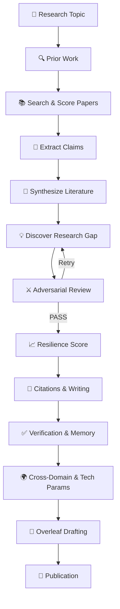

# ScholarPilot

> **Building the Future of AI-Assisted Research**
>
> *Where every idea is challenged before it's published.*

### 🚀 Built for the **NitroStack × Amrita University Coimbatore Hackathon**

### 👥 Team: **MindMesh**

---

## 👥 Team

**Team Name:** **MindMesh**

| S.No | Team Member |
|:---:|-------------|
| 1 | Vignesh V S |
| 2 | Praneeth J|
| 3 | R Pranav Adhith |
| 4 | Ramshray R B |

---

## 📖 Overview

ScholarPilot is an **AI Research Operating System** built on the **Model Context Protocol (MCP)** using **NitroStack**.

Developed by **Team MindMesh** for the **NitroStack × Amrita University Coimbatore Hackathon**, ScholarPilot transforms the traditional research workflow into an intelligent, collaborative process powered by specialized AI agents.

Unlike conventional research assistants that primarily search and summarize papers, ScholarPilot manages the complete research lifecycle—from prior work discovery and literature analysis to research gap identification, adversarial validation, citation management, verification, persistent research memory, and IEEE paper generation.

By combining retrieval, reasoning, verification, and academic writing into a unified workflow, ScholarPilot helps researchers move from an initial idea to a publication-ready manuscript with confidence.

---
## 🔄 ScholarPilot Research Lifecycle

---
## 📜 License

This project is licensed under the **MIT License**.

See the **[LICENSE](LICENSE)** file for complete license details.

Copyright © 2026 **MindMesh**.
