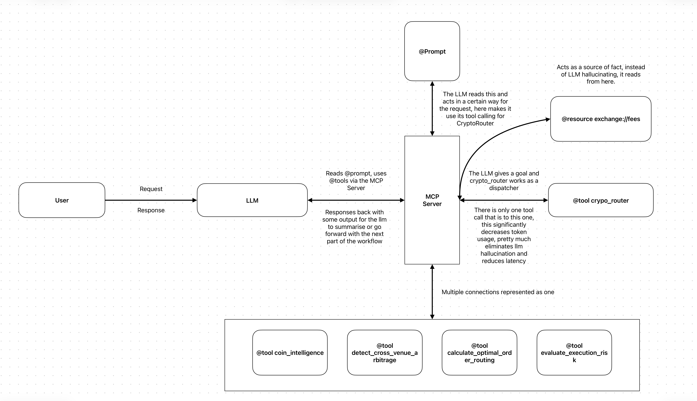
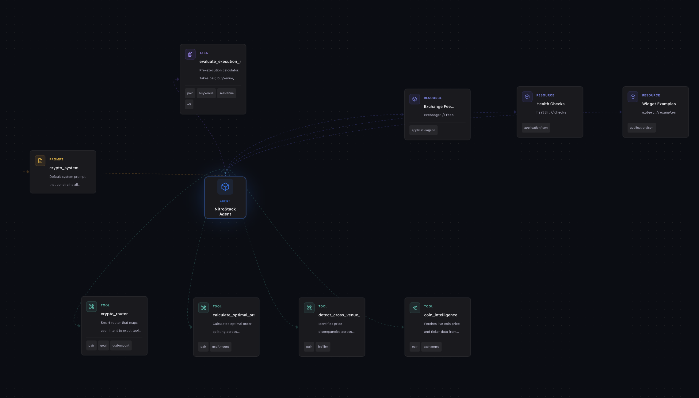
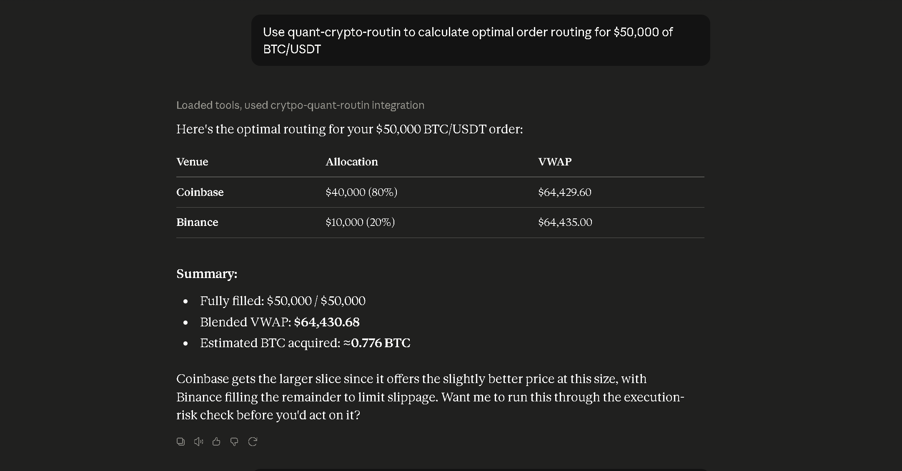
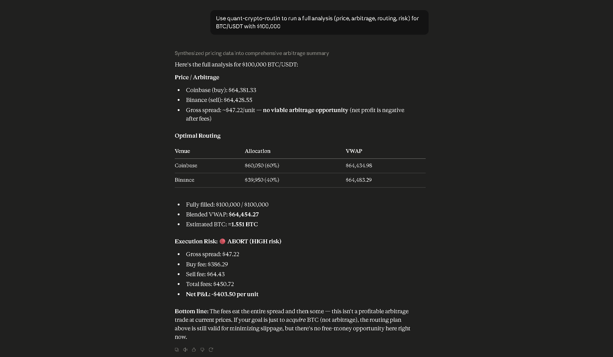

# Smart Order Routing & Cross-Market Execution MCP: SORCME

SORCME is a MCP Server that connects multiple tools related to cryptocurrency together by fetching current crypto prices from various sellers and runs the SOR algorithm to route the purchases to provide maximum returns for cost. 

## Server Overview

This project gives an interface for Large Language Models(LLMs) to connect to external tools such as coingecko api and more using the nitrostack sdk. It helps users to identify the rate of a cryptocoin, the sellers, the best dividing strategy and the risk factor involved in the investment. 

## Features

- A crypto router that works like as an orchestrator for other tools but not making the LLM call the tools manually which significantly reduces token usage.
- Gets the current price, tickers and others using the coingecko api.
- It creates a intelligent split across markets which is deterministic.
- It analyzes potential trades with many variables and returns a risk level with a final verdict like EXECUTE or ABORT, to your trades.
- It can be hosted in nitrostack cloud, which can be used to connect the server with multiple LLMs such as Claude.
- Using nitrostudio, it can be visualized with the ability to see the workflow with tool outputs in the Operational Flow under AI Chat.

## Architecture



Some points to note

- We use @prompt template here because it reduces token usage, makes the LLM understand it's role in this workflow, the type of message it to pass to who and the tools it can call.
- The LLM will send a request to the MCP Server which will tool call @crypto_router which will then run the other tools using the mode the LLM passes to it, With this the LLM's tool calling is done, other than the internal tool used for calling the @resource. This reduces token usage.
- Tools coin_intelligence and detect_cross_venue_arbitrage call the same function, but we use it for different scenarios. Their Definition is different.

## Intuition Behind Design Choices

- Firstly we had used @prompt, which can be used by the LLM to get just get the get the cryptocurrency to be found. Later it was modifed so that all types of user prompts can be injected to it. Using this prompt reduces token usage, and we have formatted in a way that the LLM can tell what mode for the router to operate in, for which the router will implement those tools in the mode. This as explained, makes the router call the tools instead of the LLM, Significantly reducing the token usage. This was also one of our reasons for implementing the rotuer, we could also say it is a tool orchestrator. This also reduces LLM hallucination as it won't call unnecessary tools by hallucinating or extra calls.

- The routing algorithm is deterministic, which makes them very reliable and resistant to hallucination.

- Two methods, i.e. coin_intelligence and detect_cross_venue_arbitrage will be calling the same function internally but they work for different purposes, we did this so that one function does one exact thing.

## How To Run
```
git clone https://github.com/santh-cpu/SORCME.git
cd SORCME
npm run dev
``` 

## Screenshots of MCP Server



## In Production




## Tech Stack

Typescript and NitroStack framework

## Problems that are faced

- A problem rises with evaluate_execution_risk tool which is not being recorded as a tool but as a task in nitrostudio, it works and it gives the result.

## Enhancements 

- Include more sellers for better routing.

## Contributing

Anyone other than a part of Agentlemen team cannot contribute until the hackathon has officially end. 

## Members of Agentlemen

[Vishnu Girish](https://github.com/Vishnu-Girish) <br><br>
[Srishanth A P](https://github.com/santh-cpu)<br><br>
[Gopi Krishna](https://github.com/KingKrishna47)<br><br>
[P Sanjay](https://github.com/fingernailz)<br><br>