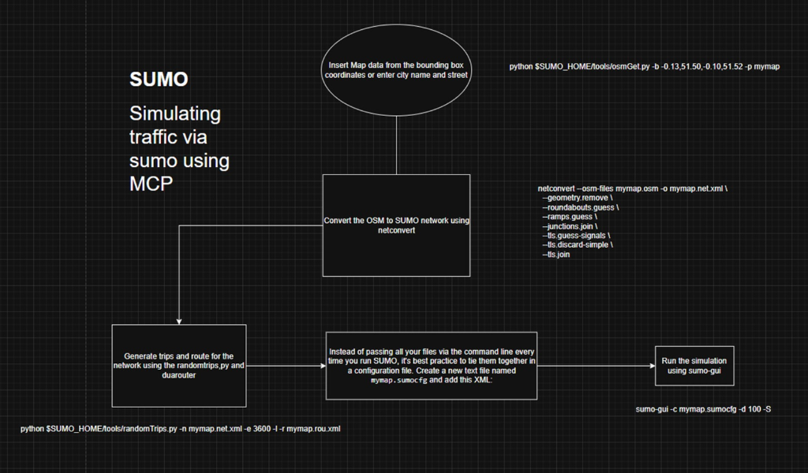
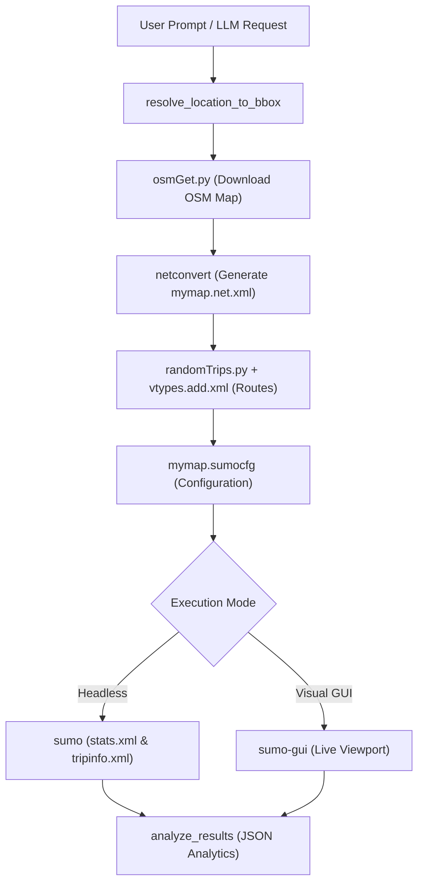
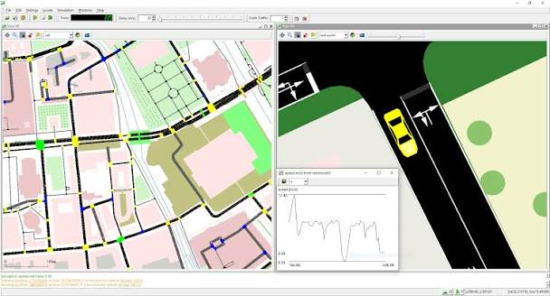
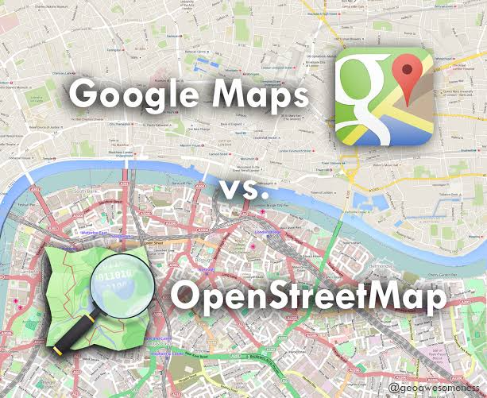

# 🚦 SUMO AI MCP – AI-Powered Urban Traffic Simulation Platform

[](https://github.com/Sanjay1266/Sumo_ai_mcp)
[](https://nitrostack.ai)
[](https://sumo.dlr.de)
[](https://python.org)
[](https://typescriptlang.org)
[](LICENSE)

**SUMO AI MCP** is an intelligent urban traffic simulation and analytics platform. It connects **Eclipse SUMO (Simulation of Urban Mobility)** with the **Model Context Protocol (MCP)** via **NitroStack** (TypeScript) and **FastMCP** (Python). 

Instead of manually crafting complex XML files or executing multi-step CLI commands, users and LLM agents can design, run, visualize, and audit microscopic traffic simulations through natural language.

---

## 📸 Workflow Architecture





---

## 🌐 Core Technologies

### 1. Eclipse SUMO Simulation Engine

- **Microscopic Modeling**: Simulates individual vehicles, motorcycles, buses, and trucks with explicit car-following and sublane physics (`lateral-resolution="0.8"`).
- **Automated Viewport**: Auto-calculates network spatial center and zoom level for optimal desktop GUI playback (`gui-settings.xml`).

### 2. OpenStreetMap (OSM) & Dynamic Geocoding

- **Nominatim Geocoding**: Resolves city/neighborhood names (*"Gandhipuram"*, *"Ettimadai"*, *"Coimbatore"*, *"Chennai"*, *"Bangalore"*) into focal bounding boxes (~2.5km × 2.5km).
- **OSM Overpass Integration**: Downloads real-world roads, lane counts, speed limits, and junction geometries automatically.

### 3. Model Context Protocol (MCP) & Heterogeneous Indian Traffic
- **Dual-Engine MCP**: TypeScript (NitroStack) for enterprise schema-validated tools, and Python (FastMCP) for native SUMO binary execution.
- **Heterogeneous Vehicles**: Pre-configured mixed traffic distribution (`vtypes.add.xml`): Motorcycles (35%), Autorickshaws (20%), Cars (30%), Buses (8%), and Trucks (7%).

---

## 📁 Project Structure

```
Sumo_simulation/
├── sumo_server.py           # Core FastMCP Python Server (Simulation Pipeline)
├── sumo_test_server.py      # FastMCP Python Test Server (Isolated Test Tools)
├── test_audit.py            # Standalone Empirical Metrics Audit Script
├── assets/                  # Workflow diagrams & visual documentation assets
├── src/
│   ├── app.module.ts        # Root Module (SumoModule + TestModule)
│   └── modules/
│       ├── sumo/            # Core Simulation Tools, Resources & Prompts
│       └── test/            # Dedicated Test Tools Module
├── Testcases/               # Pre-cached OpenStreetMap networks (map1.osm - map5.osm)
└── mymap.sumocfg            # Main SUMO Simulation Config
```

---

## 🛠️ MCP Tools & Resources Reference

### Core Simulation Tools
| Tool | Input Schema | Description |
|------|--------------|-------------|
| `generate_network` | `bbox: string` | Downloads OSM data for a place/bbox and generates `mymap.net.xml`. |
| `generate_routes` | `trips: int, duration: int, density: string` | Generates heterogeneous routes (`vtypes.add.xml`, `mymap.rou.xml`, `mymap.sumocfg`). |
| `run_headless_simulation` | *None* | Runs CLI SUMO simulation and outputs `stats.xml` & `tripinfo.xml`. |
| `run_gui_simulation` | `autoStart: bool, delay: int` | Launches desktop `sumo-gui` visual app with centered camera viewport. |
| `analyze_results` | *None* | Parses `stats.xml` and returns key metrics (loaded, inserted, avg route length). |
| `run_full_simulation` | `bbox: string, trips: int, duration: int, launchGui: bool` | Master end-to-end simulation orchestration tool. |

### Dedicated Testing Tools
| Tool | Description |
|------|-------------|
| `test_geocoder` | Validates place-name resolution, coordinate clamping, and format. |
| `test_network_generation` | Validates OSM network download and `netconvert` compilation. |
| `test_route_generation` | Validates vehicle distribution, `randomTrips.py`, and `sumocfg`. |
| `test_simulation_execution` | Validates headless SUMO execution and XML report output. |
| `test_analytics_truthfulness` | Audits reported analytics against raw `stats.xml` metrics. |
| `run_all_test_cases` | Master runner executing all 5 test cases with a structured summary report. |

### Live MCP Resources
- `sumo://stats`: Real-time `stats.xml` contents.
- `sumo://tripinfo`: Real-time `tripinfo.xml` contents.
- `sumo://network`: Real-time `mymap.net.xml` network data.
- `sumo://config`: Real-time `mymap.sumocfg` configuration data.

---

## 🚀 Setup & Verification

### 1. Installation & Environment Setup
```bash
git clone https://github.com/Sanjay1266/Sumo_ai_mcp.git
cd Sumo_ai_mcp

npm install
pip install sumolib traci fastmcp
```

Create a `.env` file:
```env
SUMO_HOME=C:\Program Files (x86)\Eclipse\Sumo
PATH=%SUMO_HOME%\bin;%PATH%
```

### 2. Running Servers
```bash
# Run Core Python FastMCP Server
python sumo_server.py

# Run Dedicated Test Server
python sumo_test_server.py

# Run NitroStack TypeScript Server
npm run dev
```

### 3. Empirical Verification Audit
```bash
python test_audit.py
```

---

## 📜 License
Distributed under the MIT License.