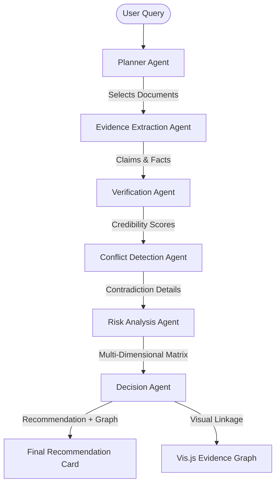

# VeriChain AI Architecture Specification

VeriChain AI is designed around a **Multi-Agent Orchestration Graph** powered by **LangGraph** and integrated with the **Model Context Protocol (MCP)**. This system guarantees explainability, conflict analysis, and evidence-backed decision making.

## Conceptual Framework

Unlike generic AI query systems that respond instantly using internal training weights, VeriChain AI establishes an **Evidence Chain**:

---

## Agent Definitions

### 1. Planner Agent (`agents/planner.py`)
- **Responsibility**: Analyzes user input, reviews the file catalog, and sets verification tasks.
- **Output**: JSON payload defining target entities, necessary checks, and primary document IDs.

### 2. Evidence Agent (`agents/evidence.py`)
- **Responsibility**: Parses document bytes (PDF, DOCX, CSV, XLSX, TXT) and extracts specific fact values.
- **Output**: Structured list of raw claims.

### 3. Verification Agent (`agents/verification.py`)
- **Responsibility**: Cross-checks claims, adjusts credibility based on document type.
- **Output**: Scoring values and verification states.

### 4. Conflict Agent (`agents/conflict.py`)
- **Responsibility**: Scans verified claims for value variances, date updates, compliance failures, or policy breaches.
- **Output**: Array of conflict records mapping dispute items to source documents.

### 5. Risk Agent (`agents/risk.py`)
- **Responsibility**: Evaluates Financial, Compliance, Operational, and Business risks on a 0-100 scale.
- **Output**: Radar chart inputs and risk log annotations.

### 6. Decision Agent (`agents/decision.py`)
- **Responsibility**: Synthesizes all data, outputs a final badge recommendation (APPROVE/REJECT/REVIEW), and formats node-edge arrays for Vis.js representation.
- **Output**: Final recommendation and Evidence Graph model.

---

## MCP Integration

VeriChain AI operates as an MCP Server implementing tools, prompts, and resources:

1. **MCP Tools**: Encapsulates agent routines to allow external IDEs and agents (like Claude or Cursor) to call them.
2. **MCP Resources**: Exposes system settings, corporate policies, and uploaded documents.
3. **MCP Prompts**: Standardizes LLM prompts for multi-agent validation.
