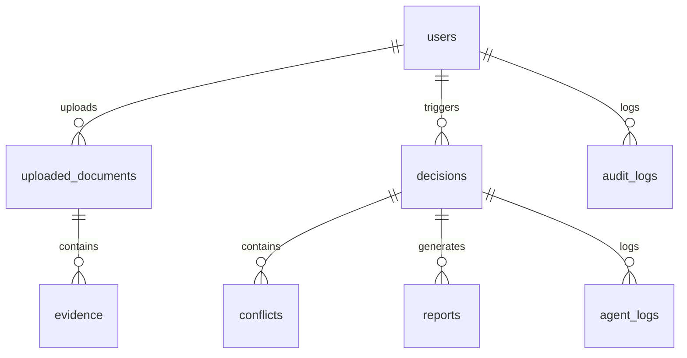

# VeriChain AI Database Schema Documentation

VeriChain AI uses an SQLite database for persistent logging, user management, and audit tracking.

## Table Specifications

### 1. `users`
Represents system administrators and compliance operators.
- `id` (INTEGER, Primary Key)
- `username` (VARCHAR, Unique, Indexed)
- `email` (VARCHAR, Unique, Indexed)
- `password_hash` (VARCHAR)
- `role` (VARCHAR) - `admin` | `user`
- `created_at` (DATETIME)

### 2. `uploaded_documents`
Contains metadata and file pointers for ingested text, spreadsheets, and PDF documents.
- `id` (INTEGER, Primary Key)
- `user_id` (INTEGER, Foreign Key to `users.id`)
- `filename` (VARCHAR)
- `file_path` (VARCHAR)
- `file_type` (VARCHAR)
- `file_size` (INTEGER)
- `content_preview` (TEXT, Nullable)
- `created_at` (DATETIME)

### 3. `evidence`
Extracted evidence points verified by the agents.
- `id` (INTEGER, Primary Key)
- `doc_id` (INTEGER, Foreign Key to `uploaded_documents.id`)
- `entity` (VARCHAR)
- `claim` (TEXT)
- `category` (VARCHAR)
- `value` (VARCHAR, Nullable)
- `credibility_score` (FLOAT)
- `source_location` (VARCHAR, Nullable)
- `status` (VARCHAR) - `verified` | `unverified`
- `created_at` (DATETIME)

### 4. `conflicts`
Identified contradictions or warnings between documents or with policies.
- `id` (INTEGER, Primary Key)
- `decision_id` (INTEGER, Foreign Key to `decisions.id`, Nullable)
- `doc_id_1` (INTEGER, Foreign Key to `uploaded_documents.id`, Nullable)
- `doc_id_2` (INTEGER, Foreign Key to `uploaded_documents.id`, Nullable)
- `description` (TEXT)
- `severity` (VARCHAR) - `low` | `medium` | `high`
- `conflict_type` (VARCHAR) - `version_mismatch` | `value_discrepancy` | `policy_violation` | `missing_approval`
- `status` (VARCHAR) - `detected` | `resolved`
- `created_at` (DATETIME)

### 5. `decisions`
The central records of concluded auditing workflows.
- `id` (INTEGER, Primary Key)
- `user_id` (INTEGER, Foreign Key to `users.id`, Nullable)
- `query` (TEXT)
- `decision_status` (VARCHAR) - `APPROVE` | `REJECT` | `REVIEW`
- `confidence_score` (FLOAT)
- `explanation` (TEXT)
- `evidence_graph_data` (TEXT, Nullable) - Raw JSON nodes and edges for Vis.js
- `created_at` (DATETIME)

### 6. `reports`
File references for generated reports.
- `id` (INTEGER, Primary Key)
- `decision_id` (INTEGER, Foreign Key to `decisions.id`)
- `file_path` (VARCHAR)
- `format` (VARCHAR) - `PDF` | `JSON` | `HTML`
- `created_at` (DATETIME)

### 7. `audit_logs`
User access logs for system auditing.
- `id` (INTEGER, Primary Key)
- `user_id` (INTEGER, Foreign Key to `users.id`, Nullable)
- `action` (VARCHAR)
- `ip_address` (VARCHAR, Nullable)
- `created_at` (DATETIME)

### 8. `agent_logs`
Chronological execution logs from the multi-agent graph runs.
- `id` (INTEGER, Primary Key)
- `decision_id` (INTEGER, Foreign Key to `decisions.id`)
- `agent_name` (VARCHAR)
- `log_message` (TEXT)
- `status` (VARCHAR) - `INFO` | `WARNING` | `ERROR`
- `created_at` (DATETIME)
