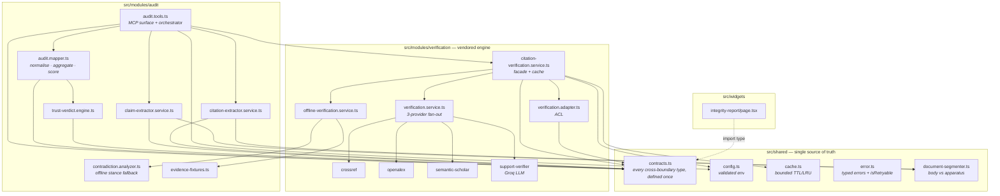
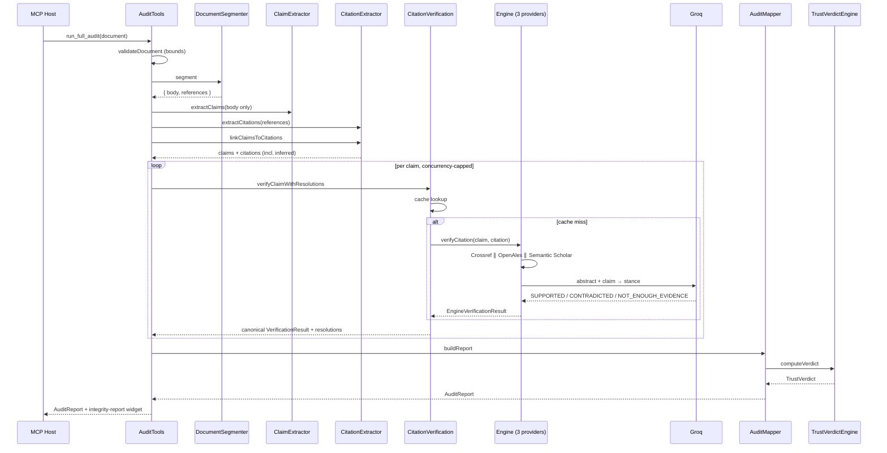

# VeriCite — Architecture

## 1. Layering

Every module — including the widget — imports its types from `src/shared/contracts.ts`. A contract change is a compile error, not a silent render bug.

## 2. Request flow

## 3. Key decisions

### 3.1 Citation-first retrieval

The question is *"does the paper this claim cites support it?"*, not *"does any paper discuss this topic?"* Retrieval therefore starts from the **cited work** — DOI first, bibliographic string second — never from the claim sentence.

An earlier implementation searched Crossref with claim text and produced results like `"Attention is All You Need... Unless You Are a CISO"` scored `SUPPORTING` with no abstract retrieved. That code is deleted.

### 3.2 Document segmentation before extraction

`document-segmenter.ts` splits body from bibliography, appendices and acknowledgements **before** any sentence is classified. Both extractors consume it, so there is exactly one definition of where the argument ends.

This is a structural guarantee, not a filter: the claim extractor is never handed the apparatus. Previously, newlines were collapsed before sentence splitting, which destroyed section boundaries and turned every reference entry into a phantom "claim".

### 3.3 Anti-corruption layer at the engine boundary

The verification engine was authored separately against an older contract. Rather than rewriting it or duplicating its provider logic:

- its **inputs** come from canonical `Claim` / `Citation` (structurally compatible)
- its **output** stays engine-shaped as `EngineVerificationResult`
- `verification.adapter.ts` merges per-citation results into one canonical per-claim `VerificationResult`

The engine's own stale `contracts.ts` is deliberately **not** vendored.

Merge precedence: `CONTRADICTED > SUPPORTED > NOT_ENOUGH_EVIDENCE > UNRELATED > ERROR`. A contradiction from any cited source outranks support from the others — citing one paper that refutes you is a finding, not an average. `ERROR` ranks last so one provider failure cannot mask a sibling verdict.

### 3.4 Errors are not evidence

`ERROR` claims are excluded from the Integrity Score denominator. Beyond a 60% error ratio the verdict sets `inconclusive: true` and says so in its title and summary. "We could not complete the audit" and "this document is untrustworthy" are different findings and the system refuses to conflate them.

### 3.5 Offline mode is a labelled fallback, not a mock

`VERICITE_OFFLINE=true` swaps in a recorded corpus. Every record carries `provider: "Fixture"` through to the widget's source chip, `AuditReport.offlineMode` flags the run, the widget shows an amber banner, and a citation matching no fixture resolves `NOT_FOUND` exactly as a live miss would. Fixtures never fabricate a match.

### 3.6 Bounded cache

`shared/cache.ts` is a TTL cache with a hard entry cap and LRU eviction, keyed on `(claim text, cited work)`. The vendored engine's internal cache was unbounded and evicted only on read — a slow leak in a long-lived MCP process. Failures are never cached.

## 4. Resilience

| Concern | Mechanism |
|---|---|
| Slow provider | Per-request timeout (`VERICITE_API_TIMEOUT_MS`) |
| Stuck provider | Per-claim wall-clock budget (`VERICITE_CLAIM_BUDGET_MS`) |
| Failing provider | `Promise.allSettled` per batch; failures become `ERROR` claims, keyed to their claim |
| Rate limiting | Exponential backoff with jitter; typed `isRetryable()` rather than message matching |
| Provider down | Graceful degradation — three providers, any subset works |
| No Groq key | Citations still resolve; support verdict degrades, reported in startup notices |
| Fan-out | Concurrency cap + `maxCitationsPerClaim` + `MAX_CLAIMS_PER_AUDIT` |
| Memory | Bounded cache with expiry sweep |
| Bad config | Range-clamped with warnings; never throws at startup |

## 5. Deliberate non-goals

- **No PDF ingestion yet.** `run_full_audit` takes text. `Claim.page` exists in the contract but has no producer.
- **Sliding-window concurrency.** Still batched; one slow claim idles its batch slot.
- **Orchestrator/controller separation.** `runFullAudit` still lives on the MCP controller and needs a fabricated `ExecutionContext` to unit test.
