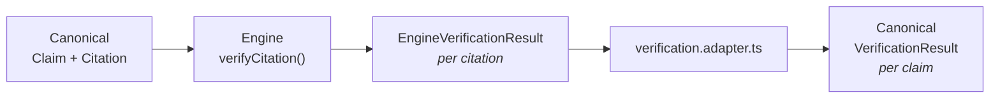
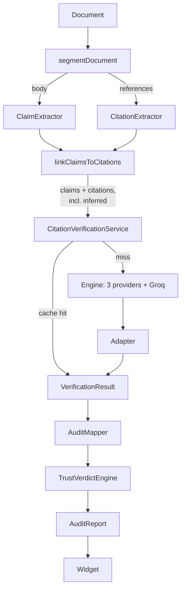

# VeriCite — Integration

How four independently-developed repositories became one system.

## 1. Inputs

| Source | Contribution | Outcome |
|---|---|---|
| Main MCP server | NitroStack scaffold, orchestration, mapper, verdict engine, widget | **Kept** — the spine |
| `vericite-verification-engine.zip` | Crossref + OpenAlex + Semantic Scholar + Groq support verifier, retry, caching, tests | **Vendored** into `src/modules/verification/` |
| `project.zip` (claim extraction) | PDF parse, Groq extraction prompts, DTOs, matcher | **Not adopted** — see §4 |
| `vericite-project.zip` (UI) | Vite/React + Python FastAPI app | **Not adopted** — see §5 |

## 2. Contract reconciliation

Before integration there were competing definitions of the same types:

| Type | Before | After |
|---|---|---|
| `Claim` | 3 shapes (server, engine, extraction DTO) | 1, in `src/shared/contracts.ts` |
| `VerificationResult` | 3 shapes (server, engine, mapper-local) | 1 canonical + 1 engine-internal, bridged by an adapter |
| `Citation` | 2 shapes | 1 |
| `AuditSummary` | 6 fields vs 13 fields | 1, 13 fields |
| Widget view types | 90-line hand-maintained mirror | deleted; widget imports the contracts |
| `COLORS` | 2 copies | 1 |

The engine shipped its own `src/shared/contracts.ts` — a pre-reconciliation copy. It was deliberately **not** vendored. Reintroducing it would have recreated exactly the defect this phase removed.

### How the engine was adapted without rewriting it

- **Inputs** needed no adaptation — the engine reads only `id`/`text` from a claim and `id`/`raw`/`title`/`doi`/`year` from a citation, all present canonically.
- **Output** stays engine-shaped and is translated at one boundary.
- Only import paths changed in the vendored provider code, plus two functional additions: OpenAlex now selects `is_retracted`, and a retracted source forces `CONTRADICTED`.

## 3. Deleted during integration

| Removed | Why |
|---|---|
| `audit/scholarly-api.service.ts` | Duplicated the engine's Crossref/OpenAlex logic, and queried by claim text — the wrong question |
| `audit/support-verifier.service.ts` | Superseded by the engine's LLM verifier |
| `mapper/LocalVerificationResult` + ACL DTOs | Nothing left to translate once producers emitted canonical shapes |
| `modules/calculator/**` | Scaffold left over from the template; also held an unsanitised file-write path |
| `widgets/app/calculator-result/**` | Same |
| Duplicate section-heading regexes | Both extractors now share `document-segmenter.ts` |

## 4. Why the claim-extraction module was not adopted

It does not compile: `dto/claim.dto.ts` and `dto/matched-claim.dto.ts` are empty files, `claim-extractor.services.ts` imports `../prompts/claim.prompt` while the file is `claim.prompts.ts`, and `Matcher.services.ts` imports a type from the empty DTO. There is no error handling, no validation of LLM JSON, no retry and no timeout.

Its ideas were kept — LLM-assisted extraction and citation-number matching are the right direction — but the existing heuristic extractor is tested, deterministic and works. Adopting broken code to honour provenance would have been the wrong trade. PDF ingestion via `pdf-parse` remains worth harvesting later.

## 5. Why the UI repository was not adopted

Vite + React 19 + Tailwind talking to a **Python FastAPI** backend with its own PyMuPDF parser and its own hardcoded classifier. Different language, different runtime, different transport from the NitroStack MCP widget.

Adopting it would mean two backends implementing the same audit differently — a correctness liability, not a feature. Its `ResultsCharts.jsx` and `IntegrityScore.jsx` informed the widget's chart work.

## 6. Verification

| Property | Evidence |
|---|---|
| One definition per type | `tsc --noEmit` clean across server, widget and tests |
| Widget/server contract linkage | Widget imports `src/shared/contracts.ts`; drift is a compile error |
| No discarded fields | `widget-contract.test.ts` pins every field the widget reads |
| No duplicate provider logic | Single `verification/services/` directory |
| No dead code | Deleted, not archived |
| Pipeline correctness | 132 tests; four-document demo corpus produces distinct outcomes |

## 7. Data flow after integration

Every property survives extractor → widget; the trace is in `PHASE2_REPORT.md` §4 and enforced by `widget-contract.test.ts`.
