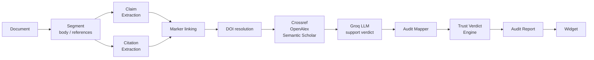

# VeriCite

**Autonomous citation integrity auditor.** An MCP server that reads a research paper, extracts its factual claims, resolves every citation against Crossref, OpenAlex and Semantic Scholar, and asks an LLM whether each cited paper actually supports the claim it is attached to — then renders an explainable Trust Verdict in an interactive widget.

Built on [NitroStack](https://nitrostack.ai) · TypeScript · React widget

---

## What it answers

Most citation tools check whether a reference *exists*. VeriCite checks whether it **says what the author claims it says**.

For each claim it reports one of:

| Status | Meaning |
|---|---|
| `SUPPORTED` | The cited paper's abstract corroborates the claim |
| `CONTRADICTED` | The cited paper conflicts with the claim, or has been retracted |
| `NOT_ENOUGH_EVIDENCE` | The source resolved, but its abstract cannot settle the claim |
| `UNRELATED` | No relevant literature could be located, or the claim is uncited |
| `ERROR` | A provider failed; excluded from scoring |

Those roll up into an **Integrity Score (0–100)**, a **severity** (GREEN / AMBER / RED), and a **Trust Verdict** with reasoning, strengths, weaknesses and recommendations.

---

## Quick start

```bash
npm install
cp .env.example .env      # then fill in CONTACT_EMAIL and GROQ_API_KEY
npm run verify            # typecheck + build + 132 tests
npm run dev               # NitroStack dev server
```

Open the project in [NitroStudio](https://nitrostack.ai/studio) and call `run_full_audit`.

No API keys? It still runs:

```bash
VERICITE_OFFLINE=true npm run dev
```

Offline mode serves recorded fixtures, labels every record `provider: "Fixture"`, and sets `AuditReport.offlineMode` so results are never mistaken for live data.

---

## MCP tools

| Tool | Purpose |
|---|---|
| `run_full_audit` | Full pipeline on a document. Returns `AuditReport`, renders the `integrity-report` widget. |
| `extract_claims` | Claim extraction only, with category breakdown. |
| `verify_citation` | Verify one claim against one named source. |

---

## Pipeline



Retrieval is **citation-first**: VeriCite looks up the work the author actually cited, by DOI where available. See [ARCHITECTURE.md](ARCHITECTURE.md).

---

## Integrity Score

```
base    = mean points over non-ERROR claims
          SUPPORTED 100 · NOT_ENOUGH_EVIDENCE 45 · UNRELATED 25 · CONTRADICTED 0

score   = clamp(base
                − (1 − citationCoverage) × 25
                − min(retractedCitations × 10, 20))

GREEN ≥ 80    AMBER ≥ 55    RED < 55
```

`ERROR` claims are excluded from the denominator on purpose: a provider outage is our failure, not the author's. When more than 60% of claims error, the verdict is flagged `inconclusive` — *"we could not complete the audit"* is a different finding from *"this document is untrustworthy"*, and VeriCite will not conflate them.

---

## Configuration

| Variable | Default | Purpose |
|---|---|---|
| `CONTACT_EMAIL` | — | Crossref/OpenAlex polite pool. Placeholders are detected and ignored. |
| `GROQ_API_KEY` | — | LLM support verdict. Without it every claim degrades to `NOT_ENOUGH_EVIDENCE`. |
| `SEMANTIC_SCHOLAR_API_KEY` | — | Optional third provider. Unauthenticated tier returns HTTP 429 under load. |
| `VERICITE_OFFLINE` | `false` | Serve fixtures instead of live providers. |
| `VERICITE_CONCURRENCY` | `5` | Claims verified in parallel. |
| `VERICITE_API_TIMEOUT_MS` | `10000` | Per-provider HTTP timeout. |
| `VERICITE_CLAIM_BUDGET_MS` | `90000` | Wall-clock budget per claim. |
| `VERICITE_CACHE_TTL_MS` | `1800000` | Verification cache lifetime. `0` disables. |
| `VERICITE_MAX_CACHE_ENTRIES` | `5000` | Cache cap, bounds memory. |

Every value is range-clamped and validated at startup. **Save `.env` with LF line endings** — a CRLF file injects a trailing `\r` into each value, which is rejected by HTTP header validation.

---

## Repository

```
src/
├── shared/           contracts · config · cache · errors · document-segmenter
├── modules/
│   ├── audit/        claim + citation extraction · mapper · verdict engine
│   └── verification/ vendored engine · providers · adapter · offline fallback
└── widgets/          Next.js widget (imports the same contracts)
tests/
├── unit/             132 tests
└── integration/      pipeline · widget contract · demo corpus
Test cases/           four demo documents
```

## Docs

[ARCHITECTURE.md](ARCHITECTURE.md) · [INTEGRATION.md](INTEGRATION.md) · [TESTING.md](TESTING.md) · [DEPLOYMENT.md](DEPLOYMENT.md) · [CHANGELOG.md](CHANGELOG.md)

## Known limitations

Documented honestly in [TESTING.md](TESTING.md#known-limitations). The main one: papers that cite inline (`(Vaswani et al., 2017)`) with no reference list get a best-effort inferred citation, and its resolution is materially less precise than a DOI-backed one.
