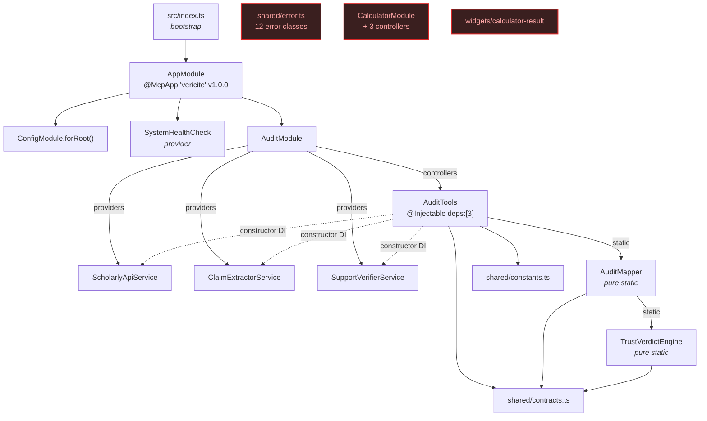
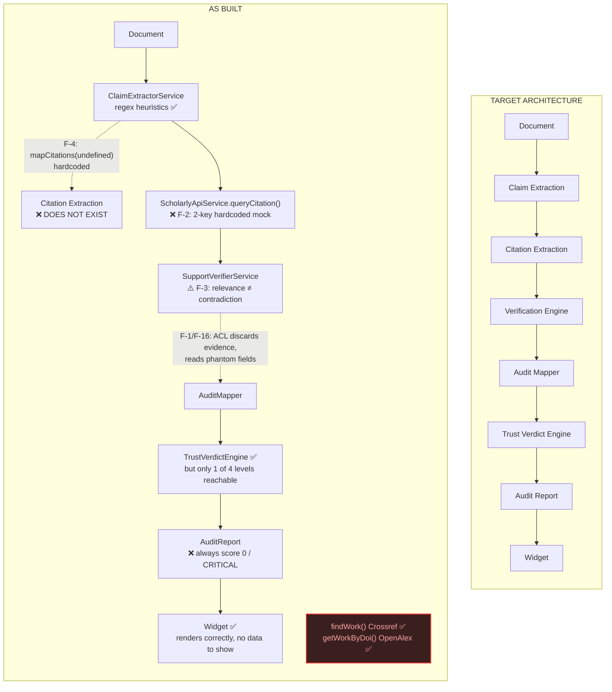
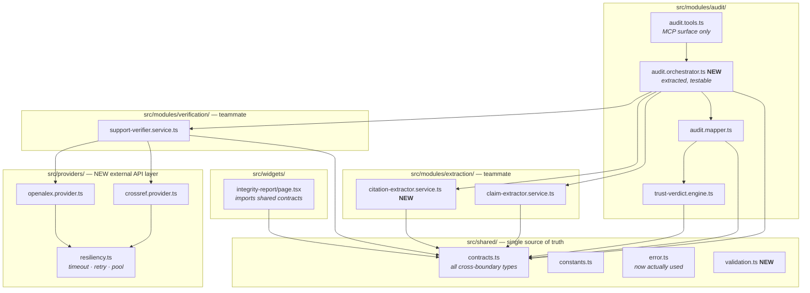

# VeriCite — Repository Audit (Phase 1)

**Audit date:** 2026-07-26
**Auditor:** Lead Architect review
**Scope:** `C:\Users\adith\mp-mcp-server` (entire working tree, excluding `node_modules`)
**Method:** Static analysis — full read of every first-party source file, cross-checked against the installed `@nitrostack/core@1.0.14` type declarations.

> ### ⚠️ Verification caveat — read this first
> The Linux sandbox did not boot during this session, so **`tsc --noEmit`, `npm run build`, and server startup were NOT executed.** Every compilation claim below is inferred from reading the code and the vendored `.d.ts` files, not observed. Before Phase 2 begins, these must be run:
> ```bash
> npx tsc --noEmit -p tsconfig.json
> npm --prefix src/widgets run build
> npm run build && npm start
> ```
> The correctness findings (F-1 … F-16) are logic defects and do not depend on the compiler — they are traceable by reading the call chain and are stated with exact file:line references so they can be confirmed independently.

---

## 1. Executive summary

### 1.1 The premise needs correcting

The brief describes four repositories — Main MCP Server, UI Repository, Claim Extraction Module, Verification Engine Module — "already added to this Claude Project."

**There is one repository.** No submodules, no workspaces, no sibling checkouts, no `nitrostack.config.*` pointing elsewhere. What the brief calls four repositories are four *files* that already live side by side in `src/modules/audit/`. Whoever owns each file may have worked separately, but the merge already happened at the filesystem level.

This is good news. **Phase 2 ("Repository Integration") is not a merge problem. It is a contract-reconciliation problem** — and the contracts are already misaligned in ways that silently break the product. Retargeting Phase 2 accordingly is the single highest-value change to the plan.

### 1.2 Quality is bimodal

The codebase splits cleanly into two tiers written to very different standards:

| Tier | Files | Assessment |
|---|---|---|
| **Architected** | `shared/contracts.ts`, `shared/constants.ts`, `shared/error.ts`, `audit.mapper.ts`, `trust-verdict.engine.ts`, `audit.tools.ts` | Genuinely strong. Explicit ACL boundary, pure static mappers, deterministic verdict engine, typed inputs, no `any`, documented ownership. This is production-shaped work. |
| **Scaffold** | `claim-extractor.service.ts`, `scholarly-api.service.ts`, `support-verifier.service.ts` | Prototype quality. Regex heuristics, a hardcoded two-key mock standing in for the scholarly API, relevance-score arithmetic used as a proxy for semantic contradiction. |

The failure is at the seam. The architected tier reads fields the scaffold tier never produces, and discards the fields it does produce.

### 1.3 The headline finding

**`run_full_audit` returns the same verdict for every possible input.**

Not "usually," not "for edge cases" — deterministically, for any document that passes the length guard. Traced end to end in §4.1, the output is always:

```
integrityScore:      0
severity:            RED
verdict.level:       CRITICAL
verdict.confidence:  0.1   (widget renders "Verdict Confidence: 10%")
summary.supported:   0
summary.contradicted: 0     (CONTRADICTED is unreachable — F-3)
summary.missingCitation: === totalClaims (always)
citations:           []     (hardcoded — F-4)
results[].existence: 'AMBIGUOUS' (always)
results[].metadata:  all fields undefined (always)
```

Every claim card in the widget expands to an empty panel. The Trust Verdict Engine's four-level design collapses to one reachable level. **This is the blocker for demo, judging, and release — nothing else in Phases 3–12 matters until it is fixed.**

The cause is not one bug. It is three independent field-level contract mismatches across the anti-corruption layer, compounding. Each is individually small; the failure only becomes visible end to end, which is why it survived until now.

### 1.4 Verdict

| Dimension | Rating | Note |
|---|---|---|
| Architecture & layering | **8/10** | Clean, well-documented, correctly separated. Best part of the project. |
| Contract hygiene | **3/10** | Four duplicated type families; ACL reads phantom fields. |
| Functional correctness | **1/10** | Degenerate single-valued output. |
| Evidence pipeline | **2/10** | Real Crossref/OpenAlex code exists and is never called. |
| Production hardening | **6/10** | Timeout/retry/isolation present and thoughtful; typed errors unused, concurrency batched not windowed. |
| Widget | **7/10** | Genuinely good already — verdict banner, radial score, KPIs, filters, accordion, export, dark mode. Starved of data, not of features. |
| Tests | **0/10** | No test files, no runner, no config. |
| Docs & repo polish | **1/10** | README is the untouched NitroStack starter. No LICENSE, no CONTRIBUTING. |

**Overall: 4/10.** The skeleton is better than the brief assumes; the nervous system is disconnected.

---

## 2. Repository inventory

### 2.1 First-party source (18 files, ~2,400 LOC)

```
mp-mcp-server/
├── package.json                  name "mp-mcp-server"; description is a literal CLI command
├── tsconfig.json                 strict:true, ES2022, legacy decorators, excludes src/widgets
├── README.md                     ⚠️ unmodified NitroStack starter template
├── .env.example                  NitroStack transport config only — no API keys
├── .gitignore
│
├── src/
│   ├── index.ts                  bootstrap → McpApplicationFactory.create(AppModule)
│   ├── app.module.ts             @McpApp "vericite" v1.0.0 → imports [ConfigModule, AuditModule]
│   │
│   ├── health/
│   │   └── system.health.ts      heap + uptime probe; wired as a provider ✅
│   │
│   ├── shared/                   ◄── SHARED CONTRACTS LAYER (already exists)
│   │   ├── contracts.ts          287 L — canonical types + 4 unused extension interfaces
│   │   ├── constants.ts          128 L — APP, DOCUMENT_LIMITS, RETRY_CONFIG, COLORS…
│   │   └── error.ts               98 L — 12 typed error classes, ⚠️ ZERO imports anywhere
│   │
│   ├── modules/
│   │   ├── audit/                ◄── the "four repositories"
│   │   │   ├── audit.module.ts            controllers:[AuditTools] providers:[3 services]
│   │   │   ├── audit.tools.ts     548 L — orchestrator + 3 MCP tools  [owner: architect]
│   │   │   ├── audit.mapper.ts    292 L — anti-corruption layer        [owner: architect]
│   │   │   ├── trust-verdict.engine.ts 350 L — explainable verdict     [owner: architect]
│   │   │   ├── claim-extractor.service.ts  288 L — regex heuristics    [owner: teammate]
│   │   │   ├── scholarly-api.service.ts    236 L — ⚠️ mock + unused real API
│   │   │   └── support-verifier.service.ts 158 L — relevance arithmetic [owner: teammate]
│   │   │
│   │   └── calculator/           ◄── ⚠️ ORPHANED — not imported by AppModule
│   │       ├── calculator.module.ts / .tools.ts / .resources.ts / .prompts.ts
│   │
│   └── widgets/                  separate Next.js 14 app, own package.json + node_modules
│       ├── package.json          ⚠️ still named "calculator-widgets"
│       ├── next.config.js / tsconfig.json / next-env.d.ts
│       └── app/
│           ├── layout.tsx
│           ├── integrity-report/page.tsx   467 L — the real VeriCite widget ✅
│           └── calculator-result/page.tsx  ⚠️ orphaned
│
└── .claude/ .cursor/ .codex/ .gemini/ .copilot/ .agents/ .antigravity/ .opencode/
    └── skills/{auth-security, mcp-app-architecture, middleware-pipeline,
                 tools-resources-prompts, ui-widgets}/SKILL.md
        └── ⚠️ 5 skills × 8 identical copies = 40 files, byte-identical fan-out
```

### 2.2 Notable absences

No `tests/`, no `vitest`/`jest` config or dependency. No `LICENSE`, `CONTRIBUTING.md`, `CHANGELOG.md`. No CI workflow. No `Dockerfile`. No demo fixtures. No `.eslintrc`/`.prettierrc`. No `docs/`.

---

## 3. Architecture

### 3.1 Module & DI graph



Red nodes are compiled but unreachable. Verified: `@Module` accepts `controllers?: ClassConstructor[]` (`@nitrostack/core/dist/core/module.d.ts:39`), so `audit.module.ts` and `calculator.module.ts` are both structurally valid. The `@McpApp({ module: AppModule })` self-reference is safe under TypeScript's legacy-decorator emit (`experimentalDecorators: true`), which evaluates decorator expressions inside `__decorate([...])` *after* the class binding is initialized. Do not migrate to TC39 decorators without revisiting this.

### 3.2 Runtime pipeline — intended vs. actual



The real scholarly-API integration (`findWork`, `getWorkByDoi`, `reconstructAbstract`) is written, correct, and **called by nobody**. It sits in the same file as the mock that *is* called.

### 3.3 Layering assessment

Requested target vs. reality:

| Target layer | Present? | Where | Gap |
|---|---|---|---|
| Controller | ⚠️ merged | `AuditTools` | Controller *and* orchestrator in one class |
| Orchestrator | ⚠️ merged | `AuditTools.runFullAudit` (184 L) | Not extractable/testable without MCP context |
| Business services | ✅ | 3 services | Correct DI, correct scope |
| External API layer | ❌ | — | `fetch` called inline inside a business service |
| Mapper (ACL) | ✅✅ | `AuditMapper` | Exemplary — pure, static, documented |
| Contracts | ✅ | `shared/contracts.ts` | Exists; not consumed by widget |
| Widgets | ✅ | Next.js app | Duplicates contracts as local mirrors |

Two real structural gaps: **no HTTP/provider layer** (network I/O lives inside `ScholarlyApiService` alongside business logic), and **the orchestrator is fused to the MCP controller** (`runFullAudit` cannot be unit-tested without fabricating an `ExecutionContext`). Both are Phase 3 work and both are refactors, not rewrites.

---

## 4. Findings

Severity: **P0** blocks demo · **P1** blocks production · **P2** quality/debt

### 4.1 F-1 · P0 · Every audit returns CRITICAL with score 0

The defect is a chain of three field mismatches. Trace:

**Step 1 — `citationMarker` never survives extraction.**
`ClaimExtractorService` (`claim-extractor.service.ts:3-11`) produces `citationMarkers?: string[]` — plural, array. `AuditMapper`'s ACL DTO (`audit.mapper.ts:36-45`) declares `citationMarker?: string` — singular, string — and no `citationId` exists on either side. `mapClaims` (`:136-143`) therefore evaluates `c.citationMarker ?? ''` → **always `''`**, and `c.citationId ?? ''` → **always `''`**.

**Step 2 — `citationId` never survives verification.**
`SupportVerifierService.verifyClaim` returns a `VerificationResult` (`support-verifier.service.ts:4-13`) with **no `citationId` field at all**. `mapVerification` (`audit.mapper.ts:171`) evaluates `r.citationId ?? ''` → **always `''`**.

**Step 3 — the summary counts everything as missing.**
```ts
// audit.mapper.ts:204-206
missingCitation: safeResults.filter(
    (r) => r && (!r.citationId || r.existence === 'NOT_FOUND')
).length,
```
`citationId` is always `''` (falsy) ⇒ **`missingCitation === totalClaims`, unconditionally.**

**Step 4 — the score floors at zero.**
With N claims, all `NOT_ENOUGH_EVIDENCE` (see F-2), all counted missing:
```
numerator = 0·100 + N·40 + 0·20 − 0·80 − 0·30 − N·50 = −10N
raw       = round(−10N / N) = −10
score     = clamp(−10, 0, 100) = 0          // audit.mapper.ts:250-261
severity  = RED                              // :266-270
```

**Step 5 — the verdict engine short-circuits.**
`missingRatio = N/N = 1.0`. First branch of `determineLevelAndTitle` (`trust-verdict.engine.ts:164`) tests `missingRatio > 0.5` → **`CRITICAL`, always**. `MODERATE_TRUST`, `LOW_TRUST` and `HIGH_TRUST` are unreachable.

**Step 6 — verdict confidence bottoms out.**
All confidences are 0 (F-2) ⇒ `avgConfidence = 0` ⇒ `clamp(0 × (1−0), 0.1, 1.0) = 0.1`. Widget prints *"Verdict Confidence: 10%"*.

**Fix direction:** the correct repair is *not* to patch `buildSummary`. `missingCitation` should be computed from a real citation-extraction result (F-4), and the producer/consumer DTOs must be unified onto `shared/contracts.ts` so this class of mismatch becomes a compile error rather than an empty string. Treat F-1, F-4 and F-16 as one work item.

---

### 4.2 F-2 · P0 · Real scholarly APIs are never called

`ScholarlyApiService.queryCitation` (`scholarly-api.service.ts:48-107`) is a mock. It looks up `mockResults[claim.toLowerCase()]` against exactly two keys: `'climate change'` and `'artificial intelligence'`. The lookup key is a **whole claim sentence**, so a real document never matches. Every call falls through to:

```ts
return [{ found: false, source: 'Unknown', title: 'No matching citations found',
          authors: [], year: <current>, relevanceScore: 0 }];
```

Downstream in `SupportVerifierService`, `found: false` fails both the supporting and contradicting branches (`:36-40`) ⇒ both arrays empty ⇒ `confidenceScore: 0` ⇒ `status: 'unverified'` ⇒ mapped to `NOT_ENOUGH_EVIDENCE`. **Every claim, every time.**

Meanwhile, in the same file: `findWork()` (`:147-188`, Crossref bibliographic search, correct error handling), `getWorkByDoi()` (`:193-214`, OpenAlex + retraction flag), and `reconstructAbstract()` (`:219-235`, inverted-index decoder). All three are production-quality. All three are dead. `verifyCitationByDoi` and `getCitationMetadata` are additional mocks, also uncalled.

`.env.example` contains no `CONTACT_EMAIL`, though `scholarly-api.service.ts:38` reads it (falling back to `vericite@example.com` — a non-functional Crossref polite-pool address).

---

### 4.3 F-3 · P1 · `CONTRADICTED` is unreachable and semantically wrong

```ts
// support-verifier.service.ts:35-41
if (item.found && item.relevanceScore > 0.5)       supportingEvidence.push(item);
else if (item.found && item.relevanceScore <= 0.5) contradictingEvidence.push(item);
```

**A low relevance score is not a contradiction.** A weakly-related paper is evidence of *absence of support*, not evidence *against*. Detecting genuine contradiction requires comparing the claim against the retrieved abstract — semantically, via NLI or an LLM judge. `getWorkByDoi()` already returns the abstract needed to do this; nothing consumes it.

Compounded by F-2 (`found` is always `false`), `contradictingEvidence` is always empty, so `summary.contradicted` is always 0. Three pieces of downstream logic are therefore dead: the `'contradicted'` status branch (`:55-57`), the CRITICAL headline *"Contradicted Claims Detected"* (`trust-verdict.engine.ts:167-169`), and the URGENT recommendation (`:327-329`).

This is the most product-defining gap in the system. A citation auditor that cannot detect contradiction is a citation *presence* checker.

---

### 4.4 F-4 · P1 · Citation extraction does not exist

```ts
// audit.tools.ts:428
const citations = AuditMapper.mapCitations(undefined);
```

Hardcoded. `AuditReport.citations` is always `[]`. No `CitationExtractorService` exists anywhere in the tree. The "Citation Extraction" stage of the target architecture is unimplemented.

Collateral dead code in the mapper: `ExtractionOutput` (`audit.mapper.ts:58-61`) and the exported `mapExtraction()` helper (`:283-291`) are the intended integration seam — neither is imported anywhere.

`ClaimExtractorService.extractCitationMarkers()` (`:258-276`) already recognises `[12]`, `(Smith, 2020)` and `doi:` patterns. That is the raw material for a reference-list parser; it currently feeds a field the mapper discards (F-1).

---

### 4.5 F-16 · P1 · Evidence is discarded, then phantom fields are read

The single clearest expression of the seam failure. `SupportVerifierService` returns rich evidence; `LocalVerificationResult` (`audit.mapper.ts:73-86`) does not declare those fields — and instead declares fields the verifier never sets.

| Producer field (`support-verifier.service.ts:4-13`) | Read by ACL? | Consequence |
|---|---|---|
| `claimId` | ✅ | ok |
| `status` | ✅ via `PLACEHOLDER_STATUS_MAP` | ok |
| `confidenceScore` | ✅ | ok |
| `notes` | ✅ | ok |
| `claim` | ❌ dropped | claim text re-sourced from `claims[]` |
| **`supportingEvidence: CitationResult[]`** | ❌ **dropped** | **all retrieved evidence discarded** |
| **`contradictingEvidence: CitationResult[]`** | ❌ **dropped** | **all counter-evidence discarded** |
| `verified` | ❌ dropped | redundant with `status` |

| ACL field read (`audit.mapper.ts:73-86`) | Produced? | Consequence |
|---|---|---|
| `citationId` | ❌ never | drives F-1 |
| `existence` | ❌ never | **always `'AMBIGUOUS'`** (`:173`) |
| `metadata.*` (doi, paperTitle, authors, journal, year, citationCount, source) | ❌ never | **all `undefined`, always** (`:178-186`) |
| `evidence` | ❌ never | always `undefined` |

**Visible symptoms in the widget:** every expandable claim card (`page.tsx:429-453`) opens to show only `reason` — the paper-title block (`:437-445`), DOI line (`:443`), evidence quote (`:447-451`) and source chip (`:418-423`) never render. `TrustVerdictEngine.extractStrengths` reads `r.metadata?.source` (`:271-279`), so *"Cross-referenced against multiple scholarly repositories"* never appears either.

The same mismatch pattern applies to claims:

| `ExtractedClaim` producer (`claim-extractor.service.ts:3-11`) | ACL DTO (`audit.mapper.ts:36-45`) | Status |
|---|---|---|
| `citationMarkers: string[]` | `citationMarker?: string` | ❌ name + type mismatch |
| `confidence`, `context`, `lineNumber` | — | ⚠️ silently dropped |
| `category` | `category?` declared | ⚠️ declared but `Claim` contract has no field ⇒ dropped |
| — | `citationId?`, `page?`, `paragraphIndex?` | ❌ never produced (`lineNumber` exists, unmapped) |

Root cause is uniform: **two independently-authored DTO families, reconciled by an ACL that was written against an assumed shape rather than the actual one.** Unifying on `shared/contracts.ts` converts every row above from a silent `''`/`undefined` into a compile error.

---

### 4.6 F-5 · P2 · Duplicate and conflicting type definitions

Direct violation of the project's "no duplicated interfaces" rule.

| Type | Definitions | Compatible? |
|---|---|---|
| `VerificationResult` | `shared/contracts.ts:100` **(canonical)** · `support-verifier.service.ts:4` | ❌ different shapes, same name |
| `ExtractedClaim` | `claim-extractor.service.ts:3` · `audit.mapper.ts:36` | ❌ different shapes, same name |
| `COLORS` palette | `shared/constants.ts:120` · `integrity-report/page.tsx:107` | ✅ identical values, 2 copies |
| Status/severity/verdict unions + 6 view interfaces | `shared/contracts.ts` · `page.tsx:11-101` | ✅ today — **90 lines of manual mirror with no compile-time link** |

The widget mirror is the most dangerous: `src/widgets/` has its own `tsconfig.json` and `node_modules`, is excluded from the root `tsconfig` (`"exclude": [..., "src/widgets"]`), and imports nothing from `src/shared`. **Any contract change silently desynchronises the UI** — no error, wrong render.

Additionally, `shared/contracts.ts:261-287` declares four extension interfaces — `IClaimExtractionService`, `ICitationVerificationService`, `ClaimExtractionService`, `CitationVerificationService`. The latter two are near-verbatim duplicates of the former two (differing only by the `I` prefix), and **none is implemented by any class.** Note `IClaimExtractionService.extractClaimsAndCitations()` returns `{claims, citations}` while the actual `ClaimExtractorService.extractClaims()` returns `ExtractedClaim[]` — the interface documents an API that was never built.

---

### 4.7 F-6 · P2 · Typed errors unused; retry policy string-sniffs

`shared/error.ts` defines 12 well-designed error classes (`VeriCiteError` base + `ProviderTimeoutError`, `CitationNotFoundError`, `LLMResponseError`, …). **Zero imports across the entire tree.**

Meanwhile the retry gate does this:

```ts
// audit.tools.ts:133-136
const msg = err instanceof Error ? err.message : '';
if (msg.startsWith('Invalid') || msg === '') throw err;
```

Retryability decided by string prefix — exactly the fragility typed errors exist to eliminate. Two live consequences: (a) any error with an empty message is silently non-retryable; (b) any future validation error not starting with the literal `"Invalid"` gets retried twice for nothing. Replace with `instanceof` checks against the existing hierarchy — the classes are already written.

---

### 4.8 F-7 · P2 · Dead error branch in the orchestrator

Each verification task (`audit.tools.ts:467-495`) wraps its whole body in `try/catch` and returns `buildErrorResult(...)` on failure — so the task **cannot reject**. `runWithConcurrency` uses `Promise.allSettled`, so `settled` is always `fulfilled`, making line 501 unreachable:

```ts
return buildErrorResult('unknown', String(s.reason));   // dead
```

Harmless today, but it means the `allSettled` isolation is doing nothing and a future refactor that removes the inner `catch` would produce results keyed `'unknown'` — silently unjoinable to any claim. Pick one isolation strategy and delete the other.

---

### 4.9 F-8 · P2 · Concurrency is batched, not sliding-window

```ts
// audit.tools.ts:154-158
for (let i = 0; i < tasks.length; i += concurrency) {
    const batch = tasks.slice(i, i + concurrency);
    const settled = await Promise.allSettled(batch.map((fn) => fn()));
```

Barrier semantics: the whole batch of 5 must finish before batch 6 starts. One slow claim (10s timeout × up to 3 attempts + backoff ≈ 30s) idles four workers for the duration. Worst case at the `MAX_CLAIMS_PER_AUDIT: 100` cap: **20 batches × ~30s ≈ 10 minutes**, versus ~2 minutes for a true sliding window at the same concurrency. Phase 5 explicitly requests sliding-window; this is a ~15-line change to a worker-pool pattern.

---

### 4.10 F-10 · P2 · Orphaned calculator module — with a latent path-traversal

`CalculatorModule` and its three controllers are unreferenced by `AppModule`, but `tsconfig.json` `"include": ["src/**/*"]` still compiles all four files into `dist/`. `src/widgets/app/calculator-result/page.tsx` still ships in the widget bundle. `src/widgets/package.json` is still named `"calculator-widgets"`.

**Do not archive this code — delete it.** `convert_temperature` (`calculator.tools.ts:85-165`) writes caller-supplied base64 to disk using a caller-supplied filename:

```ts
const filePath = path.join(process.cwd(), 'uploads', input.file_name);   // :95-100
fs.writeFileSync(filePath, buffer);                                       // :114
```

No sanitisation — `file_name: "../../.env"` escapes the uploads directory. It is unreachable today only because the module is unregistered. Re-registering it for any reason would ship an arbitrary-file-write primitive. It also uses `input: any` on both tools and does synchronous blocking I/O in an async handler.

---

### 4.11 Lower-severity findings

| ID | Sev | Finding |
|---|---|---|
| **F-9** | P2 | `withRetry` (`audit.tools.ts:139`) uses linear backoff `BASE_DELAY_MS * attempt`, but `RETRY_CONFIG.MAX_DELAY_MS` is declared and never enforced. Docblock claims "exponential back-off"; the code is linear. Also no jitter — synchronised retries against Crossref will be rate-limited in lockstep. |
| **F-11** | P2 | `getCitationMetadata` (`scholarly-api.service.ts:133-142`) returns `citationCount: Math.floor(Math.random() * 1000)`. Non-deterministic fabricated data from a service that asserts verification authority. Delete or implement. |
| **F-12** | P2 | `SupportVerifierService.generateSummaryReport` returns `Record<string, any>` (`:136`) — the only `any` in the audit module; violates the no-`any` rule. Method is also uncalled. `verifyMultipleClaims` (`:74-87`) is likewise uncalled and would serialise work the orchestrator already parallelises. |
| **F-13** | P2 | `generateNotes` case `'verified'` (`:121`) divides by `supporting.length` without a guard. Unreachable today (that branch implies `length > 0`), but a latent `NaN%` if the status logic is ever refactored. |
| **F-14** | P1 | **No tests, no runner, no config.** Phase 9 starts from zero. `AuditMapper` and `TrustVerdictEngine` are pure static classes — the highest-value, lowest-effort test targets in the repo, and the ones that would have caught F-1 immediately. |
| **F-15** | P2 | Widget lacks: charts (pie/bar/line), text search, sort, PDF export, skeleton loading state, error boundary. Present and good: verdict banner, radial score, 6 KPI cards, status filter tabs, expandable cards, copy/download JSON, dark+light theming, defensive null handling throughout. Phase 6 is additive, not remedial. |
| **F-17** | P2 | Metadata drift: root `package.json` name `mp-mcp-server` and `description` set to a literal `npx` command string; widget package `calculator-widgets`; README is the untouched starter; author field points at a different address than the session user. No `LICENSE` despite the open-source goal. |
| **F-18** | P2 | 5 skill files duplicated byte-identically across 8 agent directories (40 files). Consider a single source with generated copies, or `.gitignore` all but one. |
| **F-19** | P2 | `.env.example` documents no VeriCite variables — missing `CONTACT_EMAIL` (read at `scholarly-api.service.ts:38`) and any future provider keys. |

---

## 5. Integration plan

### 5.1 Target module structure



Four structural moves: split `audit/` into `audit/ + extraction/ + verification/` along the existing ownership lines; extract the orchestrator out of the MCP controller; add a `providers/` layer so `fetch` leaves the business services; make the widget import `shared/contracts.ts` instead of mirroring it.

### 5.2 Contract unification decisions

| Conflict | Resolution |
|---|---|
| `VerificationResult` ×2 | Keep `shared/contracts.ts`. Delete the one in `support-verifier.service.ts`; make the service return the canonical shape directly, populating `citationId`, `existence`, `metadata`, `evidence`. **Retires `LocalVerificationResult` and most of the ACL.** |
| `ExtractedClaim` ×2 | Single `ExtractedClaim` in `contracts.ts` with `citationMarkers: string[]` (plural — the producer is right). Add `category` and `confidence` to the canonical `Claim`; stop dropping them. |
| Widget type mirror | Widget imports from `shared/contracts.ts` via a path alias. Deletes ~90 lines and makes drift a compile error. |
| `COLORS` ×2 | Single export in `shared/constants.ts`; widget imports it. |
| 4 unused extension interfaces | Delete `ClaimExtractionService` + `CitationVerificationService` (duplicates). Keep `I`-prefixed pair, correct their signatures, and **make the services actually implement them**. |
| `mapCitations(undefined)` | Replace with real `CitationExtractorService` output. |

**Sequencing note:** widget↔server contract sharing across two `tsconfig`s with different `moduleResolution` (`node` vs `bundler`) needs a decision — path alias, a small `packages/contracts` workspace, or a build-time copy step. Recommend the path alias first (zero infra); revisit only if the widget build objects.

### 5.3 Revised phase order

The brief's ordering puts bug-fixing at Phase 4 and the widget at Phase 6. Both should move: F-1 makes every downstream phase unverifiable, and the widget cannot be evaluated against data that is constant.

| # | Phase | Addresses | Est. | Rationale |
|---|---|---|---|---|
| **0** | **Establish baseline** — run `tsc --noEmit`, both builds, boot the server, record real errors | verification caveat | 0.5h | **Nothing below is trustworthy until this is done.** |
| **1** | **Delete dead code** — calculator module + widget page + duplicate extension interfaces | F-10, F-13, F-5 | 1h | Free. Shrinks surface before refactoring. Removes latent path-traversal. |
| **2** | **Unify contracts** — §5.2 in full; widget imports shared types | F-5, F-16 | 4h | Converts every silent mismatch into a compile error. |
| **3** | **Fix the ACL data-loss bugs** | **F-1, F-16, F-3** | 4h | ⭐ **First point at which output stops being constant.** Verify: two documents ⇒ two different scores. |
| **4** | **Real evidence pipeline** — `providers/` layer, wire Crossref + OpenAlex, delete mocks | **F-2**, F-11 | 8h | ⭐ Makes the product real. Needs `CONTACT_EMAIL` in `.env`. |
| **5** | **Citation extraction** — new service, reference-list parsing, claim↔citation linking | **F-4** | 6h | Closes the last missing pipeline stage; makes `missingCitation` meaningful. |
| **6** | **Semantic contradiction detection** — compare claim vs. abstract | **F-3** | 6h | Makes `CONTRADICTED` reachable. Decide: NLI model vs. LLM judge. Product-defining. |
| **7** | **Layering** — extract orchestrator from controller | §3.3 | 4h | Prerequisite for orchestrator unit tests. |
| **8** | **Hardening** — typed errors, sliding window, jitter, `MAX_DELAY_MS`, dead branch | F-6…F-9 | 4h | |
| **9** | **Demo datasets** — 10 fixtures per brief | Phase 8 | 4h | Doubles as the integration-test corpus. Build before tests. |
| **10** | **Tests** — mapper + verdict engine first (pure, would have caught F-1) | **F-14** | 10h | |
| **11** | **Widget enhancement** — charts, search, sort, PDF, states | F-15 | 8h | Now has varied real data to render. |
| **12** | **Docs** — 10 files per brief | F-17 | 6h | |
| **13** | **Repo polish** — LICENSE, CONTRIBUTING, CI, badges, screenshots | F-17, F-18 | 3h | |
| **14** | **Final review** | Phase 12 | 3h | |

Approx. 72h. Phases 0–3 (~9.5h) convert the project from *demonstrably broken* to *demonstrably working* and should be treated as one atomic unit.

### 5.4 Risks

| Risk | Impact | Mitigation |
|---|---|---|
| Contract unification touches every file at once | High | Do Phase 1 (deletion) first; then unify one type family per commit, compiling between each. |
| Crossref/OpenAlex rate-limit or reshape responses | High | Polite pool via real `CONTACT_EMAIL`; response validation at the provider boundary; cache by claim hash; keep a **fixture-backed** provider (not the current mock) for offline demo. |
| Contradiction detection needs an LLM ⇒ cost, latency, non-determinism | High | Decide early. If LLM: seed/temperature-0, cache, and keep a deterministic heuristic fallback so demos never depend on a live model. |
| Live API demo fails on venue wifi | **Demo-fatal** | Ship `VERICITE_OFFLINE=true` backed by recorded fixtures. Non-negotiable for judging. |
| Widget↔server contract sharing across two tsconfigs | Medium | Path alias first; workspace package only if that fails. Prototype in Phase 2 before committing. |
| Regex extractor is the weakest link and is out of scope | Medium | Accept for v1.0; measure precision/recall against the Phase 9 corpus and document the number honestly rather than overclaiming. |
| Teammates hold context not in the code | Medium | Confirm ownership of `extraction/` and `verification/` before restructuring their files. |

### 5.5 Open questions

1. **Is the sandbox failure environmental or a real build break?** Phase 0 answers this. Everything is provisional until then.
2. **Contradiction detection: NLI model, LLM judge, or heuristic?** Drives cost, latency, determinism and demo strategy. `PROVIDERS.GROQ` in `constants.ts:91` hints at an LLM plan that was never built — was that the intent?
3. **Do the extraction/verification files have owners who are still active?** Phases 2–6 substantially rewrite them.
4. **Is `MAX_CLAIMS_PER_AUDIT: 100` × real API latency acceptable?** At true sliding-window concurrency 5, ~100 claims ≈ 2 min. Too slow for a live demo — consider a demo-mode cap of ~20.
5. **Does `run_full_audit` need to accept PDFs?** `DocumentParsingError` exists in `error.ts` and `convert_temperature` had upload plumbing, but the tool takes plain text only. If PDF is in scope, it is unbudgeted above.

---

## 6. Phase 1 exit criteria

- [x] Every first-party file read
- [x] Dependency and integration graphs produced
- [x] Module ownership mapped
- [x] Duplicate logic and conflicting DTOs enumerated (F-5, F-16)
- [x] Missing modules identified (F-4, providers layer)
- [x] Widget↔backend mismatches identified (F-5, F-16)
- [x] Technical debt catalogued (19 findings)
- [x] Integration risks and open questions documented
- [x] Implementation order proposed with estimates
- [ ] ⚠️ **Compilation and runtime NOT verified — sandbox unavailable. Phase 0 must close this.**

**No source files were modified during this audit.**

### Recommendation

Approve Phases 0–3 as a single unit of work (~9.5h). Do not start Phase 4 or later until `run_full_audit` returns different results for different documents — that is the one objective signal that the system is real. Hold Phase 6 (contradiction detection) for an explicit decision on question 2, since it drives cost and demo architecture.
