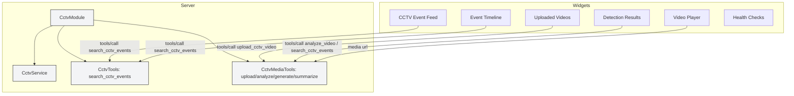

# CCTV Analyzer Architecture

This document describes the high-level architecture for the CCTV Analyzer app.

## Components

- Tools (MCP controllers):
  - `upload_cctv_video` — receive video uploads and persist (stubbed)
  - `analyze_video` — schedule/perform video analysis
  - `search_cctv_events` — query indexed detection events
  - `generate_video_clip` — produce clipped MP4s for incidents
  - `summarize_video` — produce human-friendly summaries

- Services:
  - `CctvService` — business logic, access to `data/mock_cctv.json` during development

- Widgets:
  - `CCTV Event Feed` — `/cctv-events`
  - `Uploaded Videos` — list uploaded videos and statuses
  - `Detection Results` — show detections for a selected video
  - `Event Timeline` — timeline UI for detected events
  - `Video Player` — play stored clips
  - `Health Checks` — system health endpoints

## Data

- `data/mock_cctv.json` — sample events used by `CctvService` for search tooling.

## Diagram

Placeholders and stubs are implemented in `src/modules/cctv`. Replace stubs with real storage and analysis pipelines (e.g., S3 + GPU worker) when ready.
