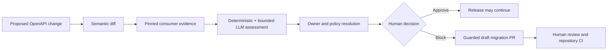
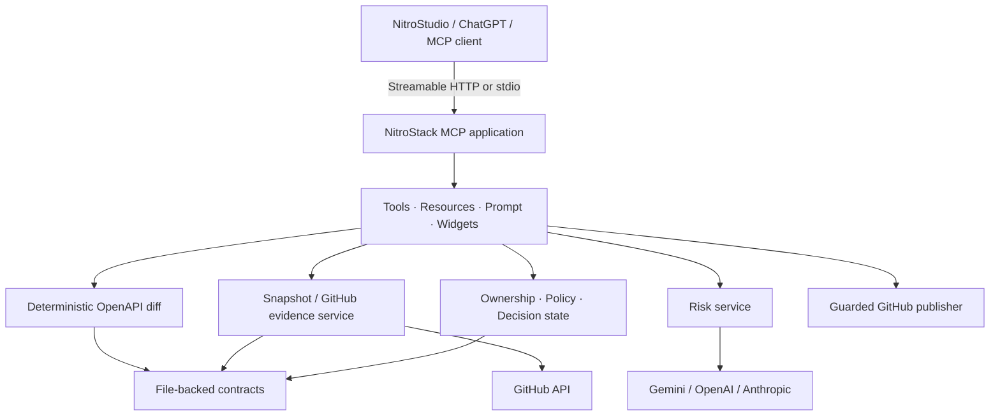

# APIGuard

> Stop breaking API releases before downstream consumers discover them in production.

[](https://github.com/arckrisofficial/api-larp/actions/workflows/ci.yml)
[](package.json)
[](https://docs.nitrostack.ai)
[](LICENSE)

APIGuard is a NitroStack-powered MCP server that turns an OpenAPI contract change into a governed release decision. It computes a semantic diff, locates consumer-code evidence at pinned Git commits, classifies real impact, resolves owners, applies release policy, records a human decision, and can open a guarded **draft** migration pull request.

The central question is not merely “is this API change breaking?” It is:

> **Which consumers will break, where is the evidence, who owns the fix, and is the release safe to continue?**

## Why it matters

Provider tests can pass while downstream applications fail after deployment. A removed response field, changed identifier type, or widened enum may be valid inside the provider repository but incompatible with code maintained elsewhere. APIGuard closes that visibility gap before release.

| Without APIGuard | With APIGuard |
|---|---|
| A schema diff reports abstract changes | Every change is linked to consumer evidence |
| Teams search repositories manually | Evidence is scoped, provenance-tagged, and commit-pinned |
| AI output is difficult to trust | Deterministic rules handle mechanical cases; the LLM sees only ambiguous snippets |
| Approval lives in chat or memory | Decisions are versioned, idempotent, and readable through MCP resources |
| Migration is a follow-up task | A guarded draft PR can be created from verified source hashes |

## The verified workflow



The bundled `risky` scenario changes the User API by converting `id` from integer to string, removing required `name` in favor of optional `fullName`, and adding `suspended` to the response status enum. The pinned React, Python, and Go consumers contain code that relies on the old contract.

### Live proof

The complete guarded write path has been exercised against a disposable public consumer repository:

- Assessment severity: `HIGH`
- Model path: Gemini, structured output accepted
- Policy verdict: `BLOCK`
- Human decision: `BLOCKED_PENDING_MIGRATION`
- Result: [draft Go migration PR #1](https://github.com/arckrisofficial/apiguard-go-consumer/pull/1)
- Evidence publication: [APIGuard assessment comment](https://github.com/arckrisofficial/apiguard-go-consumer/pull/1#issuecomment-5082574255)

The pull request is draft, remains unmerged, targets an allow-listed repository, and was created from the assessment-pinned source commit.

### Project links

- Hosted MCP endpoint: `https://apilarp-6a6591d4-ballers-amrita-university-coimbatore.app.nitrocloud.ai/mcp`
- Demo consumers: [React](https://github.com/arckrisofficial/apiguard-react-consumer), [Python](https://github.com/arckrisofficial/apiguard-python-consumer), and [Go](https://github.com/arckrisofficial/apiguard-go-consumer)
- Deployment health: verify the hosted tool list and a `risky` assessment before judging; a successful GitHub container build does not prove NitroCloud has rolled out the same revision.

## Natural-language demo

Connect the MCP server to an MCP-compatible client and ask:

> I’ve updated the API contract in the `risky` scenario and I’m about to push it. Before I do, check whether this change could break any downstream consumers. If it is unsafe, stop the release, identify the affected repositories and owners, and explain the evidence. Then prepare the required consumer migration and open a draft pull request with the assessment attached. Do not merge anything.

This intentionally describes the engineering goal rather than naming tools. The client can select the APIGuard workflow through the registered MCP descriptions and the `review_api_release` prompt.

See [the demo guide](docs/DEMO_GUIDE.md) for the narrated five-minute flow, prerequisites, expected outputs, and fallback plan.

## Quick start

Requirements:

- Node.js 20.18 or newer within the Node 20 line
- npm 9+
- NitroStudio or another MCP client

```bash
git clone https://github.com/arckrisofficial/api-larp.git
cd api-larp
cp .env.example .env
npm ci
npm run check
npm run dev
```

Windows PowerShell equivalent:

```powershell
Copy-Item .env.example .env
npm ci
npm run check
npm run dev
```

The safest zero-credential demonstration uses the committed evidence snapshot:

```bash
npm run demo
```

To use the bounded model classifier with snapshot evidence, set one provider key and run:

```bash
npm run demo:llm
```

## Operating modes

| Evidence | Classifier | Configuration | Best use |
|---|---|---|---|
| Pinned snapshot | Deterministic fallback | `USE_LIVE_GITHUB=false`, `USE_LLM=false` | Fully reproducible offline demo |
| Pinned snapshot | Gemini/OpenAI/Anthropic | `USE_LIVE_GITHUB=false`, `USE_LLM=true` | Recommended judged demo |
| Live GitHub | Selected model | `USE_LIVE_GITHUB=true`, `USE_LLM=true` | Fresh repository discovery |

Snapshot mode is not presented as live discovery. Every assessment records `sourceMode`, snapshot provenance, commit SHAs, hashes, classifier mode, model metadata, coverage, and limitations.

## MCP surface

### Tools

| Tool | Responsibility |
|---|---|
| `register_api_contract_pair` | Store a baseline/candidate OpenAPI 3.0 pair from inline JSON or URLs |
| `diff_api_spec` | Produce a deterministic, typed compatibility diff |
| `refresh_repository_evidence` | Scan active repositories or load fixture evidence into an immutable snapshot |
| `assess_consumer_risk` | Classify evidence using deterministic rules plus an optional bounded model call |
| `resolve_consumer_owners` | Resolve evidence paths through pinned `CODEOWNERS` data |
| `evaluate_release_policy` | Apply the `STRICT` or `BALANCED` deterministic policy profile |
| `run_impact_assessment` | Orchestrate diff, evidence, classification, severity, and persistence |
| `record_release_decision` | Record an optimistic, idempotent human approve/block decision |
| `manage_repository_scope` | Add or deactivate repositories with explicit confirmation |
| `export_release_evidence_package` | Export an immutable JSON assessment and snapshot bundle |
| `verify_migration_readiness` | Check policy and ownership prerequisites |
| `publish_assessment_to_pr` | Publish a real idempotent assessment comment to an allow-listed PR |
| `get_pinned_migration_sources` | Read complete impacted files and hashes from the assessment-pinned commit |
| `create_migration_pull_requests` | Create one guarded draft PR from complete-file changes and verified source hashes |

### Resources

- `apiguard://scenarios/{scenarioId}/specs/baseline`
- `apiguard://scenarios/{scenarioId}/specs/candidate`
- `apiguard://assessments/{assessmentId}`
- `apiguard://repository-scope`
- `apiguard://evidence-snapshots/{snapshotId}`
- `apiguard://evidence-packages/{bundleId}`

### Prompt, widgets, and health

- Prompt: `review_api_release`
- Widgets: contract diff, consumer risk, impact summary, ownership, policy, and migration readiness
- Health checks: `apiguard-liveness` and `apiguard-readiness`

## Architecture

APIGuard keeps MCP transport concerns thin and places business behavior in injectable services.



Read [Architecture](docs/ARCHITECTURE.md) for component boundaries, state transitions, data provenance, and persistence details.

## Safety invariants

GitHub writes are deliberately harder than reads:

1. Writes are disabled unless `APIGUARD_GITHUB_WRITE_ENABLED=true`.
2. The target must exactly match `APIGUARD_WRITABLE_REPOSITORIES`.
3. Migration PRs require a `BLOCKED_PENDING_MIGRATION` assessment.
4. Only confirmed or likely impacted paths are accepted.
5. The source is fetched from the assessment-pinned commit and its SHA-256 hash is revalidated.
6. A namespaced branch is created; the default branch is never directly modified.
7. GitHub must confirm the PR is a draft.
8. Idempotency keys prevent duplicate comments and migration PRs.
9. APIGuard never merges a pull request.

The LLM has no tools and cannot write to GitHub. Model output is JSON-parsed, Zod-validated, reconciled against known evidence/change IDs, and safely downgraded when unavailable or invalid.

Read [Security model](docs/SECURITY.md) for the threat model and deployment caveats.

## Configuration

Copy `.env.example`; never commit `.env`.

| Variable | Default | Purpose |
|---|---|---|
| `USE_LIVE_GITHUB` | `false` | Select live GitHub evidence instead of the pinned fixture |
| `GITHUB_TOKEN` | empty | GitHub read/write credential; scope it minimally |
| `DEMO_GITHUB_OWNER` | empty | Bootstrap owner for consumer scope |
| `DEMO_GITHUB_REPOSITORIES` | empty | Comma-separated consumer repositories |
| `USE_LLM` | `false` | Enable bounded classification for ambiguous evidence |
| `LLM_PROVIDER` | `openai` | `gemini`, `openai`, or `anthropic` |
| `LLM_TIMEOUT_MS` | `30000` | Model request timeout |
| `APIGUARD_GITHUB_WRITE_ENABLED` | `false` | Master switch for GitHub mutations |
| `APIGUARD_WRITABLE_REPOSITORIES` | empty | Exact comma-separated `owner/repository` allow-list |
| `ALLOWED_GITHUB_OWNERS` | empty | Owners permitted by repository-scope mutation |

Provider-specific model and key variables are documented in [.env.example](.env.example). NitroCloud configuration is covered in [Deployment](docs/NITROCLOUD_DEPLOYMENT.md).

## Verification

```bash
npm run typecheck
npm test
npm run widget:typecheck
npm run build
```

The offline suite currently contains 17 tests covering contract registration/diff behavior, prompt-injection resistance, deterministic filtering, targeted snapshot refresh, migration readiness, decision idempotency, repository-scope behavior, pinned source retrieval, GitHub publication safety, draft PR creation, stale-state verification, and PR replay semantics.

CI performs a clean `npm ci`, type-check, test, and production build on Node 20. The deploy workflow repeats the quality gate before publishing the container image to GitHub Container Registry.

See [Verification](VERIFICATION.md) for executed results and the boundary between verified behavior and remaining limitations.

## Supported compatibility subset

- OpenAPI 3.0 JSON
- Local `#/components/...` references
- Removed operations and parameters
- Parameters becoming required
- Required response-property removal
- Optional properties becoming required
- Property type changes
- Direction-aware enum compatibility
- Optional property additions

Unsupported or ambiguous constructs are reported rather than silently treated as safe. YAML, OpenAPI 3.1, remote references, and complete polymorphic compatibility are outside the current scope.

## Honest limitations

- GitHub code search is scoped evidence collection, not complete dependency discovery.
- File-backed persistence is appropriate for the demo and a single writable instance, not a multi-replica production control plane.
- APIGuard records a release decision; it is not itself a GitHub required check or branch-protection rule.
- Generated migration content still requires human review and repository CI.
- URL-based contract registration should be restricted or disabled in an untrusted public deployment.
- The public demo uses no MCP authentication unless the deployment is configured behind an authenticated gateway.
- A client request before `git push` is advisory unless integrated into a pre-push hook or CI workflow.

## Documentation

- [Documentation index](docs/README.md)
- [Project explanation](docs/PROJECT_EXPLANATION.md)
- [Architecture](docs/ARCHITECTURE.md)
- [Demo guide](docs/DEMO_GUIDE.md)
- [Security model](docs/SECURITY.md)
- [NitroCloud deployment](docs/NITROCLOUD_DEPLOYMENT.md)
- [NitroStudio inputs](NITROSTUDIO_INPUT_GUIDE.md)
- [Snapshot refresh](docs/SNAPSHOT_REFRESH.md)
- [Verification report](VERIFICATION.md)

## Repository map

```text
src/domain/                     deterministic compatibility and decision logic
src/modules/apiguard/           MCP controllers, services, adapters, and stores
src/widgets/                    six NitroStack result widgets
fixtures/scenarios/risky/       reproducible contract and evidence scenario
tests/offline/                  credential-free test suite
scripts/                        snapshot, smoke, and live-write verification
docs/                           architecture, demo, security, and operations guides
```

## License

[MIT](LICENSE)
