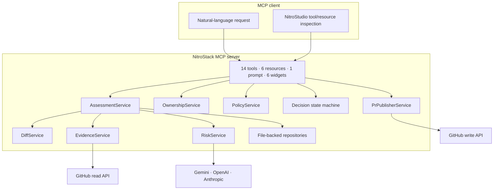
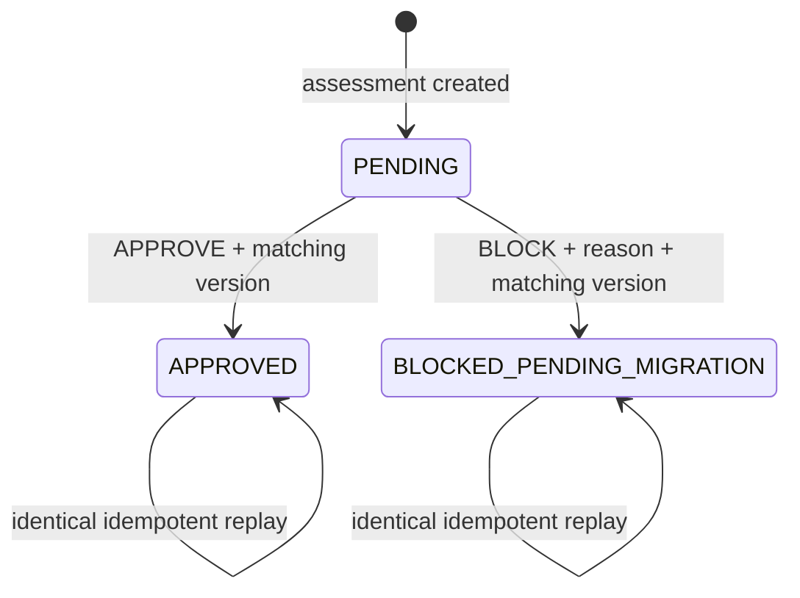

# Architecture

## Design goals

APIGuard is designed around four properties:

1. **Evidence before inference.** Contract changes and repository provenance are deterministic inputs.
2. **Bounded AI.** The model classifies only ambiguous snippets and has no tools or write authority.
3. **Human-governed mutation.** Release decisions and GitHub writes require explicit, typed inputs.
4. **Honest degradation.** Missing evidence, repository failures, invalid model output, and timeouts become warnings, review requirements, or incomplete assessments—not false green results.

## Runtime boundary



The server is the MCP boundary. GitHub and the model providers are ordinary server-side adapters; they are not additional MCP servers.

## Request lifecycle

`run_impact_assessment` performs the core read/analysis pipeline:

```text
resolve contract pair
→ deterministic semantic diff
→ load or refresh EvidenceSnapshotV2
→ verify provenance and content hashes
→ deterministically classify mechanical evidence
→ send only ambiguous evidence to the selected model
→ validate and reconcile structured model output
→ compute status and severity deterministically
→ persist versioned assessment
→ return widget-compatible payload
```

Ownership resolution, policy evaluation, evidence export, human decision, and GitHub publication remain explicit tools so a client cannot silently turn analysis into mutation.

## Core components

| Component | Responsibility |
|---|---|
| `SpecRepository` | Load bundled or dynamically registered contract pairs |
| `ContractService` | Validate and persist inline/URL contract registration |
| `DiffService` | Convert two OpenAPI documents into typed compatibility changes |
| `SnapshotEvidenceProvider` | Load reproducible committed evidence |
| `GitHubEvidenceProvider` | Search configured repositories and capture pinned source snippets |
| `EvidenceService` | Select provider, cache/refresh snapshots, and preserve provenance |
| `RiskService` | Combine deterministic classification with one bounded provider request |
| `AssessmentService` | Orchestrate analysis, compute truthful status, and persist state |
| `OwnershipService` | Resolve evidence paths against pinned CODEOWNERS content |
| `PolicyService` | Evaluate deterministic `STRICT` or `BALANCED` rules |
| `PrPublisherService` | Enforce allow-lists, stale-source checks, draft-only PR creation, and idempotency |

## Deterministic and model responsibilities

| Deterministic code owns | Model may assist with |
|---|---|
| OpenAPI parsing and local `$ref` resolution | Contextual interpretation of ambiguous executable snippets |
| Compatibility change detection | Evidence classification and reasoning |
| Snapshot/content-hash validation | Scoped migration suggestions |
| Test/docs/generated-file filtering | Nothing outside provided change/evidence IDs |
| Severity and completeness computation | No repository access and no tools |
| Policy verdicts and decision transitions | No release approval and no GitHub writes |
| Repository/file/change-ID reconciliation | Output is accepted only after schema validation |

## EvidenceSnapshotV2 provenance

Each snapshot records:

- snapshot ID and capture time
- baseline and candidate hashes
- repository-scope version
- repository, branch, and exact commit SHA
- scan status and coverage counts
- change-derived search query
- file path and line range
- bounded source snippet and SHA-256 content hash
- related semantic change IDs

An assessment stores the snapshot ID and repository commit map, allowing later ownership and migration operations to use the same evidence boundary.

## State model



Conflicting decisions and stale versions are rejected. Incomplete assessments cannot be approved.

## Persistence

Persistence is file-backed:

| Data | Location |
|---|---|
| Registered contract pairs | `.apiguard/scenarios/` |
| Evidence snapshots | `.apiguard/snapshots/` |
| Assessments and decisions | `.apiguard/assessments/` |
| Repository scope | `.apiguard/repository-scope.json` |
| Exported evidence packages | `artifacts/evidence-packages/` |

Writes use temporary-file replacement or create-once semantics where implemented. This is durable across a process restart when the filesystem persists, but it is not a transactional database and is not appropriate for unsynchronised multi-replica writes.

## Deployment topology

The application supports stdio for local MCP clients and Streamable HTTP when hosted by NitroCloud. The GitHub Actions deployment workflow builds and publishes a container only after type-check, tests, and the NitroStack production build pass.

See [Security](SECURITY.md) for trust boundaries and [Deployment](NITROCLOUD_DEPLOYMENT.md) for the runtime configuration.
