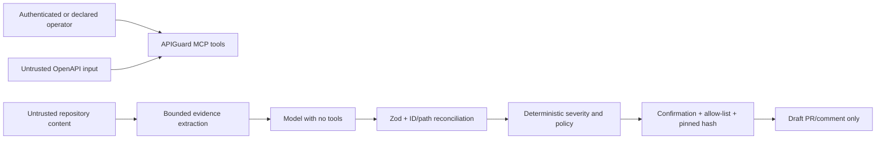

# Security model

APIGuard processes untrusted API documents, repository source, model output, and user-directed GitHub mutations. Its safety model keeps analysis separate from authority and requires progressively stronger checks as an operation approaches a write.

## Trust boundaries

## GitHub write controls

`PrPublisherService` enforces the following controls server-side:

- global write switch defaults to off
- exact repository allow-list
- canonical GitHub PR URLs for publication
- `confirmed: true` in mutating tool schemas
- blocked assessment prerequisite for migration PRs
- assessment-pinned repository commit
- proposed paths restricted to confirmed/likely impacted evidence
- pinned source content fetched from GitHub and SHA-256 revalidated
- namespaced fix branches
- draft PR assertion
- replay lookup by deterministic branch/idempotency key
- replay verification that the existing commit descends from the pinned source
- cleanup attempt if PR creation fails after branch creation

APIGuard contains no merge operation.

## Model isolation

- Repository snippets are explicitly treated as untrusted data.
- Deterministic rules handle comment-only, documentation, test, and other mechanical cases.
- Only ambiguous evidence is sent to the selected provider.
- Evidence count and snippet length are capped.
- The model receives no MCP or GitHub tools.
- Output must parse as JSON and satisfy `AssessRiskOutputSchema`.
- Change IDs must already be linked to the evidence item.
- Migration actions must match the known repository and file path.
- Missing, invalid, or timed-out output falls back to deterministic review-safe behavior.
- Provider and model status are recorded on the assessment.

## Decision integrity

Release decisions require the current assessment version and an idempotency key. A block requires a reason. Identical replays are safe; stale or conflicting decisions are rejected. An incomplete assessment cannot be approved.

## Secrets

- `.env` and `.env.*` are ignored except `.env.example`.
- Configure provider and GitHub credentials through local environment variables or NitroCloud secrets.
- Use a fine-grained GitHub token restricted to the disposable repositories required by the demo.
- Never print tokens in logs, screenshots, reports, or tool output.
- Rotate the GitHub token after a public demonstration.

## Known risks and deployment requirements

### No MCP authentication by default

The public demo endpoint may be configured with no MCP authentication. Do not enable GitHub writes on an unauthenticated public endpoint unless access is otherwise restricted. For production, place APIGuard behind an authenticated gateway and derive the decision actor from verified auth context.

### URL contract registration

`register_api_contract_pair` supports HTTP URL inputs. In an untrusted deployment, this creates a server-side request surface. Restrict network egress, validate hosts against an allow-list, or disable URL registration before production use.

### File-backed persistence

State is written under `.apiguard/` and `artifacts/`. It is not encrypted, transactional, or coordinated across replicas. Mount durable storage for a single instance or replace the repositories with a database/object store for production.

### Advisory release gate

The recorded decision is not a GitHub required check. Teams that need enforcement must connect the verdict to CI/check-runs and branch protection.

### Scoped discovery

GitHub text/code search may miss dynamic consumers, generated clients, private repositories outside scope, or dependencies expressed without the searched field names. Coverage and failures must remain visible to the reviewer.

## Reporting a vulnerability

Do not open a public issue containing credentials or exploit details. Contact the repository owner privately, include the affected component and reproduction steps, and revoke any exposed token immediately.
