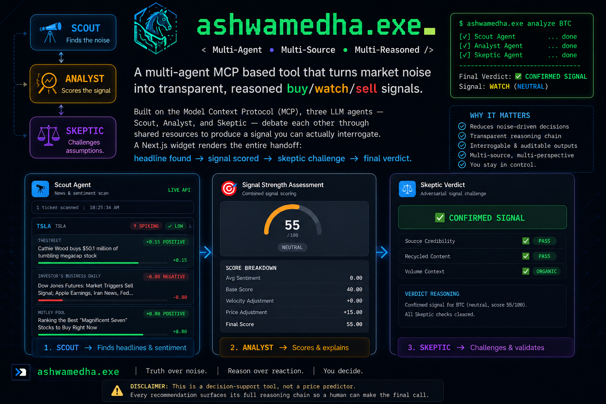

# ashwemedha.exe

**A multi-agent MCP based tool that turns market noise into transparent, reasoned buy/watch/sell signals.**

Built on the [Model Context Protocol (MCP)](https://modelcontextprotocol.io), three LLM agents — Scout, Analyst, and Skeptic — debate each other through shared resources to produce a signal you can actually interrogate. A Next.js widget renders the entire handoff: headline found → signal scored → skeptic challenge → final verdict.

> **Disclaimer:** This is a decision-support tool, not a price predictor. Every recommendation surfaces its full reasoning chain so a human can make the final call.

Deployed Link: https://ashwemeda-6a653529-ashwamedhaexe-amrita-university-coimbatore.app.nitrocloud.ai



---

## How It Works

```
  ┌──────────────┐       ┌───────────────┐       ┌──────────────┐
  │   Scout      │       │   Analyst     │       │   Skeptic    │
  │   Agent      │       │   Agent       │       │   Agent      │
  │              │       │               │       │              │
  │ Scans news   │─────▶│ Cross-checks  │──────▶│ Tries to    │
  │ headlines    │       │ price/volume  │       │ disprove     │
  │ & sentiment  │       │ action        │       │ the signal   │
  └──────┬───────┘       └──────┬────────┘       └──────┬───────┘
         │                      │                        │
         ▼                      ▼                        ▼
  ┌──────────────┐       ┌──────────────┐       ┌──────────────┐
  │ findings_    │       │ signal_log   │       │ verdict_log  │
  │ board        │       │              │       │              │
  └──────────────┘       └──────────────┘       └──────────────┘
         ▲                      ▲                        │
         │   Shared MCP         │   Resources            │
         └──────────────────────┴────────────────────────┘
                                                        │
                                                        ▼
                                               ┌──────────────┐
                                               │  Next.js     │
                                               │  Widget      │
                                               └──────────────┘
```

Agents never talk to each other directly. They communicate through **shared MCP Resources** in a blackboard architecture — Scout writes findings, Analyst reads them and writes signals, Skeptic reads both and writes the final verdict.

The three-agent pipeline runs in sequence via an orchestrator, and the widget polls the resources to render each stage live.

---

## Tech Stack

| Layer         | Technology                                  |
|---------------|---------------------------------------------|
| MCP Server    | TypeScript, [NitroStack](https://nitrostack.dev), `@modelcontextprotocol/sdk` |
| Validation    | Zod                                         |
| Widget        | Next.js 16, React 19                        |
| Orchestrator  | TypeScript, ts-node, Axios                  |
| Runtime       | Node.js (ES2022+)                           |

---

## External Data Sources

### News & Sentiment

| Source | Purpose |
|--------|---------|
| [Alpha Vantage NEWS_SENTIMENT](https://www.alphavantage.co/documentation/#news-sentiment) | Primary news feed with built-in sentiment scores |
| [NewsAPI](https://newsapi.org/) | Recent news articles for a ticker |
| [GNews](https://gnews.io/) | Fallback news source when NewsAPI returns no results |

### Market Data

| Source | Purpose |
|--------|---------|
| [Alpha Vantage GLOBAL_QUOTE](https://www.alphavantage.co/documentation/#global-quote) | Current stock price, daily change %, volume |
| [Alpha Vantage SYMBOL_SEARCH](https://www.alphavantage.co/documentation/#symbol-search) | Resolve company names (e.g. "Apple") to ticker symbols (e.g. "AAPL") |
| [Yahoo Finance](https://finance.yahoo.com/) (unofficial) | 30-day OHLCV price bars and volume data for stocks |
| [CoinGecko](https://www.coingecko.com/en/api) | Crypto price data, 24h volume, 30-day daily candles |

### LLM

| Source | Purpose |
|--------|---------|
| [Groq](https://groq.com/) (llama-3.1-8b-instant) | Sentiment analysis fallback when lexicon-based scoring has low confidence |

### Static Reference Data

| File | Purpose |
|------|---------|
| `source-credibility.json` | Curated credibility tiers for news domains (high/medium/low/press-release-mill) |
| `market-calendar.json` | Scheduled earnings dates, options expiries, index rebalances |
| `historical-signals.json` | Past signal outcomes for pattern lookup |
| `seed-news.json` / `seed-signals.json` / `seed-verdicts.json` | Pre-built demo data used as fallback when APIs are rate-limited and as primary data in `--stub` mode |

---

## Getting Started

### Prerequisites

- Node.js >= 18
- npm

### Install

```bash
# Root (shared types)
npm install

# NitroStack MCP server
cd market-signal-mcp && npm install && cd ..

# Widget
cd widget && npm install && cd ..

# Orchestrator
cd orchestrator && npm install && cd ..
```

### Environment

Create a `.env` file in the project root:

```bash
# News APIs (at least one required for live mode)
NEWSAPI_KEY=your_newsapi_key
GNEWS_API_KEY=your_gnews_key

# Market data
ALPHA_VANTAGE_KEY=your_alphavantage_key

# LLM fallback (optional — used by NitroStack Scout for low-confidence sentiment)
GROQ_API_KEY=your_groq_key
```

All keys are optional — the pipeline falls back to seed data when APIs are unavailable or unconfigured.

---

## Running

### Build & Run
```bash
npm start
```

### MCP Servers (STDIO)

```bash
# Analyst agent
npm run dev:analyst

# Skeptic agent
npm run dev:skeptic
```

### Orchestrator

```bash
cd orchestrator

# Stub mode (seed data, no API calls)
npx ts-node run-pipeline.ts TSLA --stub

# Live mode (real APIs)
npx ts-node run-pipeline.ts TSLA
```

### Widget

```bash
cd widget
npm run dev
```

Open [http://localhost:3000](http://localhost:3000).

### Tests

```bash
npm run test:skeptic
npm run test:analyst
```

---

## Project Structure

```
ashwemedha.exe/
├── market-signal-mcp/                 # NitroStack MCP server
│   └── src/
│       ├── modules/
│       │   ├── scout/                 # Scout agent — news ingestion + sentiment
│       │   ├── analyst/               # Analyst agent — price/volume + signal scoring
│       │   └── skeptic/               # Skeptic agent — adversarial credibility checks
│       ├── data/                      # Seed data, runtime state, reference files
│       ├── health/                    # System health monitoring
│       ├── widgets/                   # Per-tool NitroStack UI widgets
│       ├── index.ts                   # MCP server entry point
│       └── run-pipeline.ts            # End-to-end pipeline runner
├── server/                            # Standalone MCP server (raw SDK, for dev/testing)
│   ├── tools/
│   │   ├── analyst.tools.ts
│   │   └── skeptic.tools.ts
│   ├── resources/
│   │   ├── findings-board.resource.ts
│   │   ├── signal-log.resource.ts
│   │   └── verdict-log.resource.ts
│   ├── types/
│   │   └── shared.types.ts
│   ├── analyst-server.ts
│   └── skeptic-server.ts
├── widget/                            # Next.js dashboard — three-panel live view
├── orchestrator/
│   ├── run-pipeline.ts               # Scout → Analyst → Skeptic sequencer
│   └── types.ts
├── data/
│   ├── source-credibility.json       # Source tier ratings
│   ├── market-calendar.json          # Earnings / expiry / rebalance dates
│   └── historical-signals.json       # Past signal patterns
├── planning.md
└── package.json
```

---

## License

This project was built for a hackathon and is provided as-is.
