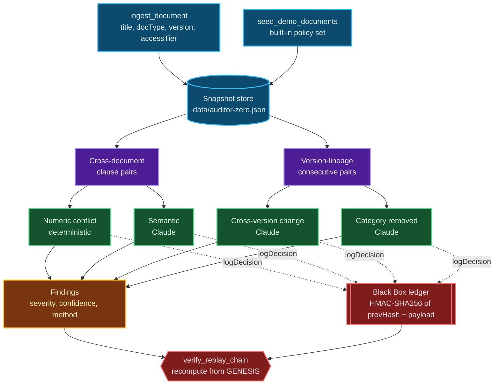

<div align="center">
<pre>
 █████╗ ██╗   ██╗██████╗ ██╗████████╗ ██████╗ ██████╗     ███████╗███████╗██████╗  ██████╗ 
██╔══██╗██║   ██║██╔══██╗██║╚══██╔══╝██╔═══██╗██╔══██╗    ╚══███╔╝██╔════╝██╔══██╗██╔═══██╗
███████║██║   ██║██║  ██║██║   ██║   ██║   ██║██████╔╝      ███╔╝ █████╗  ██████╔╝██║   ██║
██╔══██║██║   ██║██║  ██║██║   ██║   ██║   ██║██╔══██╗     ███╔╝  ██╔══╝  ██╔══██╗██║   ██║
██║  ██║╚██████╔╝██████╔╝██║   ██║   ╚██████╔╝██║  ██║    ███████╗███████╗██║  ██║╚██████╔╝
╚═╝  ╚═╝ ╚═════╝ ╚═════╝ ╚═╝   ╚═╝    ╚═════╝ ╚═╝  ╚═╝    ╚══════╝╚══════╝╚═╝  ╚═╝ ╚═════╝ 
</pre>


# Team Smooth Operator

**NitroStack Hackathon · Enterprise AI & Workplace Automation Track**

*Every contradiction. Every silent omission. Sealed in a tamper-proof, cryptographically keyed decision ledger, and replayable, step by step, on demand.*

**Live MCP server:** `https://auditor-zero-6a651-smooth-operator-amrita-university-coimbatore.app.nitrocloud.ai`
Connect it to ChatGPT with that URL plus `/sse`, authentication **No Auth**.

**Standalone repository:** [github.com/ChallapalliSathwik/AuditorZero](https://github.com/ChallapalliSathwik/AuditorZero)

[](https://www.typescriptlang.org/)
[](https://nitrostack.ai)
[](https://modelcontextprotocol.io/)
[](https://www.anthropic.com/)
[](#the-widget-layer)

**[Getting Started](#getting-started)** · **[Architecture](#how-it-works)** · **[The Black Box](#the-black-box-a-cryptographically-keyed-decision-ledger)** · **[Tools](#mcp-tools)**

</div>

---

## The Problem

> *"The 2025 filing quietly dropped last year's risk disclosure about supplier concentration. Nobody caught it, until the quarter it mattered."*

This is the story behind every silent disclosure failure, and it is structurally invisible to every document tool built today. Search answers *"what does this say."* It cannot answer *"what did this used to say, and why did it stop"*, or *"what does this say that our own other policy quietly contradicts."*

| Pain Point | What It Costs |
|---|---|
| **Manual cross-document review** | Compliance teams read filings sequentially, once a quarter. Contradictions and omissions between documents are invisible by construction |
| **No memory across versions** | A risk factor, a security obligation, a disclosed commitment can vanish between one version and the next with nobody noticing until it is already too late |
| **No traceable reasoning** | When an AI tool *does* flag something, nobody can verify, to a skeptical auditor or a court, exactly how it reached that conclusion, or whether the record was altered afterward |

**Auditor Zero** closes this gap autonomously, with every finding sealed in a cryptographic ledger that can be replayed and verified on demand.

---

## What Makes It Different, In One Sentence

> *Every other AI review tool asks you to trust its output. Auditor Zero shows you the receipts, cryptographically, for every single decision it made.*

---

## Highlights

| | |
|---|---|
| 🔎 **Four complementary detectors** | Deterministic numeric-conflict detection, LLM-driven semantic comparison, cross-version change detection, and category-disappearance detection. Each finding is tagged with *how* it was found, so nothing is a black box to the user |
| 🔐 **Cryptographically keyed provenance** | `HMAC-SHA256(secret, prevHash + payload)` per decision step. The chain is *keyed*, not just hashed, so an attacker who edits a stored record cannot re-seal the chain without the server's secret. **Tamper-proof, not merely tamper-evident.** |
| ⚡ **Non-blocking, live-progress audits** | `analyze_document` returns the moment the audit is queued. The pipeline runs behind it with bounded concurrency, and the UI polls progress live, step by step |
| 🧭 **Explainable by design** | Every judgment ships with its reasoning, visibly. Nothing is a bare confidence score with no justification |
| 🧩 **One definition, two transports** | Every operation is defined once as a NitroStack tool and served simultaneously over MCP STDIO and streamable HTTP, so a desktop client and a hosted agent call exactly the same code |
| 🖥️ **A real product, not a script** | Seven interactive React widgets, one-click demo seeding, an expandable decision trail, live integrity verification, a tamper demo, and automatic light and dark theming |

---

## What Makes This Actually Trustworthy

Most "AI audit" tools are a single LLM call with a confidence score bolted on, and the user is still asked to just believe it. Auditor Zero's trust model is architectural, not cosmetic.

**1 · The Chain Is Keyed, Not Just Hashed**
A plain hash chain only proves *something* was recorded in order. Anyone who edits a record can simply recompute a new, internally consistent chain from that point forward. Auditor Zero's chain is sealed with `HMAC-SHA256` under a server-held secret. Without that secret, no forged chain will ever reproduce the stored hashes. This is the difference between *"we kept a log"* and *"we can cryptographically prove this reasoning was never altered."*

**2 · Every Finding Is Independently Replayable**
`verify_replay_chain` does not trust its own stored state. It recomputes every link from `GENESIS` forward and reports the exact record where the chain breaks, if it ever does. Nothing is taken on faith, including the system's own prior output.

**3 · Detection Is Layered, Not Single-Shot**
Deterministic numeric-conflict detection runs independently of the LLM's semantic judgment. It is a cheap, fast pre-filter that catches hard numeric contradictions (`90 days` against `180 days`) even in cases where negation-word matching alone would miss them entirely. The system does not rely on a single method to be right.

**4 · A Failed Comparison Never Sinks the Audit**
Every clause pair and every version diff is wrapped so that a single failure is skipped and logged rather than aborting the run. An audit degrades gracefully instead of returning nothing.

---

## How it works



Documents are grouped into **version lineages** by an explicit `previousDocumentId` link rather than by parsing version strings, so `v1/v2` against `1.0/1.10` can never silently break a diff. Within a lineage, consecutive versions are compared: a category that has vanished entirely becomes a **disappearance**, and a materially changed obligation becomes a **cross-version contradiction**. Across different documents, obligation clauses are compared pairwise, gated by a topic-overlap check. Findings are deduplicated by a per-audit signature, so the same underlying issue is surfaced once and never spammed across multiple detectors.

The pipeline runs through a bounded worker pool, so progress advances in waves as batches of model calls resolve. On the built-in demo set that is 68 steps in roughly 20 seconds.

### Detection methods

| Method | Kind | How it fires |
|---|---|---|
| **Numeric conflict** | deterministic | Two topically related clauses assert different values for the same unit (days, hours, percent, currency). Catches `90 days` against `180 days` even with zero negation words |
| **Semantic (LLM)** | model-driven | Two obligation clauses from different documents are judged contradictory, gated by a topic-overlap check so unrelated clauses are never wastefully compared |
| **Cross-version change** | model-driven | An obligation still present in the new version but materially weakened, for example VPN *"required"* becoming *"optional"* |
| **Category removed** | model-driven | An entire obligation category present in an older version is completely absent from the newer one |

---

## The Black Box, a cryptographically keyed decision ledger

This is the part almost no AI review tool builds.

Every agent step calls `logDecision({ auditId, agentName, input, output })`, which:

1. Reads the hash of the last ledger entry for that audit, or `"GENESIS"` if this is the first
2. Computes `hash = HMAC-SHA256(LEDGER_SECRET, prevHash + JSON.stringify({ agentName, input, output, timestamp }))`
3. Appends the record to the ledger, keyed by a monotonic sequence per audit

`verify_replay_chain` recomputes every link from `GENESIS` forward using the server-held key, and returns `verified: false` plus the exact `brokenAt` record the moment a stored hash does not match. Because the chain is **keyed** with HMAC rather than a plain hash, an attacker cannot simply recompute a fresh, valid-looking chain after editing a record. Without the secret, no forged chain will ever verify. This is the difference between "we kept a log" and **"we can cryptographically prove this reasoning chain was never altered."**

Try it yourself: seed the demo data, run an audit, then open **Decision Trail** and **Replay Verify**. Set `ALLOW_TAMPER_DEMO`, use `debug_tamper_record` to alter a sealed record, and watch verification catch it and report exactly where the chain broke.

---

## The widget layer

Every tool that returns something worth looking at ships its own React widget. NitroStack bundles each page with esbuild into a self-contained HTML file, so production never runs a Next build.

| Widget | Backing tools | What it shows |
|---|---|---|
| `documents` | `list_documents`, `seed_demo_documents` | Searchable, sortable inventory with family and version badges, lineage links, and a run-audit action with a live progress bar |
| `audit-results` | `analyze_document`, `get_audit_result` | Findings dashboard with severity, detection method, and a replayable ledger per finding |
| `audits` | `list_audits` | Every audit with status, findings count, and expandable inline findings |
| `decision-trail` | `get_decision_trail` | The sealed ledger for an audit in chain order |
| `replay-verify` | `verify_replay_chain` | Hash-chain replay from `GENESIS` with a pass or fail verdict and the break point |
| `document-ingested` | `ingest_document` | Confirmation of a newly ingested document and its lineage |
| `tamper-debug` | `debug_tamper_record` | The dev-only tamper demo |

---

## Built on NitroStack

Auditor Zero is architected end to end on **NitroStack's** agent and MCP tooling. Every audit operation, covering ingestion, contradiction detection, disappearance detection, severity scoring, replay, and verification, is defined once as a NitroStack tool with a Zod input schema, and is served identically over MCP STDIO and streamable HTTP. The same reasoning pipeline a human clicks through in NitroStudio is exactly what an autonomous agent calls under the hood.

---

## Tech stack

**TypeScript 5.9** · **@nitrostack/core 1.0.14** (MCP server, tools, resources, health checks) · **@anthropic-ai/sdk** (Claude, semantic reasoning) · **Zod** (schema validation) · **React 18 + esbuild** (widget layer) · **Node.js 20** · **dotenv**

State is a JSON snapshot on disk, so the demo runs with zero external services.

---

## Getting started

### Prerequisites

- Node.js 20 recommended, 18 is the minimum
- An Anthropic API key ([console.anthropic.com](https://console.anthropic.com))

### Setup

```bash
git clone https://github.com/nitrocloudofficial/nitrostack.git
cd nitrostack/sample-apps/auditor-zero
npm install

cp .env.example .env     # fill in ANTHROPIC_API_KEY and LEDGER_SECRET
npm run dev              # MCP server plus the widget dev server on port 3001
```

Then open the project in **NitroStudio**, go to **Tools**, run `seed_demo_documents`, and run `analyze_document`. The audit-results widget fills in live as findings are discovered. Run `verify_replay_chain` to confirm the ledger verifies end to end.

### Production

```bash
npm run build       # bundles the 7 widgets with esbuild and compiles to dist/
npm run start:prod  # serves MCP over STDIO and streamable HTTP
```

The server binds `0.0.0.0` by default so it is reachable from outside a container, and honours `PORT` when the host assigns one.

### Other commands

```bash
npm run install:all  # install dependencies in both the root and src/widgets
npm run upgrade      # upgrade the NitroStack packages in this project
```

---

## Configuration

| Variable | Required | Description |
|---|---|---|
| `ANTHROPIC_API_KEY` | yes | Powers semantic detection, cross-version comparison, and severity scoring |
| `LEDGER_SECRET` | yes in production | The HMAC key that seals the Black Box, held only by the server. Falls back to `JWT_SECRET`. Outside production a development key is used and a warning is logged |
| `ANTHROPIC_MODEL` | optional | Model id, default `claude-sonnet-4-6` |
| `ALLOW_TAMPER_DEMO` | optional | Enables the dev-only `debug_tamper_record` tool when `NODE_ENV=production`. Keep it unset in real deployments |
| `HOST` | optional | Bind address, default `0.0.0.0` |
| `PORT` | optional | HTTP port, default `3000` |
| `DATA_FILE` | optional | Snapshot path, default `.data/auditor-zero.json` |
| `NITRO_LOG_LEVEL` | optional | Log verbosity, for example `info` |
| `NITROSTACK_APP_MODE` | optional | NitroStack application mode, for example `universal` |

---

## MCP tools

Nine tools, each with a Zod input schema, seven of them backed by a widget.

| Tool | Description |
|---|---|
| `ingest_document` | Ingest a document, optionally linking it to a prior version with `previousDocumentId` |
| `list_documents` | List all ingested documents, oldest first |
| `seed_demo_documents` | Ingest the built-in demo set: a v1, v2, v3 policy lineage plus a contradicting BYOD policy and an unrelated noise policy |
| `analyze_document` | Start the full audit pipeline. Returns immediately with the audit in `running` status. Omit `docIds` to audit everything |
| `get_audit_result` | Fetch an audit by id with its findings and live progress |
| `list_audits` | List all audits, most recent first |
| `get_decision_trail` | The sealed decision ledger for an audit, optionally scoped to one finding, in chain order |
| `verify_replay_chain` | Recompute and verify the keyed hash chain from `GENESIS` |
| `debug_tamper_record` | Dev only. Edits a sealed record in place so verification can be shown catching it |

The server also publishes a `widget://examples` resource and a `health://checks` resource.

---

## Project structure

```
src/
  index.ts                      # Bootstrap: pins cwd, loads .env, defaults HOST
  app.module.ts                 # Root module, registers the audit feature and health check
  llm.ts                        # Anthropic client wrapper (complete / completeJSON)
  store.ts                      # JSON snapshot store, loaded and persisted on disk
  health/system.health.ts       # Health check surfaced as health://checks
  audit/
    audit.module.ts             # Feature module
    audit.tools.ts              # The 9 tool definitions, Zod schemas plus @Widget bindings
    engine.ts                   # Detection engine, pair building, bounded concurrency
    blackbox.ts                 # HMAC hash-chain ledger, replay and verify
    demo-docs.ts                # Built-in demo policy set
    types.ts                    # Doc, Finding, Audit, DecisionRecord, ReplayResult
  widgets/
    app/<route>/page.tsx        # 7 widgets, one per route
    components/ui.tsx           # Shared widget design system
    lib/types.ts                # DTOs mirrored for the widget layer
    widget-manifest.json        # Loaded at startup, served as widget://examples
```

---

## Roadmap

- Embedding-based candidate selection to replace pairwise clause comparison for large corpora
- External anchoring of each audit's root hash, signed and published, for third-party verifiability
- A labelled evaluation harness to measure detector precision and recall over time
- A pluggable persistence layer so the JSON snapshot can be swapped for a database

---

## At a Glance

| Metric | Value |
|---|---|
| Detection methods per audit | **4**: numeric, semantic, cross-version, category-removed |
| MCP tools | **9**, each with a Zod input schema |
| Interactive widgets | **7**, bundled to self-contained HTML with esbuild |
| Decision ledger integrity | **Cryptographically keyed** with HMAC-SHA256, verifiable end to end from `GENESIS` |
| Transports per operation | **2**: MCP STDIO and streamable HTTP, one source of truth |
| Demo audit | **68 pipeline steps in roughly 20 seconds** |

---

## Team Smooth Operator

Built in 24 hours by:

| Name | GitHub Username |
|---|---|
| Madhumita Shenbagarajesh | `@Madhumita-05` |
| Hema M | `@Hemashankar19` |
| Challapalli Sathwik | `@ChallapalliSathwik` |
| Shobhana S | `@Shobhanashankar` |

---

<div align="center">

**AUDITOR ZERO · NitroStack Hackathon · Enterprise AI & Workplace Automation Track**

*Not just another AI reading your documents. An agent that cross-examines them, and can prove, cryptographically, exactly how it knows.*

</div>
