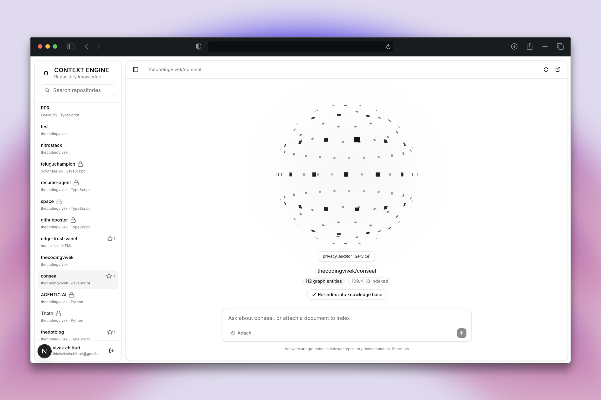
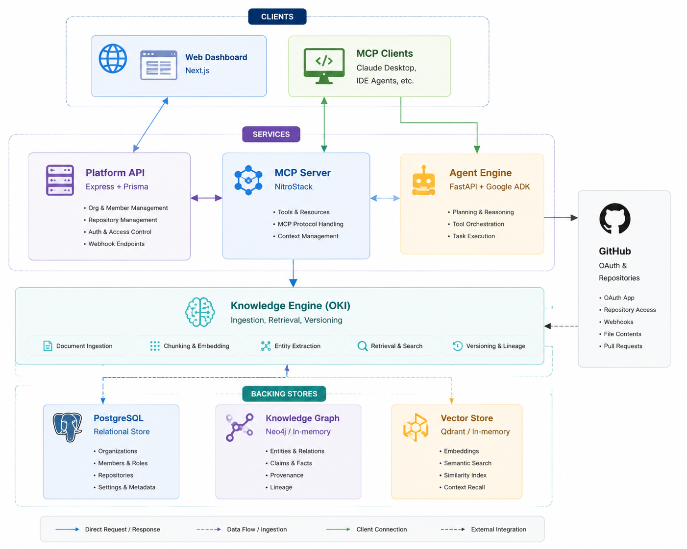
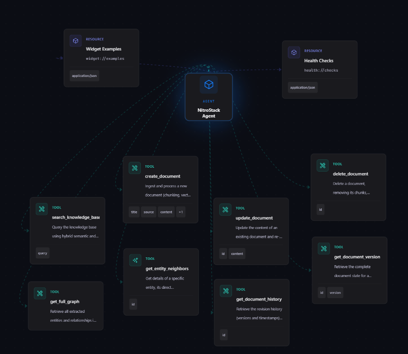

# CodeAtlas



An organizational knowledge platform that turns scattered documents, repositories, and
engineering activity into a queryable memory, and exposes that memory to AI clients over the
Model Context Protocol (MCP).

Built for the NitroStack x Amrita University Hackathon.

  
---

## Table of contents

- [CodeAtlas](#codeatlas)
  - [Table of contents](#table-of-contents)
  - [Problem](#problem)
  - [Solution](#solution)
  - [Repository layout](#repository-layout)
  - [Architecture](#architecture)
  - [Components](#components)
    - [Platform API (`backend/`)](#platform-api-backend)
    - [Knowledge Engine (OKI) (`backend/knowledge_engine/`)](#knowledge-engine-oki-backendknowledge_engine)
    - [MCP server (`backend/mcp/`)](#mcp-server-backendmcp)
    - [Agent engine (`backend/agent_engine/`)](#agent-engine-backendagent_engine)
    - [Web client (`frontend/`)](#web-client-frontend)
  - [Getting started](#getting-started)
    - [Prerequisites](#prerequisites)
    - [Platform API](#platform-api)
    - [Knowledge Engine](#knowledge-engine)
    - [MCP server](#mcp-server)
    - [Agent engine](#agent-engine)
    - [Web client](#web-client)
  - [Configuration](#configuration)
    - [Platform API (`backend/.env`)](#platform-api-backendenv)
    - [Knowledge Engine (`backend/knowledge_engine/.env`)](#knowledge-engine-backendknowledge_engineenv)
    - [MCP server (`backend/mcp/.env`)](#mcp-server-backendmcpenv)
    - [Web client (`frontend/.env.local`)](#web-client-frontendenvlocal)
    - [Port allocation](#port-allocation)
  - [Development scripts](#development-scripts)
  - [Testing](#testing)
  - [Current status](#current-status)
  - [License](#license)

---

## Problem

Two failures recur in every growing engineering team, for the same underlying reason:

1. **Onboarding is slow and interruption-heavy.** New hires get access to Confluence, Notion,
   Slack, and a dozen repositories on day one, with no way to tell which document is current,
   which is stale, or who to ask. They ask around, and senior engineers lose hours to short
   questions.
2. **Handoffs lose context.** When someone changes teams or leaves, the reasoning behind their
   work — the tradeoffs debated in a thread, the intent behind a pull request — does not travel
   with the code. Whoever picks it up reconstructs it from scratch.

Both reduce to the same thing: the knowledge exists, but it is scattered across systems with
nothing connecting it into something that can be queried.

## Solution

Context Engine ingests organizational documents and maintains three synchronized
representations of that knowledge — a **knowledge graph**, a **semantic vector index**, and an
**immutable version history**. Questions are answered with hybrid GraphRAG retrieval, grounded
strictly in indexed content.

That capability is surfaced through three interfaces:

- A **REST API** and web dashboard for organizations, membership, and repository connections.
- An **MCP server** so any MCP-compatible client (Claude Desktop, an IDE agent, an internal
  assistant) can query and mutate the knowledge base as typed tools.
- An **agent service** that reviews code changes supplied as unified diffs.

## Repository layout

```
.
├── backend
│   ├── src/                  Platform API — Express, Prisma, PostgreSQL
│   ├── prisma/               Database schema and migrations
│   ├── knowledge_engine/     OKI — ingestion, graph, vector, retrieval, versioning
│   ├── mcp/                  NitroStack MCP server exposing the knowledge engine
│   └── agent_engine/         FastAPI service wrapping a Google ADK review agent
├── frontend/                 Next.js dashboard (App Router, Tailwind, shadcn/ui)
└── testcode/                 Standalone prototype used to trial GitHub webhook handling
```

## Architecture



Documents enter through the Knowledge Engine, which parses, chunks, extracts entities and
relationships, embeds, and versions them. The MCP server is a thin typed facade over that
engine. The Platform API owns identity, organizations, and GitHub connections. The agent engine
runs independently and performs LLM code review.

## Components

### Platform API (`backend/`)

Express and TypeScript service handling authentication, organizations, membership, and GitHub
repository connections. Persistence is PostgreSQL via Prisma.

**Stack:** Express 4, Prisma 6, PostgreSQL, JWT access and refresh tokens, Zod validation,
Helmet, CORS, rate limiting, Pino logging, Octokit.

**Endpoints**

| Method | Path | Auth | Description |
|---|---|---|---|
| `GET` | `/health` | Public | Liveness probe |
| `POST` | `/api/auth/register` | Public | Create a user, optionally with an organization |
| `POST` | `/api/auth/login` | Public | Issue access and refresh tokens |
| `POST` | `/api/auth/refresh` | Public | Exchange a refresh token |
| `GET` | `/api/auth/me` | Bearer | Current user and memberships |
| `POST` | `/api/organizations` | Bearer | Create an organization |
| `GET` | `/api/organizations` | Bearer | List the caller's organizations |
| `GET` | `/api/organizations/:orgId` | Member | Organization detail |
| `PATCH` | `/api/organizations/:orgId` | Owner, Admin | Update an organization |
| `DELETE` | `/api/organizations/:orgId` | Owner | Delete an organization |
| `GET` | `/api/organizations/:orgId/members` | Member | List members |
| `POST` | `/api/organizations/:orgId/members/invite` | Owner, Admin | Issue an invitation token |
| `POST` | `/api/organizations/:orgId/members/add` | Owner, Admin | Add an existing user directly |
| `PATCH` | `/api/organizations/:orgId/members/:memberId` | Owner, Admin | Change a member role |
| `DELETE` | `/api/organizations/:orgId/members/:memberId` | Owner, Admin | Remove a member |
| `POST` | `/api/invitations/accept` | Bearer | Accept an invitation |
| `GET` | `/api/github/oauth/url` | Public | Build the GitHub OAuth authorize URL |
| `POST` | `/api/github/oauth/callback` | Public | Exchange the OAuth code, upsert the user, issue tokens |
| `GET` | `/api/github/user-repos` | Bearer | List repositories visible to the linked GitHub account |
| `GET` | `/api/organizations/:orgId/repos` | Member | List connected repositories |
| `POST` | `/api/organizations/:orgId/repos` | Owner, Admin | Connect a repository |
| `DELETE` | `/api/organizations/:orgId/repos/:repoId` | Owner, Admin | Disconnect a repository |

Every authenticated request resolves user, organization, and role from the JWT together with a
live membership check. Responses follow `{ success, data }` on success and
`{ success: false, error: { message } }` on failure.

**Data model** (`backend/prisma/schema.prisma`)

| Model | Purpose |
|---|---|
| `User` | Identity, optional password hash, optional linked GitHub account |
| `Organization` | Tenant, unique slug |
| `OrganizationMember` | Join table carrying the `OWNER`, `ADMIN`, or `MEMBER` role |
| `Invitation` | Tokenized invite with status and expiry |
| `ConnectedRepository` | GitHub repository linked to an organization |

**Layering:** routes to controllers to services to Prisma. Cross-cutting concerns live in
`middleware/` (authentication, organization context, role checks, validation, error handling).

### Knowledge Engine (OKI) (`backend/knowledge_engine/`)

The Organizational Knowledge Intelligence module. It ingests documents and maintains a
knowledge graph, a vector index, and a version history in sync, then answers natural language
questions using hybrid graph and vector retrieval.

**Pipeline:** parse, normalize, semantic chunk, extract entities and relationships, resolve
entities, update the graph, embed, update the vector store, record a version. Ingestion is
synchronous — `POST /documents` returns after the full pipeline completes.

**Supported formats:** Markdown, PDF, DOCX, plain text, JSON, YAML. Binary formats (`pdf`,
`docx`) are submitted as base64-encoded strings; text formats are submitted verbatim.

**Endpoints**

| Method | Path | Description |
|---|---|---|
| `GET` | `/health` | Status and the active provider for graph, vector, embedding, and LLM |
| `POST` | `/documents` | Ingest a document through the full pipeline |
| `PUT` | `/documents/:id` | Replace content and reprocess |
| `DELETE` | `/documents/:id` | Remove a document with its chunks, vectors, and graph edges |
| `GET` | `/search?q=` | Hybrid GraphRAG answer with sources and confidence |
| `GET` | `/graph` | All entities and relationships |
| `GET` | `/graph/entity/:id` | An entity with its relationships and one-step neighbors |
| `GET` | `/documents/:id/history` | Version list for a document |
| `GET` | `/documents/:id/version/:version` | A specific historical version |

**Pluggable providers.** Graph, vector, embedding, and LLM backends are selected independently
by environment variable and fall back automatically when a primary is unreachable at startup.
Graph: Neo4j or in-memory. Vector: Qdrant or in-memory. Embeddings and LLM: OpenAI, Groq, or
Gemini, with a local fallback. Call `GET /health` to confirm which provider is active.

The complete request and response contract, error semantics, and data model reference are in
[backend/knowledge_engine/README.md](backend/knowledge_engine/README.md).

### MCP server (`backend/mcp/`)

A [NitroStack](https://nitrostack.ai) MCP server that exposes the Knowledge Engine as typed
tools. Each tool is a `@Tool`-decorated method with a Zod input schema, so schema generation,
validation, and MCP registration come from a single declaration.

| Tool | Description |
|---|---|
| `search_knowledge_base` | Query the knowledge base with hybrid semantic and graph retrieval |
| `create_document` | Ingest a document — chunking, vector indexing, and graph extraction |
| `update_document` | Replace document content and reprocess chunks and indexes |
| `delete_document` | Delete a document with its chunks, vectors, and graph relationships |
| `get_full_graph` | Retrieve all extracted entities and relationships |
| `get_entity_neighbors` | An entity, its direct relationships, and its one-step neighbors |
| `get_document_history` | Revision history for a document |
| `get_document_version` | Full document state at a given version number |

The server transport defaults to stdio in development and dual (stdio and HTTP) in production,
controlled by `MCP_TRANSPORT_TYPE`. `src/widgets/` contains a Next.js widget bundle built
against the NitroStack Widget SDK.

### Agent engine (`backend/agent_engine/`)

A FastAPI service wrapping a Google ADK agent configured as a code reviewer. It accepts a
message, runs the agent to completion, and returns the accumulated response.

| Method | Path | Body | Description |
|---|---|---|---|
| `POST` | `/chat` | `{ "message": string, "app_name"?: string }` | Run the agent and return `{ "response": string }` |

The agent (`review_agent/agent.py`) runs `gemini-2.5-flash` and is instructed to review unified
diffs for bugs, performance issues, security vulnerabilities, style violations, and design
concerns, returning Markdown. Sessions are held in memory and one runner is cached per
`app_name`.

### Web client (`frontend/`)

Next.js App Router dashboard.

**Stack:** Next.js 16, React 19, TypeScript, Tailwind CSS 4, shadcn/ui on Base UI, TanStack
Query, React Hook Form with Zod, Framer Motion, next-themes.

| Route group | Pages |
|---|---|
| `(auth)` | `login`, `register`, `onboarding`, `github/callback` |
| `(dashboard)` | overview, `docs`, `github`, `knowledge`, `members`, `settings` |

The API client (`src/lib/api.ts`) attaches the bearer token from `localStorage` and unwraps the
`{ success, data }` envelope. Authentication state is held in `src/lib/auth-context.tsx`.

## Getting started

### Prerequisites

- Node.js (latest LTS) and npm
- Python 3.13 or later, for the agent engine
- PostgreSQL, for the Platform API
- Optional: Neo4j and Qdrant. The Knowledge Engine runs fully in-memory without them.
- Optional: the NitroStack CLI, installed as a dev dependency of `backend/mcp`

### Platform API

```bash
cd backend
cp .env.example .env
npm install
npx prisma generate
npx prisma migrate dev
npm run dev
```

Listens on `http://localhost:3001` by default; routes are mounted under `/api`.

### Knowledge Engine

```bash
cd backend/knowledge_engine
cp .env.example .env
npm install
npm run dev
```

Listens on `http://localhost:3000` by default. With the default `in-memory` graph and vector
providers, no external database is required, but an embedding and LLM API key is needed for
extraction and retrieval.

### MCP server



```bash
cd backend/mcp
cp .env.example .env
npm install
npm run dev
```

Set `KNOWLEDGE_ENGINE_API_URL` to the Knowledge Engine base URL before starting.

### Agent engine

The agent engine has no dependency manifest checked in. Install its runtime dependencies
directly:

```bash
pip install fastapi uvicorn python-dotenv google-adk google-genai
```

Place a `.env` file at `backend/agent_engine/review_agent/.env` with the Google credentials the
ADK requires, then run from the repository root so the `backend.agent_engine` package resolves:

```bash
uvicorn backend.agent_engine.main:app --reload --port 8000
```

### Web client

```bash
cd frontend
npm install
npm run dev
```

Listens on `http://localhost:3000`. Set `NEXT_PUBLIC_API_URL` to the Platform API base,
including the `/api` prefix.

## Configuration

### Platform API (`backend/.env`)

| Variable | Default | Description |
|---|---|---|
| `NODE_ENV` | `development` | Runtime mode |
| `PORT` | `3001` | HTTP port |
| `DATABASE_URL` | local PostgreSQL | PostgreSQL connection string |
| `JWT_ACCESS_SECRET` | development value | Access token secret, minimum 16 characters |
| `JWT_REFRESH_SECRET` | development value | Refresh token secret, minimum 16 characters |
| `JWT_ACCESS_TTL` | `15m` | Access token lifetime |
| `JWT_REFRESH_TTL` | `7d` | Refresh token lifetime |
| `GITHUB_CLIENT_ID` | empty | GitHub OAuth app client ID |
| `GITHUB_CLIENT_SECRET` | empty | GitHub OAuth app client secret |
| `GITHUB_REDIRECT_URI` | `http://localhost:3000/api/auth/github/callback` | OAuth redirect target |
| `CORS_ORIGIN` | `http://localhost:3000` | Allowed browser origin |
| `RATE_LIMIT_WINDOW_MS` | `900000` | Rate limit window |
| `RATE_LIMIT_MAX` | `200` | Requests per window per IP, applied to `/api` |

The committed defaults for the JWT secrets are development placeholders. Replace them before
any deployment.

### Knowledge Engine (`backend/knowledge_engine/.env`)

| Variable | Default | Description |
|---|---|---|
| `PORT` | `3000` | HTTP port |
| `GRAPH_PROVIDER` | `in-memory` | `in-memory` or `neo4j` |
| `VECTOR_PROVIDER` | `in-memory` | `in-memory` or `qdrant` |
| `EMBEDDING_PROVIDER` | `openai` | `openai`, `groq`, or `gemini` |
| `LLM_PROVIDER` | `groq` | `groq` or `openai` |
| `NEO4J_URI`, `NEO4J_USER`, `NEO4J_PASSWORD` | local defaults | Neo4j connection |
| `QDRANT_URL`, `QDRANT_COLLECTION` | local defaults | Qdrant connection |
| `GROQ_API_KEY`, `GROQ_LLM_MODEL`, `GROQ_EMBEDDING_MODEL` | empty, model defaults | Groq configuration |
| `OPENAI_API_KEY`, `OPENAI_LLM_MODEL`, `OPENAI_EMBEDDING_MODEL` | empty, model defaults | OpenAI configuration |
| `GEMINI_API_KEY`, `GEMINI_EMBEDDING_MODEL` | empty, model default | Gemini configuration |
| `SEARCH_MIN_SIMILARITY` | `0.55` | Minimum similarity for a chunk to be retrieved |
| `GRAPH_EXPANSION_DEPTH` | `1` | Hops traversed when expanding graph context |
| `VECTOR_TOP_K` | `10` | Vector candidates retrieved per query |

### MCP server (`backend/mcp/.env`)

| Variable | Default | Description |
|---|---|---|
| `KNOWLEDGE_ENGINE_API_URL` | `http://localhost:3001` | Knowledge Engine base URL |
| `MCP_TRANSPORT_TYPE` | `stdio` in development, `dual` in production | Transport mode: `stdio`, `http`, or `dual` |
| `PORT`, `HOST`, `ENABLE_CORS` | `3000`, `localhost`, `true` | HTTP transport settings |
| `NITRO_LOG_LEVEL` | `info` | Log verbosity |
| `NITROSTACK_APP_MODE` | `universal` | Application mode |

### Web client (`frontend/.env.local`)

| Variable | Default | Description |
|---|---|---|
| `NEXT_PUBLIC_API_URL` | `http://localhost:5000/api` | Platform API base URL including `/api` |

### Port allocation

Three services default to overlapping ports. Assign them explicitly before running the stack
together — for example, Knowledge Engine on `3000`, Platform API on `3001`, web client on
`3002`, agent engine on `8000` — and set `KNOWLEDGE_ENGINE_API_URL`, `NEXT_PUBLIC_API_URL`, and
`CORS_ORIGIN` to match.

## Development scripts

| Location | Command | Description |
|---|---|---|
| `backend` | `npm run dev` | Watch mode via tsx |
| `backend` | `npm run build` | Compile TypeScript to `dist/` |
| `backend` | `npm start` | Run the compiled server |
| `backend` | `npm run prisma:generate` | Regenerate the Prisma client |
| `backend` | `npm run prisma:migrate` | Create and apply a development migration |
| `backend` | `npm run prisma:studio` | Open Prisma Studio |
| `backend/knowledge_engine` | `npm run dev` | Run via ts-node |
| `backend/knowledge_engine` | `npm run build` | Compile with `tsconfig.build.json` |
| `backend/knowledge_engine` | `npm test` | Run the Vitest suite |
| `backend/mcp` | `npm run dev` | NitroStack dev server |
| `backend/mcp` | `npm run build` | NitroStack build |
| `backend/mcp` | `npm start` | Build and start |
| `frontend` | `npm run dev` | Next.js dev server |
| `frontend` | `npm run build` | Production build |
| `frontend` | `npm run lint` | ESLint |

## Testing

The Knowledge Engine carries the automated test suite, run with Vitest:

```bash
cd backend/knowledge_engine && npm test
```

Coverage spans semantic chunking, entity resolution, retrieval confidence scoring, content
hashing, the ingestion pipeline as an integration test, and the HTTP API end to end.

The other services have no automated tests yet.

## Current status

This is hackathon-stage work. Known gaps, stated plainly:

- Several dashboard pages (overview, `docs`, `knowledge`, `members`) render fixture data from
  `frontend/src/mock/` rather than live API responses. The authentication and `github` pages are
  wired to the Platform API.
- The Platform API and the Knowledge Engine are not yet connected; document ingestion currently
  reaches the Knowledge Engine only through the MCP server.
- The agent engine ships without a dependency manifest and is not integrated with the Platform
  API or the MCP server.
- `testcode/` is a standalone prototype covering GitHub webhook signature verification and
  Firebase login. It is not part of the running stack.

## Keywords

`Enterprise AI & Workplace Automation` · `Code-Atlas` · `MCP` · `Model Context Protocol` · `MCP server` · `MCP app` · `AI tools` · `AI agents` · `LLM tools` · `Claude MCP` · `Nitrostack` · `deploy MCP server` · `build MCP app`

## License

MIT © 2026

---

Built with ❤️ using the Model Context Protocol on [Nitrostack](https://nitrostack.ai). Share your MCP app on [r/mcptothemoon](https://www.reddit.com/r/mcptothemoon/).
