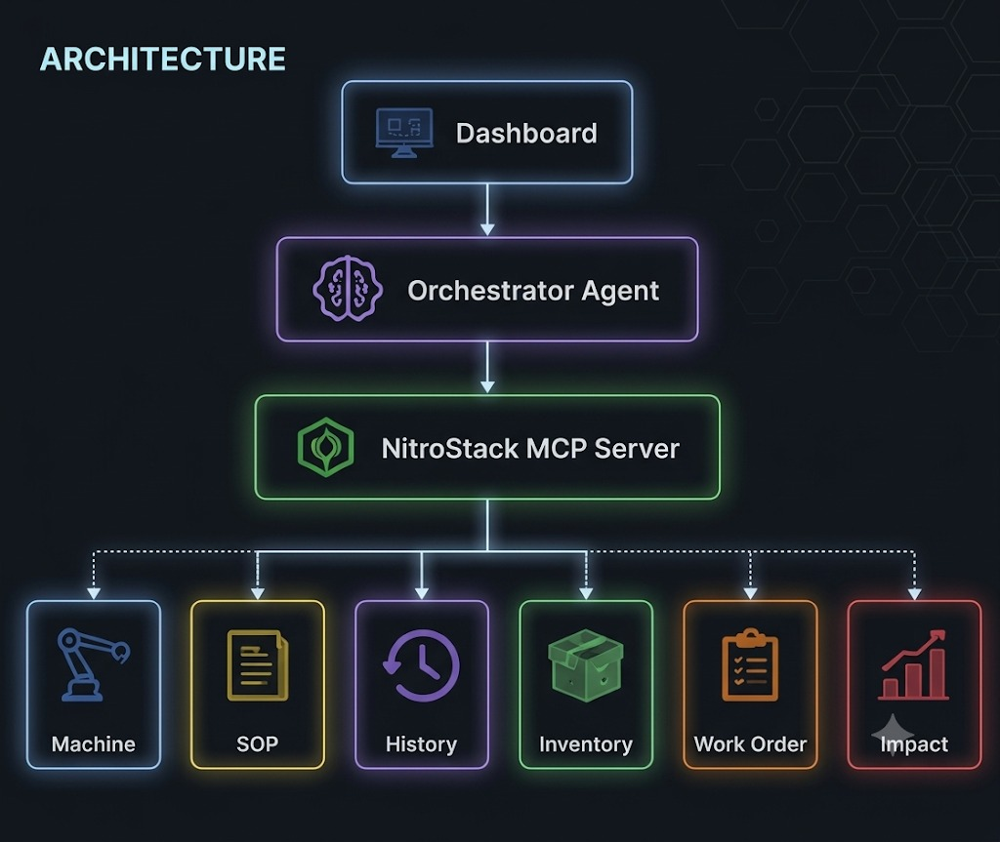
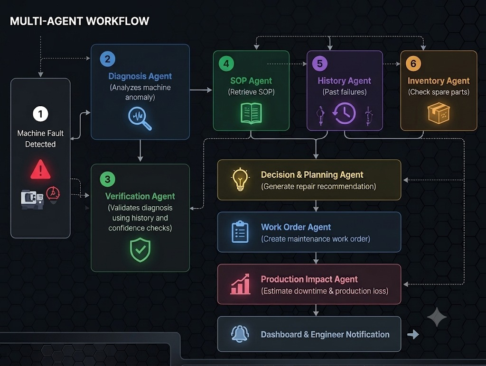

<div align="center">

# ⚙️ ForgeMind

### Autonomous Manufacturing Intelligence using MCP

*The AI Operating Layer for Modern Factories*


</div>

---

## 🚀 Overview

ForgeMind is an **MCP-native AI platform** that automates manufacturing diagnostics using **NitroStack**.

Instead of manually searching machine logs, SOPs, maintenance history, and inventory systems, ForgeMind uses multiple AI agents to identify root causes, retrieve repair procedures, check spare parts, estimate production impact, and generate maintenance work orders—all from one interface.

---

## ✨ Features

- 🤖 AI-powered root cause analysis
- 📖 RAG-based SOP retrieval
- 📊 Machine history analysis
- 📦 Inventory verification
- 📝 Automatic work order generation
- 📉 Production impact estimation
- ⚡ Live monitoring dashboard

---
## 🏗️ Architecture

<div align="center">


</div>

<p align="center">
<b>Figure 1.</b> High-level architecture of ForgeMind.
</p>

## 🤖 Multi-Agent Workflow

<div align="center">



</div>

<p align="center">
<b>Figure 2.</b> Multi-agent workflow for autonomous manufacturing diagnostics.
</p>

## 🧠 AI Agents

| Agent | Responsibility |
|------|----------------|
| 🔍 Diagnosis | Detect root cause |
| ✅ Verification | Validate diagnosis |
| 📖 SOP | Retrieve repair procedures |
| 📊 History | Analyze previous failures |
| 📦 Inventory | Check spare-part availability |
| 🧠 Decision | Generate repair recommendation |
| 📝 Work Order | Create maintenance ticket |
| 📉 Impact | Estimate downtime & production loss |

---

## 🔧 MCP Tools

| Tool | Purpose |
|------|----------|
| `find_machine()` | Machine details |
| `retrieve_sop()` | Fetch SOP |
| `get_machine_history()` | Maintenance history |
| `check_inventory()` | Spare-part availability |
| `create_work_order()` | Generate ticket |
| `estimate_production_impact()` | Downtime estimation |

---

## 💻 Tech Stack

| Frontend | Backend | AI | Database |
|----------|---------|----|----------|
| React + TypeScript | NitroStack MCP SDK | LLM + RAG | MongoDB + Qdrant |

---

## 🔄 Workflow

```
Fault Detection
      ↓
Diagnosis
      ↓
Verification
      ↓
Retrieve SOP + History + Inventory
      ↓
Decision
      ↓
Work Order
      ↓
Impact Analysis
```

---

## 🚀 Getting Started

### Prerequisites

Make sure you have installed:

- Node.js (v18+)
- npm or pnpm
- MongoDB
- Qdrant
- Git

---

### 1️⃣ Clone the Repository

```bash
git clone https://github.com/<your-username>/ForgeMind.git
cd ForgeMind
```

### 2️⃣ Install Dependencies

```bash
npm install
```

### 3️⃣ Configure Environment Variables

Create a `.env` file in the project root.

```env
MONGODB_URI=your_mongodb_uri
QDRANT_URL=your_qdrant_url
OPENAI_API_KEY=your_api_key
REDIS_URL=your_redis_url
```

### 4️⃣ Start the MCP Server

```bash
npm run dev
```

### 5️⃣ Launch the Frontend

Open a new terminal and run:

```bash
npm run client
```

### 6️⃣ Open the Application

Visit:

```
http://localhost:3000
```

---
