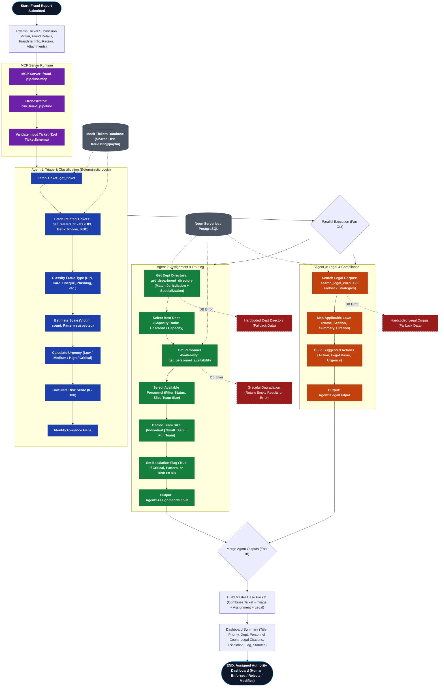

# Golden Hour - Imposture Detection with MCP

> Golden Hour is an AI-powered, MCP-enabled cyber fraud response platform that transforms fraud complaints into investigation-ready case packets through a deterministic, one-in-a-million 3-agent intelligence swarm.

  

**Golden Hour - Imposture Detection with MCP** is an [MCP (Model Context Protocol)](https://nitrostack.ai) server that extends AI assistants — like Claude, Cursor, and any MCP-compatible client — with new, real-world capabilities. It is built and deployed on [Nitrostack](https://nitrostack.ai), the fastest way to build, deploy, and share MCP apps.

## Table of Contents

- [Overview](#overview)
- [Why This Project is Elite](#why-this-project-is-elite)
- [System Architecture Flowchart](#system-architecture-flowchart)
- [What is MCP?](#what-is-mcp)
- [Features](#features)
- [Getting Started](#getting-started)
- [Connect to an MCP Client](#connect-to-an-mcp-client)
- [Deploy Your Own MCP App](#deploy-your-own-mcp-app)
- [Explore More MCP Apps](#explore-more-mcp-apps)
- [FAQ](#faq)
- [Keywords](#keywords)
- [License](#license)

## Overview

Golden Hour is an AI-powered, MCP-enabled cyber fraud response platform that transforms fraud complaints into investigation-ready case packets through a deterministic three-agent workflow. It automatically classifies fraud, assigns cases to the appropriate authorities, and provides jurisdiction-specific legal guidance with explainable recommendations. By combining specialized AI agents, Model Context Protocol (MCP), and human-in-the-loop decision making, Golden Hour enables faster, transparent, and more reliable cyber fraud investigations while ensuring all final enforcement decisions remain with authorized personnel.

## 🌟 Why This Project is Elite

1. **Deterministic Orchestration:** We don't leave control flow to chance. Our backend dictates the absolute path of execution, while isolated AI agents handle the deeply complex cognitive work (classification, legal mapping, personnel assignment).
2. **Neon Serverless PostgreSQL:** Lightning-fast, infinitely scalable, serverless data access. By leveraging **Neon**, this pipeline handles massive data concurrency without breaking a sweat, ensuring instant recovery and global scale.
3. **Self-Updating API Keys:** Security isn't an afterthought. Our system architecture embraces **self-updating API keys**, drastically reducing the attack surface and ensuring high-availability operations never fail due to stale credentials.
4. **Agent Isolation:** Zero cross-contamination. Agents operate in strict information silos, receiving only the precise, validated JSON output they need. This maximizes context window efficiency and eliminates hallucination bleed.

## 🧠 System Architecture Flowchart



## What is MCP?

The **Model Context Protocol (MCP)** is an open standard that lets AI assistants securely connect to external tools, data sources, and services. Instead of being limited to what it was trained on, an AI model can call **MCP servers** to fetch live data, run actions, and integrate with real systems.

This project is one such MCP server. Learn more about building and shipping MCP apps at [nitrostack.ai](https://nitrostack.ai).

## Features

- 🔌 **MCP-native** — works with any MCP-compatible client (Claude, Cursor, and more)
- 🛠️ **Tools, resources & prompts** — exposes structured capabilities to AI agents
- ⚡ **Deployed on Nitrostack** — reliable, hosted, and instantly shareable
- 🔐 **Secure by design** — secrets stay in environment variables, never in code
- 🧩 **Composable** — combine with other MCP apps to build powerful AI workflows

## Getting Started

### Prerequisites

- Node.js 18+ (or your project runtime)
- Neon PostgreSQL connection string
- An MCP-compatible client (Claude Desktop, Cursor, etc.)

### Installation

```bash
git clone https://github.com/your-username/golden-hour-imposture-detection-with-mcp.git
cd golden-hour-imposture-detection-with-mcp
npm install
```

### Configuration

Copy the example environment file and add your highly secure environment variables, including your **Neon DATABASE_URL** and **Self-Updating API configurations**:

```bash
cp .env.example .env
```

### Run

```bash
npm run dev
```

## Connect to an MCP Client

Add this server to your MCP client configuration. A typical entry looks like:

```json
{
  "mcpServers": {
    "golden-hour-imposture-detection-with-mcp": {
      "command": "npm",
      "args": ["run", "dev"]
    }
  }
}
```

Restart your client and the tools from this MCP server will be available to your AI assistant.

## Deploy Your Own MCP App

Want to build and ship an MCP server like this one? **[Nitrostack](https://nitrostack.ai)** lets you create, deploy, and host MCP apps in minutes — no infrastructure to manage.

👉 **Start building:** [https://nitrostack.ai](https://nitrostack.ai)

## Explore More MCP Apps

- 🌙 Discover and share MCP projects with the community on [r/mcptothemoon](https://www.reddit.com/r/mcptothemoon/)
- 🧰 Browse a growing catalog of MCP apps on [Nitrostack](https://nitrostack.ai/apps)

## FAQ

### What is an MCP server?

An MCP server implements the Model Context Protocol to expose tools, resources, and prompts that AI assistants can call. It lets an AI model take real actions and access live data.

### What does Golden Hour - Imposture Detection with MCP do?

Golden Hour is an AI-powered, MCP-enabled cyber fraud response platform that transforms fraud complaints into investigation-ready case packets through a deterministic, one-in-a-million 3-agent intelligence swarm.

### Which AI clients does this work with?

Any MCP-compatible client, including Claude Desktop and Cursor. New clients are adding MCP support regularly.

### How do I deploy my own MCP app?

Use [Nitrostack](https://nitrostack.ai) to build, deploy, and host MCP apps without managing infrastructure.

## Keywords

`BFSI & FinTech` · `Golden Hour - Imposture Detection with MCP` · `MCP` · `Model Context Protocol` · `MCP server` · `MCP app` · `AI tools` · `AI agents` · `LLM tools` · `Claude MCP` · `Nitrostack` · `deploy MCP server` · `build MCP app`

## License

Private, Exclusive & Highly Confidential.
*(Operating under MIT for standard open-source framework integrations)*

---

Built with ❤️ using the Model Context Protocol on [Nitrostack](https://nitrostack.ai). Share your MCP app on [r/mcptothemoon](https://www.reddit.com/r/mcptothemoon/).