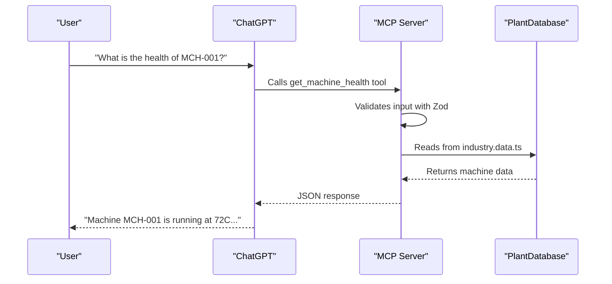

# 🏭 Industry 4.0 Machine Health MCP Server


> **Bridging the gap between Industrial IoT Data and Conversational AI**

---

## 📖 Table of Contents

- [🌟 Overview](#-overview)
- [⚠️ Problem Statement](#-problem-statement)
- [💡 Solution & AI Integration](#-solution--ai-integration)
- [🔄 Architecture & Flow](#-architecture--flow)
- [📂 Project Structure](#-project-structure)
- [🛠️ Available MCP Tools](#-available-mcp-tools)
- [🚀 Getting Started (Local Setup)](#-getting-started-local-setup)
- [🧪 Testing via NitroStudio](#-testing-via-nitrostudio)
- [☁️ Deployment & ChatGPT Integration](#-deployment--chatgpt-integration)
- [🔮 Future Scope](#-future-scope)
- [🤝 Community & Links](#-community--links)

---

## 🌟 Overview

The **Industry 4.0 Machine Health MCP Server** is a Model Context Protocol (MCP) based application built for the **NitroStack Hackathon**. 

It empowers factory operators and managers to interact with complex industrial telemetry data using simple natural language via **ChatGPT**.

> Instead of navigating through complex dashboards, a user can simply ask:
>
> **"What is the current temperature of Machine 1?"**
>
> And ChatGPT will fetch the real-time data through this MCP server.

---

## ⚠️ Problem Statement

In Industry 4.0 environments, factory machines generate telemetry data such as temperature, vibration, and RPM. In production, this would typically live in a time-series database like **InfluxDB**.

Today, this demo runs against an in-memory `PlantDatabase` in `industry.data.ts`, which means:
- Data access is already standardized through MCP Tools
- Non-technical users can query it through ChatGPT
- The same tool contract can later target a real time-series database without changing the AI workflow

---

## 💡 Solution & AI Integration

We created an **MCP Server** using the NitroStack SDK. This server exposes structured tools that ChatGPT can call directly, while all machine data is served from the in-memory `PlantDatabase` defined in `src/modules/industry/industry.data.ts`.

This keeps the AI layer decoupled from storage:
- MCP Tools define the contract
- `PlantDatabase` acts as the current data source
- A future InfluxDB connector can replace it without changing the AI workflow

---

## 🔄 Architecture & Flow

```mermaid
flowchart LR
    A["Factory Machines / IoT Sensors"] -->|Telemetry Data| B["PlantDatabase industry.data.ts"]
    B -->|In-Memory Mock Data| C["NitroStack MCP Server TypeScript"]
    C -->|"@Tool Functions"| D["NitroCloud Hosted Deployment"]
    D -->|Exposes Server URL| E["ChatGPT MCP Client"]
    E -->|Natural Language Query| F["End User"]

    style A fill:#ff9f43,color:#fff
    style B fill:#54a0ff,color:#fff
    style C fill:#5f27cd,color:#fff
    style D fill:#00d2d3,color:#fff
    style E fill:#10ac84,color:#fff
    style F fill:#feca57,color:#333
```



### Data Flow



---

## 📂 Project Structure

```
industry4-mcp/
├── src/
│   ├── index.ts                       # Application bootstrap
│   ├── app.module.ts                  # Root application module
│   └── modules/
│       └── industry/                  # Industry 4.0 module
│           ├── industry.module.ts
│           ├── industry.tools.ts      # MCP Tools (get_machine_health)
│           ├── industry.prompts.ts    # Plant orchestrator prompt
│           └── industry.data.ts       # In-memory PlantDatabase
├── widgets/                           # NitroStudio UI Widgets (Next.js)
├── package.json                       # Dependencies (@nitrostack/core, zod)
└── .env                               # Environment variables
```

---

## 🛠️ Available MCP Tools

The server currently exposes the following tool to the AI:

### `get_machine_health`

| Property | Description |
|----------|-------------|
| **Purpose** | Fetches current health status, temperature, and vibration level of a specific machine |
| **Input** | `machine_id: string` (e.g., `"MCH-001"`) |
| **Output** | JSON object with telemetry data |

#### Input Schema (Zod)

```typescript
{
  machine_id: z.string() // e.g., "MCH-001"
}
```

#### Response Format

```json
{
  "machine_id": "MCH-001",
  "temperature": 72.5,
  "vibration_level": 0.45,
  "health_status": "healthy",
  "last_maintenance": "2026-07-15"
}
```

---

## 🚀 Getting Started (Local Setup)

### Prerequisites

- 🟢 **Node.js** (v18+ required, v20.x recommended by NitroStack)
- 📦 **npm** or **npx**

### Installation

```bash
# 1. Clone the repository
git clone https://github.com/AryanPROOO/industry4-mcp.git
cd industry4-mcp

# 2. Install dependencies
npm install

# 3. Start the development server
npm run dev
```

The server will start running locally on the default STDIO/HTTP port.

---

## 🧪 Testing via NitroStudio

**NitroStudio** is the official desktop IDE to test MCP servers before deploying them.

1. 📥 **Download & Install** — Get NitroStudio from [nitrostack.ai/studio](https://nitrostack.ai/studio)
2. 🔑 **Sign In** — Use your NitroCloud account
3. ➕ **Add Server** — Click `Add Server` → Select `Nitro Project` tab
4. 📁 **Browse Project** — Select the `industry4-mcp` folder
5. 🖥️ **Open App Canvas** — Navigate to the Studio App Canvas
6. 🔧 **Test Tool** — Go to `Tools` → Select `get_machine_health`
7. ▶️ **Execute** — Input `MCH-001` and click **Execute Tool**

---

## ☁️ Deployment & ChatGPT Integration

Once the tool is working locally, it's time to make it live!

### Step 1: Deploy to NitroCloud

1. In **NitroStudio**, click the **Deploy** button in the header
2. Follow the modal steps:
   - 📦 Preparing bundle
   - ⬆️ Uploading
   - 🔨 Building
   - ✅ Live
3. Copy your **Service URL**

### Step 2: Connect to ChatGPT

1. Open **ChatGPT** (Plus/Pro account required)
2. Go to **Settings → Plugins (Apps)** and enable **Developer Mode**
3. Click the **+ (Add Plugin)** button
4. Select **Server URL** as the connection type
5. Paste your Service URL and add `/sse` at the end:
   ```
   https://xyz.nitrocloud.app/sse
   ```
6. Click **Create** and then **Connect**

### Step 3: Talk to your Factory! 🗣️

Try asking ChatGPT:

- 💬 *"What is the health of machine MCH-001?"*
- 💬 *"Is machine 4 running hot?"*
- 💬 *"Which machines need maintenance?"*

---

## 🔮 Future Scope

| Feature | Description |
|---------|-------------|
| 🗄️ **Live InfluxDB Integration** | Replace `PlantDatabase` with actual InfluxDB client queries for real time-series data |
| 🔮 **Predictive Maintenance** | Add tools that analyze historical data to predict machine failure |
| 🔔 **Alerting System** | Trigger alerts to maintenance teams if vibration exceeds threshold |

---

## 🤝 Community & Links

| Resource | Link |
|----------|------|
| 📚 **NitroStack Documentation** | [docs.nitrostack.ai](https://docs.nitrostack.ai) |
| ☁️ **NitroCloud** | [nitrocloud.ai](https://nitrocloud.ai) |
| 💬 **NitroStack Discord** | [Join Community](https://discord.gg/uVWey6UhuD) |
| 🐙 **NitroStack GitHub** | [github.com/nitrocloudofficial/nitrostack](https://github.com/nitrocloudofficial/nitrostack) |
| 📹 **YouTube** | [@nitrostackai](https://www.youtube.com/@nitrostackai) |
| 💼 **LinkedIn** | [nitrostack-ai](https://linkedin.com/company/nitrostack-ai) |

---

<div align="center">

**Built with ❤️ for the NitroStack Hackathon 2026**

*Empowering Industry 4.0 with Conversational AI*

</div>
