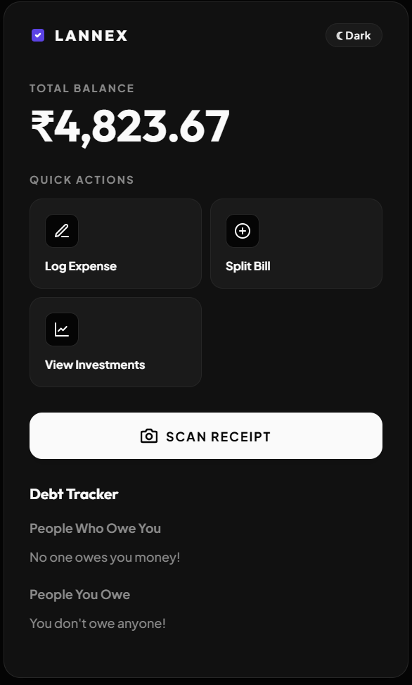
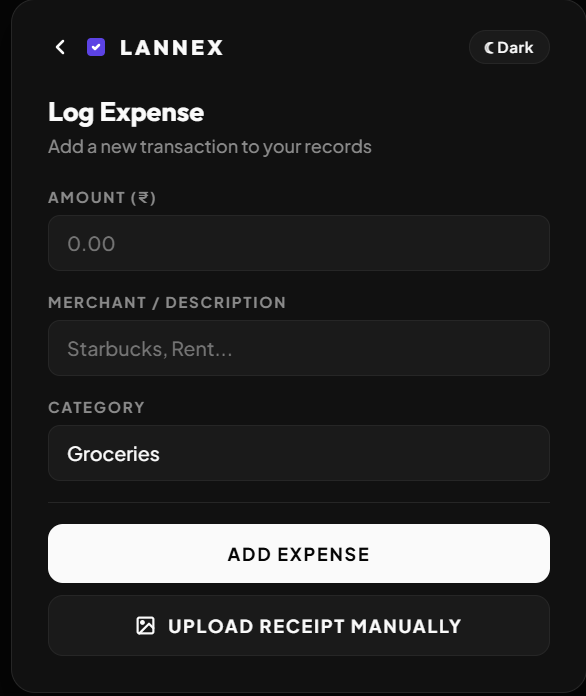
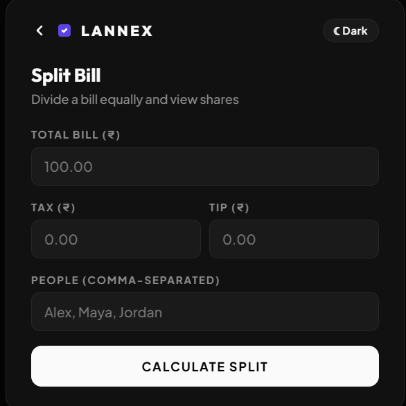
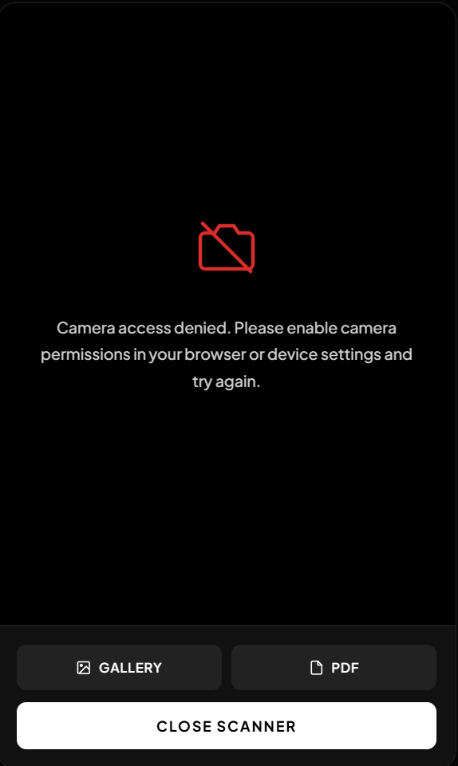
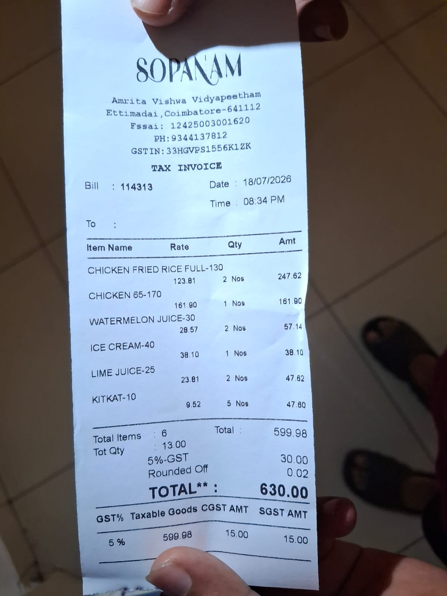
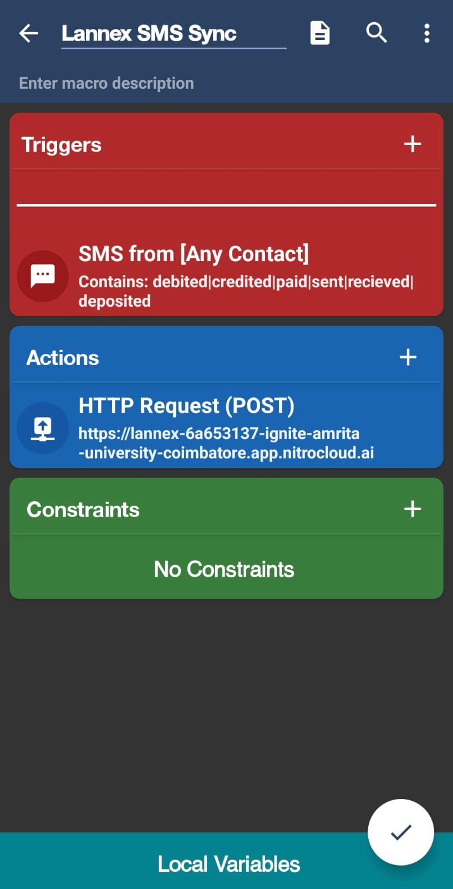

# Lannex

> Lannex is an AI money assistant that tracks your spending, splits bills from receipt photos, and chases friends who owe you through natural conversation.

    

**Lannex** is an [MCP (Model Context Protocol)](https://nitrostack.ai) server that extends AI assistants — like Claude, Cursor, and any MCP-compatible client — with new, real-world capabilities. It is built and deployed on [Nitrostack](https://nitrostack.ai), the fastest way to build, deploy, and share MCP apps.

## Table of Contents

- [Overview](#overview)
- [What is MCP?](#what-is-mcp)
- [Screenshots & Walkthrough](#screenshots--walkthrough)
- [Features](#features)
- [Architecture](#architecture)
- [Module Reference](#module-reference)
- [Complete Tool Reference](#complete-tool-reference)
- [Feature Deep Dives](#feature-deep-dives)
- [Data Model](#data-model)
- [Live Demo](#live-demo)
- [Getting Started](#getting-started)
- [Environment Variables](#environment-variables)
- [Connect to an MCP Client](#connect-to-an-mcp-client)
- [Known Limitations & Roadmap](#known-limitations--roadmap)
- [Deploy Your Own MCP App](#deploy-your-own-mcp-app)
- [Explore More MCP Apps](#explore-more-mcp-apps)
- [FAQ](#faq)
- [Tech Stack](#tech-stack)
- [Keywords](#keywords)
- [License](#license)

## Overview

Lannex is an AI money assistant that tracks your spending, splits bills from receipt photos, and chases friends who owe you through natural conversation.

It also spots idle cash from your daily transactions and nudges you to invest it, while giving you a live view of your balance, debts, and portfolio in one dashboard.

### The problem

Most people lose thousands of rupees a year for three boring, entirely solvable reasons:

| Leak | What actually happens | Why existing apps fail |
|---|---|---|
| **Forgotten debts** | You pay for a ₹630 group dinner. Three friends owe you ₹157 each. Nobody remembers by Thursday. | Splitwise requires *both* parties to install it and manually enter every item. |
| **Manual entry fatigue** | Expense apps demand you type every transaction. Nobody does this past week two. | Data entry is a chore with a delayed, invisible payoff. |
| **Idle cash & invisible drains** | ₹4,000 sits in a 3% savings account. Three streaming subscriptions auto-renew unnoticed. | Budgeting apps show you charts *after* the fact; they never intervene at the decision point. |

The common thread: **every existing tool requires the user to do the work.** Lannex inverts that — the assistant does the work and the user just talks.

### The solution

Three "hard" fintech concepts, reduced to three things a normal person actually understands:

| Institutional term | How Lannex presents it |
|---|---|
| Idle Cash Sweep & Yield Drag | **"Spare Cash Saver"** — *"You have ₹4,000 doing nothing. Here's what it becomes in a year."* |
| Cost-of-Capital Debt Aging | **"Smart Nudge"** — *"Rahul has owed you ₹500 for 3 weeks. Tap to send a UPI request."* |
| Recurring Subscription Drag | **"Zombie Detector"** — *"You have 2 overlapping entertainment subs draining ₹468/yr."* |

And three input methods that require **zero typing**:

1. **SMS auto-capture** — a phone macro forwards bank alerts; Lannex parses and logs them silently.
2. **Receipt photo + plain English** — *"Rahul had the Chicken 65, we shared the juices"* → itemised split + debts created.
3. **Natural chat** — *"How much did I spend on food this week?"*

## What is MCP?

The **Model Context Protocol (MCP)** is an open standard that lets AI assistants securely connect to external tools, data sources, and services. Instead of being limited to what it was trained on, an AI model can call **MCP servers** to fetch live data, run actions, and integrate with real systems.

This project is one such MCP server. Learn more about building and shipping MCP apps at [nitrostack.ai](https://nitrostack.ai).

Lannex exposes **~20 tools, 3 resources, 3 prompts, and 1 interactive widget** over MCP, so the same backend powers a chat agent *and* a React dashboard rendered inline in the conversation.

## Screenshots & Walkthrough

### 🖥️ The Money Summary Dashboard



This is the **primary surface** — a React widget rendered *inside the chat conversation*, not a separate website. It is returned by the `dashboard_get_money_summary` tool via NitroStack's `@Widget('money-summary')` binding, meaning the AI can summon the entire UI as the result of a sentence like *"show me my money."*

**Total Balance** is computed live: monthly budget minus real spending pulled from Postgres, not a hardcoded figure. Beneath it, **Outgoing vs Incoming** bars visualise cash flow direction for the month at a glance — the single most useful number most budgeting apps bury four screens deep.

**Quick Actions** are a data-driven grid. The backend returns an array of `{label, action}` objects and the widget maps each to an internal page, so adding a new action is a one-line backend change with no widget redeploy.

**Scan Receipt** opens the device camera directly in the chat pane. **Debt Tracker** sits permanently at the bottom in two sections — *People Who Owe You* and *People You Owe* — each row showing the amount, how long it has been outstanding, and one-tap **Mark as Paid** / **Notify Me** buttons.

The entire widget is theme-aware (light/dark toggle top-right) and every currency figure is formatted through `Intl.NumberFormat('en-IN')`, giving proper Indian lakh/crore grouping.

<br clear="right"/>

### 📝 Log Expense



The manual fallback for when SMS capture is unavailable — a foreign card, a cash payment, or a bank whose alert format isn't recognised.

Three fields only: **amount**, **merchant/description**, and a **category** dropdown constrained to the nine categories the backend validates against (`groceries, coffee, transport, entertainment, shopping, dining, utilities, healthcare, other`). Keeping the widget's dropdown in lockstep with `ExpensesService.VALID_CATEGORIES` means a submission can never be rejected for an invalid category.

Pressing **Add Expense** fires a real `callTool('expenses_log_transaction', …)` call — it does *not* fake a local state update. The transaction is written to Postgres via Prisma, and critically, `ExpensesService.addTransaction()` then emits an `expense.logged` event on NitroStack's internal event bus.

That event is what makes the app feel alive: `ActionsService` listens for it and, if the purchase looks discretionary (entertainment/dining/shopping over ₹500), silently generates an investment nudge in the background. The user logs an expense; the *insight* arrives unprompted.

The merchant field is passed through a **client-side redaction filter** before transmission, stripping anything resembling a card number, account number, phone number, or OTP.

**Upload Receipt Manually** is the non-camera path into the same OCR pipeline described below.

<br clear="right"/>

### 🧾 Split Bill



The quick-entry path for when you already know the total and just need it divided — no photo required.

Enter the **total bill**, **tax**, **tip**, and a comma-separated list of **people**. The names field is also redacted client-side before it leaves the device.

Behind this simple form sits genuinely non-trivial maths in `SplitterService.splitBill()`. It does **not** naively divide by headcount. It supports per-item assignment (`"Rahul"`), multi-person items (`"Rahul, Sarah"`), shared items (`"shared"` / `"all"`), and items one person covered for another (`coveredBy`).

Tax and tip are distributed **proportionally to each person's subtotal**, not split evenly — the person who ordered the ₹247 fried rice pays proportionally more GST than the person who had a ₹9 KitKat. This is the mathematically fair treatment and it is what most split apps get wrong.

Because per-person rounding to two decimals can leave the shares summing to a few paise off the true total, a **reconciliation pass** assigns the residual to the payer, guaranteeing `Σ(shares) === totalBill` exactly.

Every non-payer share automatically becomes a real **debt record** in `DebtsService` and generates a UPI + WhatsApp payment link. Splitting a bill and tracking who owes you are the same action.

<br clear="right"/>

### 📷 The Receipt Scanner



Tapping **Scan Receipt** opens a full-bleed camera overlay using `navigator.mediaDevices.getUserMedia({ facingMode: 'environment' })` — the rear camera, with an alignment frame to guide bill placement.

The screenshot shows the **permission-denied state**, which is deliberately designed rather than left to a raw browser error. When camera access is unavailable, the user is not dead-ended: **Gallery** and **PDF** buttons remain fully functional, routing an existing photo or PDF into the identical processing pipeline.

A **Torch** control toggles the device flash via the MediaStream `torch` constraint — genuinely necessary, because restaurant bills are usually photographed in dim lighting where OCR accuracy collapses without illumination.

Captured images are base64-encoded and POSTed to the `/webhook/receipt` endpoint on the Express sidecar, which writes them to `uploads/` using `path.basename()` sanitisation to prevent directory-traversal attacks.

The server responds with a file path, and the widget then sends a follow-up message instructing the AI to call `expenses_scan_receipt_vision` — a tool that returns the image as an MCP `image` content block, letting the model's own vision capability read the bill.

This is the elegant part: **no OCR dependency is required** when the host model can already see. The Gemini/OpenAI vision tiers exist as fallbacks for headless operation.

<br clear="right"/>

### 🍽️ Worked Example — A Real Bill



This is a genuine ₹630 bill from SOPANAM (Amrita Vishwa Vidyapeetham, Coimbatore) — the exact class of document Lannex is built for: thermal-printed, slightly skewed, with quantity/rate/amount columns and GST split into CGST and SGST lines.

`splitter_extract_receipt_items` extracts six line items: Chicken Fried Rice (₹247.62), Chicken 65 (₹161.90), Watermelon Juice (₹57.14), Ice Cream (₹38.10), Lime Juice (₹47.62) and KitKat (₹47.60) — a ₹599.98 subtotal, ₹30.00 GST, ₹0.02 rounding, **₹630.00 total**.

The heuristic parser in `parseReceiptText()` is tuned for precisely this layout. It detects the merchant from the top non-metadata line, then explicitly **skips** address, FSSAI, GSTIN, phone, bill-number and date lines that would otherwise be misread as ₹-valued items — a failure mode that wrecks naive receipt parsers.

It handles both `"2 x Item  247.62"` and `"247.62  Item"` orderings, recognises `GST/CGST/SGST/VAT` as tax rather than a purchase, and reconciles the arithmetic: if no explicit total is found, it infers `subtotal + tax + tip`.

Now the magic. The user says: **"Rahul had the Chicken 65, Priya and I shared the fried rice, everyone had the juices."**

`assignItemsToPeople()` converts that sentence into per-item assignments, then `splitBill()` produces exact per-person totals with proportional GST — and writes each non-payer's share into the debt ledger automatically. One photo, one sentence, zero arithmetic.

<br clear="right"/>

### 📲 SMS Auto-Capture (The Zero-Entry Engine)



**This is the feature that makes Lannex sustainable beyond week two**, and this screenshot shows how the phone-side half works.

An MCP server cannot read a phone's SMS inbox — it runs on a server, not on the handset. So Lannex uses a **MacroDroid macro** (an Android automation app) as a thin, permissioned bridge. No custom APK, no Play Store review, ~2 minutes to configure.

**Trigger:** `SMS from [Any Contact]` containing `debited | credited | paid | sent | recieved | deposited`. This keyword filter is the **first privacy layer** — personal messages from friends never match, so they are never transmitted. Only bank/UPI alerts leave the device.

**Action:** an HTTP POST carrying the message body to the deployed Lannex instance's `/webhook/sms` endpoint.

On arrival, the server runs a **second redaction layer** before any parsing: 4–6 digit numbers are masked as `[MASKED_OTP]`, longer account numbers are truncated to their last four digits, and available-balance figures are stripped entirely. Sensitive data is destroyed before it is ever stored or logged.

Only then does regex extraction run — pulling the **amount** (`Rs.`/`₹`/`INR` patterns), the **direction** (credited → income, debited → expense), and the **merchant** (`at X` / `to X`).

The parsed result is published to the event bus as `sms.received`. `ExpensesTools` subscribes via `@OnEvent('sms.received')` and writes the transaction to Postgres. **The user types nothing.** They buy coffee, and by the time they open the chat, it is already categorised and reflected in their balance.

<br clear="right"/>

## Features

- 🔌 **MCP-native** — works with any MCP-compatible client (Claude, Cursor, and more)
- 🛠️ **~20 tools, 3 resources, 3 prompts** — a full financial toolkit exposed to AI agents
- 🖼️ **Interactive widget** — a live React dashboard rendered *inside* the conversation
- 📲 **Zero-entry SMS capture** — bank alerts auto-log themselves via an on-device macro
- 📷 **4-tier receipt OCR** — host-model vision → Gemini → OpenAI → offline heuristic parser
- 🧮 **Proportional bill splitting** — per-item assignment, fair tax/tip, exact rounding
- 🤝 **Unified debt ledger** — splits automatically become trackable, collectable debts
- 💸 **UPI + WhatsApp deep links** — one-tap collection, no payment gateway required
- 🔔 **Event-driven nudges** — investment insights generated passively, not on request
- ⚡ **Deployed on Nitrostack** — reliable, hosted, and instantly shareable
- 🔐 **Secure by design** — two-layer redaction, secrets in env vars, never in code
- 🧩 **Composable** — combine with other MCP apps to build powerful AI workflows

## Architecture

### Diagram 1 — System Overview

```
┌──────────────────────────────────────────────────────────────────────────────┐
│                            CLIENT SURFACES                                    │
│                                                                               │
│   ┌────────────────────┐   ┌─────────────────────┐   ┌────────────────────┐  │
│   │  AI Chat Host      │   │  money-summary      │   │  Android Phone     │  │
│   │  Claude / Cursor   │   │  React Widget       │   │  MacroDroid Macro  │  │
│   │  NitroStudio       │   │  (Next.js 14)       │   │  (SMS listener)    │  │
│   └─────────┬──────────┘   └──────────┬──────────┘   └─────────┬──────────┘  │
│             │ MCP protocol            │ callTool() /           │ HTTPS POST  │
│             │ (stdio / HTTP SSE)      │ sendFollowUpMessage()  │             │
└─────────────┼─────────────────────────┼────────────────────────┼─────────────┘
              │                         │                        │
              ▼                         ▼                        ▼
┌──────────────────────────────────────────────────────────────────────────────┐
│                     LANNEX SERVER  (NitroStack + Node 20)                     │
│                                                                               │
│   ┌──────────────────────────────┐        ┌────────────────────────────────┐ │
│   │   MCP Transport Layer        │        │   Express Webhook Sidecar      │ │
│   │   ~20 tools · 3 resources    │        │   POST /webhook/sms            │ │
│   │   3 prompts · 1 widget       │        │   POST /webhook/receipt        │ │
│   └──────────────┬───────────────┘        └───────────────┬────────────────┘ │
│                  │                                        │                   │
│                  ▼                                        ▼                   │
│   ┌───────────────────────────────────────────────────────────────────────┐  │
│   │            DEPENDENCY-INJECTION CONTAINER (NestJS-style)               │  │
│   │                                                                        │  │
│   │  ExpensesModule   SplitterModule   DebtsModule                        │  │
│   │  ActionsModule    DashboardModule  PortfolioModule   DatabaseModule   │  │
│   └───────────────────────────────┬───────────────────────────────────────┘  │
│                                   │                                           │
│   ┌───────────────────────────────▼───────────────────────────────────────┐  │
│   │              INTERNAL EVENT BUS  (emitEvent / @OnEvent)                │  │
│   │        'sms.received'  ─────►  ExpensesTools.handleSmsReceived()      │  │
│   │        'expense.logged' ────►  ActionsService.handleExpenseLogged()   │  │
│   └───────────────────────────────┬───────────────────────────────────────┘  │
└───────────────────────────────────┼───────────────────────────────────────────┘
                                    │ Prisma ORM
                                    ▼
              ┌────────────────────────────────────────────┐
              │   PostgreSQL (Supabase)                     │
              │   users · expenses · debts · receipts       │
              │   bill_items · assets · action_logs         │
              └────────────────────────────────────────────┘
                                    ▲
                                    │ optional vision fallback
              ┌─────────────────────┴──────────────────────┐
              │  Gemini 2.0 Flash  /  OpenAI GPT-4o-mini   │
              └────────────────────────────────────────────┘
```

### Diagram 2 — SMS Ingestion Pipeline

```
  📱 Bank SMS arrives
  "Rs.630.00 debited from A/c XX4412 at SOPANAM on 18-07-26. Avl Bal Rs.14,500"
          │
          ▼
  ┌───────────────────────────────────────┐
  │  PRIVACY LAYER 1 — On-Device Filter   │   MacroDroid trigger keywords
  │  debited|credited|paid|sent|deposited │   ✗ Personal SMS never matches
  └───────────────┬───────────────────────┘   ✓ Only bank alerts transmit
                  │ HTTPS POST
                  ▼
  ┌───────────────────────────────────────┐
  │  PRIVACY LAYER 2 — Server Redaction   │   POST /webhook/sms
  │  OTP (4-6 digits)  → [MASKED_OTP]     │   Runs BEFORE parsing,
  │  Account numbers   → ****4412         │   BEFORE storage,
  │  "Avl Bal Rs.X"    → [MASKED]         │   BEFORE any logging
  └───────────────┬───────────────────────┘
                  ▼
  ┌───────────────────────────────────────┐
  │  PARSE                                 │
  │  amount    ← /(?:rs|₹|inr)\s*([\d,]+)/ │ → 630.00
  │  direction ← "debited"                 │ → expense
  │  merchant  ← /at\s+([A-Za-z0-9\s]+)/   │ → SOPANAM
  └───────────────┬───────────────────────┘
                  ▼
        emitEvent('sms.received', { text, parsed })
                  │
                  ▼
  ┌───────────────────────────────────────┐
  │  @OnEvent('sms.received')              │
  │  ExpensesTools.handleSmsReceived()     │
  │  → ExpensesService.addTransaction()    │
  └───────────────┬───────────────────────┘
                  ▼
        💾 Postgres  +  emitEvent('expense.logged')
                  │
                  ▼
  ┌───────────────────────────────────────┐
  │  @OnEvent('expense.logged')            │
  │  ActionsService → investment nudge     │
  │  "₹630 on dining → ₹705.60 in a year"  │
  └───────────────────────────────────────┘
```

### Diagram 3 — Receipt → Split → Debt Flow

```
   📷 Photo of bill                    💬 "Rahul had the Chicken 65,
        │                                  Priya and I shared the rice"
        │                                          │
        ▼                                          │
  POST /webhook/receipt                            │
  path.basename() sanitise                         │
  write → uploads/                                 │
        │                                          │
        ▼                                          │
  ┌──────────────────────────────────────┐         │
  │  EXTRACTION — 4-tier cascade          │         │
  │                                       │         │
  │  Tier 1: Host model vision            │         │
  │          (scan_receipt_vision)        │         │
  │  Tier 2: Gemini 2.0 Flash    ─┐       │         │
  │  Tier 3: OpenAI GPT-4o-mini   ├ opt   │         │
  │  Tier 4: Heuristic regex parser       │         │
  │          (works fully offline)        │         │
  └───────────────┬──────────────────────┘         │
                  │ items[], tax, tip, total        │
                  ▼                                 ▼
        ┌────────────────────────────────────────────────┐
        │  assignItemsToPeople(items, prompt)             │
        │  LLM-assisted, with rule-based fallback         │
        │  → per-item person / shared / coveredBy         │
        └───────────────────┬────────────────────────────┘
                            ▼
        ┌────────────────────────────────────────────────┐
        │  splitBill()                                    │
        │  1. resolve participants                        │
        │  2. distribute item costs                       │
        │  3. proportional tax + tip                      │
        │  4. rounding reconciliation → exact total       │
        │  5. generate UPI + WhatsApp links               │
        └───────────────────┬────────────────────────────┘
                            ▼
        ┌────────────────────────────────────────────────┐
        │  DebtsService.addDebt() × each non-payer        │
        │  💾 receipts + bill_items + debts persisted     │
        └───────────────────┬────────────────────────────┘
                            ▼
                 Dashboard Debt Tracker updates
```

## Module Reference

Lannex follows a strict **service / controller separation** across all seven modules. Business logic and data access live in an `@Injectable()` service; the `@Controller()` class is a thin MCP-facing wrapper. This is what makes cross-module composition possible — `ActionsService` can inject `ExpensesService` directly rather than duplicating its logic.

| Module | Path | Responsibility | Exports |
|---|---|---|---|
| **Database** | `src/modules/database/` | Single shared `PrismaClient` instance | `PrismaService` |
| **Expenses** | `src/modules/expenses/` | Transaction CRUD, summaries, SMS parsing, subscription detection | `ExpensesService` |
| **Splitter** | `src/modules/splitter/` | Bill splitting, OCR, item assignment, settlement minimisation | `SplitterService` |
| **Debts** | `src/modules/debts/` | The single source of truth for who owes whom | `DebtsService` |
| **Actions** | `src/modules/actions/` | Reminders, investment nudges, affordability analysis | `ActionsService` |
| **Portfolio** | `src/modules/portfolio/` | Asset holdings and returns | `PortfolioService` |
| **Dashboard** | `src/modules/dashboard/` | Aggregates all of the above into the widget payload | `DashboardService` |

**Dependency graph** (who injects whom):

```
DatabaseModule ──► every other module

ExpensesModule ──┐
SplitterModule ──┼──► ActionsModule ──┐
DebtsModule ─────┤                     ├──► DashboardModule
PortfolioModule ─┘                     │
                                        │
DebtsModule ──► SplitterModule  (splits create real debts)
```

`DebtsService` being the **single source of truth** is a deliberate architectural decision. An earlier iteration had three separate mock debt lists across three modules that silently disagreed with each other. Consolidating them means the dashboard total, the reminder amount, and the split output can never diverge.

## Complete Tool Reference

All tools are namespaced by their `@Controller('name')` prefix, so `log_transaction` is exposed to clients as `expenses_log_transaction`. This prevents collisions as the surface grows.

### 💸 Expenses (`expenses_*`)

| Tool | What it does | Why it exists |
|---|---|---|
| `log_transaction` | Records an expense or income entry with amount, merchant, category, timestamp, type | The foundational write. Validates category against a whitelist and rejects non-positive amounts before touching the DB. Emits `expense.logged`, which triggers the nudge engine. |
| `get_spending_summary` | Category breakdown + total for `week` or `month` | Answers the single most common question — *"where did my money go?"* — in one call rather than making the model reason over raw rows. |
| `get_recent_transactions` | Latest N transactions, newest first (1–100) | Powers the dashboard's activity feed. Bounded limit prevents a runaway query. |
| `get_income_vs_outgoing` | `{totalIncoming, totalOutgoing, netFlow, transactionCount}` | Direction of travel matters more than absolute spend. Net flow is the number that tells you if you're actually sinking. |
| `parse_transaction_message` | Regex-extracts amount/merchant/direction from a pasted bank SMS | The manual counterpart to the SMS webhook. **Crucially, it distinguishes peer-to-peer transfers from merchant purchases** — a ₹500 transfer to "Rahul" is flagged as a debt candidate, not filed as shopping. |
| `detect_zombie_subscriptions` | Finds recurring merchants, computes annual drain, flags redundant overlaps | Real-world impact: a ₹29.99 + ₹8.99 monthly pair reads as trivial. Presented as **₹467.76/year of overlapping entertainment**, it becomes a decision. Reframing is the product. |
| `upload_receipt` | Persists a base64 image to `uploads/` with path sanitisation | Entry point for the OCR pipeline. Uses `path.basename()` to defeat `../../etc/passwd`-style traversal. |
| `scan_receipt_vision` | Returns a stored receipt as an MCP `image` content block | **The cleverest tool in the codebase.** Instead of paying for an OCR API, it hands the image to the host model's own vision. Zero marginal cost, state-of-the-art accuracy. |

### 🧾 Splitter (`splitter_*`)

| Tool | What it does | Why it exists |
|---|---|---|
| `split_bill` | Proportional per-person split with tax/tip, generating debts + payment links | The core algorithm. Handles individual, multi-person, shared, and covered-by items; reconciles rounding so shares sum exactly to the bill. |
| `create_payment_link` | Builds `upi://pay?…` and `https://wa.me/?text=…` links | Turns an abstract number into a **one-tap collection action**. No payment-gateway integration, no PCI scope — just deep links into apps the user already has. |
| `extract_receipt_items` | Vision/OCR extraction of line items from an image | Four-tier cascade (host vision → Gemini → OpenAI → heuristic regex) means it degrades gracefully instead of failing. |
| `parse_receipt_text` | Structured parse of raw receipt *text* | Separated from image handling so it is independently testable, and so already-OCR'd text can skip the vision step entirely. |
| `extract_and_split_receipt` | **The headline composite:** photo + plain-English prompt → itemised split → real debts | Chains extraction, assignment, splitting, debt creation, and persistence into one call. This is the demo. |
| `minimize_group_settlement` | Compresses a debt web into the fewest possible transfers | A greedy netting algorithm. Six friends after a trip might owe each other across 12 transactions; this reduces it to 3. Saves real time and real UPI fees. |

### 🤝 Debts (`debts_*`)

| Tool | What it does | Why it exists |
|---|---|---|
| `get_debts` | The full ledger — both `owe_me` and `i_owe`, with dates | Single source of truth. Powers the dashboard tables and the reminder lookup. |
| `add_debt` | Records a new debt in either direction | Called manually *and* automatically by `split_bill`. |
| `mark_debt_paid` | Settles a debt by ID | Closes the loop. Wired to the dashboard's **Mark as Paid** button. |

### 📈 Actions (`actions_*`)

| Tool | What it does | Why it exists |
|---|---|---|
| `remind_friend` | Generates a reminder link; **looks up the owed amount automatically** if omitted | The user shouldn't have to remember the figure — the system already knows it. Amount is an optional override. |
| `suggest_investments` | Computes idle cash (budget − spend) and proposes an allocation | Converts "I have money left" into a concrete, risk-tiered action. Refuses to suggest more than actually available. |
| `tax_saver_nudge` | Surfaces remaining tax-deductible room | Deadline-driven money is the easiest money to lose. A nudge in July is worth more than a reminder in March. |
| `can_i_afford_this` | Opportunity-cost analysis: work-hours, 5/10-year compounded value, hazard level | **The behavioural-economics tool.** A ₹15,000 phone isn't ₹15,000 — it's *30 hours of your life* and *₹46,586 in ten years*. Reframing at the decision point is what actually changes behaviour. |
| `get_pending_nudges` | Retrieves nudges generated passively by the event listener | Lets the assistant volunteer insight without being asked. |

### 📊 Portfolio & Dashboard

| Tool | What it does | Why it exists |
|---|---|---|
| `portfolio_get_portfolio` | Holdings, total value, daily change, absolute + % returns | Diversified across stocks, mutual funds, gold and crypto — mirroring how Indian retail investors actually allocate. |
| `dashboard_get_money_summary` | **Aggregates everything** into the widget payload, bound to `@Widget('money-summary')` | One call → balance, debts, portfolio, recent transactions, cash flow, quick actions. The AI renders an entire dashboard from a single tool invocation. |

### 📚 Resources & Prompts

| Type | Name | Purpose |
|---|---|---|
| Resource | `expenses://transactions` | Read-only spending snapshot for model grounding |
| Resource | `splitter://recent-splits` | Recent split history |
| Resource | `dashboard://summary` | Live financial snapshot as JSON |
| Prompt | `money_flow_assistant` | The core persona — defines tone and available capabilities |
| Prompt | `expense_insights_assistant` | Generates a narrative spending analysis with actionable observations |
| Prompt | `money_summary_assistant` | Conversational rendering of the dashboard state |
| Prompt | `bill_split_assistant` | Friendly "who owes what" summary after a split |

## Feature Deep Dives

### Why proportional tax beats equal division

Take the SOPANAM bill. Two people: A had the ₹247.62 fried rice, B had the ₹47.60 KitKat. GST is ₹30.

- **Naive equal split:** each pays ₹15 tax. B's ₹47.60 snack now carries ₹15 of tax — a 31% effective rate.
- **Lannex proportional split:** A pays `247.62/295.22 × 30 = ₹25.16`, B pays `₹4.84`. Both face the same ~5% effective rate.

The second is simply correct, and it is the difference between a tool people trust and one they quietly stop using.

### Why the rounding reconciliation matters

Rounding each share to two decimals independently means the parts may not sum to the whole. Off by ₹0.03 on one bill is invisible; systematically short across a hundred splits is a bug that erodes trust. Lannex computes the residual after rounding and assigns it to the payer, so `Σ(shares) === totalBill` is an invariant, not an aspiration.

### Why greedy settlement minimisation works

`minimize_group_settlement` computes each person's **net** position, then repeatedly matches the largest debtor against the largest creditor. Because every match fully settles at least one party, the algorithm terminates in at most `n−1` transfers for `n` participants — provably near-optimal for the practical case, and dramatically better than the raw pairwise debt count.

### Why an event bus instead of direct calls

`ExpensesService` does not know `ActionsService` exists. It emits `expense.logged` and moves on. This means:

- **New reactions are additive.** A future `BudgetAlertService` subscribes to the same event with zero changes to the expenses module.
- **Failures are isolated.** A crashing nudge listener cannot fail the transaction write.
- **The SMS path and manual path converge.** Both end at `addTransaction()`, so both trigger nudges identically — no duplicated logic.

### Why the four-tier OCR cascade

Vision APIs cost money and require keys. Regex parsers are free but brittle. Lannex tries the host model's own vision first (free, excellent), falls back to Gemini, then OpenAI, then a purpose-built heuristic parser that runs entirely offline. **The app never hard-fails on a receipt** — it degrades to a lower-confidence result and says so via the `confidence` field.

## Data Model

Seven Postgres tables managed by Prisma:

```
users ──┬──< expenses      (amount, category, merchant, date, status[expense|income])
        └──< assets        (ticker, type, shares, avgPrice, currentPrice)

debts              (debtorName, creditorName, amount, status, paymentLink)
receipts ──< bill_items    (name, price, person, coveredBy)
action_logs        (actionType, details, status)   ← investment nudge queue
```

`debts` uses a `debtorName`/`creditorName` pair rather than a signed amount, with `"me"` as the sentinel for the app owner. `DebtsService` translates this into the `owe_me` / `i_owe` types the UI consumes — keeping the database schema neutral enough to support multi-user later.

`action_logs` doubles as a durable queue for passively generated nudges, so an insight produced at 2 a.m. is still there when the user opens the app.

## Live Demo

🚀 **Live MCP endpoint:** https://lannex-6a653137-ignite-amrita-university-coimbatore.app.nitrocloud.ai

Point your MCP client at the endpoint above to try it instantly. Prefer a hosted setup? Deploy your own in minutes on [Nitrostack](https://nitrostack.ai).

**Things to try once connected:**

- *"Show me my money summary"* → renders the full interactive dashboard widget
- *"How much did I spend on food this month?"* → category breakdown
- *"Can I afford a ₹15,000 phone?"* → work-hours + 10-year opportunity cost
- *"Do I have any zombie subscriptions?"* → annualised drain analysis
- *"Remind Rahul about what he owes me"* → auto-looks-up amount, generates UPI link

## Getting Started

### Prerequisites

- Node.js 20+
- A PostgreSQL database (Supabase free tier works)
- An MCP-compatible client (Claude Desktop, Cursor, NitroStudio)
- *(Optional)* A Gemini or OpenAI API key for headless OCR

### Installation

```bash
git clone https://github.com/your-username/lannex.git
cd lannex
npm install
npm --prefix src/widgets install
```

### Configuration

Copy the example environment file and add your own values:

```bash
cp .env.example .env
#    → fill in DATABASE_URL and DIRECT_URL
```

### Database setup

```bash
npx prisma db push      # create the schema
npx tsx prisma/seed.ts  # seed demo transactions, debts and holdings
```

### Run

```bash
npm run build   # runs prisma generate, then compiles TypeScript
npm run start
```

For development with hot reload:

```bash
npm run dev
```

The server starts two listeners:

- **MCP transport** on `PORT` (default 3000) — stdio in development, dual stdio + HTTP SSE in production
- **Express webhook sidecar** on `WEBHOOK_PORT` (default 3001) — serves `/webhook/sms` and `/webhook/receipt`

### Widget development

```bash
npm run widget dev     # Next.js dev server on :3001
npm run widget build   # static export for production
```

### Connecting the SMS macro

1. Install **MacroDroid** on Android.
2. New macro → Trigger → **SMS Received** → *Any Contact* → contains `debited|credited|paid|sent|recieved|deposited`.
3. Action → **HTTP Request (POST)** → your deployed `/webhook/sms` URL → body `{"text": "[sms_message]"}`.
4. Save. Every matching bank alert now logs itself.

## Environment Variables

| Variable | Required | Default | Purpose |
|---|---|---|---|
| `DATABASE_URL` | ✅ | — | Pooled Postgres connection string |
| `DIRECT_URL` | ✅ | — | Direct connection for Prisma migrations |
| `PORT` | | `3000` | MCP transport port |
| `WEBHOOK_PORT` | | `3001` | Express webhook sidecar port |
| `MONTHLY_BUDGET` | | `5000` | Baseline for balance and idle-cash maths |
| `DEFAULT_HOURLY_WAGE` | | `500` | Used by `can_i_afford_this` work-hour conversion |
| `DEFAULT_RETURN_RATE` | | `12` | Assumed annual % for compounding projections |
| `TAX_SAVER_ROOM` | | `1500` | Remaining deductible allowance |
| `DEFAULT_UPI_ID` | | `user@upi` | Payee VPA embedded in generated UPI links |
| `GEMINI_API_KEY` | | — | Enables Gemini 2.0 Flash vision OCR tier |
| `OPENAI_API_KEY` | | — | Enables OpenAI vision OCR tier |
| `NITRO_LOG_LEVEL` | | `info` | Log verbosity |

> 🔐 Secrets stay in environment variables and are never committed. `.env` is gitignored.

## Connect to an MCP Client

Add this server to your MCP client configuration. A typical entry looks like:

```json
{
  "mcpServers": {
    "lannex": {
      "url": "https://lannex-6a653137-ignite-amrita-university-coimbatore.app.nitrocloud.ai"
    }
  }
}
```

Restart your client and the tools from this MCP server will be available to your AI assistant.

## Known Limitations & Roadmap

Documented honestly — these are the gaps between the current build and the full product vision.

### Known issues

| Issue | Impact | Fix |
|---|---|---|
| Widget receipt upload targets port `3000`; webhook sidecar listens on `WEBHOOK_PORT` (3001) | Camera/gallery upload fails to connect locally | Point the fetch at `WEBHOOK_PORT` (or the deployed origin) |
| Widget's Split Bill sends `{bill_amount, tax_amount, friends}`; the tool expects `{items, tax, payer}` | Widget-initiated splits fail schema validation | Align the widget payload with the tool schema |
| Three `expenses.tools.ts` handlers call async service methods without `await` | Responses return unresolved promises in nested fields | Add `await` to the three call sites |
| `DebtsService` caches state in memory with fire-and-forget DB writes | In-memory and DB copies can diverge; startup read race | Make it stateless against Prisma like Expenses/Portfolio |
| Webhook endpoints are unauthenticated | Anyone reaching the port can inject transactions | Add a shared-secret header check |
| `uuid` imported but not declared in `package.json` | Resolves only as a transitive dependency | Add it explicitly |
| `suggest_investments` returns US ETFs (VOO/BND) | Inconsistent with the ₹/Indian-market portfolio | Swap to NIFTYBEES / Indian instruments |

### Roadmap

- **Debt-reminder popup on load** — modal summarising outstanding debts before the dashboard renders
- **Real brokerage integration** — Zerodha Kite Connect / Groww OAuth to replace seeded holdings
- **Multi-user** — the `users` table and relations already exist; auth is the remaining piece
- **Recurring-debt detection** — flag the friend who *always* takes three weeks
- **Prompt coverage** — `money_flow_assistant` currently advertises 7 of ~20 tools; expanding it would let the model reach for `can_i_afford_this` and `minimize_group_settlement` unprompted

## Deploy Your Own MCP App

Want to build and ship an MCP server like this one? **[Nitrostack](https://nitrostack.ai)** lets you create, deploy, and host MCP apps in minutes — no infrastructure to manage.

👉 **Start building:** [https://nitrostack.ai](https://nitrostack.ai)

## Explore More MCP Apps

- 🌙 Discover and share MCP projects with the community on [r/mcptothemoon](https://www.reddit.com/r/mcptothemoon/)
- 🧰 Browse a growing catalog of MCP apps on [Nitrostack](https://nitrostack.ai/apps)

## FAQ

### What is an MCP server?

An MCP server implements the Model Context Protocol to expose tools, resources, and prompts that AI assistants can call. It lets an AI model take real actions and access live data.

### What does Lannex do?

Lannex is an AI money assistant that tracks your spending, splits bills from receipt photos, and chases friends who owe you through natural conversation. It also detects idle cash and recurring subscription drain, and nudges you to invest.

### Which AI clients does this work with?

Any MCP-compatible client, including Claude Desktop and Cursor. New clients are adding MCP support regularly.

### How does the SMS auto-capture work if an MCP server can't read my phone?

It can't — and that's the point. A **MacroDroid** macro on the phone filters for bank-alert keywords on-device and forwards only those messages to the `/webhook/sms` endpoint. Personal messages never match the filter, so they never leave the device. The server then redacts OTPs, account numbers and balances *before* parsing.

### Do I need an OCR API key for receipt scanning?

No. The primary path hands the receipt image to the host model's own vision capability via `scan_receipt_vision` — free and highly accurate. Gemini and OpenAI keys are optional fallbacks for headless operation, and there is a fully offline heuristic parser beneath those.

### Does Lannex actually move money or execute trades?

No. It generates **UPI and WhatsApp deep links** that the user taps to pay through their own apps, and investment suggestions are clearly labelled as simulated. There is no payment gateway integration and no brokerage execution — deliberately, to stay out of PCI and regulatory scope.

### How do I deploy my own MCP app?

Use [Nitrostack](https://nitrostack.ai) to build, deploy, and host MCP apps without managing infrastructure.

## Tech Stack

**Backend** NitroStack (MCP framework) · TypeScript 5.9 (strict) · Node 20 · Express · Zod
**Data** PostgreSQL (Supabase) · Prisma 6
**Frontend** Next.js 14 · React 18 · `@nitrostack/widgets`
**AI** Model Context Protocol · Gemini 2.0 Flash / GPT-4o-mini (optional vision)
**Mobile bridge** MacroDroid (Android SMS automation)

## Keywords

`Lannex` · `MCP` · `Model Context Protocol` · `MCP server` · `MCP app` · `AI tools` · `AI agents` · `LLM tools` · `Claude MCP` · `Nitrostack` · `deploy MCP server` · `build MCP app` · `expense tracker` · `bill splitter` · `receipt OCR` · `UPI payment links` · `personal finance AI` · `debt tracker`

## License

MIT © 2026

Built with ❤️ using the Model Context Protocol on [Nitrostack](https://nitrostack.ai). Share your MCP app on [r/mcptothemoon](https://www.reddit.com/r/mcptothemoon/).
