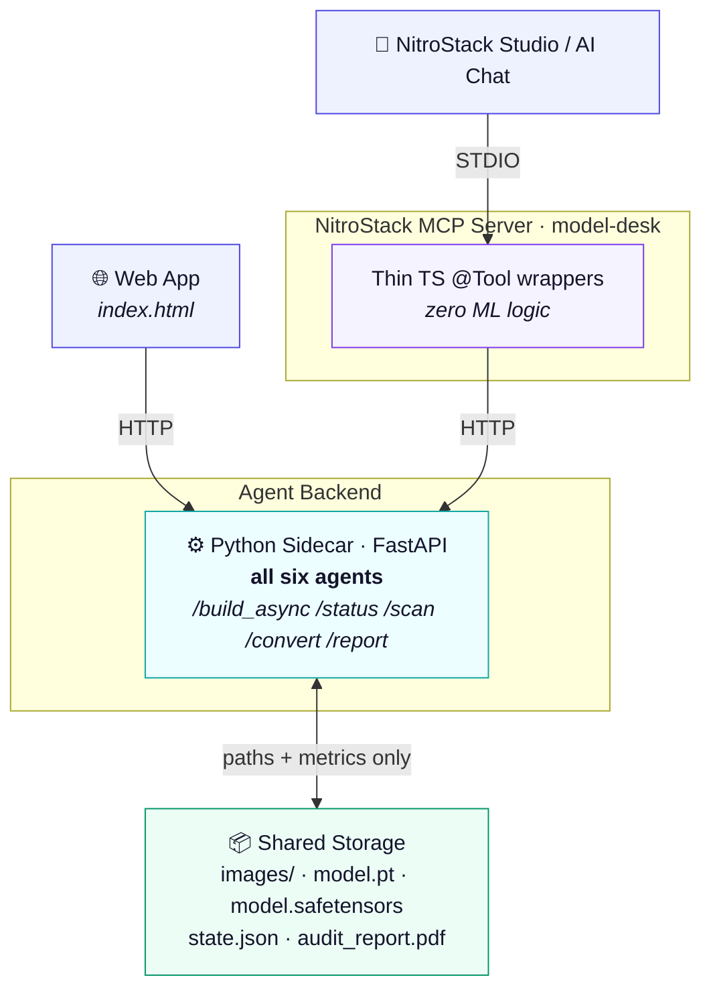
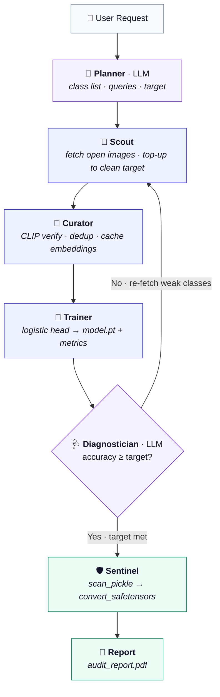
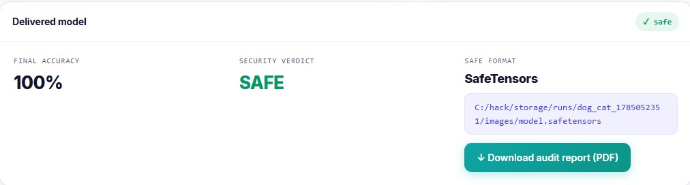
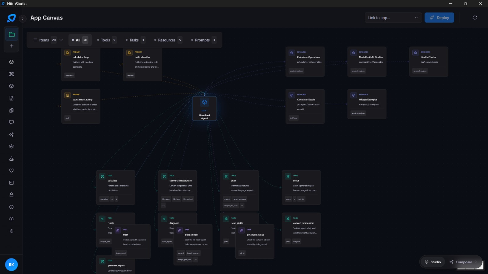
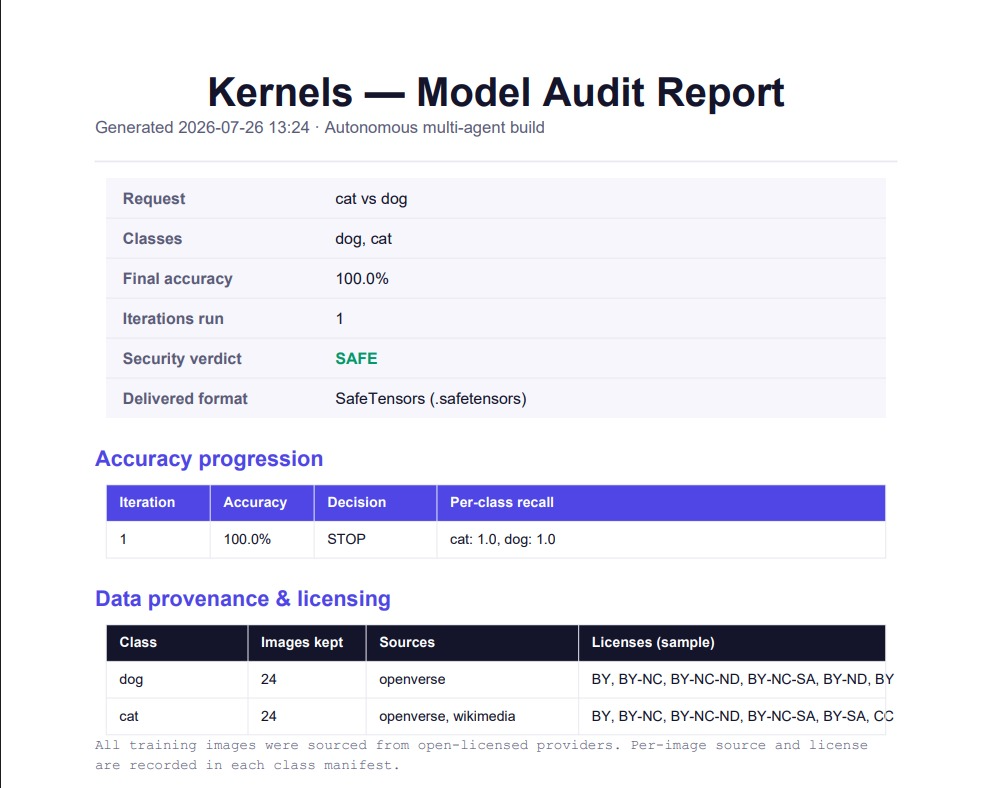

# ModelSmithAI

**Your Autonomous Model Factory — from a plain-English request to a security-scanned, ready-to-use model in minutes.**


*Team Kernels · Built on NitroStack MCP*

---

## Overview

Describe what you want to recognize in plain English; six coordinated AI agents gather open-licensed data, train a model, diagnose their own failures, gather better data, and deliver a **security-scanned model + audit report** — no dataset, no labeling, no code required.

---

## Problem

Building a model for a **niche/long-tail task** (a specific defect, species, or document type) is slow and manual:

- **No ready datasets** exist on Kaggle/Roboflow — sourcing and labeling data takes days to weeks.
- **Requires an ML expert** to run the source → clean → train → diagnose → re-source loop.
- **Downloaded models are unsafe:** PyTorch `.pt` files use `pickle`, which executes arbitrary code on load (RCE risk — e.g. **CVE-2025-1889**, where scanners are bypassed by hiding payloads under fake extensions).

## Solution

An autonomous, self-improving multi-agent pipeline that solves both **data scarcity** and **model trust**:

- Gathers open-licensed images, verifies each with zero-shot CLIP, trains, and **reasons about its own failures** to fetch better data — improving until it hits a target or the open data is exhausted.
- **Scans** every model for malicious pickle opcodes (by content, not filename) and **converts to SafeTensors** — a format with no code-execution path. *Detection is evidence; conversion is the guarantee.*

---

## Key Features

- **Natural-language → trained model.** LLM parses the request into a class list.
- **Six-agent self-improving loop** with a *reasoning* Diagnostician that issues structured, per-class re-fetch requests.
- **Multi-source harvesting** (Openverse, Wikimedia) with per-image **source + license** recorded; graceful failure and fresh-page re-fetch.
- **Zero-shot CLIP verification** + perceptual-hash dedup; rejects moved to `_rejected/` (inspectable).
- **Clean-image top-up:** fetches until *N* clean images survive, or the source is exhausted (hard round cap — no infinite loops).
- **Fast training:** CLIP embeddings (cached once) → logistic head → real `.pt` in ~1s.
- **Local LLM reasoning** (Ollama) in Planner + Diagnostician, each with a **deterministic fallback** so a demo never breaks.
- **Security (Sentinel):** load-free pickle scan + SafeTensors conversion, with a malicious-file fixture to prove detection.
- **Auto-generated PDF audit report:** request, accuracy progression, data provenance/licenses, agent decision log, security verdict.
- **Three surfaces, one backend:** web app · NitroStack MCP toolbar · NitroStack AI Chat.

---

## Tech Stack

| Layer | Tech |
|---|---|
| MCP server | NitroStack SDK (`@nitrostack/core`), TypeScript |
| Agent backend | Python 3.12, FastAPI, Uvicorn |
| Frontend | Static HTML + vanilla JS |
| Vision | OpenCLIP `ViT-B-32` -> scikit-learn `LogisticRegression`; PyTorch (CPU/CUDA, RTX 3050 6GB) |
| LLM | Ollama local (`qwen2.5:3b`) over HTTP |
| Data | Openverse, Wikimedia Commons, HF datasets (discovery) |
| Security | `pickletools`, `safetensors` |
| Reporting | ReportLab |

---

## NitroStack Components Used

| Component | How It Is Used | Benefit |
|---|---|---|
| **CLI** (`@nitrostack/cli`) | Scaffolded the MCP project | Correct setup, zero boilerplate |
| **SDK** (`@nitrostack/core`) | `@McpApp`/`@Module`/`@Tool` + Zod schemas | Type-safe, standard MCP tools |
| **Studio** | Connect (STDIO) + run/inspect tools on App Canvas | Live execution, no client needed |
| **MCP Server** (`model-desk`) | Exposes agents to the platform | Private backend -> discoverable service |
| **MCP Tools** | `plan, scout, curate, train, diagnose, scan_pickle, convert_safetensors, build_model, get_build_status, generate_report` | Individually callable + composable |
| **AI Chat** | LLM calls `build_model`/`get_build_status` with tool-approval | Whole loop orchestrated from a chatbot |

**Scope (honest):** Fully used — CLI, SDK, Studio, MCP server/tools, AI Chat. **Not used:** AI Gateway/hosted LLM (local Ollama instead), NitroCloud deployment (local GPU runtime), Compose (hand-written), NitroStack Memory/Agent-Framework (orchestration is our own Python; state in `state.json`).

---

## System Architecture

One agent backend, two independent front-ends. The web app and NitroStack both call the same Python sidecar over HTTP — they don't route through each other.



- **Orchestrator** runs the loop, holds shared state, decides next step.
- **TS tools are thin forwarders — zero ML logic in TypeScript.**
- **Files never pass between layers** — only paths + metrics (JSON). The artifact stays in storage.

---

## Agentic AI Workflow



*Loop stops on: target met · no improvement · max iterations.*

- **Reasoning is placed deliberately** — LLM only in Planner (intent) and Diagnostician (failure analysis); Scout/Curator/Trainer/Sentinel are deterministic (the security scanner intentionally rule-based).

---

## Real-World Use Cases

- **Factory QC, no dataset:** train "defective vs clean casting" for a specific part in minutes, with a licensing audit trail.
- **Team without an ML engineer:** describe classes in English, get a working, safe model.
- **MLOps vetting:** scan any downloaded `.pt` for malicious code and get a safe SafeTensors version — the Sentinel is valuable standalone.
- **Education:** demonstrate the full data->model loop live, including the model failing and the system fixing itself.

---

## Benefits & Impact

- **Speed:** days/weeks of data work -> minutes.
- **Access:** model-building without ML staff, datasets, or code.
- **Trust:** every model de-risked from pickle RCE before use.
- **Governance:** standardized SafeTensors + PDF audit with data provenance.
- **Privacy:** LLM reasoning runs locally — no data leaves the machine.

---

## Innovation / USP

1. **Self-improving loop with a *reasoning* Diagnostician** — issues machine-readable, per-class data requests, not "accuracy low."
2. **Security as a guarantee, not a scan** — SafeTensors conversion removes the code-execution surface regardless of scanner coverage; content-based archive walk defeats CVE-2025-1889-style bypasses.
3. **Reasoning placed where it counts** — LLM for judgment, deterministic for computation/security.
4. **Provenance + audit by default** — answers "where's the data from?" and "is it safe?" automatically.
5. **One backend, native MCP integration** — same agents in a web app and an orchestratable chatbot.

---

## Installation

**Prerequisites:** Node 18+ (20.x rec.), Python 3.12, Ollama, optional GPU.

```bash
# 1. MCP server (TypeScript)
npx @nitrostack/cli@latest init model-desk --template typescript-starter
#    add src/modules/agents/{agents.module.ts,agents.tools.ts}; register AgentsModule in app.module.ts

# 2. Python sidecar
cd sidecar
py -3.12 -m venv .venv && .\.venv\Scripts\Activate.ps1        # Windows
pip install -r requirements.txt                               # fastapi uvicorn requests torch open-clip-torch scikit-learn pillow numpy safetensors reportlab
uvicorn app:app --port 8000 --reload

# 3. Local LLM
ollama pull qwen2.5:3b

# 4. Website
cd website && py -3.12 -m http.server 5500                     # open http://localhost:5500
```

Connect in **NitroStack Studio:** Add Server -> Nitro Project -> `model-desk` -> Open Project -> Studio App Canvas.

**Run:** `python orchestrator.py "husky vs wolf vs malamute" --per-class 12 --target 0.85`

**Config:** `request`, `images_per_class` (12), `target_accuracy` (0.85), `max_iterations` (3); LLM via `KERNELS_LLM` env var.

---

## Screenshots

**Live agent relay + accuracy per iteration** — the six agents report in real time; the Planner (LLM) parses the request, the Scout tops up to the clean target, and the Diagnostician stops at the target.


**Delivered model card** — final accuracy, the `SAFE` security verdict, the SafeTensors path, and a one-click audit-report download.



**NitroStack Studio — App Canvas** — all agents exposed as MCP primitives: 9 Tools, 3 Prompts, 5 Resources (including the project-owned `modelsmith://pipeline` resource and `build_classifier` / `scan_model_safety` prompts).



**Auto-generated PDF audit report** — request, accuracy progression, and full data provenance with per-image licenses.



---

## Security Highlights

- Disassembles pickle bytecode **without loading** the file; flags dangerous opcodes against a torch-only allowlist.
- Inspects every archive entry **by pickle signature, not extension** (defeats CVE-2025-1889-class bypasses).
- Converts to **SafeTensors** (loaded `weights_only=True`, so even malicious files can't execute during conversion).
- Ships a malicious `.pt` fixture (created, never executed) to prove the scanner catches real payloads.

---

## Future Enhancements

- **Short:** video via frame-sampling; in-chat metric/image widgets; env-configurable paths; NitroCloud deployment.
- **Medium:** object detection (YOLO + zero-shot box auto-labeling); negative-class strategist; durable job store.
- **Long:** audio modality; synthetic-data (diffusion) fallback; edge/LoRA export; hosted multi-tenant service.

---

## Known Limitations

- Accuracy is bounded by open-data availability; niche classes may plateau below target (loop stops honestly).
- The live accuracy climb isn't guaranteed — it depends on re-fetches finding better images.
- Small validation sets are noisy; easy tasks (cat vs dog) saturate at 100% in one iteration.
- Classification only (no detection/video/audio yet); ML runtime is local (not cloud-deployed).

---

## Team & License

- **Team Kernels**, Amrita University Coimbatore.
- **MIT License** (assumed for the prototype).
- Built with: NitroStack · OpenCLIP · Ollama/Qwen2.5 · PyTorch · scikit-learn · FastAPI · ReportLab · Openverse · Wikimedia.

> *ModelSmithAI — from a sentence to a secure model.*
