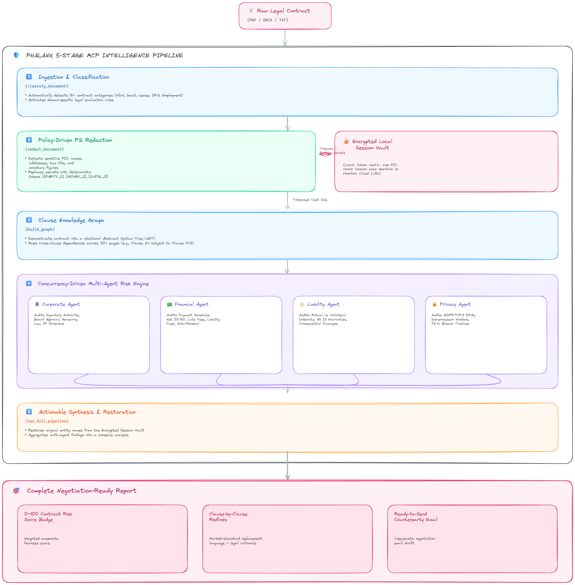

# Phalanx: Privacy-First Legal & Contract Intelligence for AI

> Every day, individuals and teams sign contracts blindly because legal review is prohibitively expensive, while cloud AI models expose confidential data and trade secrets.

  

Phalanx: Privacy-First Legal & Contract Intelligence for AI is an MCP (Model Context Protocol) server that extends AI assistants — like Claude, Cursor, and any MCP-compatible client — with new, real-world capabilities. It is built and deployed on Nitrostack, the fastest way to build, deploy, and share MCP apps.

## Table of Contents
- [Overview](#overview)
- [What is MCP?](#what-is-mcp)
- [Features](#features)
- [Live Demo](#live-demo)
- [Getting Started](#getting-started)
- [Connect to an MCP Client](#connect-to-an-mcp-client)
- [Deploy Your Own MCP App](#deploy-your-own-mcp-app)
- [Explore More MCP Apps](#explore-more-mcp-apps)
- [FAQ](#faq)
- [Keywords](#keywords)
- [License](#license)

## Overview
Every day, individuals and teams sign contracts blindly because professional legal review is prohibitively expensive, while cloud AI models expose confidential data and trade secrets. Standard large language models also struggle with long-form legal documents—often missing critical cross-clause dependencies, such as an indemnity clause on page 2 that secretly voids a liability limitation on page 15.

Phalanx bridges this gap. Built on the open Model Context Protocol (MCP), it equips any AI assistant with secure, domain-aware legal intelligence. Instead of sending raw text to the cloud, Phalanx enforces policy-driven redaction, constructs a structural Clause Knowledge Graph, and deploys a multi-agent risk analysis engine across Corporate, Financial, Liability, and Privacy domains. The result is a complete, explainable risk audit with fair redlines and a ready-to-send negotiation email—all while keeping your confidential secrets locked in an encrypted local vault.

### TARGET AUDIENCE
* **Individuals and Freelancers**: Review residential leases, independent contractor agreements, and employment offer letters with confidence. Phalanx highlights unfair termination rights, hidden fee structures, and personal liability traps without incurring hourly legal bills.
* **Startups and Founders**: Negotiate customer NDAs, SaaS terms, and vendor DPAs at high deal velocity. Founders can audit incoming contracts in seconds, ensuring that revenue-generating deals move forward without exposing intellectual property.
* **Enterprise Legal and HR**: Automate preliminary contract triage and enforce company playbook compliance across departments. Legal teams can standardize audits for procurement and HR, reserving expensive legal counsel hours for complex negotiations.
* **AI Developers**: Easily embed secure, legal-grade document intelligence into custom copilots, internal tools, and automated workflows without building complex NLP or redaction pipelines from scratch.

### INTELLIGENCE PIPELINE
Phalanx processes every agreement through a secure, 5-stage analytical architecture:

* **1. Classification (`classify_document`)**: Analyzes contract structure and terminology to identify the document type among 15+ legal categories (NDAs, Leases, DPAs, Employment, SaaS, etc.) and activates domain-specific evaluation rules.
* **2. Policy-Driven Redaction (`redact_document`)**: Uses advanced pattern matching to anonymize sensitive PII, names, addresses, and monetary figures locally. Original secrets are replaced with deterministic tokens and stored in an encrypted local session vault before any text reaches an LLM.
Every day, individuals and teams sign contracts blindly because professional legal review is prohibitively expensive, while cloud AI models expose confidential data and trade secrets. 

### Why Traditional Cloud LLMs & Standard RAG Fail on Legal Contracts
1. **Data Privacy & GDPR/CCPA Violations**: Sending raw contracts (which contain PII, bank details, pricing schedules, and trade secrets) to external cloud LLMs risks data leaks, training exploitation, and regulatory penalties.
2. **The Cross-Clause Dependency Blindspot**: Standard chunk-based RAG (Retrieval-Augmented Generation) splits documents into 500-token snippets. In legal agreements, an obligation defined in **Clause 2.1 (Scope of License)** is frequently modified or voided by an exception buried in **Clause 14.3 (Limitation of Liability)** or **Schedule B (Payment Terms)**. Simple RAG chunks miss these structural dependencies entirely.
3. **Lack of Actionable Synthesis**: Most AI summarizing tools produce passive summaries rather than actionable negotiation redlines and ready-to-send counterparty correspondence.

Phalanx bridges this gap. Built on the open Model Context Protocol (MCP), it equips any AI assistant with secure, domain-aware legal intelligence. Instead of sending raw text to the cloud, Phalanx enforces **policy-driven P2 redaction**, constructs a structural **Clause Knowledge Graph**, and deploys a **multi-agent risk analysis engine** across Corporate, Financial, Liability, and Privacy domains.

---

### TARGET AUDIENCE & USE CASES
* **Everyday Individuals & Freelancers**:
  - *Pain Point*: Residential leases, independent contractor agreements, and employment offer letters contain unfair termination rights, personal liability traps, and hidden fee schedules. Hiring a lawyer at $350+/hr is economically impossible for smaller transactions.
  - *Phalanx Solution*: Highlights predatory terms in plain English, benchmarks clauses against standard tenant/freelancer protections, and drafts a fair counter-proposal email.
* **Startups & High-Growth Founders**:
  - *Pain Point*: Fast-moving teams sign customer NDAs, SaaS terms, and vendor DPAs under pressure to close deals, inadvertently licensing away core intellectual property or agreeing to uncapped indemnification.
  - *Phalanx Solution*: Audits vendor and NDA agreements in seconds without exposing proprietary secrets, accelerating sales velocity while guarding IP.
* **Enterprise Legal, HR & Procurement Teams**:
  - *Pain Point*: In-house legal departments are buried under routine contract triage, creating multi-week bottlenecks across sales and procurement.
  - *Phalanx Solution*: Automates preliminary contract triage against corporate legal playbooks, ensuring consistent governance and allowing in-house lawyers to focus on complex strategic negotiations.
* **AI & Platform Developers**:
  - *Pain Point*: Building secure, domain-aware legal AI tools requires complex NER redaction models, graph parsing, and specialized prompt engineering.
  - *Phalanx Solution*: Provides a plug-and-play MCP backend that any LLM client (Claude, Cursor, custom GPTs) can connect to instantly.

---

### TECHNICAL ARCHITECTURE & THE 5-STAGE INTELLIGENCE PIPELINE

Phalanx processes every contract through an institutional-grade 5-stage analytical architecture:

#### 1️⃣ Intelligent Ingestion & Classification (`classify_document`)
- **What it does**: Inspects document structure, preamble language, and key terms to classify the agreement into one of **15+ legal contract categories** (e.g., NDA, SaaS Agreement, Residential Lease, Employment Contract, Vendor DPA, Loan Agreement).
- **Why it matters**: A liability cap that is normal in a $50/month SaaS contract is unacceptably risky in an M&A escrow agreement. Classification automatically binds the correct domain policy.

#### 2️⃣ Policy-Driven P2 Redaction & Session Vault (`redact_document`)
- **What it does**: Uses regex heuristics and Named Entity Recognition (NER) to detect sensitive PII, names, addresses, tax IDs, and monetary amounts.
- **Security Mechanism**: Replaces sensitive entities with deterministic tokens (`[PARTY_1]`, `[MONEY_1]`, `[DATE_1]`) and stores the encrypted mapping in a secure local session vault (`sessionId`). Only tokenized text is analyzed by LLM agents.
- **Restoration (`restore_text`)**: Once analysis is complete, Phalanx restores original entities in the final user-facing report using the vault key—ensuring cloud LLMs never see raw secrets.

#### 3️⃣ Clause Knowledge Graph Construction (`build_graph`)
- **What it does**: Deconstructs the contract into an abstract syntax tree and builds a directed graph (`GraphModule`) where nodes represent individual clauses/definitions and edges represent cross-references (`subject_to`, `notwithstanding`, `defined_in`, `except_as_provided`).
- **Why it matters**: Eliminates RAG truncation errors by allowing risk agents to traverse dependency chains across 30+ page contracts.

#### 4️⃣ Concurrency-Driven Multi-Agent Risk Engine (`analyze_all_risks`)
Phalanx deploys four specialized domain AI agents concurrently to inspect the Knowledge Graph:
- 🏛️ **Corporate Agent (`analyze_corporate`)**:
  - Checks signatory authority, board approval requirements, governing law, choice of forum, and intellectual property ownership (assignment vs. licensing).
- 💵 **Financial Agent (`analyze_financial`)**:
  - Audits payment schedules (Net 30/60/90), late fee compounding rates, liability caps (annual contract value vs. uncapped), CPI price escalation clauses, and auto-renewal cancellation windows.
- ⚖️ **Liability Agent (`analyze_liability`)**:
  - Evaluates mutual vs. unilateral indemnification obligations, warranty disclaimers (`AS IS` vs. fitness for particular purpose), consequential damages waivers, and termination rights (convenience vs. cause).
- 🔒 **Privacy Agent (`analyze_privacy`)**:
  - Inspects GDPR/CCPA data processing agreements (DPA), sub-processor notification windows, cross-border data transfer mechanisms (SCCs), and data breach notification timelines (72-hour window).

#### 5️⃣ Actionable Synthesis & Negotiation Report (`run_full_pipeline`)
- **Overall Risk Score (0–100)**: A weighted composite score evaluating overall contract fairness and severity.
- **Clause-by-Clause Redlines (`generate_redline`)**: Provides fair, market-standard replacement language for risky clauses along with legal rationale.
- **Ready-to-Send Negotiation Email (`negotiationEmail`)**: Synthesizes all findings into a professional, empathetic email draft that the user can copy and send directly to the counterparty.

```
+---------------------------------------------------------------------------------------------------+
|                                      PHALANX PIPELINE FLOW                                        |
+---------------------------------------------------------------------------------------------------+
|                                                                                                   |
|  [ Raw Document / URL / Base64 ]                                                                  |
|         │                                                                                         |
|         ▼                                                                                         |
|  1️⃣ INGESTION & CLASSIFICATION (classify_document)                                                |
|         │                                                                                         |
|         ▼                                                                                         |
|  2️⃣ POLICY-DRIVEN P2 REDACTION (redact_document)                                                  |
|         │──► Encrypted Token Store (Session Vault, Local & Secure)                                |
|         │                                                                                         |
|         ▼                                                                                         |
|  3️⃣ CLAUSE KNOWLEDGE GRAPH (build_graph)                                                          |
|         │──► Builds structural dependencies & identifies clause relationships                      |
|         │                                                                                         |
|         ▼                                                                                         |
|  4️⃣ SPECIALIZED RISK AGENTS (analyze_all_risks)                                                   |
|         ├──► Corporate Agent   (governance, authority, IP)                                        |
|         ├──► Financial Agent   (fees, payment terms, caps)                                        |
|         ├──► Liability Agent   (indemnity, warranties, damages)                                   |
|         └──► Privacy Agent     (data protection, DPA, GDPR)                                       |
|         │                                                                                         |
|         ▼                                                                                         |
|  5️⃣ SYNTHESIS & NEGOTIATION READY REPORT                                                          |
|         ├──► Overall Risk Score (0 - 100)                                                         |
|         ├──► Clause-by-Clause Findings & Redlines                                                 |
|         └──► Ready-to-Send Negotiation Email                                                      |
|                                                                                                   |
+---------------------------------------------------------------------------------------------------+
```

### System Architecture Diagram


---

### SOCIAL IMPACT
* **Democratizing Legal Literacy & Protection**: High-quality legal analysis should not be a luxury reserved for wealthy enterprises. Phalanx empowers tenants, gig workers, and small business owners to understand and push back against predatory boilerplate clauses.
* **Privacy as a Fundamental Right**: Demonstrates that institutional-grade AI reasoning can be achieved without compromising personal privacy or business confidentiality, setting a new ethical standard for AI in regulated industries.
* **Open-Source Compliance Standards**: By making contract benchmarking and redaction policies open and auditable, Phalanx fosters a transparent community standard for legal AI fairness.

### FINANCIAL IMPACT
* **Catastrophic Liability Prevention**: Proactively detecting uncapped indemnities, silent auto-renewals, and unfavorable jurisdiction terms saves companies from debilitating lawsuits and unexpected recurring costs.
* **Accelerated Deal Velocity**: Compresses contract review turnaround times from weeks to minutes, speeding up sales cycles, vendor onboarding, and time-to-revenue.

## What is MCP?
The Model Context Protocol (MCP) is an open standard that lets AI assistants securely connect to external tools, data sources, and services. Instead of being limited to what it was trained on, an AI model can call MCP servers to fetch live data, run actions, and integrate with real systems.
This project is one such MCP server. Learn more about building and shipping MCP apps at nitrostack.ai.

## Features
- 🔌 **MCP-native** — works with any MCP-compatible client (Claude, Cursor, and more)
- 🛠️ **Tools, resources & prompts** — exposes structured capabilities to AI agents
- ⚡ **Deployed on Nitrostack** — reliable, hosted, and instantly shareable
- 🔐 **Secure by design** — secrets stay in environment variables, never in code
- 🧩 **Composable** — combine with other MCP apps to build powerful AI workflows

## Live Demo
🚀 **Live MCP endpoint**: <https://finalsub-6a65b318-seventie-amrita-university-coimbatore.app.nitrocloud.ai>
Point your MCP client at the endpoint above to try it instantly. Prefer a hosted setup? Deploy your own in minutes on Nitrostack.

## Getting Started

### Prerequisites
- Node.js 18+ (or your project runtime)
- An MCP-compatible client (Claude Desktop, Cursor, etc.)

### Installation
```bash
git clone https://github.com/Seventie/NitroStack-Seventie.git
cd NitroStack-Seventie
npm install
```

### Configuration
Copy the example environment file and add your own values:
```bash
cp .env.example .env
```

### Run
```bash
npm run start
```

## Connect to an MCP Client
Add this server to your MCP client configuration. A typical entry looks like:
```json
{
  "mcpServers": {
    "phalanx-privacy-first-legal-contract-intelligence-for-ai": {
      "url": "https://finalsub-6a65b318-seventie-amrita-university-coimbatore.app.nitrocloud.ai"
    }

---

## 📄 License
This project is licensed under the **MIT License**.
