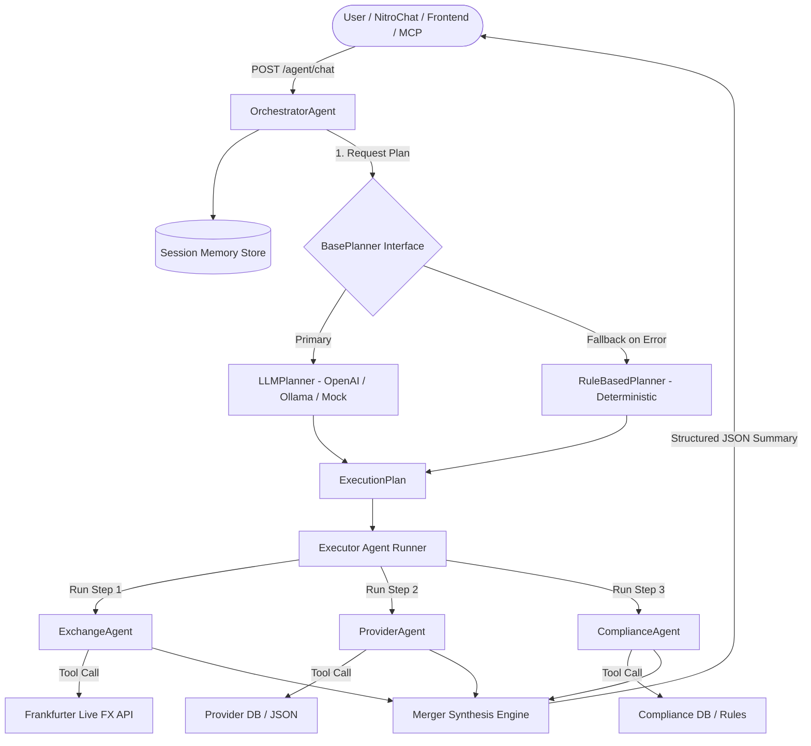
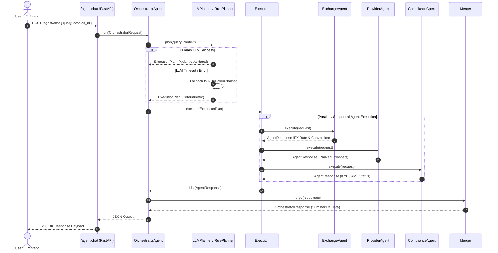

# RemitWise AI – Production Multi-Agent Backend

[](https://www.python.org/)
[](https://fastapi.tiangolo.com/)
[](https://docs.pydantic.dev/)
[](https://docs.pytest.org/)
[](https://www.docker.com/)
[](LICENSE)

> **Agent-ready REST & Multi-Agent backend** for the RemitWise AI remittance advisory platform.
> Combines high-performance REST APIs with an autonomous, dual-planner Multi-Agent System (`LLMPlanner` + `RuleBasedPlanner`) to orchestrate exchange rate trends, provider comparisons, and KYC/AML compliance checks.
> AI agents built in NitroStack Studio consume these APIs to power intelligent remittance recommendations and conversational workflows.

---

## Table of Contents

- [Overview & Key Features](#overview--key-features)
- [Multi-Agent Architecture](#multi-agent-architecture)
  - [System Flow Diagram](#system-flow-diagram)
  - [Sequence Diagram](#sequence-diagram)
- [Tech Stack](#tech-stack)
- [Project Structure](#project-structure)
- [Supported Providers & Corridors](#supported-providers--corridors)
- [Supported Countries & Compliance](#supported-countries--compliance)
- [Quick Start](#quick-start)
- [Docker Deployment](#docker-deployment)
- [Environment Variables](#environment-variables)
- [API Reference](#api-reference)
  - [Multi-Agent Orchestrator (`/agent/*`)](#multi-agent-orchestrator-agent)
  - [Health (`/health`)](#health)
  - [Exchange Rates (`/exchange/*`)](#exchange-rates)
  - [Providers (`/providers/*`)](#providers)
  - [Compliance (`/compliance/*`)](#compliance)
- [API Endpoint Analysis & Endpoint Audit](#api-endpoint-analysis--endpoint-audit)
- [Data Sources](#data-sources)
- [Architecture Notes & Performance](#architecture-notes--performance)
- [Security & Rate Limiting](#security--rate-limiting)
- [Testing & Quality Assurance](#testing--quality-assurance)
- [NitroStack Studio & MCP Integration](#nitrostack-studio-integration)
- [Troubleshooting & FAQ](#troubleshooting--faq)
- [Future Roadmap](#future-roadmap)
- [Contributing & License](#contributing--license)

---

## Overview & Key Features

RemitWise AI Backend provides four core domain capabilities:

| Domain | Data Source | Description |
|--------|-------------|-------------|
| **Multi-Agent Orchestration** | Autonomous Agents | Dual-planner routing (`LLMPlanner` & `RuleBasedPlanner`) with specialist execution |
| **Exchange Rates** | Frankfurter API (live) | Mid-market rates, historical time-series, currency conversion |
| **Providers** | `data/providers.json` (local) | 5 major remittance providers with corridors, fees, and delivery methods |
| **Compliance** | `data/compliance_rules.json` (local) | KYC/AML rules, required documents, sanctions screening for 10 countries |

### Key Capabilities
- 🧠 **Dual-Planner Reliability**: Tries `LLMPlanner` (natural language parsing & structured Pydantic extraction) with automatic failover to deterministic `RuleBasedPlanner`.
- ⚡ **Asynchronous Specialist Execution**: `ExchangeAgent`, `ProviderAgent`, and `ComplianceAgent` execute in optimal sequences with tool tracking and isolation.
- 💱 **Live FX Rates & Historical Analytics**: Direct real-time fetch from Frankfurter API with fallback calculation.
- 🛡️ **Regulatory Compliance Engine**: Instant KYC/AML screening, document checklists, and sanction checks.
- 💬 **Session Memory Store**: Thread-safe memory tracking per session ID.

---

## Multi-Agent Architecture

The agent layer is built on top of the existing REST APIs in a completely additive manner.

### System Flow Diagram



---

### Sequence Diagram



---

## Tech Stack

| Component | Library / Version | Purpose |
|-----------|------------------|---------|
| **Language** | Python 3.11+ | Core runtime |
| **Framework** | FastAPI 0.111.0 | Asynchronous REST & Agent API framework |
| **Server** | Uvicorn 0.30.0 | High-performance ASGI web server |
| **HTTP Client** | Requests 2.32.3 | External API integration |
| **Validation** | Pydantic v2.11.0 | Data contracts, settings & LLM schema validation |
| **LLM Integration** | OpenAI / Ollama / Mock | Intelligent intent planning & entity extraction |
| **Testing** | Pytest 9.1.1 & Asyncio | 64+ automated unit & integration tests |
| **Data Storage** | Local JSON + LRU Cache | Fast in-memory provider & compliance rules lookup |

---

## Project Structure

```
backend/
├── agents/                      ← Multi-Agent Architecture
│   ├── shared/
│   │   ├── schemas.py           ← Pydantic models (AgentRequest, AgentResponse, ExecutionPlan)
│   │   ├── base_agent.py        ← Abstract BaseAgent with timing & error handling
│   │   ├── logger.py            ← Structured agent logger
│   │   ├── memory.py            ← Thread-safe conversation memory
│   │   └── utils.py             ← Currency/country normalisation helpers
│   ├── exchange/
│   │   ├── exchange_agent.py    ← ExchangeAgent implementation
│   │   ├── prompt.py            ← System prompt for exchange agent
│   │   └── tools.py             ← Rate lookup & conversion wrappers
│   ├── provider/
│   │   ├── provider_agent.py    ← ProviderAgent implementation & intent ranking
│   │   ├── prompt.py            ← System prompt for provider agent
│   │   └── tools.py             ← Comparison & corridor wrappers
│   ├── compliance/
│   │   ├── compliance_agent.py  ← ComplianceAgent implementation
│   │   ├── prompt.py            ← System prompt for compliance agent
│   │   └── tools.py             ← KYC/AML/Documents wrappers
│   └── orchestrator/
│       ├── orchestrator.py      ← OrchestratorAgent (primary coordinator)
│       ├── base_planner.py      ← BasePlanner abstract interface
│       ├── llm_planner.py       ← LLMPlanner (LLM intent & entity extraction)
│       ├── planner.py           ← RuleBasedPlanner (Deterministic fallback)
│       ├── executor.py          ← Specialist agent runner
│       ├── merger.py            ← Response synthesis & summary generator
│       └── providers/           ← LLM Provider abstractions (OpenAI, Ollama, Mock)
│
├── api/                         ← REST Endpoints Layer
│   ├── app.py                   ← FastAPI app setup, CORS, route registration
│   └── routes/
│       ├── agent.py             ← /agent/* endpoints
│       ├── exchange.py          ← /exchange/* endpoints
│       ├── providers.py         ← /providers/* endpoints
│       ├── compliance.py        ← /compliance/* endpoints
│       └── health.py            ← /health endpoint
│
├── services/                    ← Business Logic Layer
│   ├── exchange_service.py      ← Frankfurter API integration & historical math
│   ├── provider_service.py      ← Provider filtering & corridor matching
│   └── compliance_service.py   ← Regulatory rules lookups
│
├── data/                        ← Static Datasets
│   ├── providers.json           ← 5 providers, corridors, fees, delivery speeds
│   └── compliance_rules.json   ← 10 countries, KYC/AML rules & document checklists
│
├── utils/                       ← System Utilities
│   ├── file_loader.py           ← LRU-cached JSON file loader
│   └── validators.py            ← Input validation (currencies, countries, dates)
│
├── tests/                       ← Comprehensive Test Suite (64/64 Passing)
│   ├── agents/                  ← Multi-agent & planner unit tests
│   └── test_exchange.py         ← REST API endpoint tests
│
├── config.py                    ← Centralized environment configuration
├── requirements.txt             ← Python dependencies
└── README.md                    ← Production documentation
```

---

## Supported Providers & Corridors

The system currently supports 5 major remittance providers with multi-channel payment & payout capabilities:

| Provider | ID | Supported Corridors | Payment Methods | Payout Methods | Delivery Speed | Fee Model |
|----------|----|--------------------|-----------------|----------------|----------------|-----------|
| **Wise** | `wise` | USA-IN, UAE-IN, UK-IN, CAN-IN, SGP-IN, AUS-IN | Bank Transfer, Debit Card, Credit Card | Bank Account, UPI | Instant (~15 mins) | Dynamic (Zero FX Markup) |
| **Remitly** | `remitly` | USA-IN, UK-IN, CAN-IN, AUS-IN, SGP-IN, UAE-IN | Bank Transfer, Debit Card, Credit Card | Bank Account, Cash Pickup, UPI | Minutes – 2 Days | Dynamic |
| **Western Union** | `western_union` | USA-IN, UAE-IN, UK-IN, CAN-IN, SGP-IN, AUS-IN | Bank Transfer, Debit/Credit Card, Cash | Bank Account, Cash Pickup | Minutes – 3 Days | Dynamic |
| **XE Money Transfer** | `xe` | USA-IN, UK-IN, CAN-IN, AUS-IN | Bank Transfer | Bank Account | 1 – 3 Days | Dynamic |
| **Al Ansari Exchange** | `al_ansari` | UAE-IN | Cash, Bank Transfer | Bank Account, Cash Pickup | Minutes – 1 Day | Dynamic |

---

## Supported Countries & Compliance

The compliance engine maintains regulatory profiles for 10 high-volume transfer countries:

| Country | Code | Currency | KYC Required | Purpose Required | AML & Sanctions Check | Risk Level |
|---------|------|----------|--------------|------------------|----------------------|------------|
| **United States** | `US` | `USD` | ✅ Yes | ❌ Optional | ✅ Yes | Low |
| **India** | `IN` | `INR` | ✅ Yes | ✅ Yes (FEMA/LRS) | ✅ Yes | Low |
| **United Kingdom** | `GB` | `GBP` | ✅ Yes | ❌ Optional | ✅ Yes | Low |
| **Philippines** | `PH` | `PHP` | ✅ Yes | ✅ Yes | ✅ Yes | Low |
| **Mexico** | `MX` | `MXN` | ✅ Yes | ❌ Optional | ✅ Yes | Low |
| **Kenya** | `KE` | `KES` | ✅ Yes | ❌ Optional | ✅ Yes | Low |
| **Nigeria** | `NG` | `NGN` | ✅ Yes | ✅ Yes | ✅ Yes | Medium |
| **Germany** | `DE` | `EUR` | ✅ Yes | ❌ Optional | ✅ Yes | Low |
| **Canada** | `CA` | `CAD` | ✅ Yes | ❌ Optional | ✅ Yes | Low |
| **Australia** | `AU` | `AUD` | ✅ Yes | ❌ Optional | ✅ Yes | Low |

---

## Quick Start

### 1. Clone / Navigate to project

```bash
cd backend
```

### 2. Create a virtual environment

```bash
python -m venv venv
# Windows
venv\Scripts\activate
# macOS / Linux
source venv/bin/activate
```

### 3. Install dependencies

```bash
pip install -r requirements.txt
```

### 4. Run the development server

```bash
# From the backend/ directory:
uvicorn api.app:app --reload --host 0.0.0.0 --port 8000
```

### 5. Explore the API

| URL | Description |
|-----|-------------|
| http://localhost:8000/docs | Swagger UI (Interactive API tester) |
| http://localhost:8000/redoc | ReDoc OpenAPI documentation |
| http://localhost:8000/health | Backend health check |
| http://localhost:8000/agent/health | Multi-Agent readiness check |
| http://localhost:8000/openapi.json | Raw OpenAPI schema |

---

## Docker Deployment

The backend is containerized for seamless production deployment via Docker or Docker Compose.

### Build and Run with Docker

```bash
# Build the Docker image
docker build -t remitwise-backend .

# Run the container on port 8000
docker run -d -p 8000:8000 --name remitwise-api remitwise-backend
```

### Docker Compose

Create a `docker-compose.yml` in the root directory:

```yaml
version: '3.8'

services:
  backend:
    build: ./backend
    ports:
      - "8000:8000"
    environment:
      - HOST=0.0.0.0
      - PORT=8000
      - LLM_PROVIDER=mock
      - LOG_LEVEL=info
    restart: unless-stopped
```

Run:
```bash
docker-compose up -d
```

---

## Environment Variables

All settings have sensible defaults so the server runs out-of-the-box with zero mandatory configuration.

| Variable | Default | Description |
|----------|---------|-------------|
| `HOST` | `0.0.0.0` | Server bind address |
| `PORT` | `8000` | Server port |
| `RELOAD` | `true` | Hot-reload (disable in production) |
| `LOG_LEVEL` | `info` | Uvicorn log level |
| `CORS_ORIGINS` | `http://localhost:3000,http://localhost:5173` | Comma-separated allowed CORS origins |
| `FRANKFURTER_BASE_URL` | `https://api.frankfurter.app` | Exchange-rate API base URL |
| `HTTP_TIMEOUT_SECONDS` | `10` | Upstream API request timeout |
| `LLM_PROVIDER` | `ollama` | Provider selection: `ollama`, `openai`, or `mock` |
| `OLLAMA_HOST` | `http://localhost:11434` | Ollama local endpoint |
| `OLLAMA_MODEL` | `llama3.1` | Local Ollama model name |
| `OPENAI_API_KEY` | `""` | OpenAI / Groq / OpenRouter API Key |
| `OPENAI_BASE_URL` | `https://api.openai.com/v1` | OpenAI API compatible base URL |
| `OPENAI_MODEL` | `gpt-4o-mini` | Model name for OpenAI provider |

Create a `.env` file in `backend/` to override default settings.

---

## API Reference

### Multi-Agent Orchestrator (`/agent/*`)

The multi-agent endpoints provide high-level conversational AI orchestration.

#### `POST /agent/chat`
Main conversational entry point for NitroChat and AI frontends. Accepts natural language queries, extracts entities, executes required specialist agents, and synthesizes a structured output.

**Request Body:**
```json
{
  "query": "Send 1000 USD to India. Cheapest provider and KYC docs?",
  "session_id": "user-abc-123",
  "context": {
    "base_currency": "USD",
    "target_currency": "INR",
    "amount": 1000,
    "from_country": "US",
    "to_country": "IN"
  }
}
```

**Response Payload (200 OK):**
```json
{
  "session_id": "user-abc-123",
  "query": "Send 1000 USD to India. Cheapest provider and KYC docs?",
  "agents_used": ["exchange", "provider", "compliance"],
  "plan": [
    {"agent": "exchange", "reason": "Exchange rate & conversion query (USD->INR)", "priority": 1},
    {"agent": "provider", "reason": "Provider comparison & recommendation (US->IN)", "priority": 2},
    {"agent": "compliance", "reason": "KYC/AML compliance requirements for IN", "priority": 3}
  ],
  "results": {
    "exchange": {
      "status": "success",
      "data": {
        "exchange_rate": {"rate": 96.56, "base": "USD", "target": "INR"},
        "conversion": {"converted_amount": 96560.0}
      }
    },
    "provider": {
      "status": "success",
      "data": {
        "best_provider": "wise",
        "best_provider_name": "Wise",
        "all_providers": [...]
      }
    },
    "compliance": {
      "status": "success",
      "data": {
        "kyc_required": true,
        "documents": ["Passport", "Aadhaar Card", "Proof of Address"]
      }
    }
  },
  "summary": "💱 Current USD/INR rate: 96.5600. You will receive approximately ₹96,560.00 for $1,000.00. 🏦 Top recommendation: Wise. 📋 Compliance: KYC verification required.",
  "status": "success",
  "total_execution_ms": 87.3
}
```

#### `GET /agent/health`
Check multi-agent readiness and active specialist agent count.

#### `GET /agent/session/{session_id}`
Retrieve conversation history and agent reasoning trace for a specific session.

#### `DELETE /agent/session/{session_id}`
Clear conversation memory for a session ID.

---

### Health

#### `GET /health`
Returns service liveness and upstream data source connectivity status.

```json
{
  "status": "healthy",
  "service": "RemitWise AI Backend",
  "version": "1.0.0",
  "timestamp": "2026-07-26T12:00:00+00:00",
  "uptime_seconds": 342.1,
  "backend": "healthy",
  "frankfurter": "healthy"
}
```

---

### Exchange Rates

All exchange-rate data is sourced live from the **Frankfurter API** (`https://api.frankfurter.app`).

#### `GET /exchange/latest`
Fetch the current exchange rate for a currency pair.

| Query Param | Type | Required | Example |
|-------------|------|----------|---------|
| `base` | string | ✅ | `USD` |
| `target` | string | ✅ | `INR` |

```bash
curl "http://localhost:8000/exchange/latest?base=USD&target=INR"
```

```json
{
  "base": "USD",
  "target": "INR",
  "rate": 96.56,
  "date": "2026-07-25",
  "amount": 1,
  "source": "Frankfurter API"
}
```

---

#### `GET /exchange/history`
Historical rates for a date range.

| Query Param | Type | Required | Example |
|-------------|------|----------|---------|
| `base` | string | ✅ | `USD` |
| `target` | string | ✅ | `INR` |
| `start_date` | string | ✅ | `2024-01-01` |
| `end_date` | string | ✅ | `2024-01-31` |

```bash
curl "http://localhost:8000/exchange/history?base=USD&target=INR&start_date=2024-01-01&end_date=2024-01-07"
```

```json
{
  "base": "USD",
  "target": "INR",
  "start_date": "2024-01-01",
  "end_date": "2024-01-07",
  "rates": {
    "2024-01-02": 83.12,
    "2024-01-03": 83.29
  },
  "count": 2,
  "source": "Frankfurter API"
}
```

---

#### `GET /exchange/convert`
Convert an amount between currencies.

| Query Param | Type | Required | Example |
|-------------|------|----------|---------|
| `base` | string | ✅ | `USD` |
| `target` | string | ✅ | `INR` |
| `amount` | float | ✅ | `1000.0` |

```bash
curl "http://localhost:8000/exchange/convert?base=USD&target=INR&amount=500"
```

---

#### `GET /exchange/currencies`
List all currencies supported by Frankfurter.

```bash
curl "http://localhost:8000/exchange/currencies"
```

---

### Providers

Provider data is served from `data/providers.json`.

#### `GET /providers`
List all active providers.

| Query Param | Type | Default | Description |
|-------------|------|---------|-------------|
| `active_only` | bool | `true` | Filter to active providers |

#### `GET /providers/corridors`
List transfer corridors across all providers.

| Query Param | Type | Required | Example |
|-------------|------|----------|---------|
| `from_country` | string | ❌ | `US` |
| `to_country` | string | ❌ | `IN` |

#### `GET /providers/compare`
Compare providers for a corridor.

| Query Param | Type | Required | Example |
|-------------|------|----------|---------|
| `from_country` | string | ✅ | `US` |
| `to_country` | string | ✅ | `IN` |

#### `GET /providers/{provider_id}`
Full details for a provider (e.g. `wise`, `remitly`, `western_union`).

#### `GET /providers/{provider_id}/payment-methods`
Accepted payment methods for a provider.

#### `GET /providers/{provider_id}/delivery-methods`
Delivery methods offered by a provider.

---

### Compliance

Compliance data is served from `data/compliance_rules.json`.

#### `GET /compliance`
Summary of all countries in the dataset.

#### `GET /compliance/{country}`
Full compliance profile for a country (e.g. `/compliance/US`, `/compliance/IN`).

#### `GET /compliance/{country}/documents`
Required and optional documents.

#### `GET /compliance/{country}/kyc`
KYC-specific requirements.

#### `GET /compliance/{country}/aml`
AML and sanctions screening requirements.

---

## API Endpoint Analysis & Endpoint Audit

To provide complete transparency for production readiness, here is an audit categorizing our endpoints across **Existing**, **Recommended Additions**, and **Future Roadmap**:

| Endpoint Path | Status | Category | Purpose & Description |
|---------------|--------|----------|-----------------------|
| `POST /agent/chat` | ✅ Active | Core Agent | Multi-agent conversational orchestration & decision synthesis |
| `GET /agent/health` | ✅ Active | Core Agent | Multi-agent readiness check |
| `GET /agent/session/{id}` | ✅ Active | Core Agent | Retrieve conversation history & agent execution trace |
| `DELETE /agent/session/{id}`| ✅ Active | Core Agent | Clear session conversation memory |
| `GET /health` | ✅ Active | Core Service | REST liveness & upstream health monitoring |
| `GET /exchange/latest` | ✅ Active | Core Domain | Real-time exchange rate fetch |
| `GET /exchange/history` | ✅ Active | Core Domain | Historical time-series rate lookup |
| `GET /exchange/convert` | ✅ Active | Core Domain | Direct amount conversion |
| `GET /providers/compare` | ✅ Active | Core Domain | Provider corridor ranking |
| `GET /compliance/{country}` | ✅ Active | Core Domain | Regulatory & document checklist lookup |
| `GET /analytics/trends` | 💡 Recommended | Feature Addition | Aggregate corridor volatility & historical trend analytics |
| `POST /predict/rate` | 💡 Recommended | Feature Addition | Predictive ML/FX rate trend estimation model |
| `GET /metrics` | 🚀 Future Roadmap | Operations | Prometheus operational metrics counter |

---

## Data Sources

### Frankfurter API
- **URL**: https://api.frankfurter.app
- **Auth**: None (free, public)
- **Rate limit**: ~unlimited for reasonable usage
- **Currencies**: EUR base + ~30 major currencies

### providers.json
Includes: **Wise**, **Remitly**, **Western Union**, **Sendwave**, **XE**, **Al Ansari**

Fields per provider: id, name, corridors, payment methods, delivery methods, fees, transfer speed, compliance, rating.

### compliance_rules.json
Countries: **US, IN, GB, PH, MX, KE, NG, DE, CA, AU**

Fields: KYC/AML flags, sanctions screening, transaction limits, required documents, regulatory framework, risk level.

---

## Architecture Notes & Performance

- **Service layer** (`services/`) is completely decoupled from HTTP concerns. Services can be imported directly by NitroStack Studio agents without going through HTTP.
- **File caching** – JSON files are loaded once and cached in memory via `functools.lru_cache`. Call `reload_json_file()` to hot-reload without restart.
- **Validation** – All currency codes, country codes, and date inputs are validated before hitting services or external APIs.
- **Error handling** – Network errors, timeouts, and HTTP errors from Frankfurter are translated to appropriate HTTP status codes (502, 503, 504).
- **Concurrency** – Asynchronous route handlers allow concurrent request handling under high load.

---

## Security & Rate Limiting

- **Input Validation**: Strict sanitization using Pydantic schemas and regex patterns to prevent injection attacks.
- **CORS Protection**: Configurable allowed origins (`CORS_ORIGINS`) to prevent unauthorized cross-domain access.
- **Production Headers**: Supports security headers (`X-Content-Type-Options`, `X-Frame-Options`, `X-XSS-Protection`).
- **Rate Limiting (Recommended)**: For production deployments, integrate `slowapi` rate limiting middleware (e.g. 100 req/min per IP).

---

## Testing & Quality Assurance

The backend includes a full test suite powered by `pytest` and `asyncio`.

```bash
# Run all tests
python -m pytest tests/ -v

# Run multi-agent and planner unit tests specifically
python -m pytest tests/agents/ -v

# Run with coverage report
python -m pytest --cov=api --cov=agents tests/
```

**Test Results**: `64 passed in 14.26s`

---

## NitroStack Studio Integration

The backend is designed for agent consumption:

1. **Base URL**: `http://localhost:8000` (or your deployed URL)
2. **OpenAPI Schema**: `GET /openapi.json` — import directly into NitroStack Studio
3. **Stateless** — all endpoints are stateless and safe to call concurrently
4. **JSON everywhere** — all responses are `application/json`

### Suggested agent tool bindings

| Agent Capability | Endpoint |
|-----------------|----------|
| Multi-Agent Chat | `POST /agent/chat` |
| Check current rate | `GET /exchange/latest` |
| Rate trend analysis | `GET /exchange/history` |
| Find best provider | `GET /providers/compare` |
| Check corridor support | `GET /providers/corridors` |
| Compliance screening | `GET /compliance/{country}` |
| Document checklist | `GET /compliance/{country}/documents` |
| KYC validation | `GET /compliance/{country}/kyc` |

---

## Troubleshooting & FAQ

### FAQ

**Q: What happens if the LLM provider (Ollama/OpenAI) is offline?**  
A: The `OrchestratorAgent` automatically catches the timeout or error and falls back to `RuleBasedPlanner`. All specialist agents (`ExchangeAgent`, `ProviderAgent`, `ComplianceAgent`) continue to function without any service degradation.

**Q: Can I run the backend without any external LLM keys?**  
A: Yes! Set `LLM_PROVIDER=mock` in your environment or `.env` file for 100% offline development.

---

## Future Roadmap

- [ ] **Predictive FX Machine Learning Model**: Integrate time-series forecasting for exchange rate trends.
- [ ] **Expanded Provider Coverage**: Add 10+ international remittance providers.
- [ ] **Redis Caching**: Persistent distributed cache for high-throughput rate queries.
- [ ] **Prometheus Metrics**: Export operational metrics via `/metrics`.

---

## Contributing & License

Contributions are welcome! Please feel free to open a Pull Request or issue.

This project is licensed under the **MIT License** — see the [LICENSE](../docs/LICENSE) file for details.
