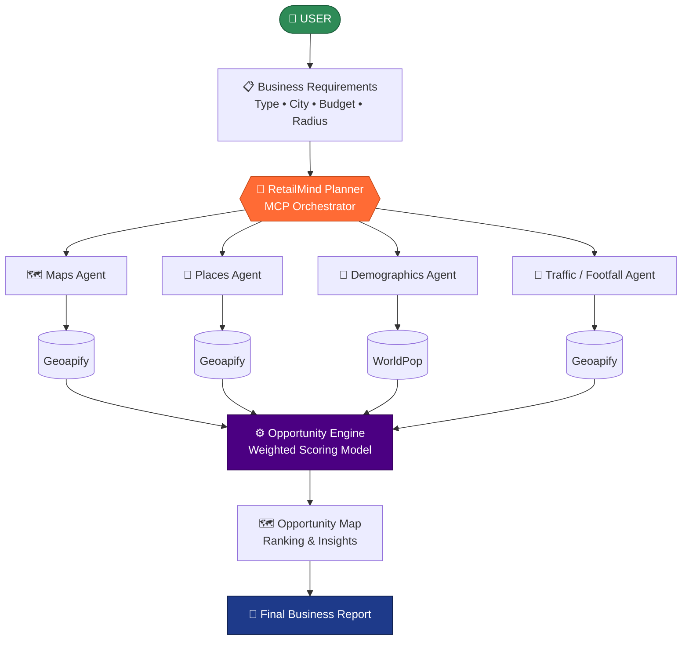

# 🧠 RetailMind — AI-Powered Retail Location Intelligence

> Enter a business type, city, budget & radius — get a ranked, explainable answer to *where* to open your next outlet.

    

**RetailMind — AI-Powered Retail Location Intelligence** is an [MCP (Model Context Protocol)](https://nitrostack.ai) server that extends AI assistants — like Claude, Cursor, and any MCP-compatible client — with new, real-world capabilities. It is built and deployed on [Nitrostack](https://nitrostack.ai), the fastest way to build, deploy, and share MCP apps.

## Table of Contents

- [Overview](#overview)
- [What is MCP?](#what-is-mcp)
- [Problem Statement](#problem-statement)
- [Features](#features)
- [System Architecture](#system-architecture)
- [Intelligence Components](#intelligence-components)
- [Opportunity Scoring Model](#opportunity-scoring-model)
- [MCP Tools](#mcp-tools)
- [Inputs & Outputs](#inputs--outputs)
- [Data Sources & Transparency](#data-sources--transparency)
- [End-to-End Workflow](#end-to-end-workflow)
- [Getting Started](#getting-started)
- [Connect to an MCP Client](#connect-to-an-mcp-client)
- [Project Status](#project-status)
- [Tech Stack](#tech-stack)
- [Deploy Your Own MCP App](#deploy-your-own-mcp-app)
- [Explore More MCP Apps](#explore-more-mcp-apps)
- [FAQ](#faq)
- [Keywords](#keywords)
- [License](#license)

## Overview

AI-powered retail location intelligence. Enter business type, city, budget & radius — RetailMind analyzes competitors, demographics, and footfall potential across candidate zones via an MCP multi-agent architecture, then ranks them with an explainable 0–100 Opportunity Score. Built with TypeScript, NitroStack, Geoapify & WorldPop.

The system decomposes location intelligence into four specialized MCP components — **Maps, Places, Demographics, and Traffic** — coordinated by an MCP-based Planner. Their outputs feed an **Opportunity Engine** that applies a weighted scoring model, ranks every candidate zone, and produces a recommendation with an interactive map and executive summary.

> ### 🎯 RetailMind doesn't just answer *"Which location should I choose?"*
> ### It answers *"**Why** is this location better than the alternatives?"*

## What is MCP?

The **Model Context Protocol (MCP)** is an open standard that lets AI assistants securely connect to external tools, data sources, and services. Instead of being limited to what it was trained on, an AI model can call **MCP servers** to fetch live data, run actions, and integrate with real systems.

This project is one such MCP server. Learn more about building and shipping MCP apps at [nitrostack.ai](https://nitrostack.ai).

## Problem Statement

Retail businesses struggle to select the right location because there is no **unified, data-driven approach** for evaluating potential areas.

| ❌ The Challenge | ✅ What RetailMind Does |
|---|---|
| 📍 Difficulty identifying suitable locations | Discovers real candidate zones from geographic data |
| 🏪 Unclear competitor presence | Maps competitors and commercial anchor points |
| 👥 Limited demographic insights | Analyzes population, age profile, purchasing power |
| 🚶 Uncertainty about footfall potential | Derives a footfall score from real accessibility signals |
| 📊 Hard to compare multiple locations | Ranks all zones on one 0–100 scale |
| 💡 Heavy reliance on intuition | Explains *why* each zone scored the way it did |

## Features

- 🔌 **MCP-native** — works with any MCP-compatible client (Claude, Cursor, and more)
- 🛠️ **Tools, resources & prompts** — exposes structured capabilities to AI agents
- 🗺️ **Real location discovery** — finds actual candidate retail zones with real coordinates
- 🏪 **Competitor & anchor analysis** — evaluates the commercial environment around each zone
- 👥 **Demographic intelligence** — population, 18–35 age profile, purchasing-power proxy
- 🚶 **Footfall potential scoring** — derived from transport, education, commerce, dining, entertainment & healthcare signals
- 💰 **Budget-aware insights** — pairs investment budget with a derived cost-pressure indicator
- 🧠 **Explainable Opportunity Score** — a transparent 0–100 weighted model, not a black box
- 🏆 **Ranked recommendations** — best zone plus scored alternatives
- 📊 **Decision-support report** — risks, suggestions, and an executive summary
- ⚡ **Deployed on Nitrostack** — reliable, hosted, and instantly shareable
- 🔐 **Secure by design** — secrets stay in environment variables, never in code
- 🧩 **Composable** — combine with other MCP apps to build powerful AI workflows

## System Architecture

RetailMind uses a **multi-agent architecture** where the MCP-based Planner coordinates four specialized components. Their outputs flow into the Opportunity Engine, which scores and ranks every zone before rendering the map and final report.



<details>
<summary><b>📐 View ASCII architecture diagram</b></summary>

```text
                        USER
                         │
                         ▼
                 Business Requirements
       Business Type • City • Budget • Radius
                         │
                         ▼
              ┌──────────────────────┐
              │  RetailMind Planner  │
              │   MCP Orchestrator   │
              └──────────┬───────────┘
                         │
        ┌────────────────┼────────────────┬────────────────┐
        │                │                │                │
        ▼                ▼                ▼                ▼
 ┌────────────┐   ┌────────────┐   ┌──────────────┐  ┌────────────┐
 │ Maps Agent │   │Places Agent│   │ Demographics │  │Traffic /   │
 │            │   │            │   │    Agent     │  │Footfall    │
 └─────┬──────┘   └─────┬──────┘   └──────┬───────┘  └─────┬──────┘
       │                │                 │                │
       ▼                ▼                 ▼                ▼
   Geoapify          Geoapify          WorldPop         Geoapify
       │                │                 │                │
       └────────────────┴────────┬────────┴────────────────┘
                                 │
                                 ▼
                     ┌────────────────────┐
                     │ Opportunity Engine │
                     │ Weighted Scoring   │
                     └──────────┬─────────┘
                                │
                                ▼
                     ┌────────────────────┐
                     │ Opportunity Map    │
                     │ Ranking & Insights │
                     └──────────┬─────────┘
                                │
                                ▼
                     ┌────────────────────┐
                     │ Final Business     │
                     │ Report             │
                     └────────────────────┘
```

</details>

## Intelligence Components

### 🗺️ 1. Maps Agent — *Location Discovery*

Responsible for finding **where** to look.

- Identifies candidate retail zones within the selected city and search radius
- Retrieves real geographic locations and coordinates
- Supplies the location set consumed by every downstream component
- **Data source:** Geoapify location/map data

### 📍 2. Places Agent — *Competitive Landscape*

Responsible for understanding **what's already there**.

- Finds nearby competitors matched to the selected business type
- Identifies anchor points and important nearby places
- Evaluates the commercial environment around each zone
- Determines competition level and commercial attractiveness

### 👥 3. Demographics Agent — *Who Lives There*

Responsible for profiling **the customer base**.

- Analyzes population around each candidate location
- Calculates the **18–35 age-group profile**
- Estimates purchasing-power potential from surrounding commercial and affluence signals
- **Data source:** WorldPop population & age data

### 🚶 4. Traffic / Footfall Agent — *Customer Movement*

Responsible for estimating **how busy** a zone is, across six signal categories:

| | | |
|---|---|---|
| 🚌 Public transport | 🎓 Educational institutions | 🏬 Commercial areas |
| 🍽️ Restaurants & catering | 🎭 Entertainment locations | 🏥 Healthcare facilities |

These accessibility and activity signals are converted into a **Footfall Potential Score**.

> [!NOTE]
> The Footfall Potential Score is a **derived accessibility/activity indicator** — it is *not* a direct pedestrian count.

### ⚙️ Opportunity Engine — *Not an Agent*

A deterministic scoring layer that consumes all four component outputs and turns them into a decision:

1. Combines footfall potential, population, purchasing-power proxy, age profile, competition, and anchor points
2. Applies the defined **weighted scoring model**
3. Ranks all candidate zones
4. Selects the strongest retail location
5. Generates the final **Opportunity Score**

## Opportunity Scoring Model

The final Opportunity Score ranges from **0 to 100**.

| Component | Weight | Contribution |
|---|---:|---|
| 🚶 **Footfall Potential** | **30%** | ██████████████████████████████ |
| 👥 **Population** | **20%** | ████████████████████ |
| 🏪 **Competition** | **20%** | ████████████████████ |
| 💰 **Purchasing Power Proxy** | **15%** | ███████████████ |
| 🧑 **Age 18–35 Profile** | **10%** | ██████████ |
| 📍 **Anchor Points** | **5%** | █████ |
| **Total** | **100%** | |

This multi-dimensional model lets RetailMind compare candidate locations holistically instead of over-fitting to a single factor.

## MCP Tools

| MCP Tool | Function |
|---|---|
| 🗺️ **Maps Tool** | Discovers candidate zones and geographic locations |
| 📍 **Places Tool** | Finds competitors, POIs, and anchor points |
| 👥 **Demographics Tool** | Retrieves population and age-related demographic data |
| 🚶 **Traffic Tool** | Calculates footfall potential from nearby activity signals |
| ⚙️ **Opportunity Engine** | Combines insights, scores zones, and ranks opportunities |

**MCP capabilities in use:** agent orchestration · tool execution · structured communication · real-time data integration · modular architecture.

## Inputs & Outputs

### 📥 Inputs

| Input | Description |
|---|---|
| 🏪 **Business Type** | Type of retail business the user wants to establish |
| 🌆 **City** | Target city for location analysis |
| 💰 **Investment Budget** | Available investment budget |
| 📍 **Search Radius** | Geographic radius used to discover candidate areas |

```yaml
Business Type : Coffee Shop
City          : Coimbatore
Budget        : ₹1,00,00,000
Search Radius : 5 km
```

### 📤 Outputs

| 🏆 Recommendation | 📊 Supporting Intelligence |
|---|---|
| Recommended Retail Location | Footfall Potential Score |
| Opportunity Score (0–100) | Demographic Score |
| Ranked Candidate Zones | Competition Insights |
| Interactive Opportunity Map | Cost-Pressure / Budget Insights |
| | Potential Risks & Business Suggestions |
| | Executive Summary |

## Data Sources & Transparency

| Data Source | Used For |
|---|---|
| **Geoapify** | Geographic locations, candidate zones, POIs, competitors, anchor points, nearby facility/activity signals |
| **WorldPop** | Population and age-related demographic information |
| **RetailMind Derived Models** | Purchasing-power proxy, footfall potential, cost pressure, Opportunity Score |

> [!IMPORTANT]
> Some RetailMind indicators are **derived rather than directly measured**.

| Indicator | What it actually is |
|---|---|
| **Footfall Potential** | Estimated from nearby accessibility and activity signals — not direct pedestrian counts |
| **Purchasing Power** | A proxy based on surrounding commercial/affluence signals — not measured household income |
| **Cost Pressure** | A directional indicator — not actual locality-level rent data |

This keeps every recommendation **explainable**, with a clear line between observed data and derived indicators.

## End-to-End Workflow

| Step | Stage | What Happens |
|:--:|---|---|
| **1️⃣** | **User Input** | Business type, city, budget, and search radius are provided |
| **2️⃣** | **RetailMind Planner** | The MCP-based Planner coordinates the full analysis workflow |
| **3️⃣** | **Maps Analysis** | Candidate retail zones and coordinates are discovered |
| **4️⃣** | **Places Analysis** | Competitors, POIs, and commercial anchor points are identified |
| **5️⃣** | **Demographic Analysis** | Population, age profile, and purchasing power are evaluated |
| **6️⃣** | **Footfall Analysis** | Accessibility and activity signals become footfall-potential scores |
| **7️⃣** | **Opportunity Scoring** | The Engine applies the weighted scoring model |
| **8️⃣** | **Zone Ranking** | Candidate zones are ranked by Opportunity Score |
| **9️⃣** | **Opportunity Map** | Results are visualized on real geographic coordinates |
| **🔟** | **Final Report** | Recommendation, alternatives, risks, suggestions, and summary are delivered |

## Getting Started

### Prerequisites

- Node.js 18+
- A [Geoapify](https://www.geoapify.com/) API key
- An MCP-compatible client (Claude Desktop, Cursor, etc.)

### Installation

```bash
git clone https://github.com/your-username/retailmind.git
cd retailmind
npm install
```

### Configuration

Copy the example environment file and add your own values:

```bash
cp .env.example .env
```

```env
GEOAPIFY_API_KEY=your_geoapify_key_here
```

### Run

```bash
npm run start
```

## Connect to an MCP Client

Add this server to your MCP client configuration. A typical entry looks like:

```json
{
  "mcpServers": {
    "retailmind": {
      "command": "npm",
      "args": ["run", "start"]
    }
  }
}
```

Restart your client and the RetailMind tools will be available to your AI assistant.

### Try it

```text
Analyze the best location to open a coffee shop in Coimbatore
with a ₹1 crore budget within a 5 km radius.
```

## Project Status

| Component | Status |
|---|:--:|
| 🔌 MCP Server Integration | ✅ Complete |
| 🗺️ Maps Analysis | ✅ Complete |
| 📍 Places & Competitor Analysis | ✅ Complete |
| 👥 Demographic Analysis | ✅ Complete |
| 🚶 Footfall Potential Analysis | ✅ Complete |
| ⚙️ Opportunity Scoring Engine | ✅ Complete |
| 🏆 Candidate Zone Ranking | ✅ Complete |
| 🗺️ Interactive Opportunity Map | ✅ Complete |
| 📊 Business Insights | ✅ Complete |
| 📄 Executive Summary | ✅ Complete |

## Tech Stack

| Layer | Technology |
|---|---|
| **Language** | TypeScript |
| **Framework** | NitroStack |
| **Protocol** | Model Context Protocol (MCP) |
| **Tooling** | NitroStudio |
| **Geospatial Data** | Geoapify API |
| **Demographic Data** | WorldPop |
| **Interface** | Interactive Map / Widget UI |
| **Design** | Modular service-based architecture |

## Deploy Your Own MCP App

Want to build and ship an MCP server like this one? **[Nitrostack](https://nitrostack.ai)** lets you create, deploy, and host MCP apps in minutes — no infrastructure to manage.

👉 **Start building:** [https://nitrostack.ai](https://nitrostack.ai)

## Explore More MCP Apps

- 🌙 Discover and share MCP projects with the community on [r/mcptothemoon](https://www.reddit.com/r/mcptothemoon/)
- 🧰 Browse a growing catalog of MCP apps on [Nitrostack](https://nitrostack.ai/apps)

## FAQ

### What is an MCP server?

An MCP server implements the Model Context Protocol to expose tools, resources, and prompts that AI assistants can call. It lets an AI model take real actions and access live data.

### What does RetailMind do?

It analyzes multiple candidate zones in a city and recommends the strongest location for a new retail outlet — scoring each zone from 0–100 based on footfall potential, population, competition, purchasing power, age profile, and anchor points, then explaining the ranking.

### How is the Opportunity Score calculated?

Through a transparent weighted model: footfall potential (30%), population (20%), competition (20%), purchasing-power proxy (15%), 18–35 age profile (10%), and anchor points (5%). See [Opportunity Scoring Model](#opportunity-scoring-model).

### Is the footfall data a real pedestrian count?

No. It is a **derived** accessibility/activity indicator built from nearby transport, education, commercial, dining, entertainment, and healthcare signals. See [Data Sources & Transparency](#data-sources--transparency).

### Which AI clients does this work with?

Any MCP-compatible client, including Claude Desktop and Cursor. New clients are adding MCP support regularly.

### How do I deploy my own MCP app?

Use [Nitrostack](https://nitrostack.ai) to build, deploy, and host MCP apps without managing infrastructure.

## Keywords

`Enterprise AI & Workplace Automation` · `RetailMind` · `retail location intelligence` · `site selection` · `opportunity score` · `footfall analysis` · `geospatial analytics` · `MCP` · `Model Context Protocol` · `MCP server` · `MCP app` · `AI tools` · `AI agents` · `LLM tools` · `Claude MCP` · `Nitrostack` · `Geoapify` · `WorldPop` · `deploy MCP server` · `build MCP app`

## License

MIT © 2026

---

Built with ❤️ using the Model Context Protocol on [Nitrostack](https://nitrostack.ai). Share your MCP app on [r/mcptothemoon](https://www.reddit.com/r/mcptothemoon/).