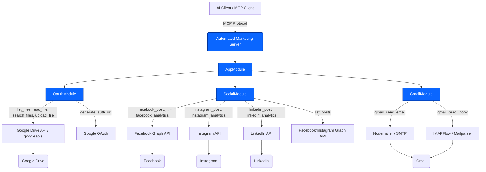

# Automated Marketing

> An MCP server that gives an AI agent everything it needs to run marketing campaigns.

  

**Automated Marketing** is an [MCP (Model Context Protocol)](https://nitrostack.ai) server that extends AI assistants — like Claude, Cursor, and any MCP-compatible client — with new, real-world capabilities. It is built and deployed on [Nitrostack](https://nitrostack.ai), the fastest way to build, deploy, and share MCP apps.

## Table of Contents

- [Overview](#overview)
- [What is MCP?](#what-is-mcp)
- [Architecture](#architecture)
- [Features](#features)
- [Getting Started](#getting-started)
- [Connect to an MCP Client](#connect-to-an-mcp-client)
- [Deploy Your Own MCP App](#deploy-your-own-mcp-app)
- [Explore More MCP Apps](#explore-more-mcp-apps)
- [FAQ](#faq)
- [Keywords](#keywords)
- [License](#license)

## Overview

An MCP server that gives an AI agent everything it needs to run marketing campaigns. It posts and tracks analytics across Facebook, Instagram, and LinkedIn, sends and reads emails through Gmail, and connects to Google Drive to search, list, and read files, including converting Docs and Sheets into usable text or CSV. One server, all the tools an AI needs to plan, publish and manage a campaign.

## What is MCP?

The **Model Context Protocol (MCP)** is an open standard that lets AI assistants securely connect to external tools, data sources, and services. Instead of being limited to what it was trained on, an AI model can call **MCP servers** to fetch live data, run actions, and integrate with real systems.

This project is one such MCP server. Learn more about building and shipping MCP apps at [nitrostack.ai](https://nitrostack.ai).

## Architecture

The server is built using `@nitrostack/core` and consists of modular components integrating various third-party services. Below is the MermaidJS architecture diagram showcasing how the modules and underlying tools fit together.



### Tools Used in the Architecture
- **Framework & Core**: `@nitrostack/core`, `@nitrostack/cli` for the MCP standard lifecycle and dependency injection. `zod` for validating tool input schemas.
- **Social Module (`SocialController`)**: Manages external posts and analytics using standard HTTP fetches and respective service APIs for Facebook, Instagram, and LinkedIn.
- **Gmail Module (`GmailController`)**: Leverages `nodemailer` to send emails, and `imapflow` paired with `mailparser` to read the inbox natively.
- **OAuth Module (`OauthController`)**: Uses `googleapis` to interface with the Google Drive API for auth URLs, listing, searching, downloading, and uploading files.

## Features

- 🔌 **MCP-native** — works with any MCP-compatible client (Claude, Cursor, and more)
- 🛠️ **Tools, resources & prompts** — exposes structured capabilities to AI agents
- ⚡ **Deployed on Nitrostack** — reliable, hosted, and instantly shareable
- 🔐 **Secure by design** — secrets stay in environment variables, never in code
- 🧩 **Composable** — combine with other MCP apps to build powerful AI workflows

## Getting Started

### Prerequisites

- Node.js 18+ (or your project runtime)
- An MCP-compatible client (Claude Desktop, Cursor, etc.)

### Installation

```bash
git clone https://github.com/your-username/your-mcp-project.git
cd automated-marketing
npm install
```

### Configuration

Copy the example environment file and add your own values:

```bash
cp .env.example .env
```

### Run

```bash
npm run start
```

## Connect to an MCP Client

Add this server to your MCP client configuration. A typical entry looks like:

```json
{
  "mcpServers": {
    "automated-marketing": {
      "command": "npm",
      "args": ["run", "start"]
    }
  }
}
```

Restart your client and the tools from this MCP server will be available to your AI assistant.

## Deploy Your Own MCP App

Want to build and ship an MCP server like this one? **[Nitrostack](https://nitrostack.ai)** lets you create, deploy, and host MCP apps in minutes — no infrastructure to manage.

👉 **Start building:** [https://nitrostack.ai](https://nitrostack.ai)

## Explore More MCP Apps

- 🌙 Discover and share MCP projects with the community on [r/mcptothemoon](https://www.reddit.com/r/mcptothemoon/)
- 🧰 Browse a growing catalog of MCP apps on [Nitrostack](https://nitrostack.ai/apps)

## FAQ

### What is an MCP server?

An MCP server implements the Model Context Protocol to expose tools, resources, and prompts that AI assistants can call. It lets an AI model take real actions and access live data.

### What does Automated Marketing do?

An MCP server that gives an AI agent everything it needs to run marketing campaigns.

### Which AI clients does this work with?

Any MCP-compatible client, including Claude Desktop and Cursor. New clients are adding MCP support regularly.

### How do I deploy my own MCP app?

Use [Nitrostack](https://nitrostack.ai) to build, deploy, and host MCP apps without managing infrastructure.

## Keywords

`Enterprise AI & Workplace Automation` · `Automated Marketing` · `MCP` · `Model Context Protocol` · `MCP server` · `MCP app` · `AI tools` · `AI agents` · `LLM tools` · `Claude MCP` · `Nitrostack` · `deploy MCP server` · `build MCP app`


Built with ❤️ using the Model Context Protocol on [Nitrostack](https://nitrostack.ai). Share your MCP app on [r/mcptothemoon](https://www.reddit.com/r/mcptothemoon/).
