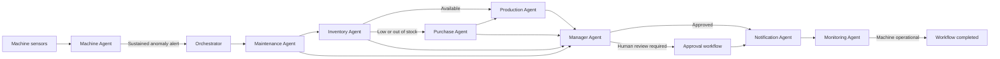

# FactoryBrain

### Multi-agent AI for autonomous manufacturing operations

> Factories do not lose money only because machines fail. They lose money because decisions happen too late.

FactoryBrain is an agentic manufacturing operations platform built with [NitroStack](https://github.com/nitrostackai/nitrostack) and the Model Context Protocol (MCP). Specialized agents collaborate to detect sustained machine anomalies, plan maintenance, verify spare-part availability, recommend suppliers, protect production schedules, obtain approvals, notify stakeholders, and monitor recovery.

Instead of stopping at a failure alert, FactoryBrain coordinates the operational response from sensor signal to restored production.

## Why FactoryBrain?

Manufacturing data is often fragmented across machine monitoring, maintenance, inventory, procurement, scheduling, and management systems. When a machine begins to degrade, people must manually coordinate decisions between these systems—often after downtime has already started.

FactoryBrain connects those functions through autonomous, auditable agents that can:

- Detect persistent anomalies instead of reacting to a single noisy reading.
- Create a maintenance plan using machine configuration and repair history.
- Reserve an available spare part or initiate procurement when stock is insufficient.
- Rank suppliers using urgency, delivery speed, reliability, and cost.
- Propose production rerouting without silently changing an approved schedule.
- Apply configurable manager-approval policies.
- Notify maintenance, procurement, requesters, supervisors, and dashboards.
- Track the workflow until the machine returns to service.

## End-to-end workflow



Every transition is recorded with an idempotency key and workflow state, making the chain of decisions explainable and resistant to duplicate execution.

## Agent responsibilities

| Agent | Responsibility | Representative outcome |
|---|---|---|
| Machine | Evaluates complete timestamped telemetry against healthy baselines and persistence rules | Failure probability, evidence, urgency, likely cause, alert |
| Maintenance | Uses the machine registry and repair history to prepare the intervention | Ticket, required part, technician, team, repair estimate |
| Inventory | Validates parts, checks available quantity, and reserves stock | In-stock, low-stock, or out-of-stock decision |
| Purchase | Ranks compatible active suppliers | Supplier recommendation and purchase request |
| Production | Finds affected orders and validates alternate capacity | Proposed reroutes, delays, and recovery plan |
| Manager | Synthesizes cost and operational impact under approval policy | Approval request, decision, executive report |
| Notification | Delivers role-specific messages with retries and deduplication | Maintenance, procurement, floor, requester, and dashboard updates |
| Monitoring | Normalizes external status events and detects stalled stages | Live workflow status, alerts, recovery completion |

## Key capabilities

- Multi-agent orchestration with durable stage transitions
- MCP tools, resources, prompts, and interactive dashboard widgets
- Rolling-window anomaly detection with sustained-event thresholds
- Maintenance-history-aware repair planning
- Atomic inventory reservation when MongoDB is enabled
- Urgency-aware supplier scoring
- Priority-aware production rerouting
- Automatic and human-in-the-loop approvals
- Redis/BullMQ delivery with retries and dead-letter handling
- In-memory fallback for a zero-infrastructure demonstration
- MongoDB persistence for durable workflows
- Socket.IO updates for live dashboards
- Duplicate suppression across workflows, events, and notifications

## Technology stack

| Layer | Technology |
|---|---|
| Agent and MCP framework | NitroStack, Model Context Protocol |
| Backend | TypeScript, Node.js, Zod |
| Durable database | MongoDB |
| Event delivery | Redis, BullMQ |
| Realtime gateway | Socket.IO, WebSocket |
| Widgets | React, Next.js, `@nitrostack/widgets` |
| Testing | Node.js test runner, in-memory and integration suites |
| Demo data | Machine, sensor, maintenance, inventory, supplier, and production CSV datasets |

## Project structure

```text
src/
├── modules/
│   ├── machine/          # Telemetry analysis and failure alerts
│   ├── maintenance/      # Maintenance tickets and repair planning
│   ├── inventory/        # Stock lookup and reservations
│   ├── purchase/         # Supplier scoring and purchase requests
│   ├── production/       # Disruption and rerouting plans
│   ├── manager/          # Approval policy and decision reports
│   ├── notification/     # Delivery, retries, and recipients
│   └── monitoring/       # Workflow tracking and stall detection
├── orchestrator/         # Workflow state machine and routing
├── services/             # Database, queue, AI, and prompt services
├── resources/            # MCP operational resources
├── prompts/              # Versioned agent prompts
├── gateway/              # Realtime event gateway
└── widgets/              # Factory dashboards and operational cards

data/                     # Demo factory datasets
tests/                    # Unit, workflow, and integration tests
```

## Quick start

### Prerequisites

- Node.js 20 or newer
- npm
- NitroStudio for the recommended interactive demo
- Docker Desktop only if running MongoDB/Redis integration tests

### Install and run

```bash
git clone https://github.com/praishwarya10/nitrostack.git
cd nitrostack/sample-apps/factorybrain
npm install
cp .env.example .env
npm run dev
```

On Windows PowerShell, copy the environment file with:

```powershell
Copy-Item .env.example .env
```

Open the MCP server in [NitroStudio](https://nitrostack.ai/studio) to inspect tools, run scenarios, and view agent activity.

The default local mode does not require MongoDB or Redis. When those services are configured, FactoryBrain automatically uses durable storage and queued event delivery.

## Configuration

The included [`.env.example`](.env.example) documents all supported settings. Common options include:

```dotenv
NITROSTACK_APP_MODE=universal
PORT=3001
HOST=localhost

# Optional durable infrastructure
MONGODB_URI=mongodb://localhost:27017
MONGODB_DATABASE=factorybrain
REDIS_URL=redis://localhost:6379

# Manager policy
FACTORYBRAIN_APPROVAL_THRESHOLD=1000
FACTORYBRAIN_AUTO_APPROVAL=true

# Optional OpenAI-compatible model provider
FACTORYBRAIN_AI_BASE_URL=https://your-provider.example/v1
FACTORYBRAIN_AI_API_KEY=
FACTORYBRAIN_AI_MODEL=gpt-5-mini
```

Never commit a populated `.env` file. Environment files, virtual environments, dependencies, generated builds, credentials, and NitroStudio runtime state are excluded by `.gitignore`.

## Hackathon demo

Start a fresh server session, reconnect the project in NitroStudio, and use this short prompt:

```text
Simulate a critical predictive-maintenance event for CNC machine M002 using three consecutive abnormal sensor readings.

Run the complete FactoryBrain workflow autonomously: failure prediction, alert creation, maintenance ticket, inventory check, conditional procurement, production recovery planning, manager approval, notifications, and monitoring.

Use only actual tool results, do not duplicate automatically completed steps, and do not invent missing data. Briefly explain each agent's decision and finish with the final business outcome and workflow status.
```

M002 is used because its configured health and risk profile can genuinely reach the Critical classification under the current scoring policy. Procurement remains conditional: if the required part is available, the system reserves it and correctly skips purchasing.

## Available commands

```bash
npm run dev              # Start the NitroStack development environment
npm run build            # Build TypeScript and bundle all widgets
npm start                # Build and start the production server
npm run start:prod       # Start from the existing production build
npm test                 # Build and run the complete unit suite
npm run test:unit        # Run unit and in-memory workflow tests
npm run test:integration # Run the MongoDB/Redis integration pipeline
npm run infra:up         # Start integration infrastructure with Docker
npm run infra:down       # Stop and remove integration infrastructure
```

## Testing

Run the standard verification suite:

```bash
npm test
```

The test suite covers:

- Tool input validation and direct NitroStudio controller initialization
- Failure prediction and sustained anomaly handling
- Maintenance ticket generation
- Inventory reservation and invalid-part protection
- Supplier ranking and procurement branching
- Production rerouting and conflict detection
- Manager approval and rejection paths
- Notification retries and duplicate suppression
- Monitoring, out-of-order events, stalls, and recovery
- Complete Machine → Maintenance → Inventory → Purchase → Production → Manager → Notification → Monitoring execution

For durable infrastructure testing:

```bash
npm run infra:up
npm run test:integration
npm run infra:down
```

## Safety and decision boundaries

FactoryBrain is designed as a decision-support and orchestration prototype:

- A single abnormal reading does not automatically generate a maintenance alert.
- Invalid part identifiers fail safely and cannot trigger accidental procurement.
- Production changes are proposed and remain subject to manager policy.
- High-value actions can pause for explicit human approval.
- The system does not claim repair completion until monitoring confirms that the machine is operational.

## Documentation

- [System architecture](FactoryBrain-AI-System-Architecture.md)
- [Implementation guide](FactoryBrain-AI-Build-Guide.md)
- [React widgets implementation](FactoryBrain%20React%20Widgets%20Implementation.docx)
- [NitroStack documentation](https://docs.nitrostack.ai)
- [NitroStudio](https://nitrostack.ai/studio)

## Roadmap

- Digital-twin integration
- Real industrial telemetry connectors
- Computerized maintenance management system integrations
- ERP and supplier marketplace integrations
- Multi-factory coordination
- Energy and carbon optimization
- Workforce scheduling
- Reinforcement-learning-based production policies

## Team

Built by **Team Naalvar** for an Agentic AI Hackathon.

## Project status

FactoryBrain is a hackathon prototype intended for demonstration, evaluation, and research. Validate operational recommendations and safety procedures before connecting the system to real manufacturing equipment or production systems.

---

> **FactoryBrain turns disconnected factory data into coordinated decisions before downtime happens.**
