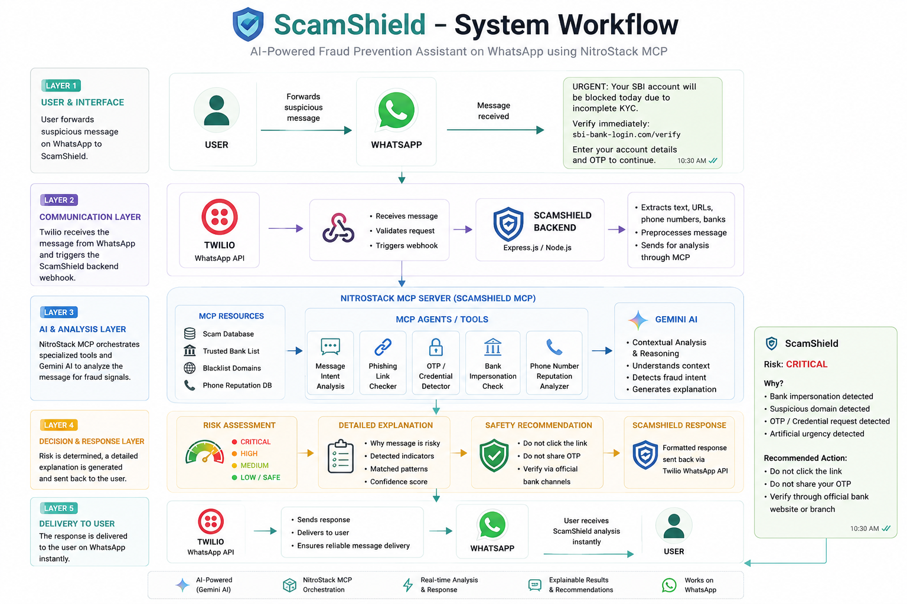

# 🛡️ ScamShield

### AI-Powered Explainable Fraud Prevention Assistant using NitroStack MCP

ScamShield is an AI-powered fraud prevention system designed to help users identify suspicious WhatsApp messages, phishing links, OTP scams, fake bank messages, and other social-engineering attacks.

The project uses **NitroStack MCP**, **Gemini AI**, and **Twilio WhatsApp** to analyse suspicious messages and provide an explainable risk assessment with actionable safety recommendations.

---

## 🎯 Problem Statement

Online fraudsters frequently use fake bank messages, phishing links, OTP requests, urgency, and impersonation to trick users into revealing sensitive information.

Many users may not be able to determine whether a message is genuine or fraudulent before clicking a link, sharing an OTP, or providing sensitive information.

**ScamShield** provides an intelligent security assistant that analyses suspicious messages before users take potentially dangerous actions.

---

## ✨ Features

- 🔍 Message scam analysis
- 🔐 OTP and credential protection
- 🔗 Suspicious link analysis
- 📞 Phone number risk analysis
- 🏦 Bank impersonation detection
- 🧠 AI-powered contextual fraud analysis
- 📊 Explainable risk assessment
- 💬 WhatsApp integration
- ⚙️ NitroStack MCP security tools
- ⚠️ Risk-level classification
- 🛡️ Actionable safety recommendations

---

## 🔄 System Workflow

<p align="center">
  
</p>

<p align="center">
  <i>ScamShield workflow — from receiving a suspicious WhatsApp message to AI-powered fraud analysis and real-time safety recommendations.</i>
</p>

### How It Works

1. 👤 A user receives a suspicious message.
2. 💬 The message is forwarded to **ScamShield through WhatsApp**.
3. 📡 **Twilio WhatsApp API** receives the message and triggers the ScamShield webhook.
4. 🛡️ The **ScamShield backend** extracts relevant information from the message.
5. ⚙️ **NitroStack MCP** invokes specialised fraud-detection tools.
6. 🤖 **Gemini AI** performs contextual fraud analysis and reasoning.
7. 📊 ScamShield determines the risk level and generates an explanation.
8. ✅ A safety recommendation is generated.
9. 📲 The result is returned to the user through WhatsApp.

---

## 🛠️ NitroStack MCP Tools

ScamShield contains specialised MCP security tools:

- `otp_share_guard` – Detects attempts to obtain OTPs or sensitive credentials
- `analyze_message_intent` – Analyses suspicious message intent
- `check_link_safety` – Checks suspicious URLs
- `phone_number_risk_check` – Analyses potentially suspicious phone numbers
- `verify_bank_identity` – Helps identify bank impersonation attempts

---

## 🤖 AI Integration

**Gemini AI** is used for contextual analysis of suspicious messages.

The AI examines indicators such as:

- Urgency
- Threats
- Requests for credentials
- OTP requests
- Bank impersonation
- Suspicious links
- Social-engineering language

Gemini AI works together with ScamShield's specialised **NitroStack MCP security tools** to produce an explainable fraud-risk assessment.

---

## ⚠️ Risk Assessment

ScamShield classifies suspicious messages into risk levels:

- 🟢 **SAFE** – No significant fraud indicators detected
- 🟡 **SUSPICIOUS** – Some potentially suspicious indicators detected
- 🟠 **HIGH** – Multiple strong fraud indicators detected
- 🔴 **CRITICAL** – Strong evidence of phishing, credential theft, impersonation, or other fraud

The response explains **why** the message received its risk level and provides recommended actions.

---

## 💬 Example ScamShield Response

```text
🛡️ ScamShield

Risk: CRITICAL

🔎 Why:
• Bank impersonation detected
• Suspicious domain detected
• OTP / credential request detected
• Artificial urgency detected

✅ Recommended Action:
• Do not click the link
• Do not share your OTP
• Verify the request through official bank channels
```

---

## 💻 Technology Stack

- TypeScript
- Node.js
- NitroStack MCP
- Model Context Protocol (MCP)
- Gemini AI
- Twilio WhatsApp API
- ngrok
- GitHub

---

## 🚀 Local Development

Install dependencies:

```bash
npm install
```

Start the development server:

```bash
npm run dev
```

---

## 🧪 Testing

The project has been tested for:

- MCP server functionality
- NitroStack Studio integration
- Gemini AI integration
- ScamShield fraud-analysis tools
- WhatsApp/Twilio message flow

---

## 👥 Project

**Team:** Code Crafters  
**Project:** ScamShield  
**Category:** AI-Powered Fraud Prevention

---

## 🛡️ ScamShield

> **Think before you trust.**

Forward the suspicious message.  
**ScamShield investigates it for you.**