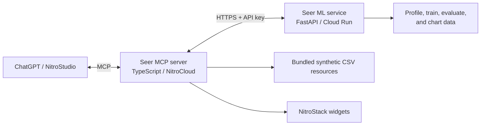

# Seer

> Ask your data. Understand the process. See what comes next.

Seer is an MCP application for transparent, CSV-based predictive analysis. It
helps non-technical users profile approved datasets, explicitly approve a
supervised-learning plan, and understand a resulting estimate or
classification. It is designed for the Enterprise AI & Workplace Automation
use case.

Seer supports eligible, fixed CSV datasets; it does not claim to model every
CSV or establish causal relationships.

## What it does

1. Exposes approved datasets through MCP resources.
2. Profiles the full CSV for schema, quality, and modelling eligibility.
3. Validates a regression or classification plan against the dataset.
4. Issues a signed review token, then exchanges it for an execution-only token after approval.
5. Trains and evaluates the approved plan atomically in the ML service.
6. Returns evidence, charts, warnings, and prediction coverage to MCP widgets.

The bundled datasets demonstrate both supported task types:

| Dataset | Task | Example target |
| --- | --- | --- |
| Employee Compensation | Regression | `annual_salary` |
| Employee Attrition | Classification | `attrition` |
| Iris | Classification | `species` |
| Titanic | Classification | `survived` |
| Wine | Classification | `cultivar` |
| Auto MPG | Regression | `mpg` |

Dataset sources, attribution, and intentional preparation are documented in
[the bundled-datasets guide](docs/datasets.md). Titanic is a historical
teaching dataset: its results are not causal or suitable for decisions about
people.

The attrition data is generated from a latent probability rather than a rule, so
the classes overlap on every feature, a share of rows contradict the trend, and
the model lands well short of perfect. That is deliberate: a near-perfect score
on synthetic data demonstrates nothing.

## The quality label is a heuristic

Every result carries one of three labels. They come from a fixed threshold the
ML service applies to a single train/test split:

| Label | Rule |
| --- | --- |
| Better than the comparison | Regression MAE improves by at least 5%, or classification weighted F1 improves by at least 5 absolute points |
| Slightly better | Any improvement below that threshold |
| Not better | No improvement over the baseline |

This is a product heuristic for describing one comparison in plain language. It
is **not** a test of statistical significance, a confidence interval, or
evidence that the result generalises beyond the split it was measured on. The
thresholds were chosen for legibility, not derived from the data.

Classification probabilities come directly from `predict_proba`. Seer does not
evaluate calibration, so they are reported as the model's own assigned
probability and must not be read as a measured likelihood.

## Target display metadata

A dataset may declare how its target should be shown. Seer never infers a unit
from a column name—`annual_salary` says nothing about rupees versus dollars—so
an undeclared target renders as a bare number:

```json
"targetDisplay": { "column": "annual_salary", "unit": "INR/year", "decimals": 0 }
```

The display applies only when `column` matches the target actually being
predicted.

## Supported scope

- One target column with numeric and categorical input features.
- Linear regression with a `DummyRegressor` baseline.
- Logistic regression with a `DummyClassifier` baseline.
- Missing-value imputation, numeric scaling, and categorical one-hot encoding.
- Train/test evaluation, plot-ready diagnostics, and up to ten prediction rows.

User uploads, databases, time-series, free-text, images, deep learning,
hyperparameter optimisation, arbitrary Python execution, and model persistence
are intentionally out of scope.

## Architecture

The TypeScript MCP server runs in NitroCloud and the Python ML service deploys
independently to Google Cloud Run. The full design and trust boundaries are in
[the architecture guide](docs/architecture.md).



## Local development

Prerequisites: Node.js with npm, and [uv](https://docs.astral.sh/uv/). The
checked-in [`ml-service/.python-version`](ml-service/.python-version) pins the
ML service to Python 3.12; use `uv`, not a manually-created virtual environment.

1. Copy the example configuration and set distinct secrets:

   ```bash
   cp .env.example .env
   ```

   `ML_SERVICE_API_KEY` must be the same value in both services.
   `ANALYSIS_PLAN_TOKEN_SECRET` must be a different value of at least 32
   characters.

2. Start the ML service in one terminal:

   ```bash
   cd ml-service
   uv sync --extra dev
   ML_SERVICE_API_KEY=your-secret uv run uvicorn app.main:app --port 8080
   ```

3. Start the MCP server from the repository root in another terminal:

   ```bash
   npm install
   npm run dev
   ```

## MCP workflow

Use the tools in this order:

1. Read `seer://datasets` and call `profile_dataset`.
2. Call `create_analysis_plan` with only columns returned by the profile.
3. Show the plan and obtain explicit user approval.
4. Call `confirm_analysis_plan` with the review token, then `run_analysis` with the returned execution token.
5. Present the returned metrics, warnings, limitations, and chart data as
   estimates—not guarantees.

The `seer_guided_analysis` prompt supplies this sequence to MCP hosts, and the
`seer_getting_started` prompt introduces Seer's scope and approved datasets to a
new user before any tool is called. The `seer_help` tool returns the same
orientation on demand—capabilities, approved datasets, tool order, and the
limits currently enforced—for hosts that cannot surface prompts.
`run_analysis` rejects review tokens as well as altered, expired, or
dataset-mismatched execution tokens. The current NitroStack runtime does not
expose MCP elicitation, so compatible hosts must obtain the user’s explicit
approval before calling `confirm_analysis_plan`; the approval widget follows
that sequence.

## Configuration

Copy `.env.example`; never commit `.env` or real secret values. Set secrets in
NitroCloud and Cloud Run's secret manager rather than build arguments or source
files.

| Variable | Default | Used by | Purpose |
| --- | --- | --- | --- |
| `ML_SERVICE_BASE_URL` | `http://127.0.0.1:8080` | MCP server | ML service URL; HTTPS is required outside local development. |
| `ML_SERVICE_API_KEY` | required | Both | Shared bearer secret for every ML-service request. |
| `ANALYSIS_PLAN_TOKEN_SECRET` | required | MCP server | Separate 32+ character HMAC secret for approval tokens. |
| `ML_SERVICE_TIMEOUT_MS` | `120000` | MCP server | Timeout per ML-service attempt, in milliseconds. |
| `ML_SERVICE_MAX_RETRIES` | `1` | MCP server | Retries a connection failure or 5xx response once after 250 ms. |
| `ML_PROFILE_MAX_CSV_BYTES` | `5242880` | ML service | Maximum CSV size (5 MiB). |
| `ML_PROFILE_MAX_CSV_ROWS` | `20000` | ML service | Maximum dataset rows. |
| `ML_PROFILE_MAX_CSV_COLUMNS` | `50` | ML service | Maximum dataset columns. |
| `ML_PROFILE_MAX_CATEGORICAL_VALUES` | `50` | Both | Maximum categorical values per feature. |
| `ML_PROFILE_SAMPLE_ROWS` | `10` | ML service | Number of profile sample rows returned. |
| `ML_MAX_ENCODED_FEATURES` | `500` | Both | Maximum one-hot-encoded feature count. |
| `ML_MAX_PREDICTION_ROWS` | `10` | Both | Maximum prediction rows per plan. |
| `ML_MIN_USABLE_ROWS` | `20` | Both | Minimum non-missing-target rows needed to analyse. |
| `ML_SMALL_DATASET_WARNING_ROWS` | `100` | Both | Warn when usable target rows are below this value. |
| `ML_MAX_CLASSIFICATION_CLASSES` | `10` | Both | Maximum target classes for classification. |
| `ML_CLASS_IMBALANCE_THRESHOLD_PERCENT` | `20` | ML service | Warn when a usable target class falls below this percentage. |
| `NITRO_LOG_LEVEL` | `info` | MCP server | NitroStack log verbosity. |
| `NITROSTACK_APP_MODE` | `universal` | MCP server | NitroStack application mode. |
| `MCP_TRANSPORT_TYPE` | framework default | MCP server | Optional `stdio`, `http`, or `dual` transport selection. |
| `PORT`, `HOST`, `ENABLE_CORS` | framework default | MCP server | Optional HTTP transport settings. |

Retries never apply to timeouts, cancellations, authentication or validation
failures, or malformed ML-service responses. `X-Request-ID` is forwarded to the
ML service and echoed in the response for safe request correlation; CSV content
and prediction inputs are not logged.

## Reliability and responsible use

Seer enforces size, schema, category, encoded-feature, and prediction-row
limits before model fitting. It surfaces missing data, duplicate rows,
unsupported columns, small datasets, class imbalance, weak baseline
comparisons, unseen categories, and extrapolation beyond observed or training
ranges. Every final result also warns that selected features can omit important
factors and that historical data can reflect bias or unequal outcomes.

Results are estimates based on historical synthetic data. They can be wrong,
and relevant explanatory variables or biases may be absent. Do not use Seer as
the sole basis for employment, compensation, or other high-impact decisions.

## Deployment

Deploy `ml-service/` separately to Cloud Run (the intended region is
`asia-south1`) using its Dockerfile, and deploy the repository-root NitroStack
application to NitroCloud. Configure the same `ML_SERVICE_API_KEY` as a Cloud
Run secret and NitroCloud environment variable, then set
`ML_SERVICE_BASE_URL` in NitroCloud to the Cloud Run HTTPS URL. Keep
`ANALYSIS_PLAN_TOKEN_SECRET` in NitroCloud only.

The Python service's `/health` endpoint returns:

```json
{"status":"healthy","service":"seer-ml","version":"0.1.0"}
```

Cloud Run can permit unauthenticated invocation only when the shared bearer
secret remains configured and protected. Prefer a restricted service endpoint
and managed secrets in any environment beyond this MVP.

## Verification

Run the following checks from the repository root:

```bash
npm run test:unit
cd ml-service && uv run --extra dev pytest -q
```

`npm run test:unit` performs the NitroStack production build and bundles all
four widgets before running the TypeScript unit tests.

For a local end-to-end check, start both services, then execute
`python_health`, profile each bundled dataset, create and confirm an approved
regression plan, and repeat with a classification plan.

## Project layout

```text
src/                 TypeScript NitroStack MCP server, resources, tools, widgets
ml-service/          Python 3.12 FastAPI and scikit-learn service
docs/                Architecture and operational documentation
.env.example         Safe configuration template
```
