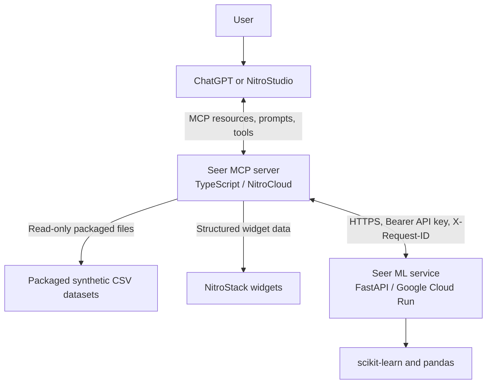
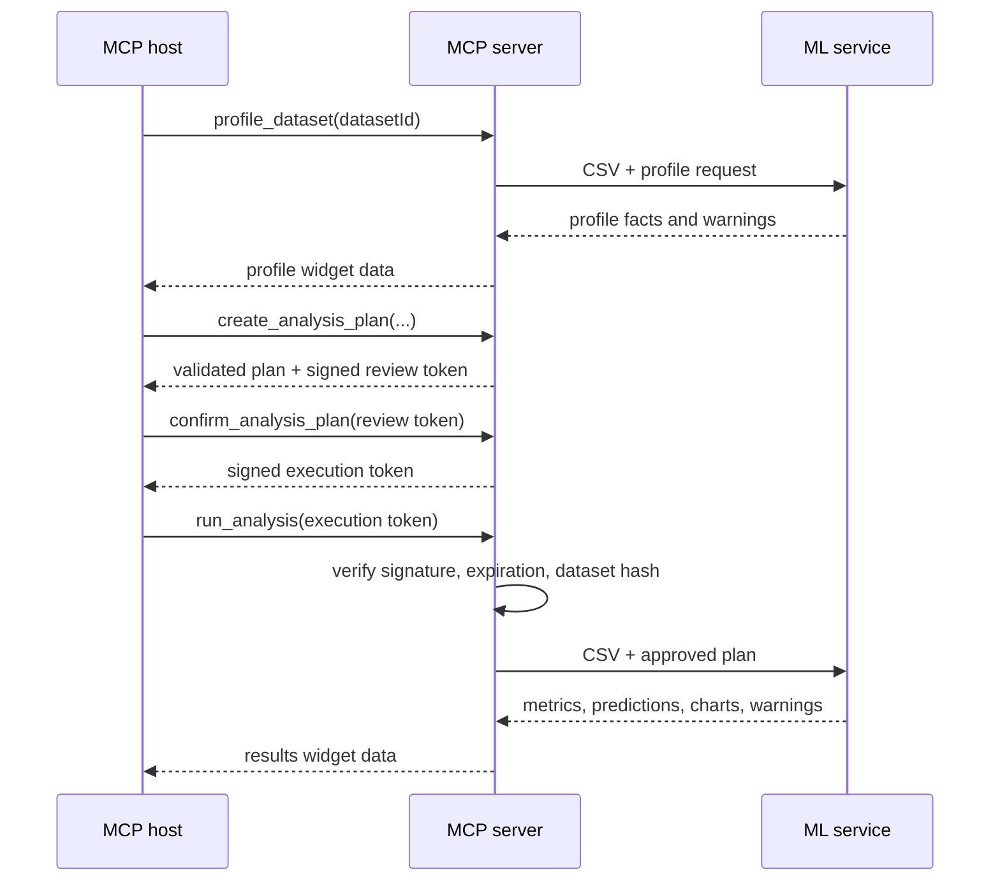

# Seer architecture

## System overview

## Approved-analysis flow

## Boundaries and responsibilities

| Component | Responsibilities | Must not do |
| --- | --- | --- |
| MCP host / LLM | Understand the question, select profiled columns, request approval, explain returned evidence. | Invent columns, modify a plan token, calculate metrics, or claim causality. |
| MCP server | Expose datasets, validate plans, sign/verify tokens, invoke the ML service, return widgets and safe errors. | Train models or persist a reusable model. |
| ML service | Parse CSVs, profile data, enforce eligibility, train/evaluate models, produce predictions and chart data. | Execute arbitrary Python or accept unapproved plans. |
| Cloud secret stores | Hold API and HMAC secrets. | Expose secret values in logs, source, or client responses. |

## Security model

- The MCP server is the trust boundary for dataset selection and plan approval.
- `ANALYSIS_PLAN_TOKEN_SECRET` signs versioned review and execution tokens
  containing the dataset hash and a 15-minute expiry. `run_analysis` accepts
  only execution tokens and rejects review, tampered, expired, or
  dataset-mismatched tokens.
- The compatible host or approval widget must collect explicit user approval
  before calling `confirm_analysis_plan`. The installed NitroStack runtime does
  not expose MCP elicitation, so it cannot independently attest a human click.
- `ML_SERVICE_API_KEY` is a separate shared bearer secret required by the ML
  service. It is sent only over HTTPS outside local development.
- Request IDs provide correlation across services without logging CSV contents
  or prediction inputs.
- The MVP has no database, user upload path, arbitrary-code endpoint, or model
  persistence layer.

## Deployment topology

Deploy the repository-root NitroStack server to NitroCloud. Deploy
`ml-service/` independently to Cloud Run in `asia-south1`. Store
`ML_SERVICE_API_KEY` in both platforms' secret configuration, store
`ANALYSIS_PLAN_TOKEN_SECRET` only in NitroCloud, and set NitroCloud's
`ML_SERVICE_BASE_URL` to the Cloud Run HTTPS address. Cloud Run receives only
the bounded CSV and approved plan supplied by the MCP server.
