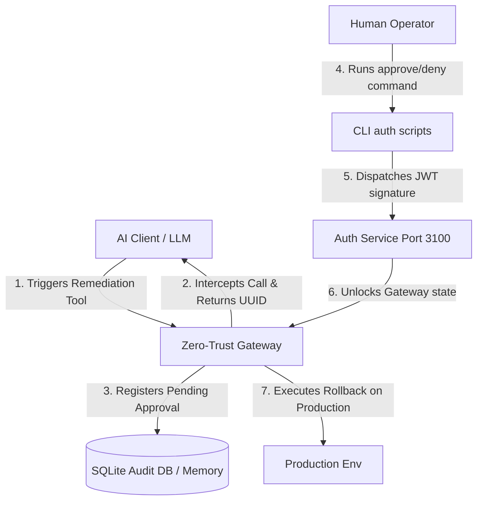

# 🛡️ Zero-Trust-Commander

**A Next-Generation MCP Server for Zero-Trust Incident Response & Safe AI Autonomy**

Zero-Trust-Commander is an autonomous infrastructure remediation gateway built on the [NitroStack](https://nitrostack.ai) framework. It empowers AI agents to investigate production outages, trace broken commits, and analyze system health—while strictly enforcing a **Human-in-the-Loop Zero-Trust Security Gate** for all destructive or mutating actions.

AI is incredibly fast at diagnosing issues, but giving autonomous agents direct administrative keys to production is a severe security risk. Zero-Trust-Commander bridges the gap: it allows AI agents to act autonomously up to the point of change, then halts execution until a authorized human cryptographically signs off.

---

## 🚀 Key Features

*   **Zero-Trust Interception Gate**: High-risk tool calls (like `execute_rollback`) are automatically intercepted, assigned a unique UUID tracking ID, and paused in a `PENDING_APPROVAL` state.
*   **Cryptographic Human-in-the-Loop Validation**: Approvals are validated using time-bound JWT tokens. Humans sign off via clean, secure CLI tools.
*   **Infrastructure Blast Radius Analysis**: When querying the system state, the `infrastructure://current-state` resource performs a **Breadth-First Search (BFS)** dependency traversal. The AI uses this to calculate the blast radius of any remediation action and presents it to the human operator.
*   **Persistent SQLite Audit Logs**: All actions, approvals, and denials are recorded in a local SQLite database (`audit.db`) with an automatic in-memory array fallback if native SQLite drivers are unavailable.
*   **Strict Zod Schema Validation**: Upgraded input validation on all tools (`fetch_recent_errors`, `diff_recent_commits`, `execute_rollback`) to prevent prompt-injection attacks and LLM hallucinations.

---

## 🏗️ Architecture



1.  **MCP Gateway (Port 3000)**: Serves the Zero-Trust-Commander tools, resources, and investigation workflows.
2.  **Auth Service (Port 3100)**: An internal API server managing pending transactions, JWT validation, and audit database logging.
3.  **CLI Remediator**: Command-line helper utilities (`npm run approve` / `npm run deny`) to authorize or reject pending actions.

---

## 🎮 Hackathon Demo: Step-by-Step

Follow these steps to demonstrate the secure zero-trust pipeline to the judges:

### 1. Installation & Setup
Install the project dependencies and build the server:
```bash
npm install
npm run build
```

### 2. Start the Zero-Trust Server
Run the unified MCP gateway and authentication server:
```bash
npm start
```
*You will see the terminal confirm that the SQLite database is ready, the AuthService is listening on port 3100, and the MCP HTTP/STDIO transport is active.*

### 3. Trigger the Incident Remediation (In MCP Client)
In your MCP client (such as Claude Desktop, ChatGPT, or AI Studio), load the server and execute the following instruction:
```text
A critical incident has occurred in the payment_gateway service. Please use the Zero-Trust-Commander tools to investigate and resolve it:
1. Fetch the recent error logs for 'payment_gateway'.
2. Use the commit history tools on the file path from the logs to identify the regression.
3. Propose a rollback and wait for human authorization.
```

### 4. Authorize via CLI
1. The AI will locate the null-safety regression in `broken-app.js:15` and attempt a rollback, but will be **halted**. It will output a message showing that the action is `PENDING_APPROVAL` with a unique transaction ID.
2. Open a separate terminal window and verify the pending incident, or approve it directly:
   ```bash
   # To Approve:
   npm run approve <INCIDENT_ID_FROM_AI>
   
   # To Deny:
   npm run deny <INCIDENT_ID_FROM_AI>
   ```
3. Once approved, the cryptographic JWT token will release the gate, and the AI agent will receive confirmation of the successful rollback.

---
Built with ❤️ by Team-IN for the hackathon.
